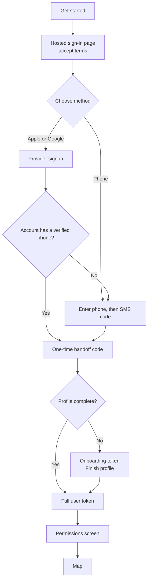

Every Yelo user has one account. The same account can request rides and, after a driver application, drive. There is no separate driver login. This page explains the account model, the sign-in flow users see, the tokens behind it, and the server-driven status that decides which mode the app shows.

## The account model

A Yelo account is a row in the `Users` table (`internal/models/user.go`). The fields that matter most for product behavior are:

| Field | What it means |
| --- | --- |
| `account_type` | `student` or `community`. New accounts start as `community`. An account becomes `student` only after a school verification succeeds. |
| `community_id` / `home_community_id` | The market the user belongs to. Sign-in resolves it from location. See [Communities and zones](/concepts/communities-and-zones). |
| `school_id` | Set by school verification. Empty for community accounts. |
| `phone_number` | Auth v3 only stores it after a successful OTP check, and legacy phones are treated as verified, so a non-empty value means "verified phone". Web-channel Google or Apple sign-ups can leave it empty. |
| `profile_completed` | `true` once the user has finished their profile (first and last name). |
| `driver_application_status` | Where the user is in the driver application. See [Driver onboarding](/concepts/driver-onboarding). |
| `acquisition_source` | How the user arrived: `app_organic`, `app_referral`, `qr_payment`, `event_link`, `csv_import`, `guest`, `driver_guest`, or `other`. |
| `is_banned`, `is_deleted`, `is_test` | Access and test flags. Banned and deleted accounts can't sign in. |

### Student and community accounts

Student accounts unlock student-only ride types. When the API builds vehicle options, it hides any ride type marked `IsStudentOnly` from riders whose `account_type` isn't `student` (`filterRideTypesForRider` in `internal/service/ride/rider.go`).

A user becomes a student by verifying a school after sign-up:

- **School email.** The in-app **Are you a student?** screen (`app/(app)/verify/1-oauth.tsx`) verifies a `.edu` address with a school OAuth sign-in or an email code.
- **StudID.** The API also supports StudID verification through `POST /authv3/user/student/studid/start` and `/complete`. A StudID session is valid for 60 minutes.

A successful verification sets `school_id`, `account_type = 'student'`, and `is_verified = true`. Every school proof (StudID, school Google or Microsoft account, or email code) is stored in `EducationVerifications`, and users manage them from the profile **Accounts** screen. Removing the last proof returns the account to `community`.

<Note>
  School verification doesn't move a user to another community. The school's community mapping is informational. See [Schools and communities](/administration/schools-and-communities).
</Note>

## How sign-in works

Yelo uses **Auth v3** for sign-up and sign-in on mobile and web. Sign-up and sign-in are the same flow: a returning user with a finished profile goes straight into the app, and a new or unfinished user completes their profile first.

Users can sign in three ways:

- **Continue with Apple**
- **Continue with Google**
- **Continue with phone** (SMS code)

The API reports which providers are available from `GET /authv3/config`. The app hides a provider the config marks unavailable.

<Steps>
  <Step title="Start">
    The user taps **Get started** on the entry screen (`app/(auth-v3)/index.tsx`). The app creates an Auth v3 transaction and, in production, opens the hosted sign-in page served by `yelo-web` at `/auth/v3`. The hosted page keeps attribution and cookies intact.
  </Step>
  <Step title="Accept terms">
    The user accepts the current **Terms of Service** and **Privacy Policy** versions. Yelo records the acceptance before any provider starts. A sign-in without current legal acceptance fails.
  </Step>
  <Step title="Choose a method">
    The user picks Apple, Google, or phone. If the hosted page can't be used, the app falls back to its native **Create your account** screen (`app/(auth-v3)/method.tsx`) on the same transaction.
  </Step>
  <Step title="Verify a phone number">
    If the user signs in with Apple or Google in the app and the account has no phone yet, Yelo asks for one before finishing. Web-channel sign-ins on the signup site (tip and World Cup pages) don't require a phone. The dashboard uses Clerk, not Auth v3. See [Provider flows](/engineering/identity/provider-flows#the-supplemental-phone-step). Phone codes are five digits and are sent through Twilio Verify.
  </Step>
  <Step title="Finish your profile">
    New users enter a first and last name on **Finish profile** (`app/(auth-v3)/finish-profile.tsx`). They can enter a referral code and reuse their Apple or Google photo. Names are limited to 100 characters.
  </Step>
  <Step title="Grant permissions">
    The **Yelo needs some permissions** screen asks for **Location**, **Notifications**, and **Contacts**. If all three are already granted, the app skips the screen.
  </Step>
</Steps>

After sign-in, the app resolves the user's community from device or coarse IP location through `POST /authv3/user/community/resolve`. Creating a new account queues a Slack signup alert to the team 90 seconds later. See [Notifications](/concepts/notifications).

### Phone code limits

Phone verification is rate-limited per transaction, per phone number, and per requester (`DefaultPhoneOrchestrationConfig` in `internal/service/authv3/phone_orchestration.go`):

| Limit | Value |
| --- | --- |
| Code attempt lifetime | 10 minutes |
| Cooldown between sends | 30 seconds |
| Sends per attempt | 5 |
| Verifies per attempt | 5 |
| Sends per phone number | 10 per hour |
| Sends per requester | 20 per hour |
| Verifies per phone number | 20 per hour |
| Verifies per requester | 40 per hour |

## Tokens: onboarding versus full

Auth v3 never hands tokens directly through a browser redirect. The provider step ends with a one-time **handoff code** that the app exchanges at `POST /authv3/token` using PKCE. The exchange returns one of two statuses:

| Status | Token | What it can do |
| --- | --- | --- |
| `authenticated` | Full user token (role `user`) | Call every mobile API. Mobile tokens last `DefaultJwtDuration` = 6,360 hours. |
| `needs_profile` | Onboarding token (role `authv3_onboarding`) | Call only `GET /authv3/status`, `POST /authv3/profile`, and `POST /authv3/community/resolve`. Lasts 15 minutes. |

Finishing the profile at `POST /authv3/profile` returns a full user token.

Other Auth v3 lifetimes (defaults in `internal/utilities/config/authv3.go`, overridable with `AUTH_V3_*` env vars):

| Setting | Default |
| --- | --- |
| Transaction | 10 minutes |
| Provider start | 5 minutes |
| Handoff code | 2 minutes |
| Web access token | 1 hour |
| Web session idle timeout | 90 days |
| Web session absolute timeout | 365 days |

Only web clients use refreshable sessions (`/authv3/session/refresh`). The mobile app holds its long-lived user token in secure storage.

<Accordion title="Legacy Auth v2 and the pre-signup token">
  Auth v2 (`/authv2/*`, `internal/service/authv2`) is still mounted. It issues a **pre-signup** token (role `presignup`, 1 hour) after a phone code, then a full token after email verification and profile setup. The mobile app now uses Auth v2 only for school email verification from the **verify** screens.

  Some public-facing flows (World Cup and tipping) accept either a pre-signup or a full token.

  If a signed-in app session belongs to an account whose profile was never finished, the app signs the user out once so they can start a clean Auth v3 transaction (`app/(app)/_layout.tsx`).
</Accordion>

<Warning>
  The legacy v1 `/auth/*` routes are no longer registered in `internal/server/http/router.go`. If Auth v3 is turned off, `/authv3/*` returns an `AuthV3Unavailable` 503 so clients can tell "disabled" apart from an unknown route.
</Warning>

## Linked identities and account deletion

A user can link more than one login method to the same account. Signed-in users start a link from the profile **Accounts** screen, which calls `POST /authv3/user/link/authorize`. `GET /authv3/user/identities` lists the linked identities.

Sign-in is refused for disabled, deleted, or banned accounts, and the refused provider identity is recorded permanently in `AuthDeniedSubjects` (`AuthV3DeniedReason` in `internal/models/authv3.go`). Ambiguous matches return a conflict instead. The older `ambiguous_match` and `provider_slot_occupied` reasons were purged by a migration.

When a user deletes their account, Yelo revokes their Apple token, removes their login identities, and scrubs their user row. If Apple revocation fails, identities and the user row are left intact, but the Stripe customer has already been deleted. See [Account deletion and retention](/engineering/identity/account-deletion).

## User requirements

The `userrequirements` package (`internal/service/userrequirements/user.go`) centralizes a few account checks:

| Check | Rule | Used by |
| --- | --- | --- |
| `RequireVerifiedPhone` | Phone number is not empty. Returns `PhoneRequiredError` otherwise. | Driver photo and license uploads, vehicle registration, Stripe account setup, activation, and going online. Enforced only when `DRIVER_VERIFIED_PHONE_REQUIRED` is `true` (default `false`). |
| `RequireCompletedProfile` | First and last name are set. Returns `ProfileRequiredError` otherwise. | Stripe account setup, so Stripe receives the legal name |
| `CanReceiveSMS` | Verified phone and no carrier STOP (`sms_opted_out_at` is empty). | Friend bump SMS |

## Riding or driving: server-driven status

The API decides whether a user is riding, driving, or neither. The mobile app follows it.

`GET /user/status` and `GET /user/ride-state` return a `user_status` built from the ride-state snapshot (`internal/data/repository/ride_snapshot.go`):

| `user_status` | When |
| --- | --- |
| `driving` | The user has a current drive, or is an online driver. |
| `riding` | The user's booking is `confirmed`, `queued`, `driver_en_route`, `driver_waiting`, `in_progress`, or `pending_rider_rating`. Riding wins over driving. |
| `home` | Neither applies. |
| `waitlisted` | Defined in the enum. The snapshot doesn't currently set it. |

On mobile, `StatusGuard` (`components/auth/StatusGuard.tsx`) sends any `driving` user to the `/drive` screens. Rider navigation belongs to `useRideLifecycleNavigation`. The guard doesn't redirect users on QR scan, tip, or fleet join screens. For the ride states themselves, see [Ride lifecycle](/concepts/ride-lifecycle).

## Where this lives in code

| Area | Path |
| --- | --- |
| Auth v3 service | `yelo-api/internal/service/authv3/` (`service.go`, `resolver.go`, `token.go`, `onboarding.go`, `active_community.go`) |
| Auth v3 routes | `yelo-api/internal/server/http/authv3/` (`routes.go`, `onboarding_routes.go`) |
| Auth v3 models | `yelo-api/internal/models/authv3.go` |
| Auth v3 config | `yelo-api/internal/utilities/config/authv3.go` |
| StudID | `yelo-api/internal/service/authv3/student/studid.go` |
| Legacy Auth v2 | `yelo-api/internal/service/authv2/`, `internal/utilities/jwt/jwt.go` |
| User requirements | `yelo-api/internal/service/userrequirements/user.go` |
| Mobile sign-in screens | `yelo-frontend/app/(auth-v3)/`, `providers/AuthV3Provider.tsx` |
| Hosted sign-in page | `yelo-web/src/sites/signup/auth-v3/AuthV3Page.tsx` |
| Mode guard | `yelo-frontend/components/auth/StatusGuard.tsx` |
