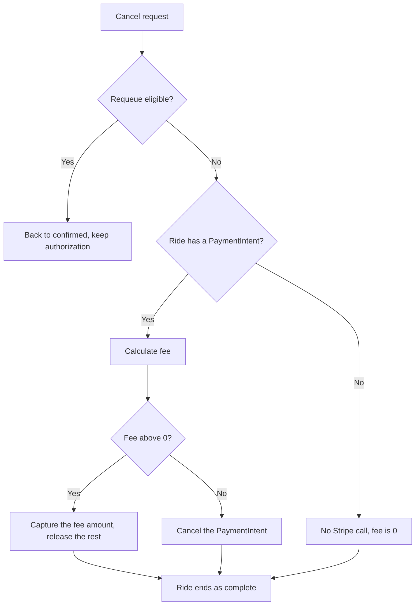

A ride can end early in four ways:

- The rider cancels.
- The assigned driver cancels.
- The system expires an unmatched request.
- A payment step fails.

Driver cancellations before pickup don't end the ride at all. They put it back on the board.

For the statuses referenced here, see [Ride lifecycle](/concepts/ride-lifecycle).

## Who can cancel

`POST /ride/i/{id}/cancel` takes a `reason` and an optional `comment`. Only the ride's rider or its assigned driver can call it. Anyone else gets an authorization error.

The ride must be in `requested`, `confirmed`, `queued`, `driver_en_route`, `driver_waiting`, or `in_progress`. Rides in `pending_rider_rating` or `complete` return "Ride is already completed."

## Driver cancellations before pickup requeue the ride

`RideService.Cancel` first checks `isReQueueEligible`. When the **assigned driver** cancels a ride in `queued`, `driver_en_route`, or `driver_waiting`, the ride takes the requeue path instead of ending:

- The ride returns to `confirmed` and goes back on the board with a fresh 10-minute expiry window.
- The driver is added to `declined_drivers`.
- The payment authorization is kept and replaced when the next driver accepts.
- No fee is charged, and the rider gets a single "finding you a new driver" push.

See [Requeue after a driver cancels](/concepts/ride-lifecycle#requeue-after-a-driver-cancels).

## Fee rules

Every other cancellation goes through `pricing.GetCancellationFee` (`internal/utilities/pricing/pricing.go`). Fees are based on the ride's effective price, which is the discounted fare when one exists. A free ride never incurs a fee.

### Rider cancels

| Ride status | Fee |
| --- | --- |
| `requested`, `confirmed`, `queued` | $0 |
| `driver_en_route`, driver more than 5 minutes from pickup | $0 |
| `driver_en_route`, driver 5 minutes or less from pickup | Greater of 40% of the fare or $1.00 |
| `driver_waiting` | Greater of 75% of the fare or $1.00 |
| `in_progress` | Greater of 100% of the fare or $1.00 |

For `driver_en_route`, the API asks Mapbox for the drive time from the driver's last reported location to the pickup. The cutoff is `TimeAwayCancellationCutoff` (300 seconds). If the driver's location is unknown, the fee is $0.

### Driver cancels

| Ride status | Outcome |
| --- | --- |
| `queued`, `driver_en_route`, `driver_waiting` | Requeued. No fee. |
| `in_progress` | Ride ends. $0. |

`calculateDriverCancellationFee` also defines a rider no-show fee: the greater of 40% of the fare or $1.00 when the driver cancels from `driver_waiting` after more than 7 minutes (`WaitTimeCancellationCutoff`, 420 seconds). Because `driver_waiting` cancellations by the driver take the requeue path first, `RideService.Cancel` never reaches this rule on `main`.

<Warning>
`POST /ride/i/{id}/cancel-intent` returns the fee preview by calling `GetCancellationFee` directly, without the requeue check. For a driver in `driver_waiting` after 7 minutes, the preview returns the 40% no-show fee, but the actual cancel requeues the ride and charges nothing.
</Warning>

## How fees are charged

Fees are charged against the ride's existing Stripe PaymentIntent. No new charge is created. `handleCancellationPayment` in `internal/service/ride/ride.go` works like this:

- A PaymentIntent exists only after a driver accepts a paid ride. Cancellations in `requested`, or in `confirmed` before any driver has accepted, never touch Stripe.
- A positive fee is captured with `PartiallyConfirm`, which calls Stripe's capture with `amount_to_capture` set to the fee in cents. Stripe releases the uncaptured remainder of the authorization.
- A $0 fee cancels the PaymentIntent, releasing the full hold.
- The captured fee lands on the same connected account that holds the authorization: the driver's account or the fleet's. See [Payments and payouts](/concepts/payments-and-payouts).

After payment handling, the ride row is updated with:

| Column | Value |
| --- | --- |
| `status` | `complete` |
| `cancel_phase` | The status the ride was in when canceled |
| `cancel_user` | `rider` or `driver` |
| `cancel_reason`, `cancel_comment` | From the request |
| `complete_time` | The cancellation time |

The ride is removed from the board. If the canceled ride belonged to a driver with queued rides, the next one is promoted. The other party gets a push. On a rider cancellation, the driver's push includes the fee amount. The event log records `ride_canceled` and the payment outcome.

## System-initiated endings

| Trigger | Result |
| --- | --- |
| Unmatched for 10 minutes after confirm | `CancelUnmatchedRides` sets `cancel_phase = 'confirmed'` and `cancel_reason = 'automatic'`, with no `cancel_user`. No Stripe call. |
| Rider starts a new request | Older `requested` rides get `cancel_reason = 'superseded'`. |
| Payment method clone or PaymentIntent creation fails | The service calls `Cancel` with reason `Payment Failed` as the requesting user. See the note below. |
| Driver offline more than 5 minutes with queued rides | Not a cancellation. Queued rides return to `confirmed` and go back on the board. |

<Note>
The `Payment Failed` cancel runs through the same authorization check as a user cancel. During a manual accept, the caller is a driver who isn't assigned to the ride yet, so `Cancel` rejects the call and only logs it. The accept returns the payment error, and the ride stays `confirmed` on the board. When payment fails while promoting a queued ride and the request context carries that ride's driver, as in `RecoverIdleQueue`, the cancel counts as a driver cancel and takes the requeue path.
</Note>

## Reporting on cancellations

The dashboard's cancellation and uncompleted-ride views read `cancel_phase`, `cancel_user`, and `cancel_reason`. The endpoints are `GET /dashboard/community/{id}/cancellations` and `.../uncompletes`, plus their `/kpis` and `/breakdowns` variants. See [Ride metrics](/dashboard/ride-metrics) for how those KPIs are defined.

## Where this lives in code

| Concern | Location |
| --- | --- |
| Cancel, requeue, fee charging | `yelo-api/internal/service/ride/ride.go` (`Cancel`, `requeueAfterDriverCancel`, `handleCancellationPayment`) |
| Fee rules | `yelo-api/internal/utilities/pricing/pricing.go` (`GetCancellationFee`) |
| Cutoff constants | `yelo-api/internal/utilities/config/constants.go` |
| Cancel and requeue SQL | `yelo-api/internal/data/repository/queries/ride_lifecycle.sql` (`CancelRideAndReturnDriver`, `RequeueRideAfterDriverCancel`) |
| Who may cancel from which status | `yelo-api/internal/data/repository/ride_command.go` (`validateRideCancellation`) |
| Stripe capture and cancel | `yelo-api/internal/data/stripe/intent.go` |
| Rider cancel button | `yelo-frontend/components/rider-flow/RiderCancelButton.tsx` |
