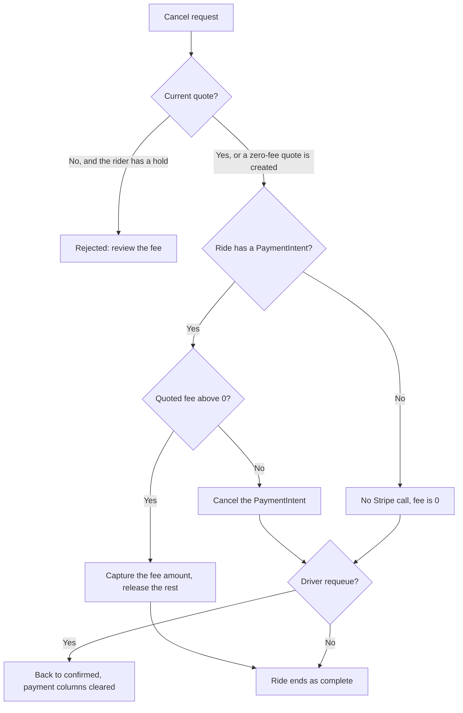

A ride can end early in five ways:

- The rider cancels.
- The assigned driver cancels.
- The system expires an unmatched request.
- A payment step fails.
- An admin silently cancels a free, accepted ride from the dashboard.

Driver cancellations before pickup don't end the ride at all. They put it back on the board.

For the statuses referenced here, see [Ride lifecycle](/concepts/ride-lifecycle).

## Who can cancel

`POST /ride/i/{id}/cancel` takes a `reason` and an optional `comment`. Only the ride's rider or its assigned driver can call it.

The ride must be in `requested`, `confirmed`, `queued`, `driver_en_route`, `driver_waiting`, or `in_progress`. A caller who isn't a participant, or a ride in `pending_rider_rating` or `complete`, gets the same conflict as any other stale command: **Ride Unavailable**, "This ride has changed. Refresh and try again." (`validateRideCancellation`).

Cancellation is two steps. `POST /ride/i/{id}/cancel-intent` prices the fee and saves a quote that is valid for 60 seconds and only for the ride's current revision. `POST /ride/i/{id}/cancel` then cancels against that quote. A rider canceling a ride that has a payment hold must have a current quote, or the cancel returns **Review cancellation fee**. A driver, or a rider on a ride with no hold, doesn't need to call `cancel-intent` first: the cancel creates its own zero-fee quote.

## Driver cancellations before pickup requeue the ride

Every cancellation runs as a `cancel` ride operation. When the **assigned driver** cancels a ride in `queued`, `driver_en_route`, or `driver_waiting`, the operation is marked as a requeue (`freezeCancellation`) and the ride goes back to matching instead of ending:

- The ride returns to `confirmed` and goes back on the board with a fresh 10-minute expiry window.
- The driver is added to `declined_drivers`.
- The payment authorization is released at Stripe before the ride goes back on the board, and the ride's payment columns are cleared. The next driver's accept places a new hold.
- No fee is charged, and the rider gets a single "finding you a new driver" push.

See [Requeue after a driver cancels](/concepts/ride-lifecycle#requeue-after-a-driver-cancels).

## Fee rules

A rider's cancellation of a ride with a payment hold is priced by `pricing.GetCancellationFee` (`internal/utilities/pricing/pricing.go`) when the quote is created. Driver cancellations and rides without a hold are always quoted at $0. Fees are based on the ride's effective price, which is the discounted fare when one exists. A free ride never incurs a fee.

### Rider cancels

| Ride status | Fee |
| --- | --- |
| `requested`, `confirmed`, `queued` | $0 |
| `driver_en_route`, driver more than 5 minutes from pickup | $0 |
| `driver_en_route`, driver 5 minutes or less from pickup | Greater of 40% of the fare or $1.00 |
| `driver_waiting` | Greater of 75% of the fare or $1.00 |
| `in_progress` | Greater of 100% of the fare or $1.00 |

For `driver_en_route`, the API asks Mapbox for the drive time from the driver's last reported location to the pickup. The cutoff is `TimeAwayCancellationCutoff` (300 seconds). If the driver's location is unknown, the fee is $0.

### Driver cancels

| Ride status | Outcome |
| --- | --- |
| `queued`, `driver_en_route`, `driver_waiting` | Requeued. No fee. |
| `in_progress` | Ride ends. $0. |

`calculateDriverCancellationFee` also defines a rider no-show fee: the greater of 40% of the fare or $1.00 when the driver cancels from `driver_waiting` after more than 7 minutes (`WaitTimeCancellationCutoff`, 420 seconds). Nothing reaches this rule on `main`. `RideCancellationQuotes.Quote` saves a zero-fee quote for every driver without calling the pricing function, so both the `cancel-intent` preview and the actual cancel charge a driver's cancellation nothing.

## How fees are charged

Fees are charged against the ride's existing Stripe PaymentIntent. No new charge is created. The `cancel` operation in `internal/service/payment/ride_cancellation_operation.go` works like this:

```mermaid
flowchart TD
    A[Cancel request] --> Q{Current quote?}
    Q -- No, and the rider has a hold --> X[Rejected: review the fee]
    Q -- Yes, or a zero-fee quote is created --> C{Ride has a PaymentIntent?}
    C -- No --> Z[No Stripe call, fee is 0]
    C -- Yes --> E{Quoted fee above 0?}
    E -- Yes --> F[Capture the fee amount, release the rest]
    E -- No --> G[Cancel the PaymentIntent]
    F --> H[Ride ends as complete]
    G --> B{Driver requeue?}
    Z --> B
    B -- Yes --> R[Back to confirmed, payment columns cleared]
    B -- No --> H
```

- A PaymentIntent exists only after a paid ride is assigned to a driver's active slot. Cancellations in `requested`, in `confirmed` before any driver has accepted, or in `queued`, never capture a fee.
- A positive fee is captured with Stripe's capture, with `amount_to_capture` set to the quoted fee in cents. Stripe releases the uncaptured remainder of the authorization.
- A $0 fee cancels the PaymentIntent, releasing the full hold.
- The Stripe step is verified before the ride changes. If Stripe can't be reached, the cancel returns an error, the ride keeps its status, and a background job keeps retrying the same step. Until it resolves, no other action on the ride is accepted.
- The captured fee lands on the same connected account that holds the authorization: the driver's account or the fleet's. See [Payments and payouts](/concepts/payments-and-payouts).

After payment handling, the ride row is updated with:

| Column | Value |
| --- | --- |
| `status` | `complete` |
| `cancel_phase` | The status the ride was in when canceled |
| `cancel_user` | `rider` or `driver` |
| `driver_payout` | The cancellation fee |
| `cancel_reason`, `cancel_comment` | From the request |
| `complete_time` | The cancellation time |

If the canceled ride belonged to a driver with queued rides, the next one is promoted in the same transaction. The other party gets a push. On a rider cancellation, the driver's push includes the fee amount. The event log records `ride_canceled` with the reason and fee. A background job then removes the ride from the board and refreshes the driver's queue.

## System-initiated endings

| Trigger | Result |
| --- | --- |
| Unmatched for 10 minutes after confirm | `CancelUnmatchedRides` runs a system cancellation that sets `cancel_phase = 'confirmed'` and `cancel_reason = 'automatic'`, with no `cancel_user`. If the ride still carries a payment hold, the hold is released at Stripe first. |
| Rider starts a new request | Older `requested` rides get `cancel_reason = 'superseded'`. |
| The rider's card is declined when a driver accepts or a queued ride is promoted | The ride ends with `cancel_reason = 'Payment Failed'`, `cancel_comment = 'Payment authorization could not be completed.'`, no `cancel_user`, and `cancel_phase` set to the status it was in. The rider gets a `ride_payment_failed` push. See the note below. |
| Driver offline more than 5 minutes with queued rides | Not a cancellation. Queued rides return to `confirmed` and go back on the board. |

## Admin silent cancellation

Admins can end a stuck ride from **Ride Details** in the dashboard without notifying anyone. The control sits under **Admin cancellation**, below the ride timeline. For the operator steps, see [Stuck or ghost ride](/runbooks/stuck-ride#fix).

A ride is eligible only when all of these hold:

- Its status is `driver_en_route`, `driver_waiting`, or `in_progress`.
- Its effective fare is 0, and `payment_intent_id` and `tip_payment_intent_id` are null.
- It has no `RideOperations` row in `pending` or `quarantined`.
- Its driver has no other ride in `queued`.
- No notification for the ride has a delivery in `queued` or `sending`.

`GET /dashboard/rides/{id}/silent-cancellation` returns the eligibility preview, the blocking reason, and the ride's `lifecycle_revision`. `POST /dashboard/rides/{id}/silent-cancel` takes that revision and a `reason` of 1 to 500 characters. The API repeats every check under the ride command locks and rejects the request if the revision changed. Both endpoints are admin-only.

A silent cancellation skips payment handling, queue promotion, and every notification, including ride-state pushes. It writes:

| Column or event | Value |
| --- | --- |
| `status` | `complete` |
| `cancel_phase` | The status the ride was in |
| `cancel_user` | Null |
| `cancel_reason` | `admin_silent_cancellation` |
| `cancel_comment` | The admin's reason |
| `ride_canceled` event | Actor `system`, with `admin_id`, `reason`, `notifications_suppressed: true`, and `cancellation_fee: 0` in its metadata |

Participants' apps pick up the change on their next refresh. The dashboard can't undo it.

<Note>
A ride is canceled for `Payment Failed` only after Stripe confirms the authorization can't charge: the PaymentIntent ended canceled with nothing captured or capturable. A Stripe outage or a timeout isn't a decline. In that case the ride stays assigned to the driver, and a background job retries the authorization. The driver's next queued ride, if any, is promoted when a declined ride is canceled.
</Note>

## Reporting on cancellations

The dashboard's cancellation and uncompleted-ride views read `cancel_phase`, `cancel_user`, and `cancel_reason`. The endpoints are `GET /dashboard/community/{id}/cancellations` and `.../uncompletes`, plus their `/kpis` and `/breakdowns` variants. See [Ride metrics](/dashboard/ride-metrics) for how those KPIs are defined.

## Where this lives in code

| Concern | Location |
| --- | --- |
| Cancel entry points | `yelo-api/internal/service/ride/ride.go` (`Cancel`, `CancelIntent`), `financial_commands.go` |
| Quote, requeue decision, fee charging | `yelo-api/internal/service/payment/ride_cancellation_operation.go`, `ride_legacy_cancellation.go`, `yelo-api/internal/data/repository/ride_cancellation_operation.go` |
| Declined authorization | `yelo-api/internal/data/repository/ride_authorization_failure.go` |
| Unmatched expiry | `yelo-api/internal/service/payment/ride_expiry_operation.go` |
| Fee rules | `yelo-api/internal/utilities/pricing/pricing.go` (`GetCancellationFee`) |
| Cutoff constants | `yelo-api/internal/utilities/config/constants.go` |
| Cancel and requeue SQL | `yelo-api/internal/data/repository/queries/ride_operation.sql` (`CancelReservedRide`, `RequeueReservedRide`, `CancelDeclinedRideAuthorization`) |
| Who may cancel from which status | `yelo-api/internal/data/repository/ride_command.go` (`validateRideCancellation`) |
| Stripe capture and cancel | `yelo-api/internal/data/stripe/ride_capture.go`, `ride_void.go` |
| Rider cancel button | `yelo-frontend/components/rider-flow/RiderCancelButton.tsx` |
| Admin silent cancellation | `yelo-api/internal/service/dashboard/ride_admin_cancel.go`, `internal/data/repository/ride_admin_cancel.go`, `queries/ride_admin_cancel.sql`; `yelo-web/src/components/rides/SilentCancelRide.tsx` |
