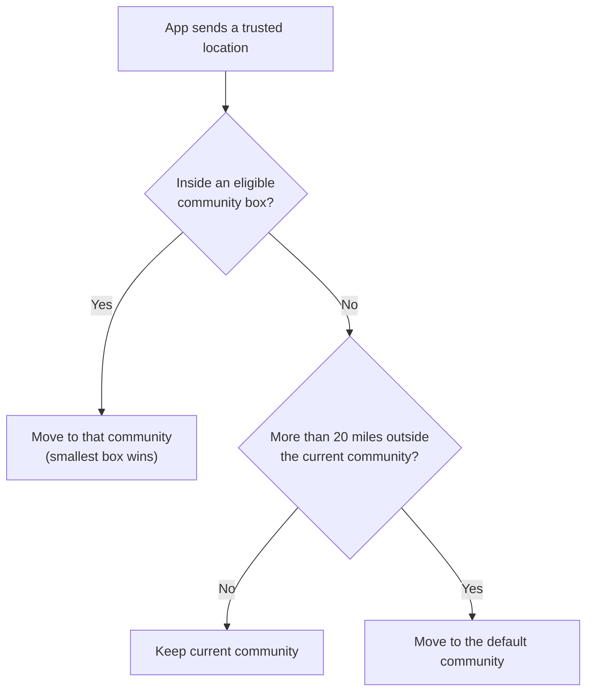

A community is a Yelo market. It is usually a college town or campus area. Every user, ride, fleet price, and dashboard view belongs to a community. Inside a community, zones mark smaller areas for pricing and operating hours.

## What a community is

A community (`Community` in `internal/models/community.go`) is defined by a name, an IANA time zone, and a rectangular **service area** (a bounding box). The service area decides:

- Which community a user belongs to, based on their location.
- Where rides can start and end. Both pickup and destination must be inside the rider's community bounding box. Otherwise the rider sees **Pickup Outside Service Area** or **Destination Outside Service Area**.
- Where drivers can go online. A driver outside the box gets **Outside Service Area**.

The time zone is derived from the service area automatically. It isn't an admin override. Its status is `resolved`, `unresolved`, `pending`, or `non_geographic`.

### Community flags

| Flag | Dashboard label | Effect |
| --- | --- | --- |
| `is_active` | **Active** | Inactive communities are skipped when Yelo matches a location to a community. |
| `is_hidden` | **Hidden** | Users can't switch into the community by hand, unless they are test users. The community is also left out of the heatmap layer. |
| `rides_disabled` | **Rides Disabled** | Kill switch. Ride requests return no vehicle options, so the app falls back to its off-peak and third-party states. |
| `is_default` | None | The fallback community for users outside every service area. |
| `is_test` | None | Test communities are excluded from location matching and school mapping. |
| `archived_at` | None | Archived communities are excluded everywhere. Archiving retires the community's fleet services and ends its open prices. |

A reserved internal community named **Yelo** has a global bounding box for staff accounts. Yelo never places ordinary users in it by location, and it repairs ordinary accounts that end up there.

### Other community settings

Admins edit these on the **Communities** page:

- **Primary Vehicle Type** and **Primary Fleet**. The primary fleet is the fallback fleet for new drivers. See [Fleets](/concepts/fleets#fleet-drivers-and-independent-drivers).
- **Map activity window**: how many hours of anonymized map moves to show (`map_moves_window_hours`).
- Experimental features (`active_experiments`): feature keys that users in the community can opt into.

Communities also have auto-queue depth limits (`auto_queue_default_minutes`, `auto_queue_max_minutes`). No API route or dashboard control sets them: the community update request does not accept these fields. See [Matching and auto-queue](/concepts/matching-and-auto-queue).

## How users are assigned to a community

Yelo assigns communities by location, not by school. Each user has a `community_id` (where they are now) and a `home_community_id`.

The API resolves the community (`internal/service/authv3/active_community.go`):

1. **At sign-in**, from device coordinates or the sign-in transaction's coarse IP location.
2. **In the background**, when the app has a fresh location. The app calls `POST /authv3/user/community/resolve` at most every 15 minutes, only with a location under 30 minutes old and accurate to 5 km. It skips this while the user is riding or driving.

Eligible communities are active, not default, not test, not archived, and not the reserved **Yelo** community. If several boxes contain the point, the smallest box wins. Leaving a community uses a fixed 20-mile buffer beyond its nearest edge. Test accounts keep their manually chosen community.

When the community changes, the API issues a new token with the new community. Users can also pick a community by hand from the profile community switch screen (`PUT /user/community`). The target must be active and not hidden, test, or the reserved **Yelo** community. Test users can pick hidden and test communities.

<Note>
  Ride requests also repair stale assignments. If a rider is in the default community, a disabled community, or a community that doesn't contain the ride, Yelo re-matches the pickup point to a community before pricing (`loadRideCommunity` in `internal/service/ride/rider.go`).
</Note>

### Schools

Schools map to communities automatically from campus coordinates. That mapping doesn't move users. It powers school lists, community demographics, and student verification. See [Schools and communities](/administration/schools-and-communities).

## Zones

A zone is a polygon inside a community (`Zone` in `internal/models/zone.go`). Each zone has a name, color, optional description, `priority`, `is_active`, and `show_on_map`.

Zones are used for:

- **Zone pricing.** A zone can override one fleet's per-mile, per-minute, or flat-fee rates (`ZonePricing`). Yelo prices a route piece by piece by the zone each segment passes through. See [Pricing](/concepts/pricing).
- **Operating hours.** Fleet calendar events select zones with bracketed prefixes such as `[FREE]`. See [Fleet operating hours](/admin/operating-hours).
- **Rider map.** `GET /community/{id}/zones` returns active zones with `show_on_map` turned on, for map rendering.

When zones overlap, the zone with the highest `priority` wins. Ties go to the smaller zone, then the lower ID (`ResolveZone`).

Admins draw and edit zones on the **Map** page (`/map`) in the dashboard. The old `/zones` route redirects there. The API routes are under `/dashboard/zones` and `/dashboard/communities/{id}/zone-pricing`. The zone-pricing backtest (`/zone-pricing/backtest`) re-prices recent rides under the current zone setup, without surge or jitter.

## Operating hours and market status

Every community reports a **market status** of `LIVE` or `OFF_PEAK` to the app. Yelo computes it in this order (`computeMarketStatus` in `internal/data/repository/community.go`):

1. Any driver is online: `LIVE`.
2. **Limited hours** is on and the current time is inside an operating window: `LIVE`.
3. The last driver went offline less than 1 hour ago: `LIVE`.
4. Otherwise: `OFF_PEAK`. With limited hours on, the app also shows the next window, such as `THU | 9PM`.

Operating windows are per day of week, in the community's time zone. A window can cross midnight, for example `19:00`–`03:00`. Admins edit them in the **Operating hours** card on the **Community** page (`/community`). Interns can view the card, but the API only accepts changes from admins.

- **Limited hours** off: the market runs 24/7 and status follows online drivers only.
- **Limited hours** on with every day off: the market shows `OFF-PEAK` unless drivers are online.

Separately, each fleet can import dated operating hours from Google Calendar. The community's primary fleet calendar supplies dated hours and zone names to the rider app. These imported hours are informational and don't block ride requests. See [Fleet operating hours](/admin/operating-hours).

## Fleets, ride types, and vehicle types

Riders see ride types, not fleets. A ride type is a price row for one fleet and one vehicle type in one community. It reaches riders only while the fleet actively serves that community. See [Fleets](/concepts/fleets#service-communities).

Riders without a verified student account don't see ride types from student-only fleets.

Vehicle types are a global catalog (`VehicleTypes`) with a slug, display name, icon, and seat range. The seeded types are `x` (Car), `xl` (Big Car), `cart` (Cart), and `minibus` (Mini Bus). A community's available vehicle types come from its active price rows. Each fleet lists its own `supported_vehicle_types`. See [Ride pricing](/dashboard/ride-pricing) and [Fleet vehicles](/dashboard/fleet-vehicles).

## Communities in the dashboard

The dashboard community selector scopes most pages to one community. Interns and fleet managers see only their assigned communities. See [Dashboard roles and access](/administration/dashboard-roles).

| Page | Path | What you manage |
| --- | --- | --- |
| **Communities** | `/communities` | Admins create and edit communities, service areas, flags, primary fleet, and experiments. The **Schools** tab manages school mapping. |
| **Community** | `/community` | Community metrics, the community feed preview, and operating hours. Admins and interns. |
| **Map** | `/map` | Zones, locations, mobility feeds, and map layers. |
| **Pricing** | `/pricing` | Price rows per fleet and vehicle type. |

Service-area edits send `expected_geography_revision`, so a save fails if someone else changed the area after you loaded it. Admins can preview the derived time zone with `POST /community/manage/timezone-preview`.

## Where this lives in code

| Area | Path |
| --- | --- |
| Community model | `yelo-api/internal/models/community.go`, `community_timezone.go` |
| Community location matching | `yelo-api/internal/service/authv3/active_community.go`, `yelo_community_repair.go` |
| Location match query | `yelo-api/internal/data/repository/queries/community.sql` (`GetCommunityByCoordinates`) |
| Market status | `yelo-api/internal/data/repository/community.go` (`computeMarketStatus`) |
| Zones and zone pricing | `yelo-api/internal/models/zone.go`, `zone_pricing.go`, `internal/utilities/pricing/zoned.go` |
| Ride service-area checks | `yelo-api/internal/service/ride/rider.go` (`loadRideCommunity`, `validateRideCoordinates`) |
| Vehicle types | `yelo-api/internal/models/vehicle_type_config.go`, `migrations/000200_vehicle_types.up.sql` |
| Community routes | `yelo-api/internal/server/http/community/community_router.go` |
| App reconciliation | `yelo-frontend/providers/LocationProvider.tsx`, `lib/map/communityResolution.ts` |
| Dashboard pages | `yelo-web/src/sites/dashboard/pages/CommunitiesPage.tsx`, `CommunityPage.tsx`, `CommunityMapPage.tsx`; `src/components/CommunityEditor.tsx`, `src/components/feed/OperatingHoursCard.tsx` |
