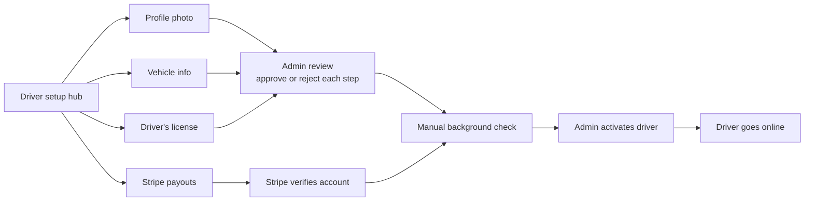

Any Yelo account can apply to drive. The driver application lives inside the same mobile app and the same account. It collects four items, admins review them, the driver sets up payouts, and an admin activates the driver after a manual background check. Only then can the driver go online.

This page explains the concepts. For the dashboard workflow, see [Driver leads](/dashboard/driver-leads).

## Application steps in the app

The driver starts from **DRIVER SETUP** (`app/(app)/driver-signup/1-hub.tsx`): "Finish setup in ~5 min and start earning." The hub lists four tasks. Each shows **COMPLETED**, **IN REVIEW**, **NOT APPROVED**, or **UP NEXT**.

| Task | Screen | What the driver provides |
| --- | --- | --- |
| **Profile photo** | `2-profile-photo.tsx` | A camera photo or a library upload. |
| **Vehicle info** | `3-vehicle-basic.tsx`, `4-vehicle-details.tsx` | Year, make, model, color, seat count (excluding the driver), plate state, and plate number. |
| **Driver's license** | `5-license.tsx` | Front and back photos, camera only. |
| **Stripe payouts** | `6-stripe.tsx` | Stripe Express onboarding. Skipped when a fleet manages payouts. The screen then shows **PAYOUTS READY** and **Managed by** the fleet name. |

After the four tasks, the app offers optional student verification (`7-student.tsx`) and ends on `8-submitted.tsx`: "Typically approved within 24 hours."

<Note>
  Yelo doesn't collect insurance, registration, or license numbers, and there is no background-check vendor integration. The background check happens outside Yelo.
</Note>

The app calls these endpoints (all require a full user token):

| Step | Endpoint |
| --- | --- |
| Profile photo | `POST /driver/profile-photo` |
| License | `POST /driver/license-photos` |
| Vehicle | `POST /vehicle/`, `PUT /vehicle/{id}`, `GET /vehicle/` |
| Stripe | `GET /stripeaccount/onboarding-link`, `GET /stripeaccount/login-link` |
| Status | `GET /driver/signup-status` |

Uploads go to Supabase storage and set the step to `pending`. The first upload of each item posts a Slack alert to the team.

## Statuses

Statuses live on the `DriverApplications` row and the driver's vehicles (`internal/models/driver.go`).

### Step status

Each step uses `ApplicationStatus`:

| Status | Meaning |
| --- | --- |
| `not_applied` | The driver hasn't submitted this step. |
| `pending` | Submitted and waiting for review, or Stripe still needs information. |
| `complete` | Approved by an admin, or verified by Stripe. |
| `failed` | Rejected by an admin with a reason. |
| `restricted` | Stripe has requirements that are currently due or past due. |
| `unknown` | Fallback value. |

The steps are `profile_picture`, `license`, `vehicle`, and `stripe`. The vehicle status is stored on each `Vehicles` row as `application_status`.

### Overall status

`GET /driver/signup-status` returns `driver_application_status`. It is `complete` only when the application is active (`DriverApplications.is_active`). Otherwise it is `pending`.

The response also includes each step status, `payout_source` (`personal_stripe` or `fleet`), the payout fleet, `vehicle_managed_by_fleet`, and `phone_verified`.

<Warning>
  The app counts `pending` steps as done on the hub, so drivers reach **Submitted** before any approval. Going online still requires `complete`.
</Warning>

## Admin review

Admins review applications from the **Drivers** page (`/drivers`) in the dashboard. The review sheet lists each requirement with **Approve** and **Reject** buttons. Rejecting asks for a reason that is shown to the driver.

- The API endpoint is `POST /dashboard/drivers/review` with `step` set to `profile_picture`, `license`, or `vehicle`, and `action` set to `approve` or `reject`.
- Only the `admin` role can review. Other roles get "Forbidden: Admins only".
- `approve` sets the step to `complete`. `reject` sets it to `failed`.
- Approving or rejecting a vehicle updates all of the driver's vehicles.
- Admins can't change the Stripe step. Stripe manages it.

When a step changes to `complete`, the driver gets a `driver_application_approved` push: "You're approved!" / "We approved your `{{step_label}}`!". The step labels are `photo`, `license`, `vehicle`, and `payout info`. Yelo sends no push on rejection or activation.

<Warning>
  The approval push deep-links to `/driver-signup/1-application-status`, which has no matching screen in the current app.
</Warning>

## Stripe Connect payouts

Drivers who are paid personally need a Stripe Express connected account. `GET /stripeaccount/onboarding-link` creates the account on first use and returns a Stripe onboarding link.

The account is created with:

- Type `express`, country `US`, business type `individual`.
- The `card_payments` and `transfers` capabilities.
- A `daily` payout schedule.
- Prefilled name, email, and phone.

Before creating the account, Yelo requires a completed profile (first and last name) so Stripe receives the legal name. See [Accounts and sign-in](/concepts/accounts-and-sign-in#user-requirements).

Yelo maps the Stripe account to the `stripe` step like this:

| Stripe account state | Step status |
| --- | --- |
| Any requirement currently due or past due | `restricted` |
| Payouts not enabled | `pending` |
| Otherwise | `complete` |

Yelo refreshes the status live on every `GET /driver/signup-status` call and on the Stripe `account.updated` webhook. After onboarding, `GET /stripeaccount/login-link` opens the Stripe Express dashboard. It fails until the driver has submitted their details.

For how fares move once a driver is active, see [Payments and payouts](/concepts/payments-and-payouts).

### Fleet-managed payouts

If the driver's fleet uses the `fleet_merchant` payment model and is payout-ready, the application uses the fleet's Stripe status instead of the driver's. The driver skips personal Stripe onboarding. If the fleet also provides the vehicle, only the profile photo and license need review. See [Fleets](/concepts/fleets#payment-models).

## Activation

An application is **complete** when the photo, license, and vehicle are `complete` and the effective payout status is `complete`. Activation is a separate step. It sets `DriverApplications.is_active = true` only if all of these are true:

- `profile_picture_status` and `license_status` are `complete`.
- Payouts are ready: either personal Stripe is `complete`, or the payout fleet is an active, payout-ready `fleet_merchant` fleet.
- The driver has an available vehicle with `application_status = 'complete'`.

Who triggers activation depends on how the driver is paid:

| Driver | How they activate |
| --- | --- |
| Personal Stripe | An admin clicks **Activate driver** on the lead after the manual background check. Approval alone never activates these drivers. |
| Fleet-managed payouts | Automatically, the next time the app loads `GET /driver/signup-status` after the application is complete. |
| Joined through a fleet link | The join tries to activate the driver immediately. |

On activation, Yelo assigns an active fleet if the driver has none. See [Fleets](/concepts/fleets#fleet-drivers-and-independent-drivers).

### Driver leads

Every applicant also appears as a driver lead. Database triggers create a lead with source `driver_app` on the first photo, license, vehicle, or activation event, and link leads to users by phone number. The lead stage is computed on read:

| Stage | Condition |
| --- | --- |
| `new` | No linked user. |
| `application` | Any step is `not_applied`, `failed`, or `restricted`. |
| `pending_approval` | Any step is `pending`. |
| `pending_background_check` | Every step is approved but the driver isn't active. |
| `zero_drives` | Active. |
| `pending_referral_payout` | Active, has a completed ride, and has a referrer. |
| `disqualified` | An admin disqualified the lead. |

Only admins can activate a lead. See [Driver leads](/dashboard/driver-leads) for the full workflow.

## Phone requirement

When `DRIVER_VERIFIED_PHONE_REQUIRED` is `true`, drivers must have a verified phone number before they upload photos, register a vehicle, create a Stripe account, activate, or go online. The flag defaults to `false`. Auth v3 accounts always have a verified phone, so this mostly affects legacy accounts.

## Going online and staying online

The **Drive** screen enables the online toggle only when `driver_application_status` and `stripe_signup_status` are both `complete`. The app also asks for **Always Allow** background location.

Going online calls `POST /driver/refresh-online` with a vehicle ID. The API checks, in order:

1. Verified phone, if the flag is on.
2. The application is active. Otherwise: **Application Incomplete**.
3. Payouts are `complete`. Otherwise: **Payment Setup Required**.
4. The driver has an active fleet, auto-assigning one if possible. Otherwise: **Fleet Not Found**.
5. The driver has a vehicle. Otherwise: **No Vehicle**.
6. The driver's location is inside the community's service area. Otherwise: **Outside Service Area**.
7. The vehicle belongs to the active fleet.

Success opens a driver session under the active fleet. `POST /driver/cancel-online` goes offline. While online, the server reports the user as `driving`. See [Server-driven status](/concepts/accounts-and-sign-in#riding-or-driving-server-driven-status).

Timers that keep a driver online (`internal/utilities/config/constants.go`):

| Setting | Value | Effect |
| --- | --- | --- |
| `DriverExpiryInterval` | 30 minutes | A driver with no recent ping and no active or queued ride goes offline. A background loop checks every 30 seconds. |
| Renew reminder | About 29 minutes after the last ping | Sends the `driver_renew_online` push: "Click back to keep your status online." |
| `OfflineGraceInterval` | 5 minutes | After this, an offline driver's queued rides leave their queue. |
| Presence cache TTL | 120 seconds | Heartbeats keep the driver's live presence fresh in Redis. |

The app sends heartbeats every 10 seconds on the drive screen, 15 seconds on a ride screen, 30 seconds elsewhere, and 45 seconds in the background. For auto-queue and dispatch, see [Matching and auto-queue](/concepts/matching-and-auto-queue).

## Vehicles and vehicle types

A vehicle needs color, make, model, year, plate, plate state, and seat count. The seat count must be at least the vehicle type's minimum. A driver's first vehicle becomes their active vehicle. Drivers must be offline to change vehicles.

Vehicle types are rows in `VehicleTypes`. The seeded types are:

| Slug | Display name | Seats |
| --- | --- | --- |
| `x` | Car | 4 |
| `xl` | Big Car | 6 |
| `cart` | Cart | 4–5 |
| `minibus` | Mini Bus | 8 |

Admins manage vehicle types and fleet-owned vehicles in the dashboard. See [Fleet vehicles](/dashboard/fleet-vehicles).

## Where this lives in code

| Area | Path |
| --- | --- |
| Application model and statuses | `yelo-api/internal/models/driver.go` |
| Driver service (uploads, status, going online) | `yelo-api/internal/service/driver/driver.go` |
| Activation query | `yelo-api/internal/data/repository/queries/user_driver.sql` (`ActivateEligibleDriver`) |
| Admin review | `yelo-api/internal/service/dashboard/dashboard.go` (`ReviewDriverApplicationStep`) |
| Lead activation | `yelo-api/internal/service/dashboard/driver_lead_activation.go` |
| Stripe Connect | `yelo-api/internal/service/stripeaccount/stripeaccount.go`, `internal/data/stripe/account.go` |
| Approval push | `yelo-api/internal/service/dashboard/driver_application_notification.go` |
| Slack step alerts | `yelo-api/internal/service/notifications/driver_application_alert.go` |
| Vehicles | `yelo-api/internal/service/vehicle/vehicle.go`, `internal/models/vehicle.go` |
| Mobile screens | `yelo-frontend/app/(app)/driver-signup/`, `app/(app)/drive/` |
| Dashboard review | `yelo-web/src/components/drivers/DriverApplicationReviewSheet.tsx`, `src/sites/dashboard/pages/LeadsPage.tsx` |
