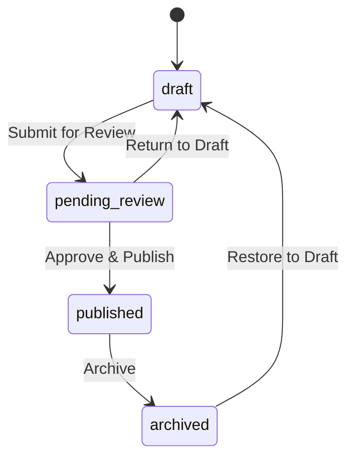

Yelo gives each community a local layer on top of rides: events, a featured **Spot**, and a community feed of recent activity. Fleets can also take payments through QR codes in their vehicles. This page explains how each piece works and where operators manage it.

For referrals, ads, and other promotions, see [Growth features](/concepts/growth-features).

## Events

An event is a local happening that Yelo promotes, such as a party or a game. Events belong to a community (`Event` in `internal/models/event.go`).

An event has:

- **Basics**: name, description, share-link slug, photo, tags, and whether it repeats.
- **Location**: location name, address, and coordinates. An event can link to a venue.
- **Tickets**: ticket URL, price, tickets available, and flags for discounted and dynamic pricing.
- **Timetable**: release, start, end, and close times. An event is closed after its close time.
- **Engagement**: views, attendees, shares, and tickets sold.

### Review workflow

Events move through four statuses:

Only `published` events appear on the public event page.

### Managing events

Admins and interns manage events on the **Events** page (`/events`) in the dashboard.

1. Click **Create Event** and fill in the form: name, description, share link slug, photo, location, price, ticket URL, tickets available, tags, and release, start, end, and close times.
2. Use the status tabs (**All**, **Draft**, **Pending Review**, **Published**, **Archived**) to find events. **Pending Review** shows a badge when events are waiting.
3. Use the row actions to move an event through the workflow.

The dashboard API lives under `/dashboard/communities/{id}/events` and `/dashboard/events/{event_id}`. The old `/spot` and `/feeds` routes redirect to `/events`.

### Events in the app and on the web

- **App.** Riders see upcoming events (`GET /event/upcoming`) and event detail screens (`app/(app)/events/[eventId]`). They can mark themselves as attending with `POST /event/{id}/attend` and see who else is going.
- **Web.** Each published event has a public page on the event site (`yelo-web/src/sites/event`), loaded from `GET /public/events/slug/{slug}`.

### Event checkout

Yelo doesn't sell event tickets itself. On the event web page, **Get Tickets** opens the event's ticket URL:

- If the ticket URL is a Posh (`posh.vip`) link, the page opens Posh's embedded checkout in a full-screen overlay.
- Otherwise it opens the ticket URL directly.

**Open in Yelo** sends iOS users to the App Store and everyone else to `https://yelo.link`. It doesn't open the specific event in the app.

## The Spot

The Spot is one featured card per community. It promotes either an event or a location (`Spot` in `internal/models/spot.go`).

| Field | Meaning |
| --- | --- |
| `spot_type` | `event` (requires `event_id`) or `location` (requires `location_id`). |
| Title and description overrides | Replace the event's or location's own text. |
| `image_url` | Card image. |
| `cta_label`, `cta_url` | Button text and link, for example **Learn More**. |
| `starts_at`, `ends_at` | When the Spot is live. |
| `display_start_time`, `display_end_time` | Daily display window in the app. |
| `is_active` | Turns the Spot on or off immediately. |

Rules:

- Creating a Spot deactivates every other Spot in the community. Only one Spot is live at a time.
- A Spot is live when it is active, its start time has passed or is empty, and its end time is in the future or empty.

Admins manage the Spot in the **The Spot** tab of the **Events** page: **Set The Spot**, **Active Spot**, and **History**. The app reads the live Spot from the community map layer (`GET /map/community`) and shows it as a featured banner.

<Warning>
  The app has a 24-hour "locked with countdown" state for Spots that haven't started. The API only returns Spots whose start time has passed, so the app never receives a future Spot to show in that state.
</Warning>

## Community feed

The community feed mixes recent community activity with sponsored content. `GET /community/feed?page=N` returns it.

- Item types are `ride`, `bump`, `ad`, `event`, and `spot`.
- The live Spot goes first on the first page.
- The feed groups one to three "moves" (rides and friend bumps), then adds one ad after each group.
- Events are currently turned off in the feed.
- Pages hold 10 items, up to 3 pages.

Yelo builds the feed ahead of time and caches it in Redis for 2 minutes. A background job refreshes every community's feed every 2 minutes.

The dashboard **Community** page (`/community`) shows a **Community feed** preview (`GET /dashboard/communities/{id}/feed`). The current app uses only the `ride` items, on the map.

## QR payments

QR payments let a fleet take card payments from a QR code, for example in a golf cart. Each QR payment config is a Stripe payment link on the fleet's connected account, wrapped in a Dub short link.

### Configs

A config (`internal/models/qr_payment_config.go`) has:

- A `slug` (lowercase letters, numbers, and hyphens) and a product name.
- A pricing mode:
  - `fixed`: one amount.
  - `custom`: a minimum, maximum, and preset. The payer picks the amount.
- The Stripe product, price, and payment link, plus the Dub link.

All amounts are in cents.

When you create a config, Yelo:

1. Checks that the fleet has a Stripe account.
2. Creates a Stripe price and payment link on the fleet's connected account.
3. Creates a Dub link at `pay.yelo.link/<slug>` that points to `https://joinyelo.com/pay/tip/<slug>`. If Dub fails, the config is still created, without a short link.

Changing the price creates a new Stripe price and payment link, repoints the Dub link, and deactivates the old payment link. Deactivating a config deactivates its Stripe link.

### Payments

Stripe's `checkout.session.completed` webhook records each payment as a `QrPayment`. The record stores the amount, currency, payer contact details, card or wallet details, fleet, and recipient driver. The payment status is copied from Stripe. Duplicate webhooks are ignored.

Tips through QR links follow these rules (`internal/service/tipping/tipping.go`):

- Every tip must be at least $0.50.
- Fixed configs must be paid at the fixed amount. Custom configs must fall inside the minimum and maximum.
- If a slug isn't a config slug, Yelo treats it as a driver's referral code and tips that driver. Driver tips range from $1 to $500, with a $5 preset. The driver must have an active application, must not be banned or deleted, and their active fleet, if any, must be active.

For tips on completed rides and driver earnings, see [Tips and earnings](/concepts/tips-and-earnings).

### Managing QR payments

QR payments live in the **Payments** tab of the **Fleet** page (`/fleets`), which admins and fleet managers can open. The old `/qr-payments` route redirects there.

- **QR configs** cards: **Create QR Config**, **Edit Pricing**, and **Deactivate**.
- **QR Payment History**: a table with date filters and name or email search.

The API lives under `/dashboard/qr/` and only returns fleets the caller can access. Pages default to 25 rows, up to 100.

## Where this lives in code

| Area | Path |
| --- | --- |
| Events | `yelo-api/internal/service/event/`, `internal/models/event.go` |
| Event dashboard API | `yelo-api/internal/server/http/dashboard/event/` |
| Public event site | `yelo-web/src/sites/event/` (`CheckoutModal.tsx`, `lib/poshCheckout.ts`) |
| The Spot | `yelo-api/internal/service/spot/spot.go`, `internal/models/spot.go` |
| Community feed | `yelo-api/internal/service/community/` (`feed_logic.go`, `feed_cache_redis.go`) |
| QR payments | `yelo-api/internal/service/qrpayment/qrpayment.go`, `internal/models/qr_payment*.go` |
| QR tipping | `yelo-api/internal/service/tipping/tipping.go` |
| QR webhook | `yelo-api/internal/service/payment/payment.go` (`CheckoutSessionCompleted`) |
| Dashboard | `yelo-web/src/sites/dashboard/pages/FeedPage.tsx`, `src/components/events/`, `src/components/spot/`, `src/components/qr-payments/` |
| Mobile | `yelo-frontend/app/(app)/events/`, `components/feed/`, `components/map/feed/useFeaturedSpot.ts` |
