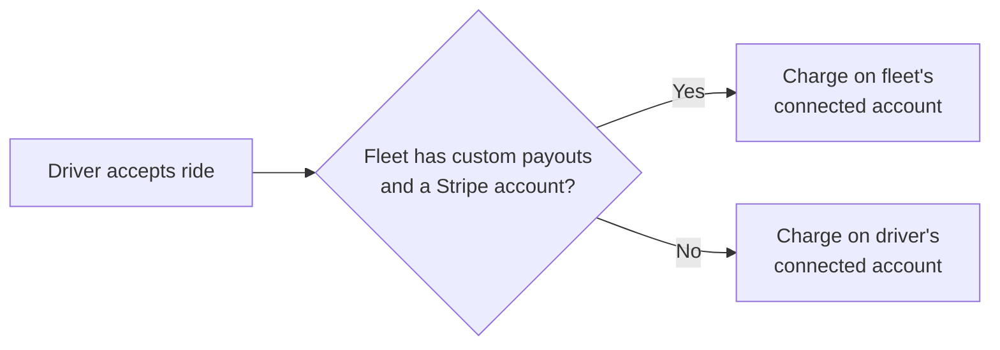

A fleet is an operator that drivers drive under. Every ride type a rider sees belongs to a fleet, and every online driver is online under exactly one fleet. Fleets decide who can accept a ride, which vehicle a driver uses, and whose Stripe account collects the fare.

This page explains the fleet model. For the dashboard tasks, see [Fleet vehicles](/dashboard/fleet-vehicles) and [Fleet driver invitations](/fleets/driver-invitations).

## What a fleet controls

A fleet row (`Fleet` in `internal/models/fleet.go`) holds:

| Field | Meaning |
| --- | --- |
| `name`, `logo_url` | How riders and drivers see the fleet. |
| `community_id` | The fleet's home community. Drivers who switch to the fleet move to this community. |
| `payment_model` | `fleet_merchant` or `owner_operator`. See [Payment models](#payment-models). |
| `has_custom_payouts` | When `true` and the fleet has a Stripe account, fares go to the fleet's Stripe account. |
| `stripe_merchant_id`, `stripe_status` | The fleet's Stripe connected account and its onboarding status. |
| `primary_vehicle_type`, `supported_vehicle_types` | The vehicle types the fleet runs. |
| `requires_confirmation_code` | Whether drivers must enter the rider's confirm code at pickup. |
| `is_student_only` | Hides the fleet's ride types from riders without a verified student account. |
| `has_owner_operators` | Marks the fleet as having owner-operator drivers. |
| `is_active`, `deleted_at` | Inactive or deleted fleets can't accept joins and don't serve communities. |

### Service communities

A fleet can serve more than one community. Each fleet-to-community pairing is a row in `FleetCommunityServices`. The `ActiveFleetCommunityServices` view lists the pairings where the service is enabled, the fleet is active, and the community is active and not archived. The dashboard pricing and driver fleet queries use this view. The rider-facing price and ride-type queries (`ListActiveRidePriceParameters`, `ListAvailableRideTypes`) do not, so a retired service does not by itself hide a fleet's open prices from riders. See [Fleet isolation](/engineering/fleets/isolation).

Admins add, retire, or restore service communities in the fleet editor. The API routes are `GET /dashboard/fleets/services/{fleet_id}` and `PUT /dashboard/fleets/services/{fleet_id}/{community_id}`, and both require the `admin` role.

Yelo also creates service rows automatically:

- When a fleet is created.
- When a community's **Primary Fleet** changes to a fleet that doesn't serve it yet.
- Archiving a community retires every service row in it and ends its open price parameters.

An admin's explicit retirement always wins over automatic creation.

### Ride types

A ride type is a price row (`RidePriceParameters`) for one fleet, one vehicle type, and one community. When a rider requests a ride, the ride records the fleet that priced it. A driver can accept a ride only if they are online under that same fleet (`validateRideFleet` in `internal/service/ride/driver.go`). Rides without a fleet predate fleets and are open to any driver.

For how prices are built, see [Pricing](/concepts/pricing). For matching, see [Matching and auto-queue](/concepts/matching-and-auto-queue).

## Payment models

Each fleet has one of two payment models. The model decides who receives the fare and what a driver must finish before driving.

| | Fleet merchant (`fleet_merchant`) | Owner-operator (`owner_operator`) |
| --- | --- | --- |
| Who is paid | The fleet's Stripe connected account | The driver's own Stripe Express account |
| Driver's personal Stripe onboarding | Not needed while the fleet manages payouts | Required |
| Vehicle | Usually fleet-owned shared inventory | The driver's own vehicle |
| Can accept joins when | Fleet is payout-ready | Fleet is active and `has_custom_payouts` is `false` |

A fleet is **payout-ready** (`Fleet.IsDriverPayoutReady()`) when it is active and not deleted, uses `fleet_merchant`, has `has_custom_payouts = true`, has a Stripe account ID, and its `stripe_status` is `complete`.

### How payouts route

When a driver accepts a ride, the API picks the Stripe account for the payment (`selectStripeMerchantID` in `internal/service/ride/driver.go`):

For authorization, capture, and payout timing, see [Payments and payouts](/concepts/payments-and-payouts).

<Note>
  Payout routing uses the fleet the driver is online under at acceptance, not their application history.
</Note>

## Fleet drivers and independent drivers

A driver can belong to several fleets but has one **active fleet**: the `FleetDrivers` row with `is_active = TRUE`. See [Membership and payout routing](/engineering/fleets/membership-and-payout-routing). The active fleet decides the community they drive in, the rides they can accept, and where their fares go.

When a driver's application activates and they have no active fleet, Yelo picks one in this order (`reconcileFleetAssignmentForUser` in `internal/service/driver/driver.go`):

1. The first fleet the driver already belongs to.
2. A fleet whose whitelist contains the driver's email.
3. The primary fleet of the driver's community.

If none apply, the driver stays independent. Independent drivers are paid on their own Stripe account.

### Switching the active fleet

A driver can switch to another fleet they belong to. The switch (`SetDriverActiveFleet` in `internal/data/repository/user_fleet.go`) is rejected if:

- The driver is online, has a ride, or has an open driver session. The app shows **Finish Driving First**.
- The driver isn't a member of the target fleet.
- The target fleet uses `fleet_merchant` but isn't payout-ready. The app shows **Fleet Payouts Unavailable**.

A successful switch sets the driver's payout fleet for fleet-merchant fleets, clears it for owner-operator fleets, and moves the driver to the fleet's community.

## How drivers join a fleet

Drivers join fleets in three ways.

<CardGroup cols={3}>
  <Card title="Invitation link" icon="link" href="/fleets/driver-invitations">
    The driver opens a reusable `https://yelo.link/fleet-<code>` link and joins in the app.
  </Card>
  <Card title="Admin assignment" icon="user-plus">
    An admin assigns the driver from the dashboard (`PUT /dashboard/users/detail/{id}/fleet`).
  </Card>
  <Card title="Email whitelist" icon="list-check">
    An admin whitelists a non-`.edu` email. The driver joins the fleet when their application activates.
  </Card>
</CardGroup>

Join links and admin assignment both go through the fleet join service (`internal/service/fleetjoin/fleet_join.go`). A join:

- Requires the fleet to pass `CanAcceptDriverJoins()`.
- Deactivates the driver's other fleet memberships and makes this fleet active.
- Moves the driver to the fleet's community.
- Tries to activate the driver if every remaining application step is done.
- Returns `joined` or `already_joined`, plus the driver's `remaining_steps`.

<Warning>
  Joining never skips application steps. Owner-operator drivers still finish their personal vehicle and Stripe onboarding. When a fleet manages both vehicles and payouts, only the profile photo and license review remain. See [Driver onboarding](/concepts/driver-onboarding).
</Warning>

The whitelist (`FleetDriverWhitelist`) rejects `.edu` emails and emails that already belong to a Yelo user.

## Fleet-owned vehicles

Fleets can own shared vehicles that every member drives. Each physical vehicle is one `Vehicles` row linked to the fleet through `FleetVehicles`. Each fleet has one explicit default vehicle.

- Joining or selecting a fleet picks its approved default vehicle.
- Going online resolves the vehicle again on the server. If every fleet vehicle is unavailable or unapproved, going online fails.
- Several drivers can use the same shared vehicle at once. Updated apps warn the driver first.
- Drivers must be offline to change vehicles.

See [Fleet vehicles](/dashboard/fleet-vehicles) for inventory management and `yelo-api/docs/fleet-owned-vehicles.md` for the migration history.

## Fleets in the dashboard

| Page | Path | Who | What |
| --- | --- | --- | --- |
| **Fleet** | `/fleets` | Admins, fleet managers | Fleet KPIs, driver directory, invitations, **Operating hours**, and **Payments** (QR payment configs). |
| **Fleets** (Configuration) | `/manage`, `/manage/{fleet_id}` | Admins | Fleet editor: settings, pricing, service communities, operating hours, join links, Stripe, vehicles. |
| **Drivers** | `/drivers` | Admins, interns, fleet managers | Driver leads and applications. Fleet managers see only their fleets. |

Fleet managers are scoped by their `fleet_assignments`. See [Dashboard roles and access](/administration/dashboard-roles). Operating hours come from a Google Calendar per fleet and community. See [Fleet operating hours](/admin/operating-hours).

Dashboard user and lead tags include a derived `Fleet: <name>` tag for activated drivers with an active membership. See [User directory](/dashboard/user-directory).

## Where this lives in code

| Area | Path |
| --- | --- |
| Fleet model and payout readiness | `yelo-api/internal/models/fleet.go` |
| Service communities | `yelo-api/internal/models/fleet_community_service.go`, `migrations/000316_fleet_community_services.up.sql` |
| Fleet joins and links | `yelo-api/internal/service/fleetjoin/fleet_join.go`, `internal/server/http/fleetjoin/routes.go` |
| Active fleet switching | `yelo-api/internal/data/repository/user_fleet.go` |
| Auto fleet assignment | `yelo-api/internal/service/driver/driver.go` (`reconcileFleetAssignmentForUser`) |
| Payout routing and fleet isolation | `yelo-api/internal/service/ride/driver.go` |
| Whitelist | `yelo-api/internal/models/fleet_driver_whitelist.go`, `internal/service/dashboard/dashboard.go` |
| Design notes | `yelo-api/docs/owner-operator-fleet-joins.md`, `docs/fleet-owned-vehicles.md`, `docs/fleet-community-dashboard.md` |
| Mobile join screen | `yelo-frontend/app/fleet-join/[code].tsx` |
| Dashboard pages | `yelo-web/src/sites/dashboard/pages/FleetsPage.tsx`, `ManageFleetsPage.tsx` |
