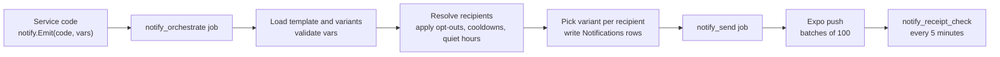

Yelo notifies riders and drivers mostly through push notifications. SMS carries friend bumps and sign-in codes, and email carries only verification codes. The team gets signup and driver-application alerts in Slack. Every templated push goes through one pipeline: code emits an event, a worker picks recipients and copy, and a sender delivers through Expo.

This page explains the model. To edit copy or review history in the dashboard, see [Notification templates](/dashboard/notification-templates).

## Channels

| Channel | Provider | Used for |
| --- | --- | --- |
| Push | Expo Push Service (`https://exp.host`) | Every templated notification: ride lifecycle, dispatch, chat, payouts, broadcasts. |
| SMS | Twilio | Friend bumps, and phone sign-in codes through Twilio Verify. |
| Email | Resend | Only the email verification code ("Your Yelo verification code"). |
| Slack | Slack (internal) | Signup alerts and driver application step alerts to the team. Users never see these. |

<Note>
  Quo and the Resend contact sync are CRM tools, not sending channels. Yelo syncs contacts and segments to them. See [Contact sync](/administration/contact-sync).
</Note>

## How a notification is sent

The pipeline runs on River, a Postgres-backed job queue (`internal/notify`).

<Steps>
  <Step title="Emit">
    Service code calls `notify.Emit` with a notification code and a typed variables struct. The orchestrate job is enqueued inside the caller's database transaction, so a notification only exists if the change that caused it commits.
  </Step>
  <Step title="Deduplicate">
    Each notification has a unique `event_key`. By default it is the code, the ride, community, or user, and a 5-minute time bucket. A second emit with the same key is dropped.
  </Step>
  <Step title="Orchestrate">
    The worker loads the template and its active variants, validates variables, and resolves recipients to push tokens. It then drops recipients who opted out or hit a cooldown, and defers recipients inside quiet hours. It assigns each recipient a variant by a deterministic hash, and writes the `Notifications`, `NotificationCohorts`, and `NotificationDeliveries` rows.
  </Step>
  <Step title="Send">
    The send job delivers in batches of 100. It adds `notification_id`, `notification_delivery_id`, `cohort_id`, and `variant_id` to the payload for tracking. If Expo fails, the batch returns to the queue and River retries. A `DeviceNotRegistered` result clears the user's push token.
  </Step>
  <Step title="Confirm">
    Every 5 minutes, `notify_receipt_check` reads Expo receipts for deliveries 15 minutes to 24 hours old. `notify_recovery` requeues deliveries stuck in `sending` for more than 10 minutes.
  </Step>
</Steps>

### Freshness

Time-sensitive codes stop retrying after 15 minutes (`orchestrateFreshness`), because a late "driver arrived" is worse than none. These include `ride_confirmed`, `driver_arrived`, `ride_canceled_by_*`, `ride_requeued`, `ride_available`, `unclaimed_ride*`, `ride_auto_queued`, `driver_renew_online`, `friend_bump`, and `dashboard_ping_*`. Payout, broadcast, and chat notifications never expire.

## Notification codes

Codes are defined in `internal/notify/codes.go`. Each code has a seeded template and a typed variables struct.

| Group | Codes |
| --- | --- |
| Ride lifecycle (rider) | `ride_confirmed`, `driver_arrived`, `ride_completed`, `ride_canceled_by_driver`, `ride_requeued`, `ride_request_no_drivers`, `direct_request_fallback` |
| Ride lifecycle (driver) | `ride_canceled_by_rider` |
| Driver dispatch | `ride_available`, `unclaimed_ride`, `unclaimed_ride_fleet`, `ride_auto_queued`, `driver_renew_online` |
| Chat | `message_sent` |
| Silent refresh | `ride_status_changed`, `ride_state_changed`, `map_content_changed` |
| Driver application | `driver_application_approved` |
| Payouts | `payout_paid`, `payout_failed`, `payout_canceled` |
| Friends | `friend_bump`, `friend_bump_sms` |
| Operator | `community_broadcast`, `dashboard_send`, `dashboard_ping_driver`, `dashboard_ping_rider` |
| Growth | `welcome_to_yelo`, `waitlist_cleared` (seeded, but no code emits them today) |

Silent codes carry no title or body. They wake the app to refresh cached data. For when each ride notification fires, see [Ride lifecycle](/concepts/ride-lifecycle). For dispatch waves, see [Matching and auto-queue](/concepts/matching-and-auto-queue).

## Templates

Each code has a template in `NotificationTemplates`, keyed by code and locale. Only `en` is used today. A template holds:

- The deep link, sound, Android channel, priority, and whether it is silent.
- A `category`: `transactional`, `marketing`, or `safety`.
- A JSON schema for its variables.
- Limits: `max_recipients`, `user_cooldown_seconds`, `community_cooldown_seconds`, `quiet_hours_behavior` (`bypass` or `defer`), and `max_defer_seconds`.

Copy lives in `NotificationTemplateVariants`. Each variant has a title, body, and weight. Active variant weights must add up to 100, which lets you A/B test copy. Rendering replaces `{{variable}}` placeholders. An unknown placeholder renders as empty text.

Templates are seeded from `internal/notify/seed/templates.go` when the API starts. The seeder only inserts missing rows, so dashboard edits survive deploys. Only admins can edit templates, preview them, or send a test (`/dashboard/notifications/templates/...`).

## Operator broadcasts

Admins send broadcasts from the **Notifications** page with **Send Notification**. The sheet asks for:

- A community.
- A recipient group: **All Users**, **Drivers Only**, **Riders Only**, **Online Drivers**, or **Recently Online Drivers**.
- A title and body. Together they must fit in 3,000 bytes.
- **Send Now** or **Schedule for Later**.

The request goes to `POST /dashboard/notifications/send` and requires the `admin` role. It emits `community_broadcast` for the community. Recipients are resolved when the job runs:

| Group | Who receives it |
| --- | --- |
| **Drivers Only** | Users with an active driver application. |
| **Online Drivers** | Drivers with an open driver session. |
| **Recently Online Drivers** | Drivers whose session ended within the last 60 minutes. |

<Warning>
  The **Link (optional)** field is saved but not sent. Broadcasts always open the template's default deep link.
</Warning>

### Scheduled broadcasts

A scheduled broadcast is stored in `ScheduledCommunityNotifications`. A background loop in the API checks every minute and sends due rows, then deletes them. You can list scheduled sends in the **Scheduled** tab and cancel one with `DELETE /dashboard/notifications/scheduled/{schedule_id}`.

### Pings from Supply & Demand

The **Supply & Demand** page can notify a market or ping one driver or rider. These emit `community_broadcast`, `dashboard_ping_driver`, and `dashboard_ping_rider`.

## Limits, cooldowns, and quiet hours

- **Cooldowns.** Templates can set per-user and per-community cooldowns. Seeded values include 900 seconds for `unclaimed_ride*` and 300 seconds for `friend_bump`. `ride_available`, `message_sent`, and the silent refresh codes always bypass cooldowns.
- **Quiet hours.** Quiet hours apply only when a template uses `defer` and is either `marketing` or `community_broadcast`. Deferred deliveries send at the end of the community's quiet window. If that is later than `max_defer_seconds`, they are dropped as `quiet_hours_expired`.

<Note>
  Quiet hours and per-community cooldown overrides come from the `NotificationPolicies` table. No dashboard page or API route edits that table today, so quiet hours are off unless a row is added directly.
</Note>

## Friend bumps

A friend bump tells a friend where you are heading. `POST /notification/bump` sends it to confirmed friends only.

- **SMS first.** Each recipient who can receive SMS gets a text through a River job, with up to 3 attempts.
- **Push fallback.** Recipients who can't receive SMS, or whose SMS fails for good, get the `friend_bump` push.
- **Limits.** 20 bumps per sender per hour, one SMS per recipient every 5 minutes, and texts older than 15 minutes are dropped.

## Internal Slack alerts

| Alert | When | Channel |
| --- | --- | --- |
| Signup alert | 90 seconds after a new account is created. Test accounts are skipped. | User updates |
| Driver application | On the first upload of **Profile Photo**, **License Photos**, **Vehicle Created**, and on **Stripe Signup** completion. Includes a **View application** link. | Driver updates |

## Opt-outs

| Setting | Scope | How it changes |
| --- | --- | --- |
| `allow_notifications` | All push, including ride pushes. | The in-app notifications setting calls `PUT /user/allow-notifications`. |
| `sms_opted_out_at` | All SMS. | Replying `STOP`, `STOPALL`, `UNSUBSCRIBE`, `CANCEL`, `END`, or `QUIT` sets it. `START`, `UNSTOP`, or `YES` clears it. |

There are no per-category preferences. Yelo texts a user only if they have a verified phone and haven't opted out (`CanReceiveSMS`).

## In the mobile app

The app registers for push in `providers/PushNotificationProvider.tsx`:

- It gets an Expo push token on physical devices and sends it to `POST /notification/set-token` when it changes. Sign-out calls `POST /notification/clear-token`. Each user has one token.
- Android uses two channels: `default` and `kaching-channel`, which plays `kaching.wav`.
- The **Notifications** permission is requested during sign-up. See [Accounts and sign-in](/concepts/accounts-and-sign-in).

When a user taps a notification, `lib/notifications/processNotificationTap.ts` reads the deep link from the payload, records `POST /notification/opened` with the tracking ID, and navigates. The **History** and **Analytics** tabs use these open events.

## Where this lives in code

| Area | Path |
| --- | --- |
| Emit, codes, rendering | `yelo-api/internal/notify/` (`emit.go`, `codes.go`, `render.go`, `typed_vars.go`) |
| Queue workers | `yelo-api/internal/notify/queue/` (`orchestrate.go`, `send.go`, `queue.go`) |
| Template seeds | `yelo-api/internal/notify/seed/templates.go` |
| Template admin | `yelo-api/internal/notify/admin/service.go` |
| Lifecycle and broadcast helpers | `yelo-api/internal/service/notifications/` |
| Expo client | `yelo-api/internal/utilities/notification/expo.go` |
| SMS and email | `yelo-api/internal/data/twilio/twilio.go`, `internal/utilities/mail/mail.go` |
| SMS opt-out webhook | `yelo-api/internal/server/http/twiliowebhook/twiliowebhook.go` |
| Dashboard | `yelo-web/src/sites/dashboard/pages/NotificationsPage.tsx`, `src/components/notifications/SendNotificationSheet.tsx` |
| Mobile | `yelo-frontend/providers/PushNotificationProvider.tsx`, `lib/notifications/` |
