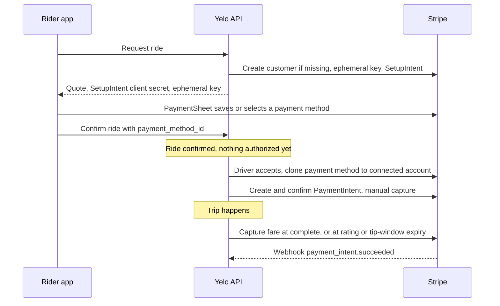

Stripe is Yelo's only payment processor. Riders pay with a payment method saved on a Stripe customer on the Yelo platform account. The money for each ride is charged directly on a Stripe Connect **Express** account that belongs to the driver or to the driver's fleet.

This page covers who gets paid, when money is authorized and captured, and how Stripe keeps Yelo's records in sync. Tips and the driver earnings screens are on [Tips and earnings](/concepts/tips-and-earnings).

## Accounts

| Party | Stripe object | Created by | Stored in |
| --- | --- | --- | --- |
| Rider | Customer on the platform account | `ensureStripeCustomerSetup` on the first ride request, if missing | `Users.stripe_customer_id` |
| Driver | Express account, `individual`, US, `card_payments` and `transfers` capabilities, daily payouts | `GET /stripeaccount/onboarding-link` (`StripeAccountService.GetOnboardingLink`) | `Users.stripe_merchant_id` |
| Fleet | Express account, `company`, US, same capabilities | Dashboard fleet creation or Stripe relink (`CreateFleetExpressAccount`) | `Fleets.stripe_merchant_id` |

Before creating a driver account, the API requires a completed profile. It also requires a verified phone when that check is enabled. Onboarding links return to `/stripe-reauth/onboarding`, which issues a fresh link if the old one expired. Drivers open the Stripe Express dashboard through `GET /stripeaccount/login-link` once onboarding details are submitted.

## Who receives the money

At accept and at complete, `selectStripeMerchantID` in `internal/service/ride/driver.go` picks the connected account:

- The **fleet's** account, when the driver's current session fleet has `has_custom_payouts = true` and a `stripe_merchant_id`.
- Otherwise, the **driver's own** account.

The chosen account is saved as `Rides.stripe_merchant_id` and recorded in a `merchant_selected` ride event with `merchant_type` of `fleet` or `driver`. Every later capture, cancel, and tip for that ride uses the saved account.

A fleet is fully payout-ready (`Fleet.IsDriverPayoutReady`) when it's active, uses the `fleet_merchant` payment model, has custom payouts on, and its Stripe status is `complete`. Drivers only receive immediate ride pushes if they're payout-ready themselves or through such a fleet. See [Fleets](/concepts/fleets#payment-models) for payment models and [Fleet driver invitations](/fleets/driver-invitations) for how fleets and owner-operators enroll drivers.

<Note>
PaymentIntents are created directly on the connected account, and the code sets no application fee. The full captured amount lands in the driver's or fleet's Stripe balance. `driver_payout` on the ride records that amount.
</Note>

## Payment timeline

### Request: SetupIntent

`CreateRide` makes sure the rider has a Stripe customer. It then creates an ephemeral key and a SetupIntent (automatic payment methods, no redirects) on that customer and returns `stripe_customer_id`, `ephemeral_key`, and `setup_intent_client_secret`.

The mobile app passes them to Stripe PaymentSheet in custom-flow mode (`yelo-frontend/lib/payments/paymentSheetConfig.ts`). Apple Pay is offered through PaymentSheet with merchant ID `merchant.com.rideyelo.yelo`. The Apple Pay sheet shows the ride fare plus a pending $5.00 "Tip authorization" line. Apple Pay is hidden only on the iOS simulator with a live key.

### Confirm: consent, no charge

`ConfirmRide` requires a `payment_method_id` when the fare is above $0. It stores the payment method, rider IP address, and user agent, and stamps `confirm_time` and `payment_consent_at`. These later become the off-session mandate on the PaymentIntent. No money moves at confirm.

### Authorization at accept

For a paid ride, `processRidePayment` runs before the ride is assigned. For a manual accept this happens in `AcceptRide`. For queued rides it happens when the ride is promoted to the active slot.

1. **Clone the payment method**: `ClonePaymentMethod` copies the rider's platform payment method onto the connected account.
2. **Create the PaymentIntent** on the connected account:
   - `capture_method: manual` and `confirm: true`
   - `off_session: true`, with mandate data from the confirm-time IP, user agent, and timestamp
   - Metadata `ride_id`, `rider_id`, and `driver_id`
   - Amount: the effective fare, **plus a $5.00 tip buffer** (`models.TipBuffer`) when tips are enabled on the ride
3. **Persist it**: `payment_intent_id`, `pre_auth_amount`, `cloned_payment_method_id`, and `stripe_merchant_id` are saved on the ride. The write is rejected if the ride changed in the meantime. In that case the new hold is canceled.

Free rides skip all of this. If cloning or PaymentIntent creation fails, the accept fails. See [Cancellations](/concepts/cancellations#system-initiated-endings) for what happens to the ride.

**Rematch after a requeue.** A requeued ride keeps its PaymentIntent. When the next driver accepts, `reuseRideAuthorization` checks the existing intent. If it's the same driver and account, it reuses the hold. If the hold belongs to the previous driver (who is now in `declined_drivers`), it cancels that hold and creates a new one on the new driver's account. Any mismatch in amount, currency, capture method, or metadata stops the accept with an error rather than reusing a hold it can't verify.

### Capture

Yelo never captures the full authorization blindly. Every capture uses `PartiallyConfirm` with an explicit `amount_to_capture`, so the rest of the hold, including an unused tip buffer, is released.

| Situation | When the fare is captured | Amount |
| --- | --- | --- |
| Tips disabled | At `Complete` | Fare |
| Tips enabled, rider rates with no tip | At rating | Fare |
| Tips enabled, tip up to $5.00 | At rating | Fare + tip, in one capture |
| Tips enabled, tip over $5.00 | At rating | Fare, plus a separate tip charge |
| Tips enabled, rider never rates | Tip-window sweeper, after 24 hours | Fare |
| Canceled with a fee | At cancel | Fee |
| Canceled with no fee | Never. The PaymentIntent is canceled. | — |

`PartiallyConfirm` retries up to 3 times with jittered backoff. It treats Stripe's `charge_already_captured` error as success, so concurrent capture paths are safe to race.

If `Complete` captures the fare but the database write then fails, the service cancels the PaymentIntent when tips are disabled. For tip-enabled rides it logs the ride for manual review, because the hold is still uncaptured.

## Webhooks

Stripe sends events to `POST /stripe-webhook`. The handler (`internal/server/http/payment/payment_handler.go`) verifies the signature with `STRIPE_WEBHOOK_SECRET` and routes by event type:

| Event | Handling |
| --- | --- |
| `payment_intent.succeeded` | Sets `Rides.driver_payout` to `amount_received` for rides with that `payment_intent_id`, and updates the `PaymentIntents` status row. |
| `payment_intent.payment_failed` | Updates the `PaymentIntents` status row. |
| `payment_intent.attached` | No-op. |
| `account.updated` | Updates the Stripe status of the fleet or driver that owns the account. See below. |
| `checkout.session.completed` | Records a QR payment or QR tip in `QrPayments`. |
| `payout.paid`, `payout.failed`, `payout.canceled` | Sends the driver a payout push. See [Tips and earnings](/concepts/tips-and-earnings#payout-notifications). |

Other event types are logged and ignored.

### Account status

`PaymentService.AccountUpdated` maps a Stripe account to a status:

| Stripe account state | Status |
| --- | --- |
| Any `past_due` or `currently_due` requirements | `restricted` |
| No outstanding requirements, `payouts_enabled` is false | `pending` |
| Otherwise | `complete` |

- **Fleet accounts** update `Fleets.stripe_status`. On `complete`, the fleet is activated, and drivers already marked to join it are reconciled into it.
- **Driver accounts** update the Stripe step of the driver's application. On `complete`, the driver gets a "Stripe signup completed" notification. Active drivers are also re-run through activation reconciliation.

## Reconciliation

Webhooks can be missed, so a River job re-syncs every connected account about once a day:

- `stripe_reconciliation_dispatch` runs every minute. It discovers every non-deleted user and fleet with a `stripe_merchant_id`, then enqueues up to 100 due accounts.
- `stripe_reconcile_account` fetches the account from Stripe and runs the same `AccountUpdated` logic, with notifications suppressed. It retries up to 12 times with exponential backoff capped at 6 hours.
- Each account is due again 24 hours after a successful run. State lives in the `StripeReconciliation` table, and coverage is logged each cycle.

Operators can inspect these jobs in River UI at `/riverui`, behind Clerk admin auth.

## Where this lives in code

| Concern | Location |
| --- | --- |
| Authorization, reuse, capture at complete | `yelo-api/internal/service/ride/driver.go` |
| Customer and SetupIntent setup | `yelo-api/internal/service/ride/rider.go` (`ensureStripeCustomerSetup`) |
| Stripe client (intents, clones, accounts, payouts) | `yelo-api/internal/data/stripe/` |
| Webhook routing | `yelo-api/internal/server/http/payment/payment_handler.go` |
| Account status and QR payment recording | `yelo-api/internal/service/payment/payment.go` |
| Reconciliation jobs | `yelo-api/internal/service/payment/reconciliation_jobs.go`, `yelo-api/internal/notify/queue/queue.go` |
| Driver onboarding links | `yelo-api/internal/service/stripeaccount/stripeaccount.go` |
| Fleet accounts | `yelo-api/internal/service/dashboard/fleet.go` |
| Mobile PaymentSheet and Apple Pay | `yelo-frontend/lib/payments/`, `yelo-frontend/components/ride/StripePaymentScreen.tsx` |
