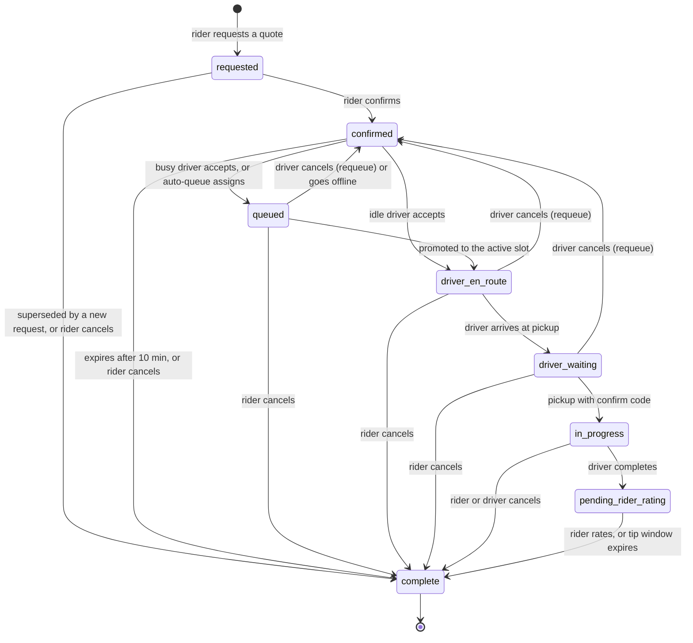

A ride moves through a fixed set of statuses from the moment a rider asks for a quote until the fare settles. This page explains each status, what triggers each transition, and how cancellations, requeues, and expiry fit in.

For how drivers find and claim rides, see [Matching and auto-queue](/concepts/matching-and-auto-queue). For fees, see [Cancellations](/concepts/cancellations).

## Statuses

`RideStatus` is defined in `internal/models/ride.go` and mirrored in the Postgres `Rides.status` column.

| Status | Meaning | Driver assigned? |
| --- | --- | --- |
| `requested` | The rider opened the request flow. The API created the row, priced the vehicle options, and returned a Stripe SetupIntent. Drivers can't see the ride. | No |
| `confirmed` | The rider picked a vehicle and confirmed. The ride is on the ride board and drivers are being notified. | No |
| `queued` | A driver owns the ride but is still busy with an earlier ride, or the auto-queue assigned it. | Yes |
| `driver_en_route` | The driver is heading to pickup. | Yes |
| `driver_waiting` | The driver marked themselves at pickup and is waiting for the rider. | Yes |
| `in_progress` | The rider is in the vehicle. | Yes |
| `pending_rider_rating` | The driver completed the trip. The ride waits for the rider's rating and, for tip-enabled rides, the tip window. | Yes (historical) |
| `complete` | Terminal. Used for finished trips **and** for every cancellation and expiry. | Historical only |
| `no_drivers_available` | Legacy terminal value. Still in the enum and in analytics queries, but no code path on `main` writes it. | No |

<Warning>
There is no `canceled` status. A canceled or expired ride ends in `complete`, with `cancel_phase` set to the status it was in when it ended. Filter on `cancel_phase IS NULL` when you want trips that actually happened.
</Warning>

## State diagram

## Transitions and who triggers them

| Transition | Actor | Endpoint or job | Service method |
| --- | --- | --- | --- |
| → `requested` | Rider | `POST /ride/` or `POST /ride/v2/` | `RideService.CreateRide` / `CreateRideV2` |
| `requested` → `confirmed` | Rider | `POST /ride/i/{id}/confirm` | `RideService.ConfirmRide` |
| `confirmed` → `driver_en_route` or `queued` | Driver | `POST /ride/i/{id}/accept` | `RideService.AcceptRide` |
| `confirmed` → `queued` | System | Operational loop (auto-queue pass) | `ActivationService.tryAutoQueueAssign` → `RideService.AutoAssignRide` |
| `queued` → `driver_en_route` | System | After the driver's active ride ends, or queue recovery | `advanceQueuedRide`, `RecoverIdleQueue` |
| `driver_en_route` → `driver_waiting` | Driver | `POST /ride/i/{id}/at-pickup` | `RideService.AtPickup` |
| `driver_waiting` → `in_progress` | Driver | `POST /ride/i/{id}/pickup` | `RideService.Pickup` |
| `in_progress` → `pending_rider_rating` | Driver | `POST /ride/i/{id}/complete` | `RideService.Complete` |
| `pending_rider_rating` → `complete` | Rider | `POST /ride/i/{id}/rate` | `RideService.Rate` |
| `pending_rider_rating` → `complete` | System | `TipCapture` loop, every 5 minutes | `RideService.AutoCaptureTipWindowExpired` |
| Any active status → `complete` | Rider or driver | `POST /ride/i/{id}/cancel` | `RideService.Cancel` |
| `queued`, `driver_en_route`, `driver_waiting` → `confirmed` | Driver | `POST /ride/i/{id}/cancel` | `RideService.requeueAfterDriverCancel` |
| `confirmed` → `complete` | System | Operational loop, every 30 seconds | `RideService.CancelUnmatchedRides` |

Every lifecycle write runs through a locked "ride command" transaction in `internal/data/repository/ride_command.go`. The transaction locks participant users in UUID order, then the ride row, and rechecks the expected status before writing. A stale request fails instead of overwriting a newer state.

## Step by step

<Steps>
  <Step title="Request">
    The rider picks pickup and dropoff. `CreateRide` resolves the rider's community, rejects it if the community has rides disabled, and cancels any older `requested` ride for the same rider with `cancel_reason = 'superseded'`. It then stores the new ride, prices every available vehicle option, and makes sure the rider has a Stripe customer. The response includes a SetupIntent client secret and an ephemeral key. See [Pricing](/concepts/pricing).
  </Step>
  <Step title="Confirm">
    The rider selects a vehicle and payment method. `ConfirmRide` recomputes the fare server-side, stores the vehicle type, fleet, price, and payment method, and generates a confirm code if the fleet requires one. It then adds the ride to the ride board and notifies drivers. If the rider picked a specific driver, the ride is offered to that driver first. No money is authorized yet.
  </Step>
  <Step title="Accept or auto-assign">
    A driver accepts from the board, or the auto-queue assigns the ride. For a paid ride, a manual accept authorizes the payment on the driver's or fleet's Stripe account **before** the ride is assigned. An auto-queued ride is authorized when it's promoted to the active slot. See [Payments and payouts](/concepts/payments-and-payouts).
  </Step>
  <Step title="Arrive and pick up">
    The driver taps arrived (`driver_waiting`, which stamps `at_pickup_time`), then enters the rider's confirm code to start the trip (`in_progress`).
  </Step>
  <Step title="Complete">
    The driver completes the trip. Tip-enabled paid rides open a 24-hour tip window and defer capture. Other paid rides capture the fare immediately. The ride moves to `pending_rider_rating`, and the driver's next queued ride, if any, is promoted.
  </Step>
  <Step title="Rate and settle">
    The rider's rating moves the ride to `complete`. On tip-enabled rides the rating also captures the fare and any tip. If the rider never rates, the tip-window sweeper captures the fare with no tip after the window expires. See [Tips and earnings](/concepts/tips-and-earnings).
  </Step>
</Steps>

<Note>
A rider can't book a new ride while any other ride is in `confirmed`, `queued`, `driver_en_route`, `driver_waiting`, `in_progress`, or `pending_rider_rating`. Rides without tips enabled stay in `pending_rider_rating` until the rider submits a rating, so an unrated trip blocks the next booking.
</Note>

## Confirm code

The confirm code is the four-digit PIN the rider shows the driver at pickup.

- `ConfirmRide` generates a random code from 1000 to 9999 only when the ride's fleet has `requires_confirmation_code = true`. New fleets default to `true`.
- Riders whose email ends in `@rideyelo.com` always get `1234` so end-to-end tests can complete pickups.
- `Pickup` compares the submitted code with the stored `confirm_code`. If the ride has no stored code, the check is skipped.
- Only the rider sees `confirm_code` in the ride-state snapshot. Driver payloads get `null` plus a `requires_confirm_code` flag.

## Ride board

The ride board holds every `confirmed` ride that no driver owns yet. A ride is added on confirm and on requeue, and removed on accept, auto-assign, cancel, and expiry. Drivers only see board rides in their community and for the fleet they're online under. Details are on [Matching and auto-queue](/concepts/matching-and-auto-queue#the-ride-board).

## Expiry

`CancelUnmatchedRides` runs every 30 seconds in the `Operational` background loop. It ends any `confirmed` ride with no driver whose `confirm_time` is more than `RideRequestExpiry` (10 minutes, `internal/utilities/config/constants.go`) in the past.

Expired rides get `status = 'complete'`, `cancel_phase = 'confirmed'`, `cancel_reason = 'automatic'`, and a null `cancel_user`. The rider receives the `ride_request_no_drivers` notification, and the ride event log records `no_drivers_available`.

<Warning>
The expiry sweep doesn't call Stripe. A requeued ride keeps its earlier authorization. If that ride then expires, the hold isn't released by this job.
</Warning>

## Requeue after a driver cancels

When the assigned driver cancels a ride in `queued`, `driver_en_route`, or `driver_waiting`, the ride goes back to `confirmed` instead of ending. `RequeueRideAfterDriverCancel`:

- Clears `driver_id`, `driver_vehicle_id`, and `match_time`.
- Adds the driver to `declined_drivers` so they aren't offered the ride again.
- Resets `confirm_time` to now, which restarts the 10-minute expiry clock.
- Keeps the price, payment method, confirm code, and `payment_intent_id`.

The service then re-adds the ride to the board, re-runs the immediate driver notification, sends the rider a single "finding you a new driver" push, and records an `auto_requeued` event. No cancellation fee applies. The next driver who accepts replaces the old authorization; see [Payments and payouts](/concepts/payments-and-payouts#authorization-at-accept).

## Offline drivers and queued rides

If a driver with queued rides drops offline, `PurgeOfflineDrivers` gives them a 5-minute grace period (`OfflineGraceInterval`). After that, `UnqueueDriverRides` returns their `queued` rides to `confirmed` and puts them back on the board. Active rides aren't touched.

## Audit trail

`internal/service/rideevents` writes an event for each step to the `"RideEvents"` table. See [Ride events](/reference/ride-events). Event types include `ride_requested`, `ride_confirmed`, `ride_accepted`, `ride_auto_queued`, `queue_promoted`, `driver_at_pickup`, `rider_picked_up`, `ride_completed`, `ride_canceled`, `auto_requeued`, `payment_intent_created`, `payment_confirmed`, `tip_captured`, and `tip_window_expired`. The full list lives in `internal/models/ride_event.go`.

## Where this lives in code

| Concern | Location |
| --- | --- |
| Status enum and ride models | `yelo-api/internal/models/ride.go` |
| Rider flows (request, confirm, direct requests) | `yelo-api/internal/service/ride/rider.go` |
| Driver flows (accept, pickup, complete, queue promotion) | `yelo-api/internal/service/ride/driver.go` |
| Cancel, requeue, expiry, rating | `yelo-api/internal/service/ride/ride.go` |
| Locked lifecycle writes | `yelo-api/internal/data/repository/ride_lifecycle.go`, `ride_command.go`, `ride_matching.go` |
| Lifecycle SQL | `yelo-api/internal/data/repository/queries/ride_lifecycle.sql` |
| Timing constants | `yelo-api/internal/utilities/config/constants.go` |
| Background loops | `yelo-api/cmd/api/main.go` (`startBackgroundTasks`) |
| Ride-state snapshot protocol | `yelo-api/docs/ride-state-protocol.md` |
| Rider and driver screens | `yelo-frontend/app/(app)/ride/`, `yelo-frontend/app/(app)/drive/` |
