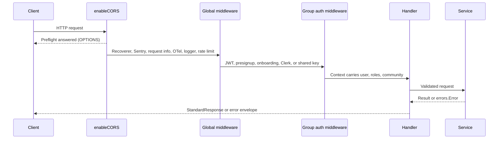

This page follows a single request from the socket to the response body. Most of the code lives in `internal/server/http`: `server.go`, `router.go`, `middleware*.go`, and `clerk_middleware.go`.

## Server and router

The API uses [Fuego](https://github.com/go-fuego/fuego) on top of a [Chi](https://github.com/go-chi/chi) mux. Fuego provides typed handlers and generates OpenAPI from route registrations. Chi provides routing and route patterns for tracing.

`Server.Serve()` builds the router, wraps the whole mux with the CORS handler, and starts a standard `http.Server`:

| Setting | Value |
| --- | --- |
| `ReadTimeout` | 30 seconds |
| `WriteTimeout` | 30 seconds |
| `IdleTimeout` | 1 minute |

Because `Serve` uses its own `http.Server` rather than `fuego.Server.Run()`, the router calls `RegisterOpenAPIRoutes` explicitly and then runs `finalizeOpenAPI`, which strips XML content types and fixes multipart upload schemas.

## Request flow



### CORS

`enableCORS` runs before routing so it can answer preflight requests.

- In `dev`, CORS is disabled and any `Origin` is echoed back. `ENVIRONMENT` defaults to `dev`, so a deployment that omits it reflects every origin.
- Elsewhere, only origins in `CORS_TRUSTED_ORIGINS` (or the built-in default list) receive `Access-Control-Allow-Origin` and `Access-Control-Allow-Credentials: true`.
- `/authv3` paths use a separate exact allowlist, `AUTH_V3_CORS_ORIGINS`, and never inherit the legacy trusted origins. Auth v3 preflights also allow the `X-API-Version` header and expose `Retry-After` and `X-Request-ID`.
- Preflight responses allow `OPTIONS, GET, POST, PUT, PATCH, DELETE` and cache for 3600 seconds.

### Global middleware

The router registers these in order. Fuego applies them to each route when it's registered on its `http.ServeMux`, so they wrap every Fuego route but don't run for requests that match no route:

| Order | Middleware | What it does |
| --- | --- | --- |
| 1 | `middleware.Recoverer` (Chi) | Recovers panics and returns 500 |
| 2 | `sentryhttp` | Only when Sentry is initialized; re-panics after capture |
| 3 | `contextSetRequestInfo` | Generates a UUID request ID, stores method, path, `Origin`, and the start time in context |
| 4 | `otelInstrumentation` | Wraps the request in an `otelhttp` span, records request and response size, inflight gauge, slow requests, and error counters. Span names and the `http.route` label use the raw path, because Fuego routes on `http.ServeMux` and the middleware looks for a Chi route pattern. See [Metrics](/reference/metrics#spans) |
| 5 | `contextSetLogger` | Attaches a zerolog logger with trace correlation fields to the context |
| 6 | `rateLimit` | Per-IP token bucket (see [Rate limiting](#rate-limiting)) |

<Note>
The request ID is generated per request. The API does not read an incoming `X-Request-ID` header. The ID appears in `metadata.request_id` on every standard response and on log lines.
</Note>

A request is logged as slow when it exceeds `SLOW_REQUEST_THRESHOLD_MS` (default 150). See [Observability](/engineering/observability) for the metrics and traces this produces.

### Route groups and auth

After the global chain, Fuego groups add their own middleware. The group decides which credential a route accepts.

| Group prefix | Middleware | Credential |
| --- | --- | --- |
| `/user`, `/community`, `/ride`, `/referral`, `/coupon`, and most top-level domains | `getValidateJWTMiddleware` + `getRequireRoleMiddleware(["user"])` | Full app JWT |
| `/authv2` phase 2 and 3, `/world-cup` (auth), `/tips` (auth) | `getValidatePresignupTokenMiddleware` | Presignup or full JWT |
| `/authv3` onboarding routes | `ValidateOnboardingTokenMiddleware` | Auth v3 onboarding JWT |
| `/authv3/user` | JWT + `user` role | Full app JWT |
| `/dashboard` | `getClerkAuthMiddleware` + `getDashboardScopeMiddleware` | Clerk session JWT |
| `/internal` | `getInternalKeyMiddleware` | `X-Internal-Key` header |
| `/internal/e2e` | `getE2EKeyMiddleware` | `X-E2e-Key` header, only when `E2E_ENABLED=true` |
| `/metrics`, `/debug/pprof/` | `metricsAuthMiddleware` | Bearer `METRICS_AUTH_TOKEN`. Not mounted when the token is empty |
| Webhooks | None at the group level | Each handler verifies a signature |

Some ride routes use `getOptionalAuthMiddleware`: a valid token attaches the user, but a missing or invalid token never returns 401. Details of every credential are in [Authentication](/engineering/api/authentication).

## Handlers

Fuego handlers are typed functions. A handler receives a `fuego.ContextWithBody[T]` or `fuego.ContextNoBody` and returns `(json.StandardResponse[R], error)`.

```go
func (h *RideHandler) CreateRide(c fuego.ContextWithBody[models.CreateRideRequest]) (json.StandardResponse[models.CreatedRide], error) {
	ctx := c.Context()

	riderId, err := customContext.GetRequestUserID(ctx)
	if err != nil {
		return json.StandardResponse[models.CreatedRide]{}, err
	}

	createRideRequest, bodyErr := c.Body()
	if bodyErr != nil {
		return json.StandardResponse[models.CreatedRide]{}, errors.Wrap(bodyErr, "failed to read request body")
	}

	v := validator.New()
	if createRideRequest.Validate(v); !v.Valid() {
		return json.StandardResponse[models.CreatedRide]{}, v.ErrorOrNil()
	}

	response, err := h.rideService.CreateRide(ctx, createRideRequest)
	if err != nil {
		return json.StandardResponse[models.CreatedRide]{}, err
	}

	c.Response().WriteHeader(http.StatusCreated)

	return json.NewStandardResponse(ctx, response), nil
}
```

Context helpers in `internal/utilities/context` read what the auth middleware stored: `GetRequestUserID`, `GetRequestUserCommunity`, `GetRequestUserRoles`, and `GetClerkUserContext`. `shared.HandleWithUserID` wraps the common "user ID + body + `Validate` + call service" pattern.

### Request feature flags

Clients opt into some behavior with the `X-Features` header, a comma-separated list. `features.HasFeature(r, name)` checks it. The mobile app sends `tips,driver-options` when creating rides, which sets `TipsEnabled` and `DriverOptionsEnabled` on the request.

## Response envelopes

Successful Fuego handlers return the v2 `StandardResponse` shape:

```json
{
  "success": true,
  "data": { "id": "..." },
  "metadata": {
    "timestamp": "2026-09-25T16:32:48Z",
    "request_id": "8d1c...",
    "trace_id": "4bf9...",
    "server": "yelo-api",
    "latency_ms": 42
  }
}
```

- `data` has no `omitempty`, so it is always present. Coerce nil slices to empty slices in the handler before building the response, or clients receive `"data": null`.
- `metadata.server` comes from `OTEL_SERVICE_NAME`.
- `json.SuccessResponse` (`{"success": true}`) is the conventional payload for commands with no result.

Errors come in two shapes, depending on where they are produced:

<Tabs>
  <Tab title="v2 (handler errors)">
    Any error returned from a Fuego handler goes through `Server.errorHandler`, which always writes the v2 error envelope:

    ```json
    {
      "success": false,
      "error": {
        "code": "NotFoundError",
        "message": "ride not found",
        "title": "Not Found",
        "body": "...",
        "fingerprint": "..."
      },
      "metadata": { "request_id": "...", "latency_ms": 3, "...": "..." }
    }
    ```
  </Tab>
  <Tab title="v1 (middleware errors)">
    Middleware writes errors with `httperrors.SendErrorResponse`. It uses the v2 envelope only when the request sends `X-Api-Version: v2`. Otherwise it writes the legacy body:

    ```json
    {
      "error": "unauthorized: error parsing token",
      "title": "Unauthorized",
      "body": "This user could not be authenticated",
      "code": "UnauthorizedError"
    }
    ```
  </Tab>
</Tabs>

<Warning>
Some middleware paths call `json.WriteJSON` with a nil envelope, so the body is the literal `null`. This happens for a failed role check (401), a failed Clerk role gate (403), the dashboard scope check (401), an auth cache failure (401), and rate limiting (429). Clients must handle a status code with no error payload.
</Warning>

The mobile auth client and the web Auth v3 client send `X-API-Version: v2`. The header name is case-insensitive.

## Error handling

`errorHandler` normalizes whatever the handler returned:

1. Fuego body-decoding failures (`fuego.BadRequestError`) and validation failures (`fuego.HTTPError` below 500) become `BadRequestError`, even when `errors.Wrap` has promoted them to `ServerError`.
2. Any other `errors.Error` passes through unchanged.
3. Anything else becomes `ServerError`.

`httperrors.LogError` then logs 5xx errors at ERROR (Sentry capture and error metric) and 4xx errors at WARN only.

`httperrors.MapErrorToStatusCode` decides the status:

| Status | Error types |
| --- | --- |
| 400 | `ValidationError`, `InputError`, `MissingFieldsError`, `PickupAddressRequired`, `DestinationAddressRequired`, `AlreadyInRideError`, `HandoffCodeInvalidError` |
| 401 | `UnauthorizedError`, `AccountDeletedError`, `AccountBannedError` |
| 403 | `ForbiddenError` |
| 404 | `NotFoundError`, `NoDriversError` |
| 409 | `DuplicateError`, `IdentityConflictError`, `AccountMergeRequiredError`, `ExistingAccountVerificationRequiredError`, `ProfileRequiredError`, `PhoneRequiredError`, `FleetJoinBusyError`, `FleetPayoutUnavailableError` |
| 410 | `AuthTransactionExpiredError` |
| 429 | `RateLimitError` |
| 503 | `AuthV3UnavailableError`, `ProviderUnavailableError`, `RideStateUnavailableError` |
| 500 | `ServerError` and any unmapped type |

When you add a new error type, add it to this switch and to the circuit breaker's `IsSuccessful` list in `internal/utilities/circuitbreaker` if it represents a client error.

## Rate limiting

`rateLimit` is an in-memory, per-process token bucket keyed by client IP (`network.GetRealIP`).

- Defaults: 50 requests per second with a burst of 100, set by the `--limiter-rps`, `--limiter-burst`, and `--limiter-enabled` flags.
- A janitor goroutine runs every minute, evicts IPs not seen for 3 minutes, and reports `rate.limiter.active_clients`. It stops when `Server.Shutdown` closes the `done` channel.
- Rejections return 429 with a `null` body and increment the rate-limit rejection metric.
- The key is spoofable. `GetRealIP` (`internal/utilities/network/ip.go`) trusts a client-supplied `X-Real-IP` header first, then the leftmost `X-Forwarded-For` entry, and only falls back to `RemoteAddr` when both are absent. A client that rotates these headers gets a fresh bucket per value.

Because the bucket is per instance, the effective limit scales with the number of Cloud Run instances. Auth v3 adds a separate durable limiter backed by Postgres for OTP and sign-in dimensions. See [Authentication](/engineering/api/authentication#auth-v3).

## Route annotations

Every route documents its errors with helpers from `internal/server/http/routeopt`:

```go
fuego.Post(s, "/i/{id}/accept", handler.AcceptRide,
	option.Summary("Accept ride"),
	option.OperationID("ride.AcceptRide"),
	option.AddResponse(200, "Ride accepted", fuego.Response{Type: json.StandardResponse[json.SuccessResponse]{}}),
	routeopt.Errors(401, 500),
	routeopt.Error(404, "Ride not found"),
)
```

- `routeopt.Errors(codes...)` adds standard descriptions for 400, 401, 403, 404, 429, and 500. It panics at startup on any other code.
- `routeopt.Error(code, description)` adds a route-specific description.
- `option.Hide()` removes a route from the published spec.

`route_annotations.go` also defines `MarkExternalRoute` and `IsExternalRoute`, which let the OTel middleware tag spans with `external_dependency=true`. No production route calls `MarkExternalRoute` today, so the attribute is never set.

## Other mounts

These handlers bypass Fuego and mount on the underlying mux:

| Path | Purpose |
| --- | --- |
| `/metrics` | Prometheus scrape endpoint, only when `METRICS_AUTH_TOKEN` is set (`mountObservability`) |
| `/debug/pprof/` | pprof, only when `METRICS_AUTH_TOKEN` is set and `PPROF_ENABLED` is true (default `false`) |
| `/riverui/` and `POST /riverui/session` | Embedded River UI for admins |
| `/authv3`, `/authv3/` | Return `AuthV3UnavailableError` (503) when Auth v3 is disabled |
| `/swagger/...` | Fuego's OpenAPI JSON and UI |
