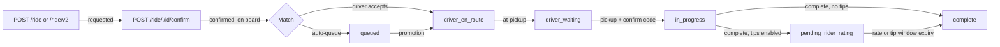

This page covers how the API implements rides. For the product meaning of each status and transition, see [Ride lifecycle](/concepts/ride-lifecycle). For pricing and payment semantics, see [Pricing](/concepts/pricing) and [Payments and payouts](/concepts/payments-and-payouts).

## Where the code lives

| Path | Contents |
| --- | --- |
| `internal/server/http/ride` | Routes under `/ride`, the `RideService` interface, handlers |
| `internal/service/ride/rider.go` | `CreateRide`, `CreateRideV2`, `ConfirmRide`, vehicle options, pricing selection, direct assignment |
| `internal/service/ride/driver.go` | `AcceptRide`, `AutoAssignRide`, `RecoverIdleQueue`, `DeclineRide`, `AtPickup`, `Pickup`, `Complete`, payment intent creation, queue promotion |
| `internal/service/ride/ride.go` | `Cancel`, `CancelIntent`, `Rate`, map details, `CancelUnmatchedRides`, requeue after driver cancel, `NewRideService` |
| `internal/service/ride/tip_capture.go`, `tip_charge.go` | Tip-window auto-capture and tip charges |
| `internal/service/ride/driver_options.go`, `option_groups.go`, `option_presentation.go` | Per-driver options and badges for `CreateRideV2` |
| `internal/service/ride/events.go` | `record*Event` helpers for the ride timeline |
| `internal/service/ride/messaging.go`, `messaging_sync.go` | Ride chat, inbox, deltas, read state |
| `internal/service/ride/ride_board_redis.go`, `ride_board_memory.go` | Ride board implementations |
| `internal/service/activation` | Driver activation tiers, auto-queue, queue summaries |
| `internal/service/rideevents` | Async `EventRecorder` |
| `internal/data/repository/ride*.go` | Ride repository: commands, lifecycle, matching, revisions, snapshots, operations |
| `internal/data/repository/queries/ride_*.sql` | sqlc queries for rides |

## Statuses

`models.RideStatus` in `internal/models/ride.go` defines the Go values. The database stores the same strings.

| Constant | Value |
| --- | --- |
| `RideStatusRequested` | `requested` |
| `RideStatusConfirmed` | `confirmed` |
| `RideStatusQueued` | `queued` |
| `RideStatusDriverEnRoute` | `driver_en_route` |
| `RideStatusDriverWaiting` | `driver_waiting` |
| `RideStatusInProgress` | `in_progress` |
| `RideStatusPendingRiderRating` | `pending_rider_rating` |
| `RideStatusCompleted` | `complete` |
| `RideStatusNoDriversAvailable` | `no_drivers_available` |

<Note>
The request-expiry sweep does not write `no_drivers_available`. `CancelUnmatchedConfirmedRides` sets expired rides to `complete` with `cancel_reason = 'automatic'` and `cancel_phase = 'confirmed'`. The `no_drivers_available` value is still read by analytics and snapshot code for older rows.
</Note>

## Command flow



Key implementation points:

- **Confirm** (`ConfirmRide`) validates the payment method, picks the effective price and fleet, generates a four-digit confirm code when the fleet sets `RequiresConfirmationCode`, then either adds the ride to the board and notifies drivers (`addToRideBoardAndNotify`) or offers it to one driver (`directAssignDriver`). Riders with an `@rideyelo.com` email always get confirm code `1234` so Maestro E2E flows can finish the handshake.
- **Accept** (`AcceptRide`) loads the driver's session and fleet, calculates the pickup route, creates or reuses the Stripe payment intent when the price is above zero, calls `Ride.Accept`, refreshes the driver's queue summary, removes the ride from the board, and notifies the rider.
- **Complete** (`Complete`) selects the Stripe merchant (fleet or driver). With tips enabled and a nonzero price, it sets `pending_rider_rating` and a 24-hour `tip_window_expires_at` and defers capture. Otherwise it captures immediately.
- **Direct requests** give the chosen driver a 30-second response window. `ActivationService.resumeExpiredDirectRide` returns the ride to normal matching after the window.

## Ride board

The ride board lists `confirmed`, unmatched rides for a community. `ride.NewRedisBacked` returns a `RideBoardProvider`:

```go
type RideBoardProvider interface {
	GetRideDetails(ctx context.Context, rideId uuid.UUID) *models.BoardRide
	AddRide(ctx context.Context, communityId uuid.UUID, ride *models.RideDetails) errors.Error
	RemoveRide(ctx context.Context, communityId uuid.UUID, rideId uuid.UUID) errors.Error
}
```

<Tabs>
  <Tab title="Redis (default)">
    `RedisRideBoard` stores:

    | Key | Type | Contents |
    | --- | --- | --- |
    | `rides:community:<community_id>` | Set | Ride IDs on the board |
    | `ride:details` | Hash | Ride ID to serialized `BoardRide` |
    | `rides:refresh:<community_id>` | String, 10-second TTL | Unix timestamp of the last change |

    `AddRide` writes all three in one `TxPipeline`. Every method falls back to the in-memory board when Redis is disabled or a command fails.
  </Tab>
  <Tab title="In-memory">
    `RideBoard` keeps per-community maps guarded by a `sync.RWMutex` and loads a community lazily from `Ride.GetAvailableRides`. `NewRedisBacked` returns it directly when Redis is disabled.

    The in-memory board is per process. With more than one Cloud Run instance, boards can diverge until Redis recovers.
  </Tab>
</Tabs>

The board is a read model. The `Rides` table remains the source of truth, and every command revalidates state in Postgres.

## Locking and command transactions

Ride commands serialize in Postgres, not in Go.

### Participant and row locks

`beginRideCommand` in `internal/data/repository/ride_command.go` opens a transaction and calls `lockRideCommand`:

<Steps>
  <Step title="Discover participants">
    `ListRideCommandParticipants` finds the rider, driver, and affected queue riders.
  </Step>
  <Step title="Lock users in UUID order">
    `lockRideParticipants` locks the participant `Users` rows in sorted order, which avoids deadlocks between concurrent commands.
  </Step>
  <Step title="Recheck participants">
    The participant query runs again. If ownership changed, the transaction rolls back and retries, up to 4 attempts.
  </Step>
  <Step title="Lock the ride">
    `LockRideCommandState` locks the ride row and returns its state. `HasConflictingRideOperation` rejects the command if another durable operation owns the ride.
  </Step>
</Steps>

A conflict returns `rideCommandConflict()`: an `InputError` (400) with the body "This ride has changed. Refresh and try again." Repository methods then validate the expected status with helpers such as `validateRideDriverCommand` before mutating.

Retries from mobile clients are treated as success where safe. For example, `Decline` returns without adding a second reason or event when the driver has already declined.

### Advisory lock

`Ride.AcquireLock(ctx, rideID)` takes a session-level `pg_advisory_lock` keyed on the first 8 bytes of the ride UUID, on a dedicated pool connection. `prepareAndPromoteQueuedRide` uses it to serialize queue-head preparation between maintenance and driver commands. The unlock uses `context.WithoutCancel` so a cancelled request cannot leak the lock.

### Revision finalizer

Before commit, lifecycle commands call `finalizeRideCommand` in `ride_revision.go`. It increments the ride's `lifecycle_revision` and `assignment_generation` and every affected user's `ride_state_revision`. When `RIDE_STATE_SNAPSHOT_ENABLED` is true, it also enqueues a `ride_state_changed` notification in the same transaction through `notify.Emit`. Rolled-back commands never expose a new revision.

## Ride state protocol

The ride state protocol v1 is an additive, revision-ordered snapshot of a user's ride state. It is disabled by default. The full specification lives in `docs/ride-state-protocol.md` in `yelo-api`.

| Piece | Implementation |
| --- | --- |
| Counters | Migration 338 adds `Users.ride_state_revision`, `Rides.lifecycle_revision`, and `Rides.assignment_generation` |
| Snapshot endpoint | `GET /user/ride-state?minimum_session_revision=N`, read in one read-only `REPEATABLE READ` transaction |
| Status negotiation | `/user/status` with `X-Ride-State-Protocol: 1` adds `ride_state`. `X-Ride-State-Minimum-Revision` sets the floor |
| Failure mode | Disabled protocol, unmet minimum, or conflicting cardinality returns `RideStateUnavailableError` (503). Invalid input returns 400 |
| Serialization | Revisions serialize as decimal strings |

<Warning>
Before enabling `RIDE_STATE_SNAPSHOT_ENABLED`, deploy migrations through 342, drain every older writer binary from the API and all workers, and run the read-only cardinality preflight in `docs/ride-cardinality-preflight.md`. An older binary writes rides without advancing counters, so rolling back past a counter-aware binary is unsafe while clients hold revision-v1 snapshots. The API cannot detect an unmanaged old process. See [Deployment](/engineering/deployment).
</Warning>

The protocol is a read-ordering foundation only. Payment authorization and capture still run before some repository claims, and the durable financial command runtime is not active.

## Ride events

`rideevents.EventRecorder` writes the ride timeline to the `ride_events` table asynchronously.

- `Record` pushes onto a channel with a buffer of 500. If the channel stays full for 100 ms, the event is dropped with a warning.
- One goroutine started by `EventRecorder.Start` inserts events. Insert failures log a warning and never fail the request.
- `main.go` calls `Stop` during shutdown, which closes the channel and drains it.

Event types are defined in `internal/models/ride_event.go`, for example `ride_requested`, `ride_confirmed`, `ride_accepted`, `ride_auto_queued`, `queue_promoted`, `driver_at_pickup`, `rider_picked_up`, `ride_completed`, `ride_canceled`, `auto_requeued`, `direct_assigned`, `tip_captured`, and `rescue_alert_sent`. Actor types are `rider`, `driver`, and `system`. Add new timeline entries through a `record*Event` helper in `internal/service/ride/events.go`.

<Note>
Ride events are an audit trail, not a source of truth. Do not read them to make lifecycle decisions.
</Note>

## Activation and auto-queue

`ActivationService.ProcessUnmatchedRides` runs every 30 seconds (see [Background jobs](/engineering/api/background-jobs)). It is skipped when `ACTIVATION_ENABLED=false`.

<Steps>
  <Step title="Load unmatched rides">
    `GetUnmatchedRidesForActivation` returns confirmed rides without a driver. Expired direct requests are resumed first.
  </Step>
  <Step title="Notify drivers by tier">
    For each ride, the service loads the community's activation config (cached 5 minutes), picks the tier for the elapsed time since confirm, and notifies drivers from the warm pool (recently seen driver locations in the Redis activation cache) and then from inactive drivers. Notified drivers are tracked in Redis so a driver is not notified twice.
  </Step>
  <Step title="Check rescue">
    `checkRescue` sends a rescue alert when a ride has waited past the configured threshold.
  </Step>
  <Step title="Auto-queue">
    Rides confirmed at least 2 minutes ago go through `tryAutoQueueAssign`, oldest first.
  </Step>
</Steps>

### Auto-queue scoring

`tryAutoQueueAssign` loads eligible drivers with `GetAutoQueueEligibleDrivers`, excluding drivers who declined. Each candidate gets:

- `timeToStart` = queued minutes + deadhead minutes + 2 minutes per queued ride.
- `queueLoad` = 0.6 × queued ride count + 0.4 × queued fare.

Both are min-max normalized. The final score is 0.5 × efficiency + 0.5 × equity, and the lowest score wins. Scores within 0.05 of each other tie-break on the smaller queue. When there are no eligible candidates, no winner, or the winner has no active session, the ride is flagged `auto_queue_attempted` in Redis for 1 hour so the pass skips it. When there are no candidates at all, the fleet is also notified about the missed ride.

The winner is assigned through the callback that `NewService` passes to the activation service, which calls `RideService.AutoAssignRide`. That method runs `Ride.AutoQueueAssign` (status `queued`), records `ride_auto_queued`, refreshes the queue summary, and calls `RecoverIdleQueue`. If the driver has no active ride, the queue head is promoted to `driver_en_route` through `prepareAndPromoteQueuedRide`, which authorizes payment and recalculates the pickup route before `PromoteQueuedRide`.

### Queue recovery

`RefreshQueueSummaries` runs every 3 minutes. For each driver with queued rides, it recovers an idle queue and rewrites the cached queue summary, with up to 10 drivers in parallel. Queue summaries are cached in Redis for 30 minutes and validated against the committed queue on read.

## Requeue after driver cancel

When a driver cancels a ride in `queued`, `driver_en_route`, or `driver_waiting`, `isReQueueEligible` returns true and `requeueAfterDriverCancel` runs:

1. `Ride.RequeueAfterCancel` resets the ride to `confirmed` in one transaction and returns any queued ride to promote.
2. A promoted ride advances in the background through `advanceQueuedRide`.
3. The board entry is removed and re-added with fresh state.
4. Drivers are notified again, which restarts activation.
5. The rider receives one "finding you a new driver" notification.
6. An `auto_requeued` event records the reason and phase.

Rider cancellations and other phases go through the normal cancellation path, which computes the fee with `GetCancellationFee` and captures or cancels the payment intent.

## Expiry and offline drivers

- `CancelUnmatchedRides` runs every 30 seconds and expires confirmed, unassigned rides older than `config.RideRequestExpiry` (10 minutes), removing them from the board.
- `PurgeOfflineDrivers` runs on the same loop. It sets inactive drivers offline, sends renew-online reminders (at most every `DriverReminderInterval`, 30 seconds, per community), and applies the offline grace to queued rides.
- `AutoCaptureTipWindowExpired` runs every 5 minutes and captures fare and tip for up to 50 rides whose tip window has closed. A ride stuck for more than an hour logs an error for manual review.
