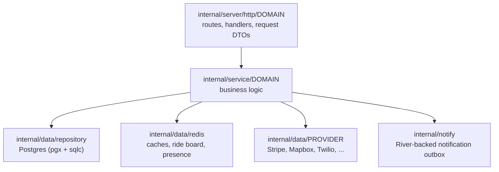

`yelo-api` is a single Go module (`api.rideyelo.com`) that builds one HTTP binary, `cmd/api`, plus a handful of operator tools. This page explains where code lives and how the pieces are wired together. For how the API fits into the wider system, see [System architecture](/engineering/overview). To run it locally, see [Local development](/engineering/local-development).

## Layers

The API uses three layers. Each layer depends only on the one below it, through Go interfaces.

| Layer | Owns | Must not |
| --- | --- | --- |
| HTTP (`internal/server/http/<domain>`) | Route registration, reading the body and path params, pulling the caller from context, validation, wrapping the result in a response envelope | Run SQL or call providers directly |
| Service (`internal/service/<domain>`) | Business rules, orchestration across repositories and providers, notifications, ride events | Write to `http.ResponseWriter` |
| Data (`internal/data/...`) | SQL, Redis commands, and third-party HTTP/gRPC clients | Contain product rules |

Each HTTP domain package declares the interface it needs from the service layer in a file named `service.go`, for example `RideService` in `internal/server/http/ride/service.go`. The concrete service in `internal/service/ride` satisfies it, and mockery generates a mock next to the interface in `mocks/`.

<Note>
A few small dashboard features skip the service layer and talk to a repository store directly from the router, for example `vehiclecatalog`, `dashboard/vehicles`, `dashboard/contactsync`, and `dashboard/pricingjitter`. Treat these as exceptions, not a pattern to copy.
</Note>

## Package map

| Path | Responsibility |
| --- | --- |
| `cmd/api` | Process entry point: config, telemetry, dependency construction, background loops, graceful shutdown |
| `cmd/import-pois`, `cmd/backfill-categories`, `cmd/contact-sync`, `cmd/sync-school-catalog` | One-shot operator tools |
| `internal/app` | `Container`, the dependency-injection struct handed to the HTTP layer |
| `internal/service/service.go` | `NewService`, which builds every service and returns the `Container` |
| `internal/server/http` | Server, router, middleware, CORS, OpenAPI post-processing |
| `internal/server/http/<domain>` | One package per route family (`ride`, `user`, `authv2`, `authv3`, `dashboard/*`, ...) |
| `internal/server/http/httperrors` | Maps `errors.Error` types to HTTP status codes and writes error bodies |
| `internal/server/http/routeopt` | Shared Fuego route options for documenting error responses |
| `internal/service/<domain>` | Business logic, one package per domain |
| `internal/data/repository` | Repository interfaces (`interfaces.go`), implementations, and sqlc query files in `queries/` |
| `internal/data/sqlc` | Generated query code (do not edit) |
| `internal/data/redis` | Redis client with circuit breaker, plus typed caches |
| `internal/data/<provider>` | Third-party clients: `stripe`, `mapbox`, `googlemaps`, `googleplaces`, `twilio`, `photon`, `resend`, `quo`, `dub`, `supabasestorage`, `mobility`, `googlecalendar` |
| `internal/notify` | Durable notification pipeline on River: emit, orchestrate, send, receipts |
| `internal/models` | Domain structs, enums, and request/response DTOs |
| `internal/utilities` | Cross-cutting helpers: `config`, `errors`, `json`, `logger`, `metrics`, `otel`, `jwt`, `context`, `validator`, `circuitbreaker`, `retry`, `pricing`, `features` |
| `migrations` | golang-migrate SQL files, `NNNNNN_name.up.sql` and `.down.sql` |
| `scripts/release`, `scripts/sqlc` | Migration policy checks and sqlc schema generation |

## Entry point and wiring

`cmd/api/main.go` composes the process explicitly. Read it top to bottom when you need to know what runs at startup.

<Steps>
  <Step title="Load and validate config">
    `config.Load()` reads the environment (and `.env` if present) once. `cfg.Validate()` panics on missing required variables. See [Configuration](/engineering/api/configuration).
  </Step>
  <Step title="Parse flags">
    `--port` (defaults to `PORT` or `8080`), `--limiter-rps` (50), `--limiter-burst` (100), `--limiter-enabled` (true), `--cors-trusted-origins`, and `--stripe-key`. CORS is disabled when `ENVIRONMENT=dev`.
  </Step>
  <Step title="Start telemetry">
    Creates the PostHog client and logger, initializes Sentry when `SENTRY_DSN` is set, then OpenTelemetry. Metrics fan out to OTel and PostHog when `OTEL_ENABLED` is true.
  </Step>
  <Step title="Open data stores">
    `repository.NewRepositoryLayer` opens the API Postgres pool and the Redis client. See [Data layer](/engineering/api/data-layer).
  </Step>
  <Step title="Build clients and services">
    Builds the Stripe and Quo clients and contact-sync destinations, then calls `service.NewService(...)`, which constructs every provider client, cache, and service and returns an `*app.Container`.
  </Step>
  <Step title="Start the notification queue">
    Opens a separate River pool, builds the River client with `notifyqueue.New`, seeds notification templates, cancels stale orchestration jobs, and starts workers plus the River UI.
  </Step>
  <Step title="Start background loops">
    Refreshes the vehicle type registry, then starts the in-process tickers. See [Background jobs](/engineering/api/background-jobs).
  </Step>
  <Step title="Serve and shut down">
    `yeloHttp.NewServer(service, server_cfg).Serve()` listens. On `SIGINT` or `SIGTERM`, the process gets an 8-second budget to shut down the HTTP server, stop River, close pools, and stop async services.
  </Step>
</Steps>

The HTTP layer reaches services only through `Service`, a type alias for `app.Container` defined in `internal/server/http/service.go`. This alias keeps `internal/service` from importing the HTTP package.

<Warning>
`service.NewService` is intentionally one long constructor. Some services depend on each other through callbacks. For example, the activation service receives closures that call `rideSvc.AutoAssignRide` before `rideSvc` exists. When you add a dependency, keep construction order in mind.
</Warning>

## Conventions

### Errors

Use the custom `errors.Error` interface from `internal/utilities/errors` in every layer. It carries a type, a user-facing title and body, a stack trace, and a fingerprint.

- Create errors with typed constructors such as `errors.NewNotFoundError`, `errors.NewBadRequestError`, `errors.NewUnauthorizedError`, or `errors.NewError(message, errType, title, body)`.
- Wrap with `errors.Wrap(err, "context")`. Wrapping a custom error keeps its type. Wrapping a plain Go error produces a `ServerError`.
- Convert driver or library errors with `errors.NewServerErrorFromError(err)`.
- The error type decides the HTTP status. See [Request lifecycle](/engineering/api/request-lifecycle#error-handling) for the mapping.

### Lint limits

`.golangci.yml` enables a large linter set and fails CI on violations. The thresholds you will hit most often are:

| Linter | Limit |
| --- | --- |
| `gocyclo` | Cyclomatic complexity 15 |
| `gocognit` | Cognitive complexity 30 |
| `funlen` | 200 lines or 100 statements |
| `nestif` | Nesting complexity 5 |
| `dupl` | 150 tokens |
| `nakedret` | Functions longer than 30 lines cannot use naked returns |

Other rules worth knowing:

- `forbidigo` bans `fmt.Print*`, `print`, and `println`. Use the structured logger.
- `errcheck` checks type assertions and blank assignments.
- `wrapcheck`, `errorlint`, `contextcheck`, `exhaustive`, and `wsl_v5` are on.
- `nolintlint` requires a specific linter name and an explanation on every `//nolint` directive, for example `//nolint:funlen // central route registration is kept together for OpenAPI generation`.

### Naming and files

- HTTP packages follow a consistent layout: `<domain>_routes.go` (registration), `<domain>_handler.go` (handlers), `service.go` (the service interface), `requests/` (request DTOs that are not shared models), and `mocks/`.
- Route functions are named `RegisterRoutes`, `RegisterAuthenticatedRoutes`, `RegisterUnauthenticatedRoutes`, `RegisterPublicRoutes`, or `RegisterDashboardRoutes`, depending on the auth group.
- OpenAPI operation IDs use `<domain>.<Handler>`, for example `ride.CreateRide`. Generated clients depend on them, so treat a rename as an API change.
- Dashboard actors use Clerk user IDs. App accounts use Supabase user UUIDs. Never match identities across the two systems.

### Comments

Comments in this codebase explain *why*, not *what*. Expect to find the reasoning for concurrency, context detachment, and lint suppressions in comments next to the code. Match that style: when you detach a context with `context.WithoutCancel` or suppress a linter, write down why.

## Generated code

Three generators produce committed code. CI fails if any output is stale.

| Tool | Input | Output | Commands |
| --- | --- | --- | --- |
| sqlc 1.31.1 | `migrations/*.up.sql`, `internal/data/repository/queries/*.sql` | `internal/data/sqlc` | `make sqlc-generate`, `make sqlc-check` |
| mockery 3.7.0 | Interfaces listed in `.mockery.yaml` | Adjacent `mocks/` packages | `make mocks`, `make mocks-check` |
| Fuego + OpenAPI test | Route registrations with stubbed services | `openapi.json` | `make openapi`, `make openapi-check` |

See [OpenAPI and clients](/engineering/openapi-and-clients) for how `openapi.json` reaches the web and mobile clients, and [Testing](/engineering/testing) for the full `make check` gate.
