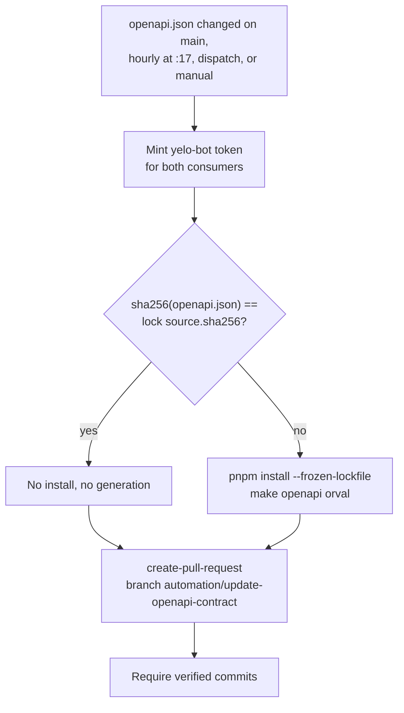
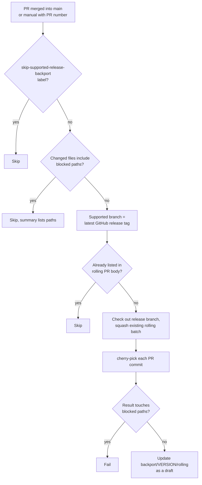

This page covers automation that writes to the repositories or posts to Slack. For the workflow inventory, see [GitHub Actions workflows](/engineering/ci/workflows). For the OpenAPI lock format and `make api-check`, see [OpenAPI and clients](/engineering/openapi-and-clients).

## The yelo-bot GitHub App

Bot pull requests come from one GitHub App, `yelo-bot`. It commits as `yelo-bot[bot] <320779321+yelo-bot[bot]@users.noreply.github.com>`.

| Repository | Credentials | Used by |
| --- | --- | --- |
| `yelo-api` | Variable `OPENAPI_BOT_CLIENT_ID`, repository secret `OPENAPI_BOT_PRIVATE_KEY` | `propagate-openapi.yml`, `sync-frontend-release.yml` |
| `yelo-frontend` | Variable `YELO_BOT_CLIENT_ID`, secret `YELO_BOT_PRIVATE_KEY` in the `yelo-bot` environment | `backport-supported-release.yml`, `finalize-app-store-release.yml` |

Each workflow mints a short-lived installation token with `actions/create-github-app-token`, scoped to the target repositories and only `contents: write` plus, where needed, `pull-requests: write`.

Two properties follow from using an App token instead of `GITHUB_TOKEN`:

- Pull requests the bot opens trigger CI in the target repository.
- `peter-evans/create-pull-request` with `sign-commits: true` creates commits through the API, so GitHub marks them verified. That satisfies the signed-commit rule on every `main`.

The `yelo-bot` environment only deploys from protected branches, so the frontend bot key is unavailable to workflows running from other branches.

## OpenAPI propagation bot

`yelo-api/.github/workflows/propagate-openapi.yml` keeps `yelo-frontend` and `yelo-web` on the current contract.



| Setting | Value |
| --- | --- |
| Branch | `automation/update-openapi-contract` in each consumer |
| Title and commit | `chore(api): update OpenAPI contract to <first 12 characters of the API SHA>` |
| Body | Names the source `rideyelo/yelo-api@<sha>` |
| Paths committed | Frontend: `openapi.json`, `openapi.lock.json`, `api/generated`. Web: `docs/openapi.json`, `docs/openapi.lock.json`, `src/generated` |
| Toolchain | pnpm 11.5.2, Node 22 |

Behavior worth knowing:

- **One PR per consumer.** A newer contract force-updates the same branch, so there's never more than one open bot PR per consumer.
- **Superseded PRs close themselves.** When the consumer's `main` already matches the API contract, the action finds no diff and, with `delete-branch: true`, deletes the bot branch. That closes the stale PR. The hourly schedule exists to catch this case and any missed push.
- **`repository_dispatch` type `reconcile-openapi-consumers`** lets a consumer request an immediate reconcile after a manual contract update lands. No workflow on `main` in the consumers sends it today.
- **The workflow never merges.** Merge the bot PR after its CI passes. Type errors in that CI are the first sign of a breaking contract change.

## Supported-release backports

`yelo-frontend/.github/workflows/backport-supported-release.yml` accumulates OTA-safe changes from `main` into one rolling draft PR against the supported release branch.



<Steps>
  <Step title="Trust boundary">
    The workflow uses `pull_request_target` so it runs trusted code from `main`. It fails unless `github.ref` is `refs/heads/main`, checks out only `github.workflow_sha`, and reads the source PR through the API. It never checks out the PR head as code.
  </Step>
  <Step title="Eligibility">
    The PR must be merged into `main` and not labeled `skip-supported-release-backport`. `scripts/release-policy.mjs blocked-paths` rejects the PR if it touches any native or runtime input: `app.json`, `app.config.*`, `eas.json`, `fingerprint.config.*`, `package.json`, `pnpm-lock.yaml`, `pnpm-workspace.yaml`, `patches/`, `ios/`, or `android/`. A mixed PR is skipped whole, never split.
  </Step>
  <Step title="Target branch">
    The target is derived from `releases/latest`. For `v5.7.3-269` it's `5.7.3`, and the branch must exist.
  </Step>
  <Step title="Apply">
    The job squashes the current `backport/<version>/rolling` branch onto a fresh checkout of the release branch, then cherry-picks the source PR's commits one by one with `--no-commit`. A merge commit in the PR fails the job. A conflict aborts and writes the conflicting files to the job summary.
  </Step>
  <Step title="Revalidate">
    It diffs the whole result against the release branch and fails if any blocked path appears. An empty diff means the change is already on the branch.
  </Step>
  <Step title="Publish">
    `create-pull-request` updates `backport/<version>/rolling` with title `backport(<version>): rolling OTA-safe changes` and `draft: always-true`. The body lists every queued PR with a hidden `<!-- backport-source:<n> -->` marker, which is how duplicates are detected.
  </Step>
</Steps>

Every new source PR returns the rolling PR to draft, which invalidates earlier review. Mark it ready when the batch is complete. CI and **OTA-ability** run on it then, and **OTA-ability** fails on any native drift because the base is a version branch. After merging, stage it with **OTA Stage** using the release branch as `source_ref`.

### Legacy release sync

`yelo-api/.github/workflows/sync-frontend-release.yml` squash-merged all of `main` into the branch in the `PREVIOUS_RELEASE_BRANCH` variable, restored `app.json` and `eas.json` from the release branch, and kept a draft PR on `backport/<version>-sync`. It's disabled in GitHub, and the variable still points at `5.7.1`.

## Dependabot

| Repository | Ecosystems | Schedule | Grouping | Notes |
| --- | --- | --- | --- | --- |
| `yelo-api` | `gomod`, `github-actions` at `/` | Weekly | None | Commit prefix `deps` |
| `yelo-web` | `npm`, `github-actions` at `/` | Weekly | `minor-and-patch` for npm | npm open PR limit 10. Actions are pinned to SHAs, and Dependabot updates the pins |
| `yelo-frontend` | `npm` at `/` | Weekly | `minor-and-patch` | Open PR limit 10. No `github-actions` entry |

`yelo-frontend` ignores packages whose versions come from the Expo SDK, because `npx expo install --fix` sets them at SDK upgrades:

- `expo`, `expo-*`, `@expo/*`, `jest-expo`, `babel-preset-expo`
- `react`, `react-native`, `@types/react`
- `react-native-reanimated`, `react-native-worklets`, `react-native-screens`, `react-native-safe-area-context`, `react-native-gesture-handler`, `react-native-svg`
- `@stripe/stripe-react-native`, `lottie-react-native`, `@react-native-async-storage/async-storage`, `@react-native-masked-view/masked-view`
- `sharp`, pinned by a pnpm override
- Major updates of `eslint`, until `eslint-config-expo` supports version 10

Nothing auto-merges Dependabot PRs. In `yelo-frontend`, any `package.json` or lockfile change is a native input, so a Dependabot PR needs a store build and is never backported.

## Code owners and review rules

`yelo-api/.github/CODEOWNERS` is the only CODEOWNERS file:

```text
/migrations/ @rideyelo/migration-approvers
/.github/CODEOWNERS @0cj
```

The `yelo-api` ruleset also requires one approval from the `migration-approvers` team for `migrations/**`.

`yelo-web` and `yelo-frontend` rulesets require code owner review, but those repositories have no CODEOWNERS file, so the rule has no effect. See [Required checks and branch rules](/engineering/ci/workflows#required-checks-and-branch-rules).

None of the repositories has a PR template, an issue template, a labeler, or release-please. The only label automation reads is `skip-supported-release-backport`.

## Local hooks

`yelo-api/.pre-commit-config.yaml` defines one local hook, `ci`, that runs `make check` on every commit with `always_run: true`. Install it with `pre-commit install`. The web and mobile repos have no commit hooks.

## Slack notifications from CI

Every CI message goes to an incoming webhook. The API reads its webhook from Secret Manager. The web and mobile repos use a `SLACK_WEBHOOK_URL` repository secret. Failures to post are warnings, except in **Staging Build Slack**.

| Event | Sender | Webhook | Message |
| --- | --- | --- | --- |
| API promoted | `cloudbuild.yaml` **Notify Slack** | Secret `yelo-api-deploy-slack-webhook` | `🚀 API deployed · production · GCP Cloud Run/us-central1 · yelo-api-testflight@<revision> · <sha8> "<title>" · author <name> · startup <time> · <date>` |
| API release failed | `release-api.yml` | Secret `yelo-api-deploy-slack-webhook`, read with `gcloud secrets versions access` | `🚨 API release failed · production · <build status> · GitHub Actions · Cloud Build · <sha8> "<title>"` |
| Web deployed | `firebase.yml` | `SLACK_WEBHOOK_URL` | `🚀 Web deployed · production · Firebase Hosting · <sites> · <sha8> · PR #<n> "<title>" · <people> · <date>` |
| EAS builds queued | `build.yml` | `SLACK_WEBHOOK_URL` | `:hammer_and_wrench: Queued EAS builds: <targets>; auto-submit: <platforms> — by <actor>. <EAS URL>` |
| EAS dispatch failed | `build.yml` | `SLACK_WEBHOOK_URL` | `:x: EAS build dispatch failed — by <actor>. <run URL>` |
| iOS staging built | `staging-build-slack.yml` | `SLACK_WEBHOOK_URL` | Block Kit header `iOS staging <version> (<build>)`, source and runtime, **Install build** button, QR image |
| OTA staged | `ota-stage.yml` | `SLACK_WEBHOOK_URL` | `OTA staged: source <sha> — <message> — <platform> group <id>, runtime <hash>, <url> — promote by pasting source SHA <sha> into Actions → OTA Promote` |
| OTA staging failed | `ota-stage.yml` | `SLACK_WEBHOOK_URL` | `OTA staging failed: <run URL>` |
| OTA promoted or rolled back | `ota-promote.yml` | `SLACK_WEBHOOK_URL` | `OTA production <action>: sources [<platform>=<group>], production [<platform>=<group>], commit <sha>` |
| OTA promote failed | `ota-promote.yml` | `SLACK_WEBHOOK_URL` | `OTA promotion failed: <run URL>` |

The deploy formatters, `yelo-api/scripts/release/format-deploy-slack.sh`, `format-release-failure-slack.sh`, and `yelo-web/scripts/format-firebase-deploy-slack.sh`, share these rules:

- Every field is required unless noted, whitespace-collapsed, length-capped, and escaped for `&`, `<`, and `>`.
- Link URLs must be HTTPS on an allowed host: `github.com`, `console.cloud.google.com`, or `console.firebase.google.com`. Any `|`, `<`, `>`, or newline fails the formatter.
- Timestamps render with Slack's `<!date^...^{date_short_pretty} {time}|fallback>` so each reader sees local time.
- The people field reads `author X · merged by Y`, `X (author & merger)`, or `author X` when no merger is known.
- The web workflow also checks that the webhook host is `hooks.slack.com` before posting.

Tests cover them: `scripts/release/release_scripts_test.sh` in the API (run by **Migration Policy**) and `pnpm test:deploy-slack` in web.

For Slack messages the API itself sends at runtime, see [Slack alerts](/engineering/notifications/slack-alerts).

## Other CI write-backs

| Automation | Where it writes |
| --- | --- |
| **Fingerprint** report | One sticky PR comment starting with `<!-- fingerprint-report -->`, edited in place |
| Web `home` preview | One PR comment `🔎 home preview: <url>`, edited with `gh pr comment --edit-last` while the PR is open |
| iOS production checkpoint | Tag `v<version>-<build>` and a draft GitHub release, from EAS with `GITHUB_RELEASE_TOKEN` in the EAS `production` environment |
| **Finalize App Store release** | Creates the release branch and publishes the release as latest |
| Vehicle catalog | `POST https://api.rideyelo.com/mobile-vehicle-catalog` with a GitHub OIDC token, from **OTA Promote** and **Finalize App Store release**. See [Vehicle types and catalog](/engineering/domains/vehicle-types-and-catalog) |

## Gotchas and edge cases

- **Rolling PRs don't trigger backports.** The workflow only triggers for PRs merged into `main`. Rolling PRs merge into version branches, so the automation can't loop.
- **The backport target moves when you publish a release.** Publishing a newer GitHub release as latest switches every future backport to the new branch. Merge or close the old rolling PR first.
- **Squash merges keep backports simple.** The job cherry-picks the source PR's own commits and rejects merge commits in the PR. A PR that merged `main` into itself has to be recreated as a linear PR.
- **OpenAPI bot PRs can pile up CI runs.** Each API contract change force-pushes the bot branch, which retriggers consumer CI. Only the latest run matters.
