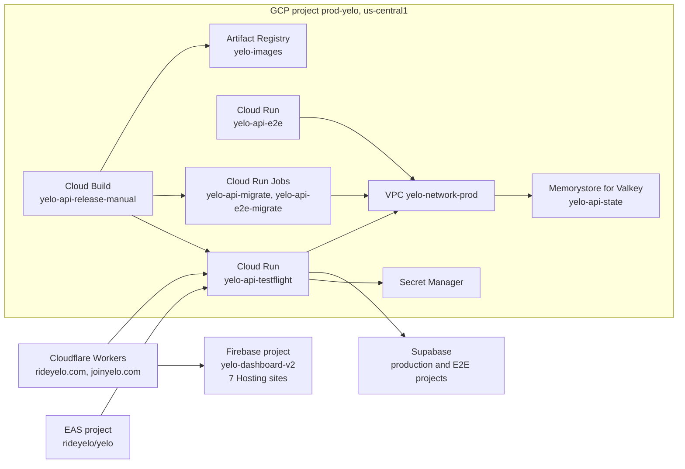

This page lists the resources that code and CI refer to by name, and the settings that matter when you change them. The GCP inventory was checked against project `prod-yelo` with read-only `gcloud` commands. For how releases use these resources, see [Release pipelines](/engineering/ci/release-pipelines). For runtime variables, see [API configuration](/engineering/api/configuration).

## GCP project

| Property | Value |
| --- | --- |
| Project ID | `prod-yelo` |
| Project number | `798668004250` |
| Region | `us-central1` for every regional resource |
| VPC | `yelo-network-prod`, with a subnet of the same name in `us-central1` |

### Cloud Run services

| Service | Role | Domains | Runtime identity |
| --- | --- | --- | --- |
| `yelo-api-testflight` | Production API. The name is historical | `api.rideyelo.com`, `api.joinyelo.com`, `tf-api.rideyelo.com` (Cloud Run domain mappings) | `798668004250-compute@developer.gserviceaccount.com` |
| `yelo-api-e2e` | Isolated E2E API running the production image | Default `run.app` URL only | `yelo-api-e2e@prod-yelo.iam.gserviceaccount.com` |

Production service settings that aren't in `cloudbuild.yaml` are carried over from the previous revision on each deploy:

| Setting | Value |
| --- | --- |
| CPU and memory | 1 vCPU, 512Mi (`GOMEMLIMIT=400MiB` in `Dockerfile` matches this) |
| Concurrency and timeout | 80 requests per instance, 300 seconds |
| Scaling | Max 2 instances, set by `_MAX_INSTANCES` on each release |
| CPU | Always allocated (`cpu-throttling: false`), startup CPU boost on, gen2 execution environment |
| Startup probe | HTTP `/healthcheck` on 8080, 5-second initial delay, every 10 seconds, 30 failures allowed |
| Network | Direct VPC egress on `yelo-network-prod`, `private-ranges-only` |
| Ingress | All |

`yelo-api-e2e` is set by `cloudbuild.e2e.yaml`: CPU throttled with startup boost, min 0 and max 2 instances, concurrency 20, unauthenticated access, same VPC.

### Cloud Run jobs

| Job | Created by | Image | Secret |
| --- | --- | --- | --- |
| `yelo-api-migrate` | `cloudbuild.yaml`, only when the migration version changes | `yelo-images/yelo-api/yelo-api-migrate@<digest>` | `MIGRATION_DSN` from `yelo-api-migration-dsn` |
| `yelo-api-e2e-migrate` | `cloudbuild.e2e.yaml` | `yelo-images/yelo-api-e2e-migrate@<digest>` | `MIGRATION_DSN` from `yelo-e2e-dsn` |

The project also has hand-made jobs named `yelo-e2e-1271-*` (`-migrate`, `-create`, `-redis-probe`, and variants for `integration`, `rebased`, and `snapshot`). They belong to isolated ride-recovery candidate environments described in `yelo-api/docs/E2E_CONTROL_PLANE.md`. No workflow creates or runs them.

### Cloud Build triggers

All three triggers are global, point at `rideyelo/yelo-api`, and run as the default compute service account. The first two use `cloudbuild.yaml`.

| Trigger | Branch filter | State | Used by |
| --- | --- | --- | --- |
| `yelo-api-release-manual` | `^__manual_only__$` | Enabled. The filter matches no branch, so pushes never start it | `resolve-release-build.sh` runs it with `--sha` |
| `yelo-api-release` | `^__disabled__$` | Dormant. The filter matches no branch | Nothing |
| `rmgpgab-yelo-api-testflight-us-central1-rideyelo-yelo-api--mcmo` | `^main$` | Disabled | Nothing. A console-created continuous-deploy trigger from before the release queue |

`yelo-api-release-manual` defines exactly two substitutions: `_RUNTIME_ENV_VARS` and `_RUNTIME_SECRET_REFS`. They are the production runtime configuration. Edit them on the trigger. A release with either one empty fails in its first step.

<Warning>
Keep the native `main` triggers inactive. A push-triggered build would bypass the `production-api` queue in `release-api.yml` and the release-order check.
</Warning>

### Artifact Registry

| Repository | Location | Contents |
| --- | --- | --- |
| `yelo-images` | `us-central1` | `yelo-api/yelo-api-testflight` (release images and the `:buildcache` tag), `yelo-api/yelo-api-migrate`, `yelo-api-e2e-migrate`, `yelo-api-e2e-candidate`, `yelo-api`, `yelo-dashboard-image`, `yelo-dashboard-golang-image` |
| `cloud-run-source-deploy` | | Created by Cloud Run source deploys. Not used by the release pipeline |
| `us.gcr.io`, `gae-standard` | | Legacy repositories. Not used by the release pipeline |

Release images are tagged with the full commit SHA and always deployed by digest.

### Secret Manager

Secret names only. Values stay in Secret Manager.

| Group | Secrets | Consumer |
| --- | --- | --- |
| Release | `yelo-api-deploy-slack-webhook`, `yelo-api-migration-dsn` | Cloud Build Slack step, `release-api.yml` failure step, `yelo-api-migrate` |
| Auth v3 | `yelo-auth-v3-state-hmac-keys`, `yelo-auth-v3-subject-hmac-key`, `yelo-auth-v3-rate-limit-hmac-key`, `yelo-auth-v3-refresh-token-keys`, `yelo-auth-v3-apple-private-key`, `yelo-auth-v3-google-client-secret`, `yelo-auth-v3-onboarding-jwt-key` | Production API |
| Integrations | `yelo-og-signing-secret`, `yelo-api-resend-api-key`, `yelo-api-resend-contacts-api-key`, `quo-dashboard-api-key`, `quo-background-api-key`, `yelo-google-calendar-client-secret`, `yelo-google-calendar-token-keys`, `yelo-api-metrics-auth-token` | Production API |
| E2E | `yelo-e2e-dsn`, `yelo-e2e-jwt-key`, `yelo-e2e-redis-url`, `yelo-e2e-control-api-key`, `yelo-e2e-stripe-api-key`, `yelo-e2e-stripe-publishable-key`, `yelo-e2e-google-maps-api-key`, `yelo-e2e-mapbox-api-key`, `yelo-e2e-auth-state-key`, `yelo-e2e-auth-subject-key`, `yelo-e2e-auth-rate-key`, `yelo-e2e-auth-onboarding-key`, `yelo-e2e-auth-refresh-key` | `yelo-api-e2e` and its migration job |
| E2E candidates | `yelo-e2e-1271-*-dsn`, `yelo-e2e-1271-*-redis-url`, and `yelo-e2e-1271-integration-migration-dsn` | The hand-made `yelo-e2e-1271-*` jobs |

The production service maps these environment variables to secrets:

| Environment variable | Secret |
| --- | --- |
| `AUTH_V3_STATE_HMAC_KEYS` | `yelo-auth-v3-state-hmac-keys` |
| `AUTH_V3_SUBJECT_HMAC_KEY` | `yelo-auth-v3-subject-hmac-key` |
| `AUTH_V3_RATE_LIMIT_HMAC_KEY` | `yelo-auth-v3-rate-limit-hmac-key` |
| `AUTH_V3_REFRESH_TOKEN_KEYS` | `yelo-auth-v3-refresh-token-keys` |
| `AUTH_V3_APPLE_PRIVATE_KEY` | `yelo-auth-v3-apple-private-key` |
| `AUTH_V3_GOOGLE_CLIENT_SECRET` | `yelo-auth-v3-google-client-secret` |
| `AUTH_V3_ONBOARDING_JWT_KEY` | `yelo-auth-v3-onboarding-jwt-key` |
| `OG_SIGNING_SECRET` | `yelo-og-signing-secret` |
| `RESEND_API_KEY` | `yelo-api-resend-api-key` |
| `RESEND_CONTACTS_API_KEY` | `yelo-api-resend-contacts-api-key` |
| `QUO_DASHBOARD_API_KEY` | `quo-dashboard-api-key` |
| `QUO_API_KEY` | `quo-background-api-key` |
| `GOOGLE_CALENDAR_CLIENT_SECRET` | `yelo-google-calendar-client-secret` |
| `GOOGLE_CALENDAR_TOKEN_KEYS` | `yelo-google-calendar-token-keys` |
| `METRICS_AUTH_TOKEN` | `yelo-api-metrics-auth-token` |

<Warning>
Other production credentials are plain environment variables set through `_RUNTIME_ENV_VARS`, not Secret Manager references. They include `DSN`, `KEY`, `STRIPE_API_KEY`, `STRIPE_WEBHOOK_SECRET`, `TWILIO_AUTH_TOKEN`, `CLERK_SECRET_KEY`, `SENDGRID_API_KEY`, `INTERNAL_API_KEY`, and `REDIS_URL`. Anyone who can view the Cloud Run revision or the trigger can read them. Move a credential by creating a secret and adding it to `_RUNTIME_SECRET_REFS`. `--update-env-vars` only adds and overwrites, so remove the plain variable from the service in the same change.
</Warning>

### Memorystore for Valkey

| Property | Value |
| --- | --- |
| Instance | `yelo-api-state` in `us-central1` |
| Engine | `VALKEY_8_0`, cluster mode disabled, one shard |
| Node type | `SHARED_CORE_NANO`, no replicas |
| Persistence | AOF |
| Auth and TLS | Auth disabled, transit encryption disabled. Access is limited to the VPC |

The E2E service uses a nonzero database number on the same instance, and the isolated candidates use others. See [Redis outage](/runbooks/redis-outage).

To reach Valkey from your machine, run `make gcp-tunnel` in `yelo-api`. It opens an IAP tunnel through the VM `yelo-dev-iap` (`us-central1-c`) to `localhost:6379`.

### Service accounts and Workload Identity

| Service account | Purpose |
| --- | --- |
| `798668004250-compute@developer.gserviceaccount.com` | Production API runtime, `yelo-api-migrate`, and every Cloud Build trigger |
| `yelo-api-release@prod-yelo.iam.gserviceaccount.com` | GitHub Actions API release submitter. Impersonated by `release-api.yml` and `release-e2e.yml` (variable `GCP_RELEASE_SERVICE_ACCOUNT`) |
| `yelo-api-e2e@prod-yelo.iam.gserviceaccount.com` | `yelo-api-e2e` runtime and its migration job (variable `E2E_SERVICE_ACCOUNT`) |
| `expo-push@prod-yelo.iam.gserviceaccount.com` | FCM v1 credentials for Expo push |
| `firebase-adminsdk-fbsvc@prod-yelo.iam.gserviceaccount.com` | Firebase Admin SDK |
| `prod-yelo@appspot.gserviceaccount.com` | App Engine default. Not used by current code |

GitHub Actions authenticates without stored keys:

| Repository | Workload Identity pool | Service account |
| --- | --- | --- |
| `yelo-api` | Pool `github-actions` in project `798668004250`. The full provider name is in the `GCP_WORKLOAD_IDENTITY_PROVIDER` variable | `yelo-api-release@prod-yelo.iam.gserviceaccount.com` |
| `yelo-web` | `projects/10944422466/locations/global/workloadIdentityPools/github/providers/github`, hard-coded in the workflows | `github-action-1270860888@yelo-dashboard-v2.iam.gserviceaccount.com` |

## Supabase

| Project | How code refers to it | Used for |
| --- | --- | --- |
| Production | `PRODUCTION_DATABASE_PROJECT_REF` variable in `yelo-api`. The DSN is in `yelo-api-migration-dsn` and the service's `DSN` | Postgres, Supabase Storage (`STORAGE_URL`, `STORAGE_PUBLIC_BUCKET_ID`, `STORAGE_PRIVATE_BUCKET_ID`), and the public `e2e` bucket that holds published E2E evidence |
| E2E | `E2E_DATABASE_PROJECT_REF` variable in `yelo-api`. The DSN is in `yelo-e2e-dsn` | The `yelo_e2e` database only |

The E2E pipeline carries both refs everywhere so it can refuse to touch production. `cloudbuild.e2e.yaml` and `run-migrations.sh` each fail if the refs match or if the E2E DSN contains the production ref.

E2E evidence goes to the production project's storage. `E2E_ARTIFACT_SUPABASE_URL` in `yelo-frontend` and `VITE_SUPABASE_URL` in `yelo-web` (read by the `maestro` viewer) both point at it. `scripts/e2e-artifacts.mjs` uploads to the `e2e` bucket (`E2E_ARTIFACT_BUCKET` overrides). Publish only synthetic data.

## Firebase Hosting

All web sites live in the Firebase project `yelo-dashboard-v2`. `.firebaserc` maps each deploy target to a Hosting site:

| Target (Nx project) | Hosting site | Default URL |
| --- | --- | --- |
| `dashboard` | `yelo-dashboard-v2` | `yelo-dashboard-v2.web.app` |
| `signup` | `yelo-signup` | `yelo-signup.web.app` |
| `home` | `yelo-home` | `yelo-home.web.app` |
| `event` | `yelo-event` | `yelo-event.web.app` |
| `maestro` | `yelo-maestro` | `yelo-maestro.web.app` |
| `invite` | `yelo-invite` | `yelo-invite.web.app` |
| `world-cup` | `yelo-world-cup` | `yelo-world-cup.web.app` |

Add a site with `make new-site NAME=<name>`, which updates the registry, and commit the resulting `.firebaserc` target. CI fails when the Nx site list and `sites.config.json` disagree. See [Sites](/engineering/web/sites) and [Multisite](/engineering/web/multisite).

## Cloudflare

Three Workers in `yelo-web/workers/` run on the zones `rideyelo.com` and `joinyelo.com`. Each sets `workers_dev: false` and `preview_urls: false`, so it has no `workers.dev` URL, and each enables observability with full head sampling.

| Worker (`name`) | Directory | Routes | Vars |
| --- | --- | --- | --- |
| `yelo-experience-router` | `workers/experience-router` | `joinyelo.com` and `www.joinyelo.com`: `/auth/v3*`, `/pay/tip*`, `/world-cup/claim*`, `/_yelo/signup/*` | `SIGNUP_ORIGIN=https://yelo-signup.web.app` |
| `yelo-og` | `workers/og` | `rideyelo.com/og/*`, `www.rideyelo.com/og/*` | `ENVIRONMENT=production`. CPU limit raised to 30,000 ms for PNG rendering |
| `yelo-world-cup-router` | `workers/world-cup-router` | `rideyelo.com`, `www.rideyelo.com`, `joinyelo.com`, `www.joinyelo.com`: `/world-cup*` | `WORLD_CUP_ORIGIN=https://yelo-world-cup.web.app`, `WORLD_CUP_API_ORIGIN=https://api.rideyelo.com` |

Deploys are manual with `pnpm worker:<name>:deploy`. See [Edge and routing](/engineering/web/edge-and-routing) for behavior and the `OG_SIGNING_SECRET` Wrangler secret.

## EAS (Expo)

| Property | Value |
| --- | --- |
| Owner and slug | `rideyelo/yelo` |
| Project ID | `174d3057-0fb3-49db-bbf5-6caa04fe0e3c` |
| Update URL | `https://u.expo.dev/174d3057-0fb3-49db-bbf5-6caa04fe0e3c` (disabled in the E2E variant) |
| Runtime version policy | `fingerprint` |
| App version source | `remote`. EAS owns build numbers |
| App Store Connect app ID | `1667384111` |

| Concept | Names |
| --- | --- |
| Update branches | `staging` (OTA Stage), `production` (OTA Promote) |
| Build channels | `production`, `staging`, `preview`, `development`, `e2e` |
| EAS environments | `production` for every build profile except `e2e-simulator`, which uses `preview` |
| EAS workflow | `.eas/workflows/build-and-submit.yml` |

The EAS `production` environment holds `GITHUB_RELEASE_TOKEN`, which the EAS workflow uses to dispatch `ios-staging-built` and to create release tags. It also holds the Android `google-services.json` file variable that fingerprinting pulls with `eas env:pull`. GitHub workflows authenticate to EAS with the `EXPO_TOKEN` repository secret. See [Mobile releases](/engineering/mobile/releases#build-profiles).

## Gotchas and edge cases

- **The production service is still named `yelo-api-testflight`.** Scripts, labels, dashboards, and rollback commands all use that name. Renaming it means updating `cloudbuild.yaml`, every workflow, and the domain mappings together.
- **`KEY` appears twice in the production container env.** The revision lists two `KEY` entries, and only one value can take effect. Check which value you intend before editing `_RUNTIME_ENV_VARS`.
- **The default compute account does too much.** It runs the production API, the migration job, and all Cloud Build triggers, so any of them has the others' permissions. The E2E path already uses a dedicated account.
- **Valkey has no auth.** Anything on `yelo-network-prod` or with IAP access to `yelo-dev-iap` can read and write every database, including production's.
- **Cloud Scheduler is not enabled** in `prod-yelo`. Periodic API work runs as River jobs inside the service. See [Background jobs](/engineering/api/background-jobs).
