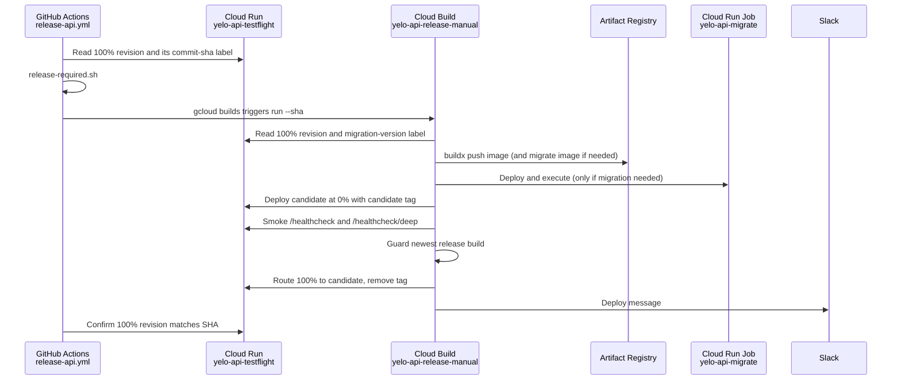
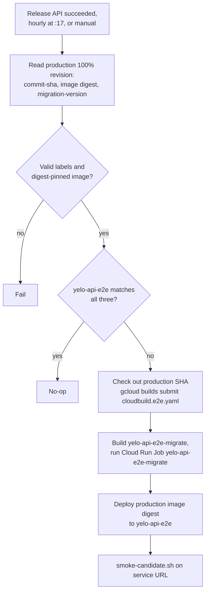
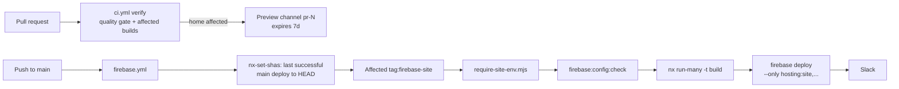
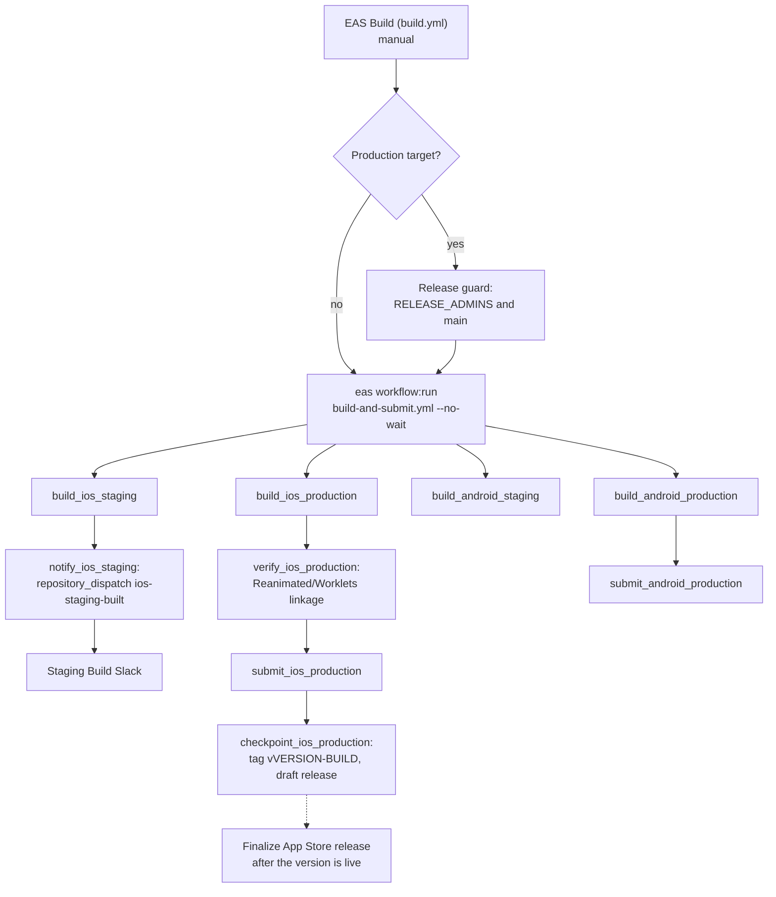
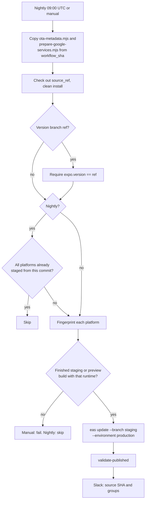
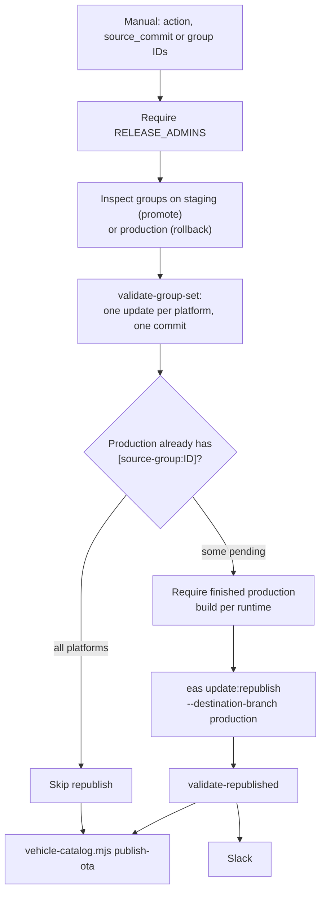

This page traces each release from the triggering event to the running artifact, including the guard scripts and their exact rules. [Deployment](/engineering/deployment) is the summary. [Deploy rollback](/runbooks/deploy-rollback) is the incident procedure. [GitHub Actions workflows](/engineering/ci/workflows) lists every trigger and input.

## API

An API release has two halves. GitHub Actions decides whether and what to release. Cloud Build builds, migrates, and shifts traffic.



### Stage 1: GitHub decides

`release-api.yml` runs on every push to `main`, or manually with a `sha`. The concurrency group `production-api` never cancels a running release. Pushes that arrive meanwhile collapse into one pending run for the newest SHA.

`scripts/release/release-required.sh <release_sha> <deployed_sha>` compares the requested SHA with the `commit-sha` label on the revision serving 100% of traffic:

| Relationship | Output | Effect |
| --- | --- | --- |
| Release SHA is an ancestor of, or equal to, the deployed SHA | `no` | Skip. The summary says "already deployed or superseded" |
| Deployed SHA is an ancestor of the release SHA | `yes` | Release |
| Neither | Error | The run fails with "Release and deployed SHAs have diverged" |
| Either SHA missing from history | Error | The run fails |

When a release is required, `resolve-release-build.sh` runs `gcloud builds triggers run yelo-api-release-manual --sha=<sha> --region=global` and returns the build ID. Set `RELEASE_MANUAL_TRIGGER` to override the trigger name. `wait-release-build.sh` polls `gcloud builds describe` every 10 seconds (`RELEASE_BUILD_POLL_SECONDS`) and prints the build log on any terminal status other than `SUCCESS`.

### Stage 2: Cloud Build releases

`cloudbuild.yaml` runs on an `E2_HIGHCPU_8` worker with a 30-minute timeout and the build tag `production-api-release`. The trigger supplies `_RUNTIME_ENV_VARS` and `_RUNTIME_SECRET_REFS`. The first step fails if either is empty.

<Steps>
  <Step title="Resolve release state">
    `check-migrations.sh migrations` validates the history and prints the highest version. It requires `NNNNNN_name.up.sql` and `.down.sql` pairs, no gaps from 1 to the maximum, no duplicates, and no empty files except the historical `000086_set-ping-default.down.sql`.

    The step then reads the serving revision's `migration-version` label and runs `migration-required.sh <deployed> <expected>`:

    | Deployed label | Output |
    | --- | --- |
    | Empty | `yes` |
    | Equal to expected | `no` |
    | Lower than expected | `yes` |
    | Higher than expected | Error. The release is older than the schema |

    It writes the previous revision, latest migration, and decision to `/workspace/.release/`.
  </Step>
  <Step title="Build image">
    `docker buildx` builds `Dockerfile` and pushes `us-central1-docker.pkg.dev/prod-yelo/yelo-images/yelo-api/yelo-api-testflight:<COMMIT_SHA>`. The layer cache lives at the `:buildcache` tag of the same image with `mode=max`. The build writes a metadata file so later steps deploy the manifest digest, not the mutable tag.

    If a migration is required, it also builds `Dockerfile.migrate` as `.../yelo-api/yelo-api-migrate:<COMMIT_SHA>`. That image is `migrate/migrate:v4.19.1` plus `postgresql-client`, the `migrations/` directory, and `run-migrations.sh` as the entrypoint.
  </Step>
  <Step title="Migrate database">
    Skipped when no migration is required. Otherwise the step deploys the Cloud Run Job `yelo-api-migrate` with:

    - The migration image by digest.
    - The service account `798668004250-compute@developer.gserviceaccount.com`.
    - `MIGRATION_DSN` from the secret `yelo-api-migration-dsn:latest`, and `EXPECTED_MIGRATION_VERSION`.
    - Network `yelo-network-prod`, subnet `yelo-network-prod`, egress `private-ranges-only`.
    - One task, up to two retries, and a 10-minute task timeout.

    It then runs `gcloud run jobs execute --wait`. Inside the job, `run-migrations.sh` appends `application_name=yelo-api-migration-<execution>` to the DSN, runs `migrate up` with a 60-second lock timeout, fails if the state is dirty, and fails unless the final version equals `EXPECTED_MIGRATION_VERSION`.
  </Step>
  <Step title="Deploy candidate">
    Deploys the image by digest to `yelo-api-testflight` with `--no-traffic`, `--max-instances=2`, and a revision suffix of `<short_sha>-<first segment of the build ID>`. It tags the revision `candidate-<short_sha>` and labels it `managed-by=cloud-build`, `commit-sha`, `gcb-build-id`, and `migration-version`. Runtime settings are merged with `--update-env-vars` and `--update-secrets`.
  </Step>
  <Step title="Verify candidate image">
    BuildKit provenance produces an OCI index, while Cloud Run records the platform manifest digest. If the two differ, the step runs `docker buildx imagetools inspect` and fails unless the deployed digest is a child of the requested index.
  </Step>
  <Step title="Smoke candidate">
    `smoke-candidate.sh <candidate-url>` requires HTTPS and polls two endpoints:

    | Endpoint | Attempts | Passes when |
    | --- | --- | --- |
    | `/healthcheck` | 18 (`SMOKE_ATTEMPTS`) | HTTP 200, `success: true`, `data: "OK"` |
    | `/healthcheck/deep` | 6 (`SMOKE_DEEP_ATTEMPTS`) | HTTP 200, `success: true`, `data.status: "healthy"`, `data.components.postgres.status: "healthy"` |

    Attempts are 5 seconds apart, with a 5-second connect timeout and a 10-second request timeout. Failures print the first 300 characters of the body.
  </Step>
  <Step title="Guard newest release">
    Lists builds tagged `production-api-release`, newest first. If the newest isn't this build, the step fails and nothing is promoted.
  </Step>
  <Step title="Promote candidate">
    Routes 100% of traffic to the candidate, verifies it, then removes the candidate tag. The log ends with `Rollback revision: <previous revision>`. If verification fails, it prints the exact `update-traffic` rollback command and exits.
  </Step>
  <Step title="Notify Slack">
    Reads `startup_duration` from the new revision's `Server is ready` log line (up to six tries, 5 seconds apart), formats the message with `format-deploy-slack.sh`, and posts it to the webhook in the secret `yelo-api-deploy-slack-webhook`. A Slack failure doesn't fail the build.
  </Step>
</Steps>

After Cloud Build succeeds, the GitHub job confirms the 100% revision carries the release SHA and writes the revision and startup time to the job summary.

### Rollback

- Traffic rollback is manual: `gcloud run services update-traffic yelo-api-testflight --region=us-central1 --to-revisions=<previous>=100`. See [Deploy rollback](/runbooks/deploy-rollback).
- You can't roll back by dispatching **Release API** with an older SHA. `release-required.sh` returns `no` for any ancestor of the deployed SHA.
- Down migrations never run in the pipeline. See [Failed migration](/runbooks/failed-migration).

### E2E convergence

`release-e2e.yml` makes `yelo-api-e2e` run the exact image serving production. It never rebuilds the API.



`cloudbuild.e2e.yaml` validates its inputs before it touches anything:

- `_GIT_SHA` is a full 40-character SHA.
- `_API_IMAGE` is a digest in this project's Artifact Registry.
- `_SERVICE_ACCOUNT`, `_DATABASE_PROJECT_REF`, and `_PRODUCTION_DATABASE_PROJECT_REF` are set, and the two project refs differ.
- `_DATABASE_NAME` is exactly `yelo_e2e`.

The migration job adds three more guards in `run-migrations.sh` when `E2E_BOOTSTRAP_SUPABASE_SECONDARY_DATABASE=true`. It refuses a DSN containing the production project ref, requires the E2E project ref in the DSN, and requires `current_database()` to be `yelo_e2e`. It then applies `bootstrap-supabase-secondary.sql`, bridges the duplicate migration 82/83 rename on a fresh database, runs `migrate up`, and seeds `seed-e2e-baseline.sql`.

The service deploys with `yelo-e2e-*` secrets, `ENVIRONMENT=e2e`, `E2E_ENABLED=true`, `E2E_BACKGROUND_JOBS_ENABLED=false`, `--min-instances=0`, `--max-instances=2`, `--concurrency=20`, and `--allow-unauthenticated`. The workflow checks out `.gitignore` from the workflow's own commit and uses it as the upload ignore file, so the upload policy doesn't depend on the older production commit. See [E2E environment reset](/runbooks/e2e-environment-reset).

## Web

### Firebase Hosting sites



- **Affected range.** `nrwl/nx-set-shas` sets `NX_BASE` to the last successful **Firebase** run on `main`. A failed deploy leaves its changes in the next range, so the next push retries them.
- **Registry check.** The Nx projects tagged `firebase-site` must equal `sites.config.json` (`dashboard`, `signup`, `home`, `event`, `maestro`, `invite`, `world-cup`). A mismatch fails CI and deploy.
- **Required variables.** `scripts/require-site-env.mjs` reads `metadata.requiredBuildEnv` from each affected site's `project.json` and fails if a listed variable is empty:

  | Site | Required build variables |
  | --- | --- |
  | `dashboard` | `VITE_API_URL`, `VITE_CLERK_PUBLISHABLE_KEY`, `VITE_MAPBOX_API_KEY` |
  | `signup` | `VITE_API_URL`, `VITE_GOOGLE_WEB_CLIENT_ID`, `VITE_APPLE_SERVICES_ID` |
  | `event` | `VITE_API_URL`, `VITE_MAPBOX_API_KEY` |
  | `invite` | `VITE_API_URL` |
  | `maestro` | `VITE_SUPABASE_URL`, `VITE_E2E_API_URL` |
  | `home`, `world-cup` | None |

- **Home images.** Generated images in `src/sites/home/public/img` are cached by a hash of `src/sites/home/assets-src/**` and `tools/vite/home/gen-home-images.ts`.
- **Deploy.** One `firebase-tools@14.27.0 deploy --only hosting:<site>,...` against project `yelo-dashboard-v2`, with the message `<sha7>: <first line of the commit message>`.
- **Preview.** Only `home` gets PR previews. The job validates the app-association files before deploying the channel.

Web has no rollback workflow. Revert on `main`, or deploy a known-good checkout with `make deploy-<site>`.

### Cloudflare Workers

The three workers under `yelo-web/workers/` deploy only from a developer machine:

```bash
pnpm worker:<name>:check    # wrangler types --check (router workers), tsc, wrangler deploy --dry-run
pnpm worker:<name>:deploy   # wrangler deploy --config workers/<dir>/wrangler.jsonc
```

`<name>` is `og`, `experience-router`, or `world-cup`. No workflow runs `check` or `deploy`. `pnpm test` does run each worker's tests in CI. See [Cloud infrastructure](/engineering/ci/cloud-infrastructure#cloudflare) for routes, and [Edge and routing](/engineering/web/edge-and-routing) for behavior.

## Mobile

### Store builds



`.eas/workflows/build-and-submit.yml` runs on EAS, not GitHub:

| EAS job | Needs | What it does |
| --- | --- | --- |
| `build_ios_staging` | | `staging` profile. `refresh_ad_hoc_provisioning_profile` follows the input |
| `ios_staging_install` | iOS staging build | Markdown install link with runtime and source commit |
| `notify_ios_staging` | iOS staging build | POSTs `ios-staging-built` to `rideyelo/yelo-frontend/dispatches` with `GITHUB_RELEASE_TOKEN` from the EAS `production` environment |
| `build_ios_production` | | `production` profile |
| `verify_ios_production` | iOS production build | Downloads the IPA and fails if exactly one of `RNReanimated.framework` and `RNWorklets.framework` is present |
| `submit_ios_production` | Build and verify, `submit_ios` | Submits to App Store Connect (`ascAppId` `1667384111`) |
| `checkpoint_ios_production` | Submit | Creates tag `v<version>-<build>` at the build's commit. Fails if the tag exists at another commit. Creates a draft release with generated notes unless one exists |
| `build_android_staging`, `android_staging_install` | | Android `staging` build and install link |
| `build_android_production`, `submit_android_production` | `submit_android` | Android production build and Google Play submit |

<Note>
Only iOS production creates a tag and draft release. Android production builds and submits without a GitHub checkpoint.
</Note>

### Finalize the store release

Run **Finalize App Store release** with the tag after Apple makes the version public. The job:

1. Requires the actor in `RELEASE_ADMINS` and the ref `main`.
2. Derives the branch name from the tag with `release-policy.mjs branch-from-tag` (`v5.7.3-269` gives `5.7.3`) and requires `expo.version` in the tagged `app.json` to match.
3. For each storefront, calls `https://itunes.apple.com/lookup?bundleId=<bundle>&country=<cc>` and requires the public version to equal the tag's version.
4. Creates the release branch at the tag commit, or checks that an existing branch contains the tag.
5. Publishes the draft release and marks it latest, then verifies `releases/latest` returns the tag.
6. Runs `node scripts/vehicle-catalog.mjs publish-build <sha> <version> <build>` to publish the released vehicle catalog. See [Vehicle types and catalog](/engineering/domains/vehicle-types-and-catalog).

The latest GitHub release defines the supported release branch for [backports](/engineering/ci/bots-and-automation#supported-release-backports).

### Runtime versions and fingerprints

`runtimeVersion` uses the `fingerprint` policy, so each platform's runtime is the hash of its native inputs. Every OTA step compares fingerprints, not app versions:

| Where | Check |
| --- | --- |
| **Fingerprint** on PRs | Hashes base and head per platform and comments on the diff |
| **OTA Stage** | Hashes the source per platform and requires a finished `staging` or `preview` channel build with that `--fingerprint-hash` |
| **OTA Promote** | Uses the staged update's `runtimeVersion` and requires a finished `production` channel build with that hash. It doesn't rehash |

Every hash runs as `eas env:exec production "pnpm exec expo-updates fingerprint:generate --platform <p>"`. Android first pulls the production EAS environment and writes `google-services.json` with `prepare-google-services.mjs`, then verifies that file is part of the fingerprint. See [Mobile releases](/engineering/mobile/releases#ota-versus-native-rebuild) for which changes alter the fingerprint.

### OTA stage



- The tooling that validates the run comes from the workflow commit, not the source ref. An older release branch can't change the checks.
- A manual run fails if any selected platform lacks a compatible build. A nightly run records a skip instead.
- The bundle always uses `EXPO_PUBLIC_API_URL=https://api.rideyelo.com/` and sets `EXPO_PUBLIC_SOURCE_COMMIT` to the source commit.
- `validate-published` checks that each published update landed on `staging`, has a group and runtime, and carries the checked-out commit.
- The Slack message tells you to paste the source SHA into **OTA Promote**.

### OTA promote and rollback



- **Promote by commit.** The job reads the latest group per platform on `staging` and retries up to five times, 5 seconds apart, until they match `source_commit`.
- **Promote or roll back by group.** Pass `group_id`, plus `second_group_id` when iOS and Android have different runtimes. At most two groups are allowed, and they must share one source commit.
- **Idempotency.** Each republish message starts with `[source-group:<id>]`. A platform whose latest production update already carries that marker is skipped.
- **Rollback** uses `production` as the source branch, so you can only restore a group that was already on `production`.
- **Catalog.** `vehicle-catalog.mjs publish-ota` runs after every promote or rollback, even when the republish was skipped. It authenticates to the API with a GitHub OIDC token.

### Release branches and backports

`main` is the next store version. The branch named for the latest published GitHub release takes OTA-safe backports. `backport-supported-release.yml` keeps one rolling draft PR per release branch. **Fingerprint** rejects native paths and native drift on PRs into version branches. See [Bots and automation](/engineering/ci/bots-and-automation#supported-release-backports).

To ship a backport, merge the rolling PR, then run **OTA Stage** with `source_ref` set to the release branch, and promote as usual.

## Gotchas and edge cases

- **Stale builds fail on purpose.** With two releases queued, the older Cloud Build can fail at **Guard newest release** after migrating and deploying its candidate. Its unused candidate revision stays at 0% traffic. Watch the newest build.
- **Migrations run before the smoke test.** If the candidate fails smoke, the schema is already migrated and the old revision keeps serving. Write migrations that the serving revision tolerates.
- **Deploy Slack shows the Git author only.** `cloudbuild.yaml` doesn't set `DEPLOY_MERGED_BY`, so the API deploy message never names the merger. The web deploy message does.
- **Only the E2E migration job uses a dedicated identity.** The production migration job and service run as the default compute service account. `yelo-api-e2e` and its migration job run as `yelo-api-e2e@prod-yelo.iam.gserviceaccount.com`.
- **Staging builds and OTA use production.** Every `eas.json` profile except `e2e-simulator` uses the `production` EAS environment, and staged bundles call the production API.
- **Finalize and promote share a queue.** Both use the `ota-production` concurrency group, so a pending finalize waits for a running promote.
