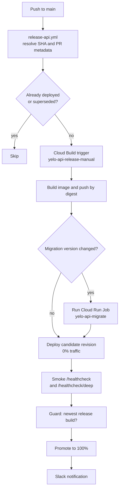

Each repository ships independently. Merging to `main` deploys the API and the web sites automatically. Mobile releases are always a deliberate, manual action.

| Repository | Trigger | Target | Pipeline |
| --- | --- | --- | --- |
| `yelo-api` | Push to `main`, or manual dispatch with a SHA | Cloud Run service `yelo-api-testflight` | `release-api.yml` then `cloudbuild.yaml` |
| `yelo-web` sites | Push to `main` | Firebase Hosting, project `yelo-dashboard-v2` | `firebase.yml` |
| `yelo-web` workers | Manual | Cloudflare Workers | `pnpm worker:<name>:deploy` |
| `yelo-frontend` store builds | Manual dispatch | App Store, Google Play | `build.yml` then EAS Workflows |
| `yelo-frontend` OTA | Nightly to staging, manual promote | EAS Update branches | `ota-stage.yml`, `ota-promote.yml` |

## Runners

- Most jobs run on Blacksmith-hosted Linux runners (labels such as `blacksmith-2vcpu-ubuntu-2404` and `blacksmith-4vcpu-ubuntu-2404`). Lightweight jobs use `ubuntu-latest`.
- Mobile E2E runs on a self-hosted Mac with the labels `self-hosted`, `macOS`, `ARM64`, `yelo-e2e`. GitHub-hosted `macos-15` is an explicit paid fallback.
- Google Cloud authentication uses Workload Identity Federation. No long-lived Google credential is stored in GitHub.

## API release

`release-api.yml` serializes releases in the `production-api` concurrency group. A running release is never cancelled. Additional pushes coalesce into the newest pending SHA, which contains every earlier change.



The Cloud Build steps in `cloudbuild.yaml` do the following:

1. **Resolve release state.** Validates migration history with `scripts/release/check-migrations.sh`, finds the revision serving 100% of traffic, and reads its `migration-version` label to decide whether a migration is required.
2. **Build image.** Builds `Dockerfile` with BuildKit, using a registry cache in Artifact Registry (`us-central1-docker.pkg.dev/prod-yelo/yelo-images`). If a migration is required, it also builds `Dockerfile.migrate`.
3. **Migrate database.** Runs the migration image as the Cloud Run Job `yelo-api-migrate` on the production VPC, because the production database resolves over IPv6 and public Cloud Build workers cannot reach it. The DSN comes from Secret Manager.
4. **Deploy candidate.** Deploys the image by digest with `--no-traffic`, a `candidate-<sha>` tag, `--max-instances=2`, and labels for `commit-sha` and `migration-version`.
5. **Verify and smoke.** Confirms the deployed image belongs to the requested image index, then polls `/healthcheck` and `/healthcheck/deep` on the candidate URL.
6. **Guard newest release.** Refuses to promote if a newer `production-api-release` build exists.
7. **Promote.** Routes 100% of traffic to the candidate, verifies it, removes the candidate tag, and posts to Slack with the startup time read from the `Server is ready` log line.

Runtime configuration lives on the Cloud Build trigger as `_RUNTIME_ENV_VARS` and `_RUNTIME_SECRET_REFS`. Secret payloads stay in Secret Manager. See [configuration](/engineering/api/configuration) for the variables themselves.

To release a specific commit manually:

```bash
gh workflow run release-api.yml --repo rideyelo/yelo-api --ref main -f sha=<FULL_GIT_SHA>
```

### Migrations and rollback

- Migrations run before the new revision receives traffic. Write them so the currently serving revision keeps working against the new schema.
- Applied migration files are immutable. CI rejects any change to an existing file under `migrations/`, and `CODEOWNERS` requires `@rideyelo/migration-approvers` to review new ones.
- Rollback means routing traffic back to an earlier schema-compatible revision. The promote step prints the exact command:

  ```bash
  gcloud run services update-traffic yelo-api-testflight \
    --region=us-central1 --to-revisions=<previous-revision>=100
  ```

- Down migrations never run automatically. `make migrate-down` exists for local databases only.

See [data layer](/engineering/api/data-layer) for how to write migrations.

<Note>
The runtime image is `gcr.io/distroless/static-debian12:nonroot` with `GOMEMLIMIT=400MiB`, sized for the 512Mi Cloud Run memory limit. If you change the service memory limit, change `GOMEMLIMIT` in the `Dockerfile` too.
</Note>

### E2E API convergence

`release-e2e.yml` keeps the isolated `yelo-api-e2e` Cloud Run service identical to production. It runs after each successful **Release API** run, hourly, and on demand. When the E2E service's commit, image digest, or migration version drifts from production, it runs `cloudbuild.e2e.yaml`. That build migrates the isolated `yelo_e2e` database and deploys the exact production image digest with E2E-only secrets. It never rebuilds the API. The workflow only runs when the `E2E_RELEASE_ENABLED` variable is `true`.

See [testing](/engineering/testing#mobile-e2e) for how the mobile suite uses this service.

## Web deployment

<Steps>
  <Step title="Pull request">
    `ci.yml` finds the Firebase sites affected by the change with Nx (`tag:firebase-site`) and checks that Nx's project list matches `sites.config.json`. It runs `workspace-quality:ci`, verifies the required build variables with `scripts/require-site-env.mjs`, and builds every affected site once. If `home` is affected, it deploys that build to a Firebase preview channel `pr-<number>` that expires in seven days and comments the URL on the pull request.
  </Step>
  <Step title="Merge to main">
    `firebase.yml` computes the affected range from the last successful `main` deploy, so a failed deploy is retried by the next push. It verifies the generated `firebase.json` with `pnpm firebase:config:check`, builds the affected sites, and runs a single `firebase deploy --only hosting:<site>,...`.
  </Step>
  <Step title="Notify">
    The workflow posts the deployed sites, commit, and pull request to Slack using the `SLACK_WEBHOOK_URL` secret.
  </Step>
</Steps>

Build-time values come from GitHub repository variables (`VITE_API_URL`, `VITE_CLERK_PUBLISHABLE_KEY`, `VITE_SENTRY_DSN`, and the rest). They are inlined into the bundle, so never put a secret in a `VITE_` variable. `firebase.yml` reads `VITE_SENTRY_DSN` from `vars.VITE_SENTRY_DSN`, but no repository variable with that name is set on `rideyelo/yelo-web`, so production dashboard builds ship without a Sentry DSN. See [Workflows](/engineering/ci/workflows).

Each site's Firebase target maps to its own Hosting site in `.firebaserc`: `dashboard` to `yelo-dashboard-v2`, and each other site to `yelo-<site>`. Each site owns its Hosting headers and rewrites in `src/sites/<site>/firebase.json`. Run `pnpm firebase:config` after you edit one to regenerate the combined root `firebase.json`.

You can also deploy from your machine. `make deploy-<site>` builds and deploys one site without a typecheck. `make deploy-all` typechecks, rebuilds, and deploys every site. Both run `check-auth` first, so run `firebase login --reauth` if your session expired.

Cloudflare Workers under `workers/` have no CI deploy. Run `pnpm worker:<name>:check` and then `pnpm worker:<name>:deploy`.

See [web sites](/engineering/web/sites) for what each site serves.

## Mobile releases

Mobile has two release paths. See [mobile releases](/engineering/mobile/releases) for the full procedure.

<Tabs>
  <Tab title="Store builds">
    Run **EAS Build** (`build.yml`) from GitHub Actions. It dispatches `.eas/workflows/build-and-submit.yml`, which can build iOS and Android `staging` (internal distribution) and `production` profiles, and optionally submit to App Store Connect and Google Play.

    - Production builds come from `main`. The actor must be listed in the `RELEASE_ADMINS` repository variable. An admin override exists for non-`main` builds.
    - `version` in `app.json` is the only hand-edited version. EAS owns build numbers (`appVersionSource: remote`).
    - A successful iOS submit tags `v<version>-<build>` and drafts a GitHub release. After the version is live, run **Finalize App Store release** to create the release branch and publish the release.
  </Tab>
  <Tab title="OTA updates">
    The runtime version is the native fingerprint. An update only reaches builds with the same fingerprint.

    - **OTA Stage** (`ota-stage.yml`) runs nightly at 09:00 UTC from `main`, and on demand from `main` or the supported release branch. It computes the fingerprint per platform, requires a finished build with that fingerprint, and publishes to the `staging` branch.
    - **OTA Promote** (`ota-promote.yml`) republishes a staged update group to `production` after confirming a finished production-channel build with the same runtime exists. It also supports `rollback` to an exact earlier production group.
    - `make eas-stage MESSAGE="..."` and `make eas-promote GROUP=<uuid> MESSAGE="..."` dispatch these workflows.
  </Tab>
  <Tab title="Release branches">
    `main` is always the next store version. The previous release branch, named for its version (for example `5.7.3`), receives OTA-safe backports until the next store version ships.

    - `backport-supported-release.yml` considers every merged pull request for the supported release. Add the `skip-supported-release-backport` label to opt out. Pull requests that touch native inputs are never backported automatically.
    - `sync-frontend-release.yml` in `yelo-api` is disabled in GitHub Actions. It used to keep an hourly rolling draft pull request from `main` onto the release branch. `backport-supported-release.yml` in `yelo-frontend` replaces it. See [Release pipelines](/engineering/ci/release-pipelines) and [Workflows](/engineering/ci/workflows).
    - `fingerprint.yml` comments on pull requests when native inputs change. The check is advisory on `main` and blocking on release branches.
  </Tab>
</Tabs>

<Warning>
Staging builds and staged OTA updates use the production API. `ota-stage.yml` bundles with `EXPO_PUBLIC_API_URL=https://api.rideyelo.com/`, and every `eas.json` profile except `e2e-simulator` uses the `production` EAS environment.
</Warning>

## Environments and approvals

| GitHub environment | Repository | Guards |
| --- | --- | --- |
| `production` | `yelo-api` | API releases |
| `ota-preview` | `yelo-frontend` | OTA Stage, staging builds |
| `ota-production` | `yelo-frontend` | OTA Promote, production store builds |
| `yelo-bot` | `yelo-frontend` | Backports and **Finalize App Store release**, which use the bot token |

Configure required reviewers or branch restrictions on these environments in GitHub, not in the workflow files.
