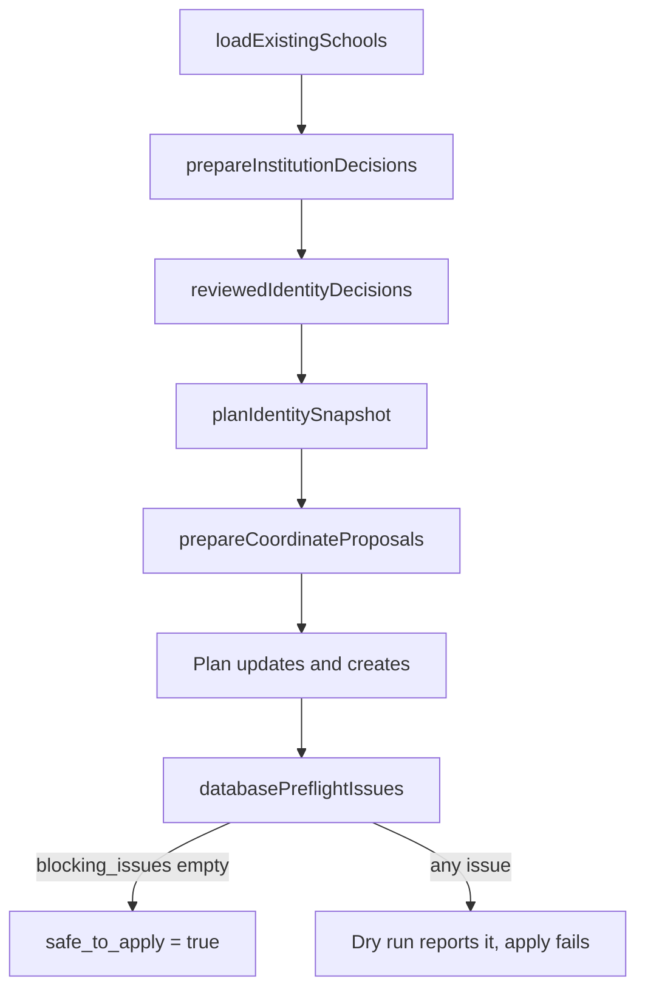

This page covers the write side of communities and schools: who can change them, how each field is validated and persisted, and what cascades from a save. For product behavior, see [Communities and zones](/concepts/communities-and-zones) and [Schools and communities](/administration/schools-and-communities).

Other pages own adjacent topics:

| Topic | Page |
| --- | --- |
| Assigning users to communities by location | [Community assignment](/engineering/location/community-assignment) |
| Zone geometry, point-in-polygon, zone pricing | [Zones and geometry](/engineering/location/zones-geometry) |
| Community feed and its cache | [Events and feed](/engineering/domains/events-and-feed) |
| Fleet service rows and fleet calendars | [Service communities and calendars](/engineering/fleets/service-communities-and-calendars) |
| Fleet manager scope rules | [Fleet manager authorization](/engineering/fleets/dashboard-authorization) |
| Student email domain matching | [School verification](/engineering/identity/school-verification) |

## Data touched

| Store | What |
| --- | --- |
| `Communities` | Name, bounding box, flags, primary fleet and vehicle type, experiments, map window, timezone columns, `geography_revision`, `archived_at` |
| `CommunityTimezoneHistory` | One row per `time_zone` change, with the revision that caused it |
| `CommunityCacheInvalidations` | Durable, coalescing outbox. One row per community with a `version` counter |
| `CommunityOperatingWindows` | Per-day windows, replaced wholesale by `UpsertOperatingWindows` |
| `Schools` | Name, `extensions`, `logo_url`, coordinates, `community_id`, `is_synthetic`, `admin_otp` |
| `SchoolCatalogMetadata` | IPEDS unit ID, address, website, source year, `synced_at` (written by the catalog sync) |
| `SchoolCoordinateProvenance` | Source, URL, year, and accuracy for a school's current coordinates |
| `Users.community_id`, `Users.home_community_id` | Rewritten when a community is archived |
| `RidePriceParameters.end_time` | Closed when a community is archived |
| Redis | `communities:all` (60 s TTL), `community:detail:{id}` (60 s TTL), `price:{community_id}:*` (5 min TTL), and their `:epoch` keys |
| Offline sources | NCES EDGE, IPEDS HD, JetBrains SWOT, Hipo, and optionally ROR, Wikidata, HIFLD, Mapbox (catalog sync only) |

## Endpoints

Dashboard paths are mounted directly on `/dashboard` (`community.RegisterDashboardRoutes` in `internal/server/http/router.go`). Every dashboard route first passes Clerk auth and `getDashboardScopeMiddleware`.

| Method | Path | Auth | Handler and purpose |
| --- | --- | --- | --- |
| `GET` | `/community/` | None | `GetAllCommunities`. Every non-archived community from `communities:all` |
| `GET` | `/community/current` | App JWT, role `user` | `GetUserCommunity`. Caller's community from `community:detail:{id}` |
| `GET` | `/community/{id}/zones` | App JWT, role `user` | `GetCommunityZones`. Active zones with `show_on_map` |
| `GET` | `/school/` | None | `school.SchoolHandler.GetAll`. Schools whose community isn't the default |
| `POST` | `/dashboard/manage/timezone-preview` | Admin (`assertAdmin`) | `PreviewCommunityTimezone` |
| `POST` | `/dashboard/manage` | Admin | `CreateCommunityAdmin` |
| `PATCH` | `/dashboard/manage/{id}` | Admin | `UpdateCommunityAdmin`. Partial update |
| `DELETE` | `/dashboard/manage/{id}` | Admin | `DeleteCommunityAdmin`. Archives |
| `POST` | `/dashboard/manage/{id}/schools/{school_id}` | Admin (inline) | `AddSchoolToCommunity` |
| `DELETE` | `/dashboard/manage/{id}/schools/{school_id}` | Admin (inline) | `RemoveSchoolFromCommunity` |
| `GET`, `PUT` | `/dashboard/manage/{id}/operating-windows` | Admin (inline) | `GetOperatingWindows`, `UpsertOperatingWindows` |
| `POST` | `/dashboard/schools/mapping-preview` | Admin | `PreviewSchoolMapping` |
| `GET` | `/dashboard/schools` | Admin via scope middleware. No handler gate | `GetSchools` |
| `POST` | `/dashboard/schools` | Admin | `CreateSchool` |
| `PUT` | `/dashboard/schools/{id}` | Admin | `UpdateSchool`. Partial despite the verb |
| `GET` | `/dashboard/communities/{id}/zones` | Admin, or intern for own community (middleware). No handler gate | `GetCommunityZonesDashboard`. All zones |
| `POST` | `/dashboard/zones` | Admin | `CreateZoneAdmin` |
| `PATCH` | `/dashboard/zones/{id}` | Admin | `UpdateZoneAdmin` |
| `DELETE` | `/dashboard/zones/{id}` | Admin | `DeleteZoneAdmin` |
| `GET` | `/dashboard/drivers/global/{active,pending,in-process,inactive}` | Admin (inline) | `global_drivers_handler.go`. Cross-community driver lists |
| `GET` | `/dashboard/{id}/users` | Admin, or intern pinned to own community | `GetUsers` via `resolveCommunityID` |

## Authorization

Two layers decide who can edit which community.

**Layer 1, path scope.** `dashboardScopeAllows` in `internal/server/http/dashboard_scope.go` returns 401 with no body when it rejects:

- `admin` passes everything.
- `intern` needs a non-nil UUID `community_id` claim. `internDashboardScopeAllows` then allows, among others, `GET /dashboard/{own_community}/{kpis,drivers,demographics,fleets,users,search-insights,search-map-data}`, anything under `/dashboard/{own_community}/top-locations`, and `GET /dashboard/communities/{own_community}/{feed,zones,map}`. Paths whose second segment is `manage`, `schools`, `zones`, `drivers`, or `vehicle-types` never equal the community ID, so interns are rejected.
- `fleet` managers never reach any route on this page. See [Fleet manager authorization](/engineering/fleets/dashboard-authorization).

**Layer 2, handler checks** in `internal/server/http/community/community_handler.go`:

| Helper | Rule |
| --- | --- |
| `assertAdmin` | `role == "admin"`, else 403 **Forbidden: Admins only** |
| `resolveCommunityID` | Admin: parse the path ID. Anyone else: `ClerkUserContext.ResolveDashboardCommunity`, which pins them to the community in their claim regardless of the path |
| Inline checks | `AddSchoolToCommunity`, `RemoveSchoolFromCommunity`, operating windows, `ReviewDriverApplication`, and the global driver lists repeat the admin comparison inline |

In practice, every community, school, and zone mutation is admin-only. No role can edit "its own" community. Interns can only read.

## Community create

`CreateCommunityRequest.Validate` (`requests/community.go`) requires a non-empty `name`. `bounding_box` is optional. If any coordinate is non-zero, the box is normalized (swapped corners are reordered) and must pass `BoundingBox.IsValid`: latitudes in -90 to 90, longitudes in -180 to 180, and min at most max. `time_zone` is accepted and ignored.

`sqlCommunityRepository.CreateCommunity` runs in one transaction:

1. `CreateCommunity` inserts with `time_zone = 'UTC'`, `is_active = FALSE`, `rides_disabled = TRUE`, `is_hidden = FALSE`, `max_riders = 200`, `min_riders = 1`, `min_drivers = 1`.
2. `persistDerivedTimezone` resolves the timezone from the box and writes it.

After commit, `DashboardService.CreateCommunityAdmin` copies the default community's `primary_fleet_id` onto the new row when it has one, then calls `invalidateCommunityCaches`.

An unresolved timezone doesn't block creation. The community stays `UTC` with `timezone_status = 'unresolved'`, and activation is blocked later.

## Community partial update

`PATCH /dashboard/manage/{id}` takes `AdminUpdateCommunityRequest`. Every field is a pointer. A missing field or JSON `null` means "leave unchanged".

### Request validation

| Field | Rule |
| --- | --- |
| `bounding_box` | Requires `expected_geography_revision`. Non-zero boxes are normalized and must be valid |
| `expected_geography_revision` | Must be positive when present |
| `min_riders`, `min_drivers`, `max_riders` | Must be absent. Any value fails with **capacity controls have been removed; reload the dashboard** |
| `name` | Non-empty when present |
| `map_moves_window_hours` | 1 to 720 |
| `primary_vehicle_type` | Must be in the vehicle type registry (see [Vehicle types](/engineering/domains/vehicle-types-and-catalog#the-registry)) |
| `time_zone` | Accepted and ignored. `ToModel` passes it, but `UpdateCommunity` always sends `TimeZone: nil` to SQL |
| `is_active`, `is_hidden`, `rides_disabled`, `primary_fleet_id`, `active_experiments` | No validation. `active_experiments` replaces the whole list |

### Persistence

`sqlCommunityRepository.UpdateCommunity` runs in one transaction:

<Steps>
  <Step title="Lock">
    `LockCommunityGeography` selects the row `FOR UPDATE`. A missing row returns 404 **community not found**.
  </Step>
  <Step title="Check the revision">
    If `expected_geography_revision` is present and differs from the stored `geography_revision`, the save fails with `ErrorTypeDuplicate` (HTTP 409, **Community changed**).
  </Step>
  <Step title="Gate geography">
    `validateCommunityGeographyUpdate` resolves the timezone for the effective box when the request changes the box, sets `is_active: true`, or sets `rides_disabled: false`. If the result is `unresolved`, the save fails with 400 and the resolver's message.
  </Step>
  <Step title="Write fields">
    `UpdateCommunityFields` applies `COALESCE(new, old)` to every column.
  </Step>
  <Step title="Re-derive the timezone">
    `persistDerivedTimezone` runs on every update, even a rename.
  </Step>
</Steps>

`DashboardService.UpdateCommunityAdmin` then calls `invalidateCommunityCaches` and, in a detached goroutine, `priceCache.InvalidateCommunity`.

### Geography revision

Migration `000315_community_timezone_derivation` adds trigger `community_timezone_dirty` (`BEFORE UPDATE`):

- A change to any box coordinate or `is_default` increments `geography_revision` and sets `timezone_status = 'pending'`.
- Otherwise, a change to `time_zone` increments `geography_revision`.
- Anything else keeps the revision.

One save can bump the revision twice. Worked example, starting at revision 7:

| Statement | Change | Revision after |
| --- | --- | --- |
| `UpdateCommunityFields` | Box moved | 8, status `pending` |
| `SetCommunityDerivedTimezone` | Derived zone differs from the old `time_zone` | 9, status `resolved` |

If the new box resolves to the same zone, the second statement doesn't change `time_zone`, and the revision stays at 8. The `PATCH` response is only `success: true`, so the dashboard must reload before the next geography save.

## Timezone derivation

`localtimezone.Resolve` in `internal/data/timezone/resolver.go` uses bundled `tzf` boundary data (`Version = "tzf-1.2.5-2026c-v1"`) and never calls the network.

1. The box is normalized. `bounds_fingerprint` is the SHA-256 of `minLat|minLng|maxLat|maxLng` formatted with `%g`.
2. `IsNonGeographic` is true only for the default community with a zero box or a near-world box (latitudes beyond ±85, longitudes beyond ±175). Those get status `non_geographic` and `UTC`.
3. An invalid box, a zero-height or zero-width box, or a longitude span greater than 180 returns `unresolved` with **Draw a non-empty local service area to determine its timezone.**
4. Five sample points are looked up: the center and four corners inset by 10 percent. Empty results and `Etc/` zones are skipped.
5. Two different zones return `unresolved` with **This service area spans timezones. Narrow or split the community bounds.** No zone at all returns **No local timezone found. Adjust the service area to include the served land area.**
6. Otherwise the status is `resolved`.

Worked example for a box from latitude 40.0 to 41.0 and longitude -75.0 to -74.0:

| Sample | Latitude | Longitude |
| --- | --- | --- |
| Center (0.5, 0.5) | 40.5 | -74.5 |
| (0.1, 0.1) | 40.1 | -74.9 |
| (0.1, 0.9) | 40.1 | -74.1 |
| (0.9, 0.1) | 40.9 | -74.9 |
| (0.9, 0.9) | 40.9 | -74.1 |

The resolver checks only these points. A box whose middle crosses a timezone line between samples can still resolve.

`SetCommunityDerivedTimezone` writes `time_zone` with `COALESCE(new, old)`. An `unresolved` result keeps the previous `time_zone` and only updates the status, message, fingerprint, resolver version, and `timezone_checked_at`.

`PreviewCommunityTimezone` runs the same resolver without writing. If `community_id` is given, it must exist (404 otherwise), and the response includes its current `geography_revision`.

### Background reconciliation and cache outbox

Trigger `community_cache_invalidation` (`AFTER INSERT OR UPDATE ON "Communities"`) upserts `CommunityCacheInvalidations`, incrementing `version`, and appends `CommunityTimezoneHistory` when `time_zone` changes.

The River job `community_geography_maintenance` (`internal/notify/queue/community_timezone.go`) is scheduled every 15 seconds with a 14-second uniqueness window and a 1-minute timeout:

- When `COMMUNITY_TIMEZONE_RECONCILIATION_ENABLED` is true (default false), it loads up to 100 communities whose status is `pending` or whose resolver version differs from `Version`, and calls `UpdateCommunity` with an empty update on each.
- It then drains up to 100 outbox rows with `InvalidateCommunityCaches`, deleting each row only if its `version` hasn't changed.

`InvalidateCommunityCaches` sets a fresh random epoch for `communities:all` and `community:detail:{id}` (24-hour TTL), then deletes those keys and every `price:{id}:*` key. Readers capture the epoch before reading the database, so a slow read can't repopulate a stale value.

## Community archive

`DELETE /dashboard/manage/{id}` calls `sqlCommunityRepository.ArchiveCommunity`:

<Steps>
  <Step title="Find a replacement">
    `FindCommunityArchiveReplacement` locks the target, which must not already be archived (404 otherwise). It picks the smallest-area active, non-test, non-default, non-archived community whose box contains the target's center, excluding the reserved community `87794dc9-7ef8-438c-b2e8-ba6fd77e66aa`. The fallback is a non-archived, non-test default community.
  </Step>
  <Step title="Refuse unsafe cases">
    The default community returns 400 **the default community cannot be removed**. No replacement returns 400 **no active default or nearby replacement community exists**.
  </Step>
  <Step title="Move references">
    `ReassignUsersCurrentCommunity`, `ReassignUsersHomeCommunity`, and `ReassignSchoolsCommunity` point every row at the replacement.
  </Step>
  <Step title="Close pricing">
    `CloseCommunityRidePriceParameters` sets `end_time = NOW()` on open price rows.
  </Step>
  <Step title="Archive">
    `ArchiveCommunity` sets `archived_at = NOW()`, `is_active = FALSE`, `is_hidden = TRUE`, `rides_disabled = TRUE`.
  </Step>
</Steps>

Fleet service retirement on archive is covered in [Community archival](/engineering/fleets/service-communities-and-calendars#community-archival).

## Schools

### School-to-community mapping

The database owns mapping. Migration `000301_automatic_school_community_mapping` defines `resolve_school_community` and two triggers. Migration `000307_school_synthetic_protection` exempts rows with `is_synthetic = true`.

- `schools_assign_community_from_coordinates` runs `BEFORE INSERT OR UPDATE OF latitude, longitude, community_id`. A usable point (in range and not exactly `0, 0`) always overwrites `community_id` with the resolved community. An unusable point keeps the given `community_id`, or uses the default when it is null or the nil UUID.
- `communities_reconcile_schools_after_update` runs after any statement that changes a community's box, `is_active`, `is_test`, or `archived_at`, and remaps every non-synthetic school with a usable point.

Worked example. A school at `34.02, -118.28` sits inside community A (box 0.5 by 0.5 degrees, area 0.25) and community B (box 0.1 by 0.1, area 0.01). Both are active, non-test, non-default. B wins because its area is smaller. If B is deactivated, the statement trigger moves the school to A.

The `school_management(school_id)` SQL function builds the `management` object on each school row in `GET /dashboard/schools`. Its `reason` is one of `synthetic_school`, `missing_coordinates`, `outside_active_bounds`, `smallest_overlapping_bounds`, or `inside_active_bounds`. Provenance joins `SchoolCoordinateProvenance` on exact latitude and longitude, so new coordinates show no source.

### Manual assignment

`AddSchoolToCommunity` runs `MoveSchoolToCommunity`, and `RemoveSchoolFromCommunity` runs `MoveSchoolToDefaultCommunity`. Both update `community_id`, which fires the `BEFORE` trigger. For a school with a usable point, the trigger immediately recomputes the community, so the call succeeds but changes nothing. Manual assignment only sticks for schools without usable coordinates and for synthetic schools.

`AddCommunitySchool` always returns a nil user list. School moves never touch users.

### Create and update

| Rule | `POST /dashboard/schools` (`CreateSchool`) | `PUT /dashboard/schools/{id}` (`UpdateSchool`) |
| --- | --- | --- |
| Name | Required | Non-empty when present |
| `extensions` | At least one | Non-empty when present |
| Coordinates | Latitude -90 to 90, longitude -180 to 180. Omitted means `0, 0`, which is legacy mode | Each checked independently when present |
| `community_id` | Optional fallback for legacy mode. Omitted is the nil UUID, which the trigger maps to the default | Optional. Overridden by the trigger when coordinates are usable |
| `logo_url` | Optional | `COALESCE`, so it can't be cleared |
| Server-set | `admin_otp = gen_random_uuid()::text` | None |

`UpdateDashboardSchool` uses `COALESCE(new, old)` for every column.

### Listing and preview

`GetSchools` accepts `limit` 1 to 1000 (default 50), `offset` 0 or more, `sort` in `name`, `community_name`, `user_count`, `driver_count`, `order` of `asc` or `desc`, and `mapping` of `missing`, `outside`, or `protected`. `search` becomes an `ILIKE '%search%'` match on the name or the comma-joined extensions. User and driver counts exclude deleted, incomplete, provisional, and test users.

`PreviewSchoolMapping` normalizes the box and requires it to be valid. A present `community_id` must be non-nil and exist (404 otherwise). Without one, the repository uses a random UUID named **New community**. `PreviewSchoolCommunityMapping` evaluates every school against the proposed box with `preview_school_community` and returns counts plus at most 500 rows, changed schools first, then by name and ID.

## School catalog sync

`internal/data/schoolcatalog` is used only by the offline command `cmd/sync-school-catalog`. No API route calls it.

`schoolcatalog.Build` merges, in order:

| Source | Default URL constant | Provides |
| --- | --- | --- |
| NCES EDGE | `DefaultEDGELayerURL` | Coordinates, paged 2,000 rows at a time |
| IPEDS HD | `DefaultIPEDSURL` (`HD2024.zip`) | Unit ID, name, website, `CYACTIVE`, `SECTOR`, `NEWID`, `CLOSEDAT` |
| Historical IPEDS | Repeatable flag | Aliases by unit ID |
| ROR, Wikidata, HIFLD | Opt-in with `--with-supplemental-sources` | Review evidence only |
| JetBrains SWOT | `DefaultSWOTURL` | Email domain candidates |
| Hipo | `DefaultHipoURL` | Email domain candidates, US only |

`School.ImportExclusion` in `eligibility.go` blocks a catalog row from creating or updating a school unless it is a current IPEDS institution with `CYACTIVE = 1`, no successor or closure, and a sector from 1 to 9. The `corroborated` domain policy (default) approves a SWOT domain, or a Hipo domain only when it equals the IPEDS website domain. `union` approves either.

Command defaults (`cmd/sync-school-catalog/main.go`): `--dry-run=true`, `--min-catalog-schools=5000`, `--max-created-schools=500`, `--max-coordinate-changes=5000`, `--max-domain-additions=2000`, `--geocode-max-requests=100`. Downloads make up to 3 attempts with 1 and 2 second backoff, or a longer `Retry-After`. The default ROR source gets 4 attempts, alternating with a pinned mirror URL. Mapbox geocoding needs exactly one address result with `exact` or `high` confidence and `rooftop`, `parcel`, or `point` accuracy. See `cmd/sync-school-catalog/README.md` for apply constraints.

## Reviewed decisions and audit report

The catalog sync never trusts a name or domain match on its own. `syncDatabase` in `cmd/sync-school-catalog/main.go` loads the existing schools, applies two bundled review files, plans every identity, and only then plans changes:

A dry run uses a read-only `REPEATABLE READ` transaction. An apply sets `lock_timeout = '5s'` and locks `"Communities"` and `"Schools"` in `SHARE ROW EXCLUSIVE` mode before it reads the plan. Downloads and geocoding finish before those locks are taken.

### Supplemental sources

`--with-supplemental-sources` fills in the default ROR, Wikidata, and HIFLD URLs. You can also set `--ror-url`, `--wikidata-url`, or `--hifld-url` individually. `EnrichSupplemental` in `internal/data/schoolcatalog/supplemental.go` skips a source with an empty URL and fails the build when a configured source returns no records.

| Source | Default | How it is read | Evidence `precision` | Evidence `status` |
| --- | --- | --- | --- | --- |
| ROR | `DefaultRORURL`, a pinned Zenodo `v2.12-2026-08-25` data dump ZIP | The first `.json` entry whose name contains `schema_v2` or starts with `v2.`. Keeps records with type `education` and a US location | `city_identity_only`. No coordinates | The ROR record status |
| Wikidata | `DefaultWikidataURL` (SPARQL) | Keyset pages of 500 entities, at most 100 pages. Entities with country `Q30` that have an IPEDS ID (`P1771`) or are an instance of a subclass of `Q3918` | `campus_candidate`, or `ambiguous_or_missing` when the entity doesn't have exactly one valid coordinate | `unknown`, `closed` (has `P576`), or `multiple_campuses` (more than one IPEDS ID, which also clears the unit ID) |
| HIFLD | `DefaultHIFLDURL`, FEMA's public mirror | ArcGIS point layer, 1,000 features per page ordered by object ID | `historical_campus`, or `missing` for invalid coordinates | `historical`, or `inactive_or_unknown` when `STATUS` isn't `A` |

HIFLD rows from the default URL get `source_year` `2019-2020`. Any other HIFLD URL uses the row's `SOURCEDATE` field.

Each parser fails closed. A missing or repeated source ID, a truncated ROR array, a Wikidata row that doesn't advance the cursor, or an HIFLD page that reports more rows but returns none aborts the run.

A supplemental record matches a catalog school by IPEDS unit ID when it has one. Otherwise a name and the school's website domain must both agree, and exactly one school may qualify. Two or more qualifying schools are listed in `sources.supplemental.conflicts` as `source:source_id`. A match only adds the record's names as aliases. It never adds an email domain or changes a coordinate.

### Downloads, cache, and checksums

Every source goes through `download` in `internal/data/schoolcatalog/download.go`.

| Behavior | Rule |
| --- | --- |
| Size limit | 128 MiB per response (`maxDownloadBytes`) |
| Timeouts | 3 minutes per request and 15 minutes for the whole run (`run` in `main.go`) |
| Retried failures | HTTP 429, HTTP 5xx, network errors, and an unexpected EOF. Any other non-2xx status fails at once |
| Backoff | `1 << attempt` seconds, or a longer `Retry-After`. `Retry-After` is capped at 30 seconds |
| ROR mirror | Only for `DefaultRORURL`. Attempts alternate with `rorDirectURL`, which is the same Zenodo record and file |
| Local files | A `file:` URL must be absolute with no host or query. It skips the cache and retries. `--ror-file` builds one, and it can't be combined with `--ror-url` |

`--source-cache-dir` turns on a local cache. It stores only URLs whose path ends in `.zip`, plus the default ROR URL. Paged ArcGIS and Wikidata responses are never cached, because separate pages could come from different snapshots.

- The cache file is `<sha256 of the URL>.json` and holds `sha256`, `saved`, and `data`.
- A read rejects an entry that is older than 24 hours, has a `saved` time in the future, is over the size limit, doesn't match its stored SHA-256, or isn't a valid ZIP. A rejected entry falls back to a download.
- A write goes to a temporary file in the same directory and is renamed into place. A failed write doesn't fail the run.
- A cache hit still runs the normal source parser.

`--verbose` logs each attempt, status, byte count, elapsed time, and the SHA-256 of the downloaded bytes to stderr with the prefix `school-source`. `sourceLabel` strips userinfo, query, and fragment from logged URLs and appends a short hash of the full URL, so paged requests stay distinguishable without exposing tokens or queries.

### Geocoding and coordinate proposals

Coordinates from supplemental sources and Mapbox never apply directly. They become `coordinate_candidates` in the report, and a reviewer approves them in a second run (`cmd/sync-school-catalog/coordinates.go`).

A school is eligible only when it is non-synthetic, has `0, 0` coordinates, and has no catalog match, hold, or preservation in the identity plan.

<Steps>
  <Step title="Collect candidates">
    `MatchEvidence` returns every supplemental record that matches the school by unit ID, or by name plus a domain. Each one with valid coordinates becomes a candidate.
  </Step>
  <Step title="Geocode confirmed addresses (optional)">
    `--geocode-addresses-file` takes a JSON array of `ConfirmedAddress` objects: `school_id`, `school_name`, `address`, `city`, `state`, `postal_code`, `evidence_url`, and `confirmed_at`. It needs `MAPBOX_API_KEY`, works only in dry-run mode, and can't be combined with `--catalog-only`. The whole file is validated before the first billable request.
  </Step>
  <Step title="Review">
    Each candidate carries a `fingerprint`, the SHA-256 of the proposal with `approved` false. Set `approved` to `true` on the ones you accept.
  </Step>
  <Step title="Apply">
    `--approved-coordinates-file` reads the reviewed list. `applyCoordinateProposal` locks the school row, re-validates the proposal, writes the coordinates, and upserts `SchoolCoordinateProvenance` with the evidence `precision` as `accuracy`.
  </Step>
</Steps>

`ConfirmedAddress.Validate` in `internal/data/schoolcatalog/geocoding.go` requires:

- An address that starts with a street number and isn't a PO box.
- A city, a two-letter uppercase state, and a ZIP in `12345` or `12345-6789` form.
- An `http` or `https` `evidence_url` with a host.
- A `confirmed_at` that is not in the future and is at most 366 days old.

`PermanentGeocoder` calls the Mapbox v6 forward endpoint with `permanent=true`, `types=address`, `country=US`, and `limit=5`. It doesn't follow redirects.

- It retries HTTP 429 and 5xx up to 3 attempts, waiting 1 and then 2 seconds. Every attempt counts against `--geocode-max-requests`.
- It caches results in memory for the run, keyed by the lowercased address, city, state, and ZIP.
- `parsePermanentGeocode` accepts a response only when it has exactly one feature of type `address` with a point geometry, `exact` or `high` confidence, `matched` codes for `address_number`, `street`, `postcode`, `place`, and `region`, a `matched` or `inferred` country, and `rooftop`, `parcel`, or `point` accuracy. The returned country, region code, and five-digit ZIP must equal the confirmed address.
- A failure is recorded in `geocoding_failures` and the run continues.

`validateCoordinateProposal` rejects an approved proposal when:

- The fingerprint doesn't match, which means the proposal was edited.
- The school is synthetic, already has coordinates, or its name or domains changed since review.
- The evidence source isn't `wikidata`, `hifld`, or `mapbox_permanent`.
- The evidence status is `closed`, `multiple_campuses`, or `inactive_or_unknown`.
- The evidence was retrieved more than 366 days ago.

Two approved proposals for one school also fail. Review files are capped at 32 MiB, reject unknown JSON fields, and must hold exactly one JSON document.

### Bundled review files

Both files are compiled into the binary with `go:embed`. Each entry pins a snapshot of a production row, and the run stops when the database or the catalog no longer matches that snapshot. Entries for school IDs that aren't in the database are skipped, so other environments still run.

| File | Entries | Purpose |
| --- | --- | --- |
| `cmd/sync-school-catalog/reviewed_identities.json` | 16 | Preserve a legacy or system row that shares a catalog identity with a canonical row |
| `cmd/sync-school-catalog/institution_decisions.json` | 22 | Preserve a row's coordinates, or replace a wrong email domain |

**Reviewed identities.** Each entry names an `existing` row, the `canonical` row, and the catalog institution (`unit_id`, `catalog_name`, `catalog_website`, `ipeds_year`). The `reason` must be one of:

| `reason` | Entries |
| --- | --- |
| `reviewed_legacy_duplicate_preserved` | 13 |
| `reviewed_system_or_healthcare_row_preserved` | 3 |

`validateReviewedIdentities` (`reviewed_identities.go`) fails with `identity review is stale` when any of these is true:

- The existing row is synthetic, or its name or exact domain list differs from the snapshot.
- The existing row now has a stored IPEDS unit ID.
- The canonical row is missing, synthetic, renamed, lacks a snapshot domain, or gained a domain that isn't an approved catalog domain of that institution.
- The catalog institution is missing, excluded from import, or its name, website domain, or first identity evidence year differs from the entry.

It then fails with `identity review evidence drifted` when the canonical row no longer matches that institution unambiguously. For a legacy duplicate, the legacy row must also still be a candidate for it.

These decisions only preserve the existing row. They never merge, delete, rename, move users, or approve domains.

**Institution decisions.** Each entry pins `existing` and carries a `reason`, a `note`, and at least one evidence URL. The reasons in the file:

| `reason` | Entries |
| --- | --- |
| `reviewed_distinct_campus_preserved` | 10 |
| `reviewed_institution_without_single_campus` | 6 |
| `reviewed_domain_mapping_correction` | 3 |
| `reviewed_namesake_preserved` | 2 |
| `reviewed_historical_identity_preserved` | 1 |

Two optional fields change what an entry does:

| Field | Effect |
| --- | --- |
| `preserve_coordinates: true` | `applyDisposition` marks the row preserved. The planner skips it, so it gets no domain, coordinate, or metadata change. The entry is stale if the row has a stored IPEDS unit ID |
| `domains_after` with `domain_source_unit_id` | Replaces the row's domains. The three entries are Central Methodist College (`cmc.edu` to `centralmethodist.edu`), Johnson Bible College (`jbc.edu` to `johnsonu.edu`), and West Virginia University at Parkersburg (`westliberty.edu` to `wvup.edu`) |

`validateInstitutionDecision` (`institution_decisions.go`) checks a domain correction as follows:

- The source institution must exist and be eligible for import, and must not conflict with the row's stored unit ID.
- Every domain in `domains_after` must be approved for that institution under the `corroborated` policy, or be the institution's website domain with directory evidence.
- If the row still has the pinned domains, the correction is planned as a `reviewed_domain_correction` change.
- If the row was already corrected, the run accepts it only when no removed domain came back, every corrected domain is present, and every current domain is approved.
- After all entries, every corrected domain must have exactly one existing owner.

An apply writes the corrections first, in the same transaction as the ordinary import.

### Identity reviews

`planIdentitySnapshot` in `identity_review.go` resolves every existing row before any change is planned. It adds an `identity_reviews` entry for each row that needed a decision.

| `status` | `reason` values | What the planner does |
| --- | --- | --- |
| `held` | `conflicting_identity_evidence`, `multiple_existing_rows_for_institution` | No change to the row. The name goes to `ambiguous_existing`, and every candidate institution is suppressed so it can't be created as a new school |
| `preserved` | A reviewed reason, or `non_us_domains_preserved_outside_us_catalog` | No change to the row, other than a reviewed domain correction |
| `resolved_match` | `ipeds_name_and_website_agree`, `reviewed_canonical_identity`, or an institution decision reason | Planned normally. `selected_unit_id` names the matched institution when there is one |

- A row with no stored unit ID whose domains all end in `.ca` is preserved as non-US.
- `corroboratedIdentity` resolves a row with no stored unit ID only when an IPEDS release agrees on both the name and the exact website domain, and exactly one eligible institution does. An alias on a website shared with another matching institution resolves nothing.
- A non-synthetic row is held when another existing row could own its matched institution.

Each review lists its `candidates` with `evidence` labels: `stored_unit_id`, `primary_name`, `alias_or_state_qualified_name`, `official_website:<domain>`, `approved_domain:<domain>`, and `ipeds_name_and_website:<source URL>`. `competing_school_ids` names the other rows that could own the same institution.

### Audit report

`--report-file` writes indented JSON with mode `0600`. The file is also written when the database sync returns an error, so a stale review or a blocked apply still leaves a report. It isn't written when the catalog build fails, the catalog is below `--min-catalog-schools`, or the database connection can't be opened.

| Top-level key | Content |
| --- | --- |
| `dry_run` | The `--dry-run` value |
| `domain_policy` | `corroborated` or `union` |
| `sources` | `schoolcatalog.Report`: row counts per source and `supplemental` (`rows`, `matched_current`, `conflicts`, `aliases_added`) |
| `database` | `databaseReport`. Absent with `--catalog-only` |

Key `database` fields:

| Field | Meaning |
| --- | --- |
| `safe_to_apply` | True when `blocking_issues` is empty |
| `blocking_issues` | Reasons an apply would be refused |
| `changes` | One entry per planned change. `action` is `update`, `create`, `reviewed_domain_correction`, or `approved_coordinate_backfill`, with before and after domains, coordinates, and community |
| `identity_reviews` | See [Identity reviews](#identity-reviews) |
| `reviewed_domain_corrections` | The domain corrections planned this run, with evidence URLs |
| `coordinate_candidates`, `geocoding_failures`, `approved_coordinate_changes` | See [Geocoding and coordinate proposals](#geocoding-and-coordinate-proposals) |
| `historical_coordinate_candidates` | Historical IPEDS locations for unmatched schools without coordinates. Review only, never applied |
| `held_catalog_records` | Catalog institutions kept out of the plan, for example `catalog_identity_collision`, `possible_existing_institution`, or `shared_institution_website` |
| `ambiguous_existing`, `unmatched_existing`, `protected_test_schools` | School names by planning outcome |
| `domain_conflicts`, `name_resolutions` | Domain ownership conflicts with their resolution, and new schools renamed to avoid a name clash |

`databasePreflightIssues` fills `blocking_issues`:

- `identityPlanIssues` adds an `identity safety violation` when a held or preserved school has a planned change other than its reviewed domain correction, when a `reviewed_domain_correction` change has no matching reviewed entry, or when two `update` or `create` changes target the same institution.
- Planned creates, coordinate changes, or domain additions exceed their `--max-*` limits.
- A community has invalid or empty bounds.
- The school management schema from migration `000307` is missing.

A dry run returns the report with the issues listed. An apply fails with `preflight blocked apply` and writes nothing.

## Where this lives in code

| Concern | File | Function or type |
| --- | --- | --- |
| Routes | `internal/server/http/community/community_router.go` | `RegisterDashboardRoutes`, `registerCommunityManagementRoutes`, `registerSchoolRoutes` |
| Handlers and authz helpers | `internal/server/http/community/community_handler.go` | `assertAdmin`, `resolveCommunityID`, `CreateCommunityAdmin`, `UpdateCommunityAdmin` |
| Timezone and school preview handlers | `internal/server/http/community/timezone.go`, `school_management.go` | `PreviewCommunityTimezone`, `PreviewSchoolMapping` |
| Zone handlers | `internal/server/http/community/zone_handler.go` | `CreateZoneAdmin`, `UpdateZoneAdmin`, `DeleteZoneAdmin` |
| Global driver lists | `internal/server/http/community/global_drivers_handler.go` | `GetGlobalActiveDrivers` and siblings |
| Request validation | `internal/server/http/community/requests/community.go`, `zone.go` | `CreateCommunityRequest`, `AdminUpdateCommunityRequest`, `UpsertOperatingWindowsRequest` |
| Path scope | `internal/server/http/dashboard_scope.go` | `dashboardScopeAllows`, `internDashboardScopeAllows` |
| Dashboard services | `internal/service/dashboard/community.go`, `school_management.go`, `zone.go` | `CreateCommunityAdmin`, `PreviewSchoolMapping`, `CreateZone` |
| Community repository | `internal/data/repository/community.go`, `community_timezone.go` | `CreateCommunity`, `UpdateCommunity`, `ArchiveCommunity`, `persistDerivedTimezone` |
| Resolver | `internal/data/timezone/resolver.go` | `Resolve`, `IsNonGeographic` |
| Maintenance job | `internal/notify/queue/community_timezone.go` | `communityMaintenanceWorker` |
| Cache invalidation | `internal/data/redis/community_invalidation.go` | `InvalidateCommunityCaches` |
| Schools | `internal/data/repository/dashboard.go`, `school_management.go`, `queries/school_management.sql` | `CreateSchool`, `UpdateSchool`, `PreviewSchoolMapping` |
| Public school list | `internal/service/school/school.go`, `internal/server/http/school/` | `SchoolService.GetAll` |
| Models | `internal/models/community.go`, `community_timezone.go`, `schools.go`, `school_management.go` | `CommunityUpdate`, `CommunityTimezone`, `SchoolUpdate`, `SchoolManagement` |
| Triggers | `migrations/000301_*`, `000303_*`, `000307_*`, `000315_*` | `resolve_school_community`, `mark_community_timezone_dirty` |
| Catalog | `internal/data/schoolcatalog/`, `cmd/sync-school-catalog/` | `Build`, `ImportExclusion`, `ApprovedDomains` |
| Catalog downloads and supplemental sources | `internal/data/schoolcatalog/download.go`, `supplemental.go`, `geocoding.go` | `download`, `EnrichSupplemental`, `PermanentGeocoder` |
| Catalog review and report | `cmd/sync-school-catalog/identity_review.go`, `institution_decisions.go`, `reviewed_identities.go`, `coordinates.go` | `planIdentitySnapshot`, `validateInstitutionDecision`, `validateReviewedIdentities`, `prepareCoordinateProposals` |

## Gotchas and edge cases

- **`primary_fleet_id` can't be cleared.** `CommunityUpdate` documents "null to clear", but `UpdateCommunityFields` uses `COALESCE`, and a JSON `null` decodes to a nil pointer. Neither path clears the column. The dashboard's **None** option sends no value, so it doesn't clear it either.
- **`primary_fleet_id` must point at a live fleet.** Trigger `guard_fleet_primary_archive` (migration `000346`) rejects setting it to an archived fleet with SQLSTATE `23514`, which fails the save. A fleet can't be archived while any community references it. See [Archive](/engineering/fleets/stripe-and-lifecycle#archive).
- **Auto-queue limits have no writer.** `CommunityUpdate` and the SQL support `auto_queue_max_minutes` and `auto_queue_default_minutes`, but `AdminUpdateCommunityRequest` has no such fields. No API route sets them.
- **Deactivating skips the timezone gate.** `validateCommunityGeographyUpdate` only runs when the box changes, `is_active` becomes true, or `rides_disabled` becomes false. You can hide or disable an unresolved community freely.
- **Activation doesn't need a revision.** Only `bounding_box` requires `expected_geography_revision`. Two admins can toggle flags concurrently with last write wins.
- **Manual school assignment is usually a no-op.** See [Manual assignment](#manual-assignment). The route still returns success.
- **`RemoveSchoolFromCommunity` ignores the community in the path.** `MoveSchoolToDefaultCommunity` is keyed by school ID only.
- **School writes don't invalidate community caches.** `school_ids`, `school_names`, and `extensions` on cached communities can lag by up to 60 seconds after a school change.
- **Missing IDs return success.** `UpdateSchool`, `UpdateZone`, and `DeleteZone` run `:exec` statements without a row count check, so a wrong ID returns 200.
- **API accepts a single coordinate.** `UpdateSchool` checks latitude and longitude independently. The "both or neither" rule is only in the dashboard.
- **Two definitions of "protected".** The `mapping=protected` filter matches schools in a test community. `management.sync_protected` is `Schools.is_synthetic`.
- **Search wildcards pass through.** `GetSchools` doesn't escape `%` or `_` in `search`.
- **The public community list is broad.** `GET /community/` needs no auth and returns every non-archived community, including hidden, inactive, and test ones, with user counts and `active_experiments`.
- **Archive doesn't refresh user sessions.** `ArchiveCommunity` rewrites `Users.community_id` in SQL but doesn't invalidate user profile caches. The cache outbox only clears community keys.
- **Reconciliation stops on the first error.** `communityMaintenanceWorker` returns on the first failed `UpdateCommunity`, and the candidate query orders by ID, so one failing community can block the rest of the batch.
- **Bundled review files go stale with the data.** A renamed school, a changed domain list, or a new IPEDS release that changes a pinned name, website, or year makes `sync-school-catalog` fail before it plans anything, in dry-run mode too. Re-review the entry and update the JSON file. See [Bundled review files](#bundled-review-files).
- **Legacy community service writes are unused.** `CommunityService.CreateCommunity`, `UpdateCommunity`, `AddCommunitySchool`, and `RemoveCommunitySchool` in `internal/service/community/community.go` have no callers. The dashboard uses `DashboardService`.
