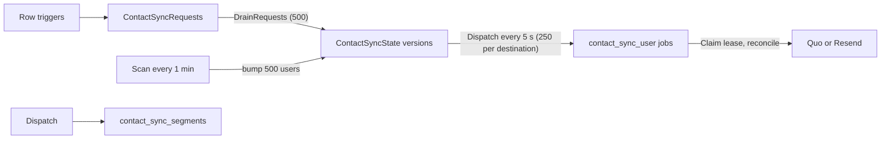

Contact sync keeps two outside CRMs in step with Yelo user data:

- **Quo** (OpenPhone) holds one contact per user, keyed by the user UUID. It's used for texting drivers and riders.
- **Resend** holds one contact per unique email, plus marketing segments built from Yelo rules.

Two engines exist side by side. The **legacy Quo worker** (`internal/service/quo`) is the original, Quo-only pipeline. The **shared engine** (`internal/service/contactsync`) handles any provider through a `Provider` interface. Each destination has a mode in `"ContactSyncProviders"` that decides which engine may write to it.

For the admin UI, see [Contact sync](/administration/contact-sync). For job schedules alongside other workers, see [Background jobs](/engineering/api/background-jobs). For env vars, see [Environment variables](/reference/environment-variables).

## Data touched

| Store | Object | Use |
| --- | --- | --- |
| Postgres | `"ContactSyncRequests"` | Append-only intent. `entity_kind` is `user`, `community`, or `school` |
| Postgres | `"ContactSyncProviders"` | One row per `(provider, account_key)`: `mode`, `schema_version`, `schema_checked_at`, `config_revision`, `blocked_reason`, `retry_at` |
| Postgres | `"ContactSyncState"` | Per user and destination: `desired_version`, `applied_version`, `force_remote_version`, `payload_hash`, `outcome`, lease, block fields, `observed_email_opt_out`, `ever_had_contact` |
| Postgres | `"ContactSyncIdentities"` | Remote identity per `sha256(identity_key)`. `stage` is `prepared`, `active`, `retiring`, or `retired` |
| Postgres | `"ContactSyncScanProgress"` | Cursor per scan mode |
| Postgres | `"ProviderRequestControl"` | Resend team-wide pacing and cooldown |
| Postgres | `"QuoSyncRequests"`, `"QuoSyncOutbox"`, `"QuoScanProgress"`, `"QuoRequestControl"` | Legacy Quo intent, coalesced outbox, scans, and pacing |
| Postgres | `"MarketingSegments"`, `"MarketingSegmentMembers"` | Segment definitions and last known Resend membership |
| Postgres | `"Users".quo_contact_id` | Quo contact ID mirror, read by the lead pipeline and dashboards |
| River | `river_job` | Queues listed under job schedules |
| Quo API | `/v1/contacts`, `/v1/contact-custom-fields` | Contact CRUD and custom field keys |
| Resend API | `/contacts`, `/contact-properties`, `/segments` | Contact CRUD, property schema, segments |

Enum values are listed in [Database enums](/reference/database/enums).

## Endpoints

All routes sit under the `/dashboard` group (Clerk auth plus dashboard scope). The scope middleware only admits admins to these paths, and each handler also rejects non-admins with **Platform admin required** (403).

| Method | Path | Auth | Handler and purpose |
| --- | --- | --- | --- |
| GET | `/dashboard/contact-sync` | Admin | `Handler.Status`. `ContactSyncStore.Status` snapshot. `Cache-Control: no-store` |
| GET | `/dashboard/contact-sync/segments` | Admin | `segmentHandler.List`. Fields, options, segments, `available` |
| POST | `/dashboard/contact-sync/segments` | Admin | `segmentHandler.Create`. Validates, then `SaveSegment` |
| PUT | `/dashboard/contact-sync/segments/{id}` | Admin | `segmentHandler.Update`. Rules and match mode only |
| DELETE | `/dashboard/contact-sync/segments/{id}` | Admin | `segmentHandler.Delete`. Marks `deleting` |
| POST | `/dashboard/contact-sync/segments/preview` | Admin | `segmentHandler.Preview`. Returns a match count |

Segment writes return **Enable Resend contact sync before managing segments** (400) when no Resend destination is in `generic` mode.

Operators change modes with the `cmd/contact-sync` CLI, not HTTP:

| Action | Effect |
| --- | --- |
| `--action=status` | Prints mode, schema version, block reason, pending, blocked, ineligible, and oldest pending age as JSON |
| `--action=pause` | `SetProviderMode(..., "paused")` and bumps `config_revision` |
| `--action=activate` | `contactsync.Activate`. Moves `paused` to `generic` |
| `--action=replay --user=UUID` | Bumps `desired_version` and `force_remote_version`, clears block fields |

Every action requires `--account` and `--provider=quo` or `--provider=resend`.

## Pipeline overview

### What enqueues work

`enqueue_contact_sync` (migration `000323`) inserts a `user` request when these columns change. `UPDATE` rows with no relevant change are ignored.

| Table | Columns or condition |
| --- | --- |
| `"Users"` | `first_name`, `last_name`, `email`, `phone_number`, `community_id`, `home_community_id`, `school_id`, `account_type`, `acquisition_source`, `created_timestamp`, `profile_completed`, `is_banned`, `is_test`, `is_deleted` |
| `"DriverApplications"` | `user_id`, `is_active`, `activated_at`, `license_status`, `stripe_status`, `payout_fleet_id` |
| `"Vehicles"` | `driver_id`, `application_status`, `application_submission_time` |
| `"Rides"` | Rider and driver, when a ride enters or leaves `complete` or `pending_rider_rating` with `cancel_phase IS NULL` |
| `"Communities"`, `"Schools"` | `name` update or delete. Inserts one `community` or `school` request |

`enqueue_contact_activity` (migration `000332`) adds a request when `last_pinged_driver`, `location_updated_at`, or `"DeviceTelemetry".updated_at` crosses a 5-minute epoch bucket. Worked example: pings at 12:03 and 12:04 share bucket `floor(epoch / 300)`, so only the first enqueues. A ping at 12:05 starts a new bucket and enqueues again.

### Draining and coalescing

`ContactSyncStore.DrainRequests(500)` runs in one transaction:

1. `expandContactEntityRequest` takes one `community` or `school` request. It appends a `user` request for up to 500 users whose `community_id` or `home_community_id` (or `school_id`) matches, and stores `expand_after_id` until the page is short.
2. `DrainContactSyncUserRequests` deletes up to 500 `user` requests and upserts one `"ContactSyncState"` row per user for every provider row. Existing rows get `desired_version + 1`.

The drain only runs when at least one `"ContactSyncProviders"` row exists. Paused and legacy destinations still accumulate versions, so nothing is lost when they turn on.

## Job schedules

Periodic jobs are registered in `internal/notify/queue/queue.go`. Contact sync jobs only exist when `cmd/api/main.go` builds a `contactsync.Service` (Quo key or Resend configured).

| Job kind | Schedule | Queue | Notes |
| --- | --- | --- | --- |
| `contact_sync_dispatch` | Every 5 s, run on start | `contact_sync_control` | Unique while active. 90 s timeout |
| `contact_sync_scan` | Every 1 min, run on start | `contact_sync_control` | Unique while active |
| `contact_sync_user` | Enqueued by dispatch | `contact_sync_quo` or `contact_sync_resend` | `MaxAttempts: 10`. Unique by provider, account, user. 90 s timeout |
| `contact_sync_segments` | Enqueued by every dispatch per Resend destination | `contact_sync_segments` | Unique by account. 90 s timeout |
| `quo_sync_outbox` | Every 5 s, unique per 4 s | `quo_control` | Legacy mode only |
| `quo_sync_batch` `backfill` | Every 1 min, unique per 45 s | `quo_control` | Legacy mode only |
| `quo_sync_batch` `reconcile` | Every 1 min, unique per 45 s | `quo_control` | Legacy mode only |
| `quo_sync_user` | Enqueued by outbox | `quo` | `MaxAttempts: 10`. Unique by `user_id`. 90 s timeout |

Queue workers per replica: `contact_sync_control` 1, `contact_sync_quo` 1, `contact_sync_resend` 4, `contact_sync_segments` 1, `quo` 1, `quo_control` 1. `Service.Queues()` only registers queues for destinations this replica has credentials for.

## Business rules

### Destination modes

| Mode | Legacy Quo worker | Shared engine |
| --- | --- | --- |
| `legacy` | Writes to Quo | Skips the destination. Versions accumulate |
| `paused` | `quo_sync_user` snoozes 1 min. Outbox and batch jobs no-op | Skips the destination |
| `generic` | `quo_sync_user` appends a `ContactSyncRequests` row instead of writing. `guardLegacyWrite` returns a 1-minute deferral | Owns all writes |

`Service.Initialize` inserts missing providers with their initial mode: `legacy` for Quo, `generic` for Resend. `ON CONFLICT DO NOTHING` means an existing row's mode is never overwritten by config.

### Activating Quo on the shared engine

`contactsync.Activate` enforces this order:

<Steps>
  <Step title="Pause first">
    The destination must be `paused`. Quo also requires `--compatible-revisions-only`, because an old Cloud Run revision could still run legacy writes.
  </Step>
  <Step title="Drain">
    No `"ContactSyncState"` row may hold a live lease. For Quo, `mode_changed_at` must be at least 120 seconds old and no `quo_sync_user`, `quo_sync_batch`, or `quo_sync_outbox` job may be `running`.
  </Step>
  <Step title="Import bindings">
    `bootstrapQuoBindings` pages 500 users with a `quo_contact_id`. Each gets an `active` identity keyed by user ID and a state row with `ever_had_contact = true` and a forced remote check.
  </Step>
  <Step title="Switch">
    One transaction sets `mode = 'generic'`, bumps `config_revision`, resets `schema_version` to 0, clears block fields, and deletes all scan progress for the destination.
  </Step>
</Steps>

On each dispatch while Quo is `generic`, `bridgeQuo` moves up to 500 `"QuoSyncRequests"` and 500 `"QuoSyncOutbox"` rows into `"ContactSyncRequests"`.

### Schema preparation

`Service.Prepare` runs from dispatch when `PreparationDue` is true. That requires `generic` mode, `retry_at` passed, and a stale schema: version mismatch, `schema_checked_at` older than 24 hours, or a block reason.

- **Quo** (`SchemaVersion` 1) loads `GET /v1/contact-custom-fields`. Both `Status` and `Application` must exist. The key map is cached for 1 hour.
- **Resend** (`SchemaVersion` 2) lists `/contact-properties` 100 at a time and creates any missing property. An existing property with the wrong type fails as `provider_configuration`.

Failure pauses the provider with `blocked_reason = 'schema_unavailable'` for 5 minutes. Success calls `SetProviderReady`, which bumps `config_revision`. `Sync` refuses to run until `SchemaReady` is true, returning a 1-minute retry.

### Dispatch and scans

`Service.Dispatch` lists up to 250 dispatchable users per destination with `ListDispatchableFor`. A row is dispatchable when all of these hold:

- The provider is `generic`, `schema_version > 0`, and `blocked_reason IS NULL`.
- `desired_version > applied_version`.
- No live lease.
- It isn't blocked at the current `desired_version` and `config_revision`.
- No active `contact_sync_user` job exists for it.

Rows are ordered by `first_pending_at, user_id`.

`contact_sync_scan` calls `ContactSyncStore.Scan` for `reconcile` and `orphans` on each `generic` destination. Each call processes one page of 500:

| Mode | Source rows | After the last page |
| --- | --- | --- |
| `reconcile` | Every `"Users"` row, including deleted and test users | Wait `CONTACT_SYNC_RECONCILE_INTERVAL` (default 24 h) |
| `orphans` | State rows whose user is missing, deleted, test, or has a `retiring` identity | Same interval |

Each page bumps `desired_version` and sets `force_remote_version = desired_version`. That forces a remote read even when the local hash hasn't changed.

Worked example: with 60,000 users, a reconcile sweep takes 120 pages. At one page per minute, the sweep takes about 2 hours. Each user then needs at least one Resend `GET`. At the 200 ms contact lane, 60,000 reads need at least 12,000 seconds, about 3.3 hours.

### One sync run

`Service.Sync` for one user and destination:

<Steps>
  <Step title="Claim a lease">
    `Claim` sets a random token and `lease_until = now() + 120 s`. If a previous token was still set, which means a crashed run, it forces a remote check. A goroutine renews the lease every 30 s. The run's context times out after 60 s.
  </Step>
  <Step title="Project and retire">
    The run loads `ContactProfile` through `ReadContactProfiles` and builds a `Target`. Every stored identity whose key differs from the new key is retired, which deletes the remote contact after an ownership check.
  </Step>
  <Step title="Eligibility">
    Deleted or missing users complete as `removed`. Test users complete as `ineligible`. Resend also marks `missing_email` and `invalid_email` as `ineligible`.
  </Step>
  <Step title="Ownership">
    For Resend, `ListContactEmailOwners` must return exactly this user among non-deleted, non-test users with the same `lower(btrim(email))`. Otherwise the run fails with `identity_conflict`.
  </Step>
  <Step title="Skip or reconcile">
    If the identity is `active`, the hash and schema match, and `force_remote_version` is at most `applied_version`, the run completes without any API call. Otherwise the provider's `Reconcile` runs.
  </Step>
  <Step title="Complete">
    `Complete` sets `applied_version` to the claimed `desired_version`, stores the hash, sets `outcome`, and clears the lease. It only succeeds while the lease is still live.
  </Step>
</Steps>

Before every remote mutation, the provider calls a `WriteGuard`. The guard re-reads the provider mode, which must still be `generic`. It re-projects the profile and fails with `source_changed` (retry in 1 s) if the key, hash, or eligibility moved. It rechecks email ownership. Then it journals `create_attempted`, the remote ID, and any observed opt-out under a `FOR UPDATE` lock on the lease row.

### Retries and blocking

`userWorker.Work` turns a `SyncError` with `RetryAfter` into `river.JobSnooze(min(RetryAfter, 24h) + (attempt % 5) × 100 ms)`. Other errors use River's default retry.

| Failure | Result |
| --- | --- |
| `rate_limited` | Snooze for the provider's `Retry-After` |
| `schema_unavailable`, `provider_configuration` (destination missing) | Snooze 1 min |
| `source_changed` | Snooze 1 s, or 1 min when the mode changed |
| `provider_configuration` (401 or 403) | Provider paused 5 min, lease released, River retries |
| `invalid_contact` (400 or 422), `identity_conflict`, `subscription_review_required` | Blocked immediately |
| Any other error on the last attempt (`attempt >= 10`) | Blocked as `retry_exhausted` |

A blocked row records `blocked_version`, `blocked_fingerprint` (the target hash), and `blocked_config_revision`. It becomes dispatchable again when `desired_version` or `config_revision` changes. An `invalid_contact` block with the same hash and config revision re-blocks without calling the provider.

### Status math

`ContactSyncStore.Status` counts non-deleted, non-test users. `progress_percent` is only set in `generic` mode:

`progress_percent = 100 × (synced + skipped) / total_users`

`synced` means `applied_version = desired_version` and `outcome = 'synced'`. `skipped` means the same with `outcome` `ineligible` or `removed`. Worked example: 10,000 users, 7,400 synced, 1,100 skipped, 900 pending, and 600 never scanned gives `100 × 8,500 / 10,000 = 85%`. `legacy_linked` counts users with a non-empty `quo_contact_id` and is only filled for Quo.

### Rate limits

Both gates live in Postgres, so every replica shares one budget per credential. Neither holds a transaction while waiting.

| Gate | Interval | On 429 | Fail-fast |
| --- | --- | --- | --- |
| Quo `PostgresGate` (`"QuoRequestControl"`, keyed by SHA-256 of the API key) | `QUO_REQUEST_INTERVAL_MS`, default 200 ms, minimum 125 ms. `QUO_REQUEST_INTERVAL_SECONDS` is a legacy fallback | Cooldown for `Retry-After`, or 1 min when absent | Wait over 15 s returns `RateLimitedError` |
| Resend `PostgresGate` (`"ProviderRequestControl"`, keyed by `RESEND_ACCOUNT_KEY`) | `RESEND_REQUEST_INTERVAL` 125 ms for all traffic. Contact sync also waits on `RESEND_CONTACT_REQUEST_INTERVAL` 200 ms | Cooldown for `Retry-After` seconds (capped at 24 h), default 1 s | Wait over 15 s returns a synthetic 429 |

Transactional email in `internal/service/service.go` shares the Resend gate without the background lane. Emails can use up to 8 requests per second, while contact sync is held to 5.

## Quo contact mapping

`buildContactRequest` and `buildUpdateRequest` in `internal/service/quo/quo.go` produce the payload for both engines.

| Quo field | Source |
| --- | --- |
| `defaultFields.firstName`, `lastName` | User first and last name |
| `defaultFields.company` | `School (Community)` when the user has a school, otherwise the community name |
| `defaultFields.role` | `driver` or `rider`, from `determineRole` |
| `defaultFields.emails[primary]` | Trimmed email, omitted when empty |
| `defaultFields.phoneNumbers[primary]` | Trimmed phone, omitted when empty |
| `externalId` | User UUID (create only) |
| `source` | `yelo` (create only) |
| Custom `Status` | `["Active"]` or `["Inactive"]` from `is_active`. Drivers only |
| Custom `Application` | Outstanding items from `Stripe`, `License`, `Vehicle` that aren't `complete`. Drivers only |

`determineRole` returns `driver` when the user has an application and license or Stripe status is `pending`, `complete`, or `failed`, or the vehicle isn't `not_applied`. Everyone else is `rider`.

The shared engine's `QuoProvider` differs from the legacy writer:

- It finds contacts by stored remote ID first, then by `externalId`. A contact whose `externalId` isn't the user UUID fails as `identity_conflict`.
- `mergeRemote` keeps custom fields not owned by Yelo, non-primary emails and phones, and the remote `externalId`, `source`, and `sourceUrl`. Quo PATCH replaces collections, so the legacy writer drops those.
- It deletes contacts for deleted users and skips test users. The legacy writer never deletes and doesn't filter test users.
- Successful writes mirror the remote ID into `"Users".quo_contact_id`. Retirement clears it when it still matches.

## Legacy Quo worker

Triggers from migration `000292` insert into `"QuoSyncRequests"`:

- `"Users"`: insert, or update of `first_name`, `last_name`, `email`, `phone_number`, `community_id`, `school_id`, `is_deleted`.
- `"DriverApplications"`: `is_active`, `license_status`, `stripe_status`, or delete.
- `"Vehicles"`: `driver_id`, `application_status`, or delete.

`outboxWorker` runs every 5 s in `legacy` mode only. In one transaction it:

1. Clears `job_id` on outbox rows whose job finished. Discarded or cancelled jobs set `blocked_version` to that job's version.
2. Clears `job_id` on rows whose job no longer exists.
3. Drains up to 500 requests. It coalesces them per user, adding the request count to `version` and keeping the earliest `first_requested_at`.
4. Enqueues `quo_sync_user` for up to 500 unlinked, unblocked rows and links the job IDs.

`quo_sync_user` then calls `syncUser`:

- It ensures the custom fields and loads the record with up to 3 attempts (1 s to 5 s backoff).
- It looks up the contact by `externalId` and heals `quo_contact_id` if it differs.
- It skips the write when `contactMatches`. Otherwise it creates or PATCHes the contact.
- On success, it deletes the outbox row only if `version` still equals the job's version.
- Permanent 4xx errors (not 401, 403, or 429) cancel the job. Rate limits snooze.

`batchWorker` scans 500 users per run:

| Mode | Users | Delay after a short page |
| --- | --- | --- |
| `backfill` | `quo_contact_id IS NULL` and not deleted | 10 min |
| `reconcile` | `quo_contact_id IS NOT NULL` and not deleted | 24 h |

A full page sets the delay to 0. `backfill` also logs pending, blocked, and oldest-pending seconds as `Quo sync backlog`.

## Resend contact mapping

`ResendProvider.Target` sends a lowercased, trimmed email as the identity key. It also sends `first_name`, `last_name`, and 19 properties. `ride_count` and `drive_count` are `number`. Everything else is `string`.

| Property | Value |
| --- | --- |
| `yelo_user_id` | User UUID |
| `yelo_account_type` | `student` or `community` |
| `yelo_account_status` | `banned` when `is_banned`, else `active` |
| `yelo_joined_at` | `created_timestamp`, RFC 3339 UTC |
| `yelo_community_id`, `yelo_community_name` | Current community, empty when unset |
| `yelo_home_community_id`, `yelo_home_community_name` | Home community |
| `yelo_school_id`, `yelo_school_name` | School |
| `yelo_acquisition_source` | `acquisition_source`, or `unknown` |
| `yelo_driver_status` | `active` if active, `inactive` if ever activated, `applicant` if any license, Stripe, payout fleet, or vehicle activity, else `none` |
| `yelo_driver_joined_at` | `DriverApplications.activated_at` |
| `yelo_ride_count`, `yelo_last_ride_at` | Rides as rider in `complete` or `pending_rider_rating` with no `cancel_phase` |
| `yelo_drive_count`, `yelo_last_drive_at` | Same, as driver |
| `yelo_last_seen_at` | `GREATEST(last_pinged_driver, location_updated_at, DeviceTelemetry.updated_at, created_timestamp)` |
| `yelo_profile_completed` | `"true"` or `"false"` |

An email is `invalid_email` unless `mail.ParseAddress` returns exactly the same string. For example, `Jo <jo@x.edu>` fails.

### Subscription safety

`UpdateRequest` has no `unsubscribed` or `email` field, so updates never change consent. Creation follows these rules:

- `PrepareIdentity` marks a new identity `create_unsubscribed` when the user has an observed opt-out or `ever_had_contact`.
- `ResendProvider.create` refuses with `subscription_review_required` when the identity is known, was already attempted, or is `create_unsubscribed`, unless an opt-out was observed.
- With an observed opt-out, the contact is created with `unsubscribed: true`.
- A definitive first-create rejection (400, 401, 403, 422, or 429) calls `RejectIdentityCreate`. That clears `create_attempted`, so the next try isn't treated as an uncertain create.

Worked example: a subscribed user changes email from `a@x.edu` to `b@x.edu`. The run retires the `a@x.edu` contact, then prepares `b@x.edu` with `create_unsubscribed = true` because `ever_had_contact` is true. No opt-out was observed, so the run blocks with `subscription_review_required` instead of creating a subscribed contact.

## Marketing segments

### Definitions and validation

`ValidateSegment` in `segment_filters.go` enforces a name of 1 to 100 bytes, `match_mode` of `all` or `any`, and 1 to 20 filters. `SegmentFields` derives the allowlist from the Resend properties:

| Field type | Fields | Operators |
| --- | --- | --- |
| `enum` | `account_type`, `account_status`, `driver_status`, `profile_completed` | `eq`, `neq` |
| `number` | `ride_count`, `drive_count` | `eq`, `neq`, `gt`, `gte`, `lt`, `lte` |
| `date` | Keys ending in `_at` | `before`, `after`, `within_days`, `older_days`, `is_set`, `is_not_set` |
| `string` | All others | `eq`, `neq`, `contains`, `is_set`, `is_not_set` |

Values must be 1 to 256 bytes, except `is_set` and `is_not_set`, which take none. Numbers and day counts must be whole numbers from 0 to 365000. Relative days must be at least 1. `before` and `after` need an RFC 3339 timestamp. `List` fills options for community, school, and acquisition source from the database.

`createSegment` takes an advisory lock on `marketing-segments:<account>` and refuses the 21st segment with **Maximum 20 segments per account**. Names are unique per account (`23505` becomes a 400). Updates match on `name`, so renames fail with **Segment not found or its name changed**. Each save bumps `revision` and sets `next_due_at = now()`.

### Matching

`MatchesSegment` evaluates against `resendValues` built from the live database profile, not from Resend.

- An empty value fails every operator except `is_not_set`, including `neq`.
- String `eq`, `neq`, and `contains` ignore case.
- `within_days N` matches `cutoff ≤ t ≤ now`, where `cutoff = now − N days`. `older_days N` matches `t < cutoff`.

A user is a candidate only when eligible for Resend, their email is unique among all loaded profiles, and the rules match. They become a desired member only if they also have an `active` Resend identity whose email equals their current email.

### Segment sync loop

`SyncSegments` takes `pg_try_advisory_xact_lock("segment-worker:<account>")` and exits if another worker holds it. It processes only the earliest due segment per job:

<Steps>
  <Step title="Ensure the remote segment">
    New segments are created in Resend as `<name> [yelo:<id>]`. `create_attempted` is journaled before the request. If a create response was lost, the worker lists all segments and adopts the one exact name match. Zero matches fail as `segment_creation_review_required`. Two or more fail as `ambiguous_segment_creation`.
  </Step>
  <Step title="Delete if requested">
    For `deleting` segments, it calls `DELETE /segments/{id}` (404 counts as success). It then deletes the row only if `revision` is unchanged. Contacts stay in Resend.
  </Step>
  <Step title="Audit membership">
    If `remote_checked_at` is null or older than 24 hours, it lists all remote members and replaces `"MarketingSegmentMembers"`.
  </Step>
  <Step title="Diff and apply">
    It loads every profile and active identity, diffs against local members, orders removals before additions, and applies at most 50 changes. Each change re-checks the segment revision and that member's current profile.
  </Step>
  <Step title="Finish">
    `FinishSegment` stores counts and schedules `next_due_at`: now if anything is pending, 1 minute when clean, 5 minutes after an error.
  </Step>
</Steps>

`pending_count = changes − applied + (matched − desired)`. The second term counts matching users who don't have a Resend contact yet. Worked example: 120 users match, 100 have Resend contacts, 130 changes are needed, and 50 are applied. Pending is `130 − 50 + (120 − 100) = 100`, so the segment runs again on the next dispatch.

Membership errors:

| Error | Handling |
| --- | --- |
| 404 on removal and the contact no longer exists | Treated as applied |
| 404 on addition and the contact no longer exists | Bumps that user's `"ContactSyncState"` if `outcome = 'synced'`, then `source_changed` |
| `source_changed` | Deferred silently. `next_due_at` is unchanged, so it retries on the next dispatch |
| Any other error | Clears `remote_checked_at` to force an audit, then `error_code = 'sync_failed'` or the `SyncError` kind |

## Where this lives in code

| Concern | File | Function or type |
| --- | --- | --- |
| Engine and run | `internal/service/contactsync/service.go` | `Service.Sync`, `syncRun`, `failed` |
| Jobs and dispatch | `internal/service/contactsync/jobs.go` | `Dispatch`, `scanWorker`, `userWorker`, `bridgeQuo` |
| Queues | `internal/service/contactsync/queues.go` | `Service.Queues` |
| Activation | `internal/service/contactsync/admin.go` | `Activate`, `checkDrained`, `bootstrapQuoBindings` |
| Provider interface | `internal/service/contactsync/provider.go` | `Provider`, `WriteGuard`, `SyncError`, `targetHash` |
| Quo adapter | `internal/service/contactsync/quo.go` | `QuoProvider`, `mergeRemote`, `classifyQuo` |
| Resend adapter | `internal/service/contactsync/resend.go` | `ResendProvider`, `resendValues`, `create` |
| Segments | `internal/service/contactsync/segments.go` | `SyncSegments`, `segmentTargets`, `applySegmentChanges` |
| Segment rules | `internal/service/contactsync/segment_filters.go` | `SegmentFields`, `ValidateSegment`, `MatchesSegment` |
| State store | `internal/data/repository/contact_sync.go` | `Claim`, `Complete`, `Block`, `Scan`, `DrainRequests` |
| Status and segment SQL | `internal/data/repository/contact_sync_status.go`, `marketing_segments.go` | `Status`, `SaveSegment`, `FinishSegment` |
| Profile projection SQL | `internal/data/repository/queries/contact_profiles.sql` | `ReadContactProfiles`, `ListContactEmailOwners` |
| Legacy Quo | `internal/service/quo/quo.go`, `jobs.go`, `contact_mode.go` | `syncUser`, `outboxWorker`, `batchWorker`, `guardLegacyWrite` |
| Quo client and gate | `internal/data/quo/quo.go`, `gate.go` | `Client.do`, `PostgresGate.Wait` |
| Resend client and gate | `internal/data/resend/client.go`, `gate.go`, `segments.go` | `doGuarded`, `PostgresGate.Wait` |
| HTTP | `internal/server/http/dashboard/contactsync/routes.go`, `segments.go` | `RegisterRoutes`, `RegisterSegmentRoutes` |
| CLI | `cmd/contact-sync/main.go` | `execute` |
| Wiring | `cmd/api/main.go`, `internal/notify/queue/queue.go` | Destinations, periodic jobs |

## Gotchas and edge cases

- **Email changes block instead of creating.** A user who has had a Resend contact and has no observed opt-out is blocked with `subscription_review_required` when their email changes (`service.go:339-347`, `resend.go:264`). Someone must review and replay each one; nothing recreates the contact automatically.
- **Daily revision bumps unblock everything.** `SetProviderReady` bumps `config_revision` about every 24 hours, and each reconcile page bumps `desired_version`. Blocked rows retry daily, not permanently.
- **Segment runs scan every user.** Each run calls `MarketingProfiles`, which runs `ReadContactProfiles` with ride-count laterals for all non-deleted, non-test users. It repeats every dispatch (about 5 s) while any segment has pending changes.
- **Segment throughput is capped.** One segment and at most 50 membership changes per job. A 1,000-member initial load takes at least 20 runs.
- **Rows accumulate for every provider.** `DrainContactSyncUserRequests` cross-joins every provider row, including `legacy` Quo. State rows grow even while the legacy worker handles Quo.
- **Legacy Quo vehicle status is nondeterministic.** `GetQuoSyncUser` picks a vehicle with `LIMIT 1` and no `ORDER BY`. The shared engine uses the latest submission.
- **Legacy PATCH drops fields.** The legacy writer sends only Yelo-owned custom fields and primary email or phone. Quo PATCH replaces collections, so other custom fields and secondary numbers are lost.
- **Legacy create and update disagree on `Application`.** Create omits it when nothing is outstanding. Update always sends it, so a fully complete driver's first reconcile can PATCH.
- **Scan pages include deleted and test users.** The `reconcile` scan pages every `"Users"` row, and each one costs a claim before it completes as `removed` or `ineligible`.
- **`MarketingAccount` picks one account.** Segment endpoints use the alphabetically first Resend account in `generic` mode.
