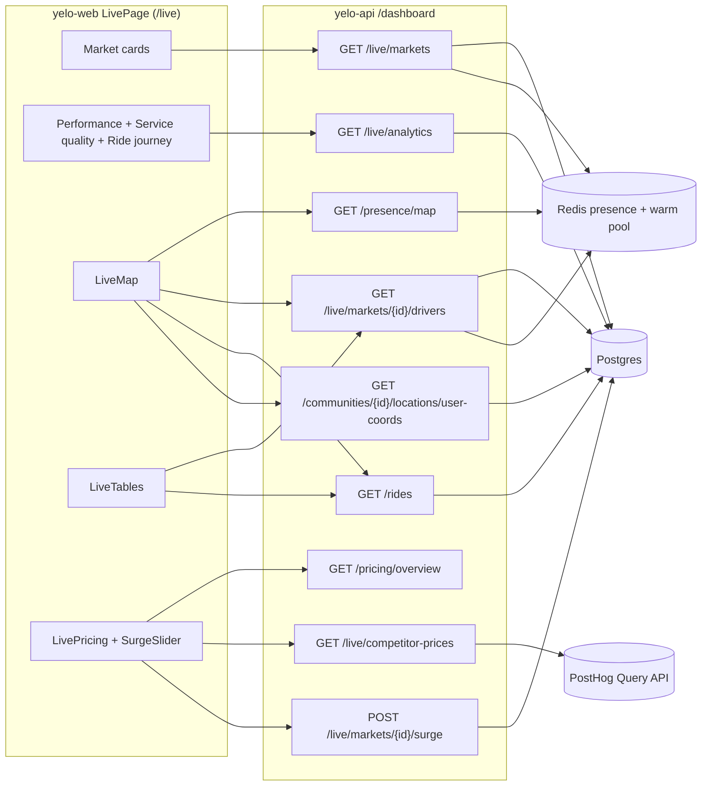
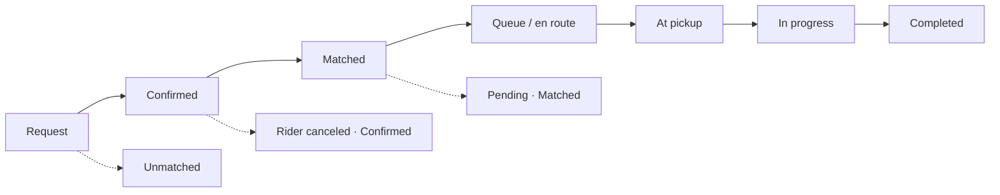
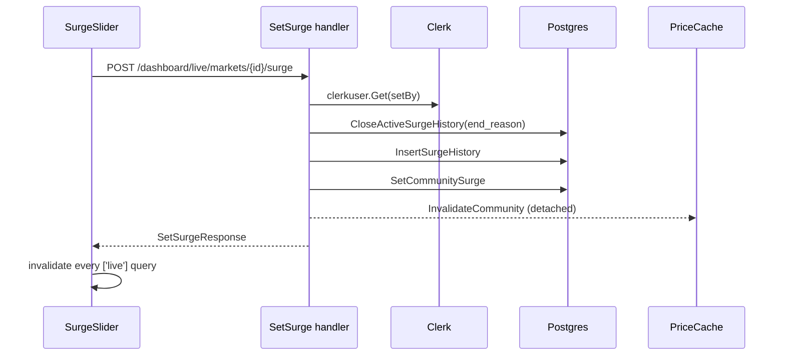

**Live** is the admin dashboard's real-time market view. It replaced the separate Supply & Demand, Presence, and Driver Ops pages. The API routes live under `/dashboard/live`, and the web page is `LivePage` at `/live` in `yelo-web`. For what operators see, read [Live operations](/dashboard/live).

This page covers the whole feature across both repos. The exact KPI SQL and delta math also appear in [Dashboard analytics internals](/engineering/domains/dashboard-analytics#live-operations), which covers every dashboard analytics endpoint side by side.

## Architecture

The route package is still named `supply_demand` (`internal/server/http/dashboard/supply_demand/`), and the service is still `dashboard.SupplyDemandService`. Only the mount point changed: `registerDashboardRoutes` in `internal/server/http/router.go` mounts it at `/dashboard/live` with the OpenAPI tag **Dashboard Live**. There is no `/dashboard/supply-demand` prefix anymore.

## Authorization

Every `/dashboard/*` request runs Clerk auth, then `getDashboardScopeMiddleware` (`internal/server/http/dashboard_scope.go`).

- `admin` passes every path.
- `intern` only reaches `/dashboard/rides`, `/dashboard/leads/drivers`, a few `/dashboard/community/{own}/...` reads, `/dashboard/communities/{own}/...` resources, and `/dashboard/{own-community}/...` operations. `/dashboard/live/*` matches none of these.
- `fleet` only reaches fleet-scoped paths. `/dashboard/live/*` matches none of these.

So every `/dashboard/live` route is admin-only in practice. A non-admin gets **401** from the middleware before the handler runs.

The handlers still carry their own scoping, written before the middleware existed:

| Helper | Used by | Admin behavior | Non-admin behavior (unreachable today) |
| --- | --- | --- | --- |
| `resolveCommunityScope` | `analytics`, `competitor-prices`, `kpis`, `markets` | `community_id` query param, or `nil` (all communities) when it's empty | Pinned to the claim's `CommunityID`, 403 if missing |
| `resolveCommunityID` | Every `/markets/{id}/...` route | Path `{id}`, 400 if empty | Ignores the path and uses the claim's `CommunityID` |
| `requireAdmin` | `/drivers/{id}/ping`, `/riders/{id}/ping` | Passes | 403 **Admin role required** |

The Live web route is also admin-only: `App.tsx` registers `/live` with `allowedRoles` of `admin`, and `RootRoute` sends admins to `/live`. See [Dashboard roles and access](/administration/dashboard-roles).

## Endpoint reference

All responses use the standard envelope, `{"success": true, "data": ...}`. Paths below are relative to `/dashboard/live`.

| Method | Path | Operation ID | Params | Response `data` | Web caller |
| --- | --- | --- | --- | --- | --- |
| GET | `/analytics` | `dashboard.GetLiveAnalytics` | `community_id`, `period` = `24h` (default), `7d`, `30d`, `all` | `LiveAnalytics` | `useLiveData('analytics')` |
| GET | `/competitor-prices` | `dashboard.GetLiveCompetitorPrices` | `community_id`, `period` | `LiveCompetitorPrices` | `LivePricing` |
| GET | `/kpis` | `dashboard.GetSupplyDemandKPIs` | `community_id` | `SupplyDemandKPIs` (24 h vs. prior 24 h) | None |
| GET | `/markets` | `dashboard.GetMarketSummaries` | `community_id` (optional) | `{ markets: MarketSummary[] }` | `useLiveMarkets` |
| GET | `/markets/{id}/drivers` | `dashboard.GetMarketDrivers` | none | `{ drivers: MarketDriver[] }` | `useLiveDrivers` |
| GET | `/markets/{id}/rides` | `dashboard.GetMarketRides` | `older=true` | `{ rides: MarketRide[], has_older }` | None |
| POST | `/markets/{id}/surge` | `dashboard.SetSurge` | Body `SetSurgeRequest` | `SetSurgeResponse` | `useSetSurge` |
| GET | `/markets/{id}/surge-history` | `dashboard.GetSurgeHistory` | `limit` (1 to 100, default 20), `offset` | `{ items, total, has_more }` | None (`useSurgeHistory` exists but no component calls it) |
| POST | `/markets/{id}/notify` | `dashboard.NotifyMarket` | Body `MarketNotifyRequest` | `{ sent_to: 1 }` | None routed |
| POST | `/drivers/{id}/ping` | `dashboard.PingDriver` | Body `{ title, message }` | `{ sent }` | None routed |
| POST | `/riders/{id}/ping` | `dashboard.PingRider` | Body `{ title, message }` | `{ sent }` | None routed |

The page also reads these endpoints outside `/dashboard/live`:

| Method | Path | Used for | Notes |
| --- | --- | --- | --- |
| GET | `/dashboard/presence/map?community_id=` | Online and warm markers | `PresenceDashboardService.GetPresenceMap` |
| GET | `/dashboard/rides?status=live&include_routes=true&limit=200` | Live rides and their quoted routes | `include_routes` is honored for admins only and caps `limit` at 200 |
| GET | `/dashboard/rides?status=<filter>&recent_only=true&limit=50&offset=` | **Completed · 24h**, **Cancelled · 24h**, **All rides · 24h** | `recent_only` restricts to `request_time` in the last 24 hours |
| GET | `/dashboard/communities/{id}/locations/user-coords` | Last-known user locations and rider fallback positions | Admin-only in the handler |
| GET | `/dashboard/communities/{id}/zones` | Zone polygons on the map | |
| GET | `/dashboard/pricing/overview` | Pricing config table and **Avg 3 mi** quotes | |
| GET | `/dashboard/communities` | Market navigation catalog | `is_active && !rides_disabled` |

### `LiveAnalytics` shape

| Field | Type | Meaning |
| --- | --- | --- |
| `start`, `end` | timestamp | Window bounds in UTC |
| `kpis` | `SupplyDemandKPIs` | `user_signups`, `driver_signups`, `completes`, `gmv`, `incompletes`, each `{ value, delta, percentage_change }` |
| `completion_rate` | `KPIValue` | `completed / requests × 100`, compared with the previous window |
| `requests`, `completed`, `unmatched`, `cancelled_by_rider`, `cancelled_by_driver`, `failed_after_pickup` | int | Cohort counts |
| `match_seconds`, `pickup_seconds`, `wait_seconds` | float or `null` | Averages. `null` when no ride qualifies. |
| `match_min_seconds` … `wait_max_seconds` | float or `null` | Min and max for each timing |
| `average_fare` | float or `null` | Average completed fare |
| `flow` | `{ source, target, value }[]` | Ride journey sankey links |
| `comparison_available` | bool | False for `period=all` |

### `MarketSummary` shape

| Field | Source |
| --- | --- |
| `id`, `name`, `surge_multiplier`, `surge_expires_at`, `time_zone` | `ListMarketSummaries` on `Communities` |
| `active_rides`, `unmatched_requests` | `ListMarketSummaries` sub-queries |
| `activity_score` | `drivers_online + active_rides`, computed from the SQL session count before presence overwrites `drivers_online` |
| `market_status`, `operating_windows`, `limited_hours_enabled`, `next_operating_window`, `bounding_box` | `Community.GetByID`, the same path the rider feed uses |
| `drivers_online`, `riders_online`, `presence_available` | Redis presence, see [Market cards](#market-cards) |

### `MarketDriver` shape

`id`, `first_name`, `last_name`, `phone`, `photo_url`, `latitude`, `longitude`, `fleet_name`, `vehicle_type`, `tags`, `rides_today`, `is_online`, `status` (`online`, `warm`, `offline`), `last_heartbeat`, `session_end_time`, and `decline_reasons` (`{ ride_id, reason, created_at }[]`). `decline_reasons` is always an array, never `null`.

## Market cards

`GetMarketSummaries` (`internal/service/dashboard/supply_demand.go`) runs `ListMarketSummaries` (`internal/data/repository/queries/supply_demand.sql`) for every `Communities` row with `is_active` and not `rides_disabled`. Then, for each market, with at most six goroutines in flight, it:

1. Calls `Community.GetByID` for market status, operating windows, time zone, and bounding box. On error the market falls back to `OFF_PEAK` with no windows.
2. Runs `populateLivePresence`.
3. Re-sorts markets by `active_rides` descending, then `LIVE` before `OFF_PEAK`, then `drivers_online` descending, then name.

`populateLivePresence` replaces the SQL open-session count with live presence:

| Output | Redis read |
| --- | --- |
| `drivers_online` | `ZRANGEBYSCORE community:drivers:{id}` over the last 120 seconds, then `HMGET presence:{driverId}` for `lat` and `lng`. A driver counts when the coordinates fall inside the community bounding box padded by 10 km (`nearLiveMarket`), or when the coordinates are missing or unparseable. |
| `riders_online` | `ZCOUNT community:online:{id}` over the last 120 seconds, minus the driver member count, floored at 0 |
| `presence_available` | True only when every Redis read succeeded |

When Redis is disabled or any read fails, the market keeps `drivers_online: 0`, `riders_online: null`, and `presence_available: false`. The web card then shows **—** for drivers online. For how the presence keys are written, see [Heartbeat and presence](/engineering/location/heartbeat-and-presence).

`active_rides` counts uncanceled rides in `confirmed`, `queued`, `driver_en_route`, `driver_waiting`, or `in_progress`, with no time bound. `unmatched_requests` is returned but not displayed.

## Performance and service quality

`GetLiveAnalytics` (`internal/service/dashboard/live.go`) resolves the window from `period`. `24h`, `7d`, and `30d` are rolling windows ending now. `all` starts at 2020-01-01 UTC. Any other value returns 400. For bounded periods it also reads the previous window of the same length.

| Read | Query | Purpose |
| --- | --- | --- |
| Ride cohorts | `GetLiveRideCohorts` | Counts, timings, fares, and sankey links |
| Signup and GMV counters | `GetSupplyDemandKPIs` | `user_signups`, `driver_signups`, `gmv`, `incompletes` |

`GetLiveRideCohorts` groups rides with `request_time` in `[start, end)`, in communities that are not `is_test` and not `rides_disabled`. The group key is `status`, `cancel_phase`, `cancel_user`, and four booleans: whether `confirm_time`, `match_time`, `at_pickup_time`, and `pickup_time` are set. Each group row carries sums, counts, mins, and maxes for three intervals:

| Metric | Interval | Row qualifies when |
| --- | --- | --- |
| **TTM** (`match_*`) | `match_time - confirm_time` | `match_time >= confirm_time` |
| **TTP** (`pickup_*`) | `pickup_time - match_time` | `pickup_time >= match_time` |
| **Wait** (`wait_*`) | `pickup_time - confirm_time` | Both checks above pass |

`aggregateLiveCohorts` (`internal/data/repository/live.go`) folds the groups into one `LiveAnalytics`:

- `requests` sums every group, including unconfirmed `requested` rides.
- `completed` is `complete` or `pending_rider_rating` with no `cancel_phase`.
- Canceled groups add to `cancelled_by_rider` or `cancelled_by_driver` by `cancel_user`. System cancels only appear in `flow`. A canceled group with `pickup_time` also adds to `failed_after_pickup`.
- `unmatched` is `no_drivers_available` without a `cancel_phase`.
- Averages divide the summed seconds by the qualifying count. `mergeLiveRange` keeps the smallest min and largest max across groups.
- `average_fare` is the sum of `COALESCE(discounted_price, price, 0)` for completed rides divided by `completed`.

The service then builds `kpis`. It uses the `GetSupplyDemandKPIs` values for signups, GMV, and incompletes, but replaces `completes` with the cohort `completed`, so the **Completed rides** card and the sankey agree. `computeKPIValue` sets `percentage_change` to 0 when the previous value is 0. The web card hides the percentage when `value == delta`.

The service-quality issue counts link to `/rides?tab=issues&community={id}&range=...`. The page maps `24h`, `7d`, `30d`, and `all` to `last_24_hours`, `last_7_days`, `last_30_days`, and `all_time`. The API accepts the last two ranges on the community KPI endpoints (`GetKPIsRequest.Validate` in `internal/server/http/community/requests/get_kpis.go`, and `calculateTimeRanges` in `internal/service/dashboard/dashboard.go`).

### Ride journey

Each cohort walks the stage list as far as its timestamps allow:

`liveCohortPath` appends a stage when any later timestamp is set, so a ride with `pickup_time` but no `at_pickup_time` still passes through **At pickup**. The terminal node is one of:

- `Completed`
- `Unmatched` for `no_drivers_available`
- `<Rider|Driver|System> canceled · <last stage>`
- `Pending · <last stage>` for anything still open

`Unmatched` attaches to the cohort's last stage, which is usually `Request` or `Confirmed`. Links are summed per `(source, target)` pair and sorted.

On the web, `rideJourneyLayout` (`src/components/live/rideJourneyLayout.ts`) keeps only links reachable from the chosen start (`Request`, `Confirmed` by default, `Matched`, or `In progress`). It lays stages out in columns 145 px apart and stacks terminal exits below the column where they branch. Colors come from `journeyColor`.

## Competitor quotes

`GetLiveCompetitorPrices` (`internal/service/dashboard/live.go`) accepts the same periods and delegates to `liveQuoteClient` (`internal/service/dashboard/live_pricing.go`). The client sends a HogQL query to `POST {POSTHOG_QUERY_HOST}/api/projects/{POSTHOG_PROJECT_ID}/query/` with a bearer `POSTHOG_PERSONAL_API_KEY`.

The query reads `ride_aggregator_prices_loaded` events in the window, scoped by `properties.community_id` and excluding `properties.is_test`. It explodes `properties.options` and keeps UberX (`provider = 'uber'`, `name = 'UberX'`) and Lyft Standard (`provider = 'lyft'`, `key = 'standard'`) options that have a positive `price_value`, `needs_connect = false`, and an empty `error_kind`. It returns one row per provider with the average fare, sample count, and last timestamp. The mobile app emits these events in `lib/analytics/events/rideAggregator.ts` when the rideshare price aggregator experiment loads quotes. See [Widgets, experiments, and client toggles](/engineering/mobile/widgets-and-experiments#experiments).

| `status` | When | Cached |
| --- | --- | --- |
| `not_configured` | Key or project ID empty, project ID not numeric, or host not an `https` URL | No |
| `unavailable` | Network error, non-200, undecodable body, or a row without four columns | No |
| `ready` | Parsed | 5 minutes, keyed by scope and window length in hours. The cache clears when it reaches 512 entries. |

The HTTP client times out after 12 seconds and the response body is capped at 1 MiB. The endpoint always returns 200 for a valid period.

## Drivers table and map

### Market drivers

`GetMarketDrivers` computes today's start at local midnight in the community's time zone, falling back to UTC. `ListMarketDrivers` returns users in the market with an active driver application whose latest session is open, ended within 7 days, or whose `last_pinged_driver` is within 7 days. It includes:

- `photo_url`: the application portrait thumbnail, else the full portrait.
- `latitude`, `longitude`: the stored `Users` coordinates, used as the last-known position.
- `fleet_name`: every active `FleetDrivers` membership, comma-joined.
- `tags`: user tags, with `EDU` prepended for student accounts.
- `rides_today`: completed or `pending_rider_rating` rides requested since today's start.

The service enriches each row from Redis:

1. `online` if the driver is in `community:drivers:{id}` within 120 seconds, `warm` if in the activation warm pool within 60 minutes (`warmPoolMaxAge`), else `offline`.
2. Online and warm drivers take `last_heartbeat` from `presence:{id}.ts`.
3. Warm and offline drivers get `session_end_time` set to the later of `last_pinged_driver` and the session end, ignoring timestamps before 2020.
4. `decline_reasons` are `RideDeclineReasons` rows since today's start.
5. Rows sort online, warm, offline, then `rides_today` descending, then last active.

`LiveTables` (`src/components/live/LiveTables.tsx`) derives the displayed status. A driver with an uncanceled ride in `queued`, `driver_en_route`, `driver_waiting`, or `in_progress` in the live rides list is **On trip**. Otherwise `online` is **Idle**, `warm` is **Recently active**, and `offline` is **Offline**. `LivePage` filters the table to drivers whose map position is inside the market plus 10 km, or who have no usable coordinates.

### Map layers

`liveMarkers` (`src/components/live/liveMarkers.ts`) merges four sources into one marker per user ID. Later sources overwrite earlier ones:

| Order | Source | Marker |
| --- | --- | --- |
| 1 | `MarketDriver` rows with valid coordinates | `driver`, `source: last_known` |
| 2 | `/presence/map` markers | Presence type. Warm markers become `driver` with `source: last_known`. A presence marker without coordinates borrows the driver's stored position or the user's last-known coordinates. |
| 3 | Live rides | The rider becomes `rider` with `ride_id` set, using presence or last-known coordinates, so active riders stay visible when their presence expires |
| 4 | `user-coords` (only with **Last known users** on) | `warm` for users not already on the map |

`hasCoordinates` rejects non-finite values, out-of-range values, and `0,0`. `isNearMarket` applies the same 10 km bounding-box padding as the API's `nearLiveMarket`.

`LiveMap` (`src/components/live/LiveMap.tsx`) renders:

| Layer toggle | Rendering | Data |
| --- | --- | --- |
| **Drivers** | DOM photo markers from `useDriverPhotoMarkers`. Solid border for presence, dashed for `last_known`. Photos load through `avatarCache`. | `type = driver` markers |
| **Online users / active riders** | `live-people` circle layer, green, larger when `active_ride` | `type = rider` markers |
| **Other users** | `live-people` circle layer, gray | `type = warm` markers |
| **Requests** | `live-routes` line layer | Routes of rides with status `requested` |
| **Ride routes** | `live-routes` line layer, colored by `rideMapStatus` | Routes of other live rides |
| **Last known users** | Enables the `user-coords` fetch | |
| **Zones** | `useZonesLayer`, read-only | `/communities/{id}/zones` |

Routes are the stored quoted paths from `include_routes`, at most 256 coordinates per ride. They are not GPS traces. The map refits when the content bounds change or a point falls outside the view, with 60 px padding and a max zoom of 15. With no content it centers on the market bounds at zoom 12.

`useUserCoords` is enabled only when **Last known users** is on, when a presence marker lacks coordinates, or when there is at least one live ride.

### Rides table

**Live / active** uses the 10-second `status=live` query and then filters client-side to uncanceled `requested`, `confirmed`, `queued`, `driver_en_route`, `driver_waiting`, and `in_progress`. The API's `live` filter (`ListDashboardRides` in `internal/data/repository/queries/analytics.sql`) already limits `requested` rows to the last 5 minutes. The other views use `recent_only=true` with `completed`, `canceled`, or `all`, at 50 rows per page.

`GET /dashboard/live/markets/{id}/rides` still exists and returns non-`requested` rides from the last hour, or the last 24 hours with `older=true`. The page doesn't call it.

## Surge

`SetSurgeRequest` validates `multiplier` from 1 to 9.99 (the column is `DECIMAL(3,2)`) and `expires_in_hours` from 1 to 168. The web `SurgeSlider` (`src/components/live/SurgeSlider.tsx`) is narrower: 1.0x to 3.0x in 0.1 steps, and 1 to 4 hours. Clearing sends `multiplier: 1` with the last selected duration.

`SetSurge` in `internal/service/dashboard/supply_demand.go`:

1. Resolves the Clerk user's name and first email for the audit row. On failure both fall back to the Clerk user ID.
2. Closes any open history row (`ended_at IS NULL`, `expires_at > NOW()`, `multiplier > 1`) with `end_reason` `manually_cleared` for 1.0 or `overwritten` otherwise.
3. Inserts a `surge_history` row, including for 1.0.
4. Updates `Communities.surge_multiplier`, `surge_expires_at`, and `surge_set_by`.
5. Invalidates the community's cached quotes in a detached goroutine.

Only step 4 can fail the request. History failures are logged and ignored.

Riders pay surge only while it's active. `RideService.getActiveSurgeMultiplier` (`internal/service/ride/rider.go`) applies `surge_multiplier` only when it's above 1.0 and `surge_expires_at` is in the future. Nothing resets the column when surge expires. See [Pricing engine](/engineering/domains/pricing-engine).

`GET /markets/{id}/surge-history` orders by `created_at DESC`. `deriveSurgeStatus` reports `clear_action` for 1.0 rows, then the stored `end_reason`, then `active` or `expired`.

## Notify and ping

These endpoints predate Live and have no caller on a routed page. `NotifyMarketDialog` and `PingDialog` in `src/components/live/` are only imported by the unrouted `DriverOpsPage`, or not at all.

| Endpoint | Body | Validation | Delivery |
| --- | --- | --- | --- |
| `POST /markets/{id}/notify` | `recipient`, `title`, `body` | `title` and `body` required. `recipient` must be `ALL`, `DRIVERS`, `RIDERS`, `ONLINE_DRIVERS`, or `RECENTLY_ONLINE_DRIVERS`, else 400. | `SendNotificationToCommunity` emits `CodeCommunityBroadcast` with a community broadcast scope |
| `POST /drivers/{id}/ping` | `title`, `message` | Both required | `NotifyDashboardPingDriver` emits `CodeDashboardPingDriver` to the user |
| `POST /riders/{id}/ping` | `title`, `message` | Both required | `NotifyDashboardPingRider` emits `CodeDashboardPingRider` to the user |

`notify` always returns `sent_to: 1` because the broadcast is queued, not counted. A ping send failure returns HTTP 200 with `sent: false`. Pings don't check that the target user belongs to any particular community. See [Broadcasts and scheduling](/engineering/notifications/broadcasts-and-scheduling) and [Send pipeline](/engineering/notifications/send-pipeline).

## Web polling and caching

Queries use TanStack Query. `useLiveData` (`src/components/live/useLiveData.ts`) and `useLive.ts` (`src/hooks/useLive.ts`) set `staleTime` equal to the poll interval, `gcTime` to 5 minutes, and `retry` to 1. Every key starts with `['live', ...]`. `refetchIntervalInBackground` is not set, so polling pauses while the tab is hidden.

| Query | Key | Interval | Enabled when |
| --- | --- | --- | --- |
| Market summaries | `['live','markets']` | 10 s | Always |
| Community catalog | generated | 60 s | Always |
| Market drivers | `['live','drivers',id]` | 10 s | A market is selected |
| Presence map | `['live','map',{community_id}]` | 10 s | A market is selected |
| Live rides | `['live','rides',{...}]` | 10 s | A market is selected |
| 24-hour ride views | `['live','recent-rides',{...}]` | 30 s | The filter isn't **Live / active** |
| Analytics | `['live','analytics',{community_id,period}]` | 60 s | A market is selected |
| Pricing overview | generated | 60 s | Always |
| Competitor quotes | `['live','competitor-prices',{community_id,period}]` | 5 min | Always |
| User coordinates | `['dashboard-user-coords',id]` | 10 s | See [Map layers](#map-layers) |

Other client behavior:

- **Market navigation.** Cards come from the community catalog filtered to `is_active && !rides_disabled`, merged with `/live/markets` counts, so the cards render before counts load. Before either loads, `LivePage` builds a placeholder market from the sidebar's `CommunityContext` selection.
- **Selection.** The selected market is the shared `CommunityContext` community. When the sidebar selection isn't ride-enabled, the page selects the first ride-enabled market and writes it back to the sidebar.
- **Prefetch.** Hovering a card prefetches that market's presence map and analytics.
- **Lazy chunks.** `LiveMap`, `LiveTables`, `RideFunnel`, and `LivePricing` load with `React.lazy`.
- **Manual refresh.** The header button refetches every query except quotes, pricing, zones, and user coordinates. An error on any refetched query shows one stale-data banner.
- **Surge.** `useSetSurge` invalidates every `['live']` key on success.

## Local preview mode

`DASHBOARD_PREVIEW=true` lets you run the API locally against production reads without starting mutation producers. `cmd/api/main.go` panics unless `ENVIRONMENT=dev`. In preview mode the API skips:

- `EventRecorder.Start`
- The Google Play release monitor
- Notify template seeding
- River notification workers and outage-job cancellation
- `startBackgroundTasks`
- The community feed cache warm-up in `NewRedisFeedCache`

## Configuration

| Variable | Where | Default | Purpose |
| --- | --- | --- | --- |
| `POSTHOG_PERSONAL_API_KEY` | API only | empty | Query API bearer for competitor quotes. Grant project query read only. Never put it in a `VITE_*` variable. |
| `POSTHOG_PROJECT_ID` | API only | empty | Numeric PostHog project ID |
| `POSTHOG_QUERY_HOST` | API only | `https://us.posthog.com` | Must be `https` |
| `DASHBOARD_PREVIEW` | API only | `false` | See [Local preview mode](#local-preview-mode) |

The web app has no Live-specific environment variables. The map needs the dashboard's existing Mapbox token, and `LiveMap` shows **Map access token unavailable.** without it.

## Where this lives in code

| Concern | Repo | Path | Key symbols |
| --- | --- | --- | --- |
| Routes | `yelo-api` | `internal/server/http/dashboard/supply_demand/router.go`, `handlers.go` | `RegisterRoutes`, `resolveCommunityScope`, `resolveCommunityID`, `requireAdmin` |
| Mount and scope gate | `yelo-api` | `internal/server/http/router.go`, `dashboard_scope.go` | `registerDashboardRoutes`, `dashboardScopeAllows` |
| Service | `yelo-api` | `internal/service/dashboard/supply_demand.go`, `live.go`, `live_pricing.go` | `GetMarketSummaries`, `populateLivePresence`, `GetMarketDrivers`, `SetSurge`, `GetLiveAnalytics`, `liveQuoteClient` |
| Repository and SQL | `yelo-api` | `internal/data/repository/supply_demand.go`, `live.go`, `queries/supply_demand.sql` | `ListMarketSummaries`, `ListMarketDrivers`, `GetLiveRideCohorts`, `aggregateLiveCohorts`, `SetCommunitySurge`, `surge_history` queries |
| Models | `yelo-api` | `internal/models/live.go`, `supply_demand.go` | `LiveAnalytics`, `MarketSummary`, `MarketDriver`, `SetSurgeRequest` |
| Ride list filters | `yelo-api` | `internal/data/repository/queries/analytics.sql`, `internal/server/http/dashboard/rides/` | `ListDashboardRides` `live` and `recent_only` |
| Page | `yelo-web` | `src/sites/dashboard/pages/LivePage.tsx` | `LivePage` |
| Components | `yelo-web` | `src/components/live/` | `LiveMap`, `LiveTables`, `LivePricing`, `SurgeSlider`, `RideFunnel`, `LiveOperatingHours` |
| Data hooks | `yelo-web` | `src/components/live/useLiveData.ts`, `src/hooks/useLive.ts` | `liveDataOptions`, `useLiveMarkets`, `useLiveDrivers`, `useSetSurge` |
| Marker merge | `yelo-web` | `src/components/live/liveMarkers.ts`, `useDriverPhotoMarkers.ts` | `liveMarkers`, `isNearMarket`, `hasCoordinates` |

## Gotchas and edge cases

- **Handler role checks are dead code.** The scope middleware rejects non-admins with 401 before the handlers' non-admin branches can run. If you ever open `/dashboard/live` to interns, note that `resolveCommunityID` ignores the path ID for non-admins.
- **Expired surge stays in the column.** `surge_multiplier` keeps its value after `surge_expires_at` passes. Ride quoting checks expiry, but `/live/markets` returns the stale multiplier. `SurgeSlider` then starts at that value with no countdown badge, and **Apply** only appears once you move it.
- **Pricing previews ignore surge expiry.** `surgeFor` in `internal/service/dashboard/pricing_overview.go` and `GetCommunitySurgeMultiplier` in `pricing_preview.go` read `surge_multiplier` without checking `surge_expires_at`. The **Avg 3 mi** column on Live can include a surge that riders no longer pay.
- **Request completion includes drafts.** `requests` counts every ride row, including `requested` quotes the rider never confirmed. It's lower than the confirmed-request completion rate on **Rides** > **KPIs**.
- **`activity_score` uses the SQL session count.** It's computed from open `DriverSessions` before presence replaces `drivers_online`, so it can disagree with the card.
- **One Redis error blanks presence for a market.** `populateLivePresence` returns early on any failed `HMGET`, leaving `presence_available: false` even when most reads succeeded.
- **Quote fetches serialize.** `liveQuoteClient.prices` holds its mutex across the PostHog call, so concurrent cache misses wait up to 12 seconds each. Failures aren't cached, so an outage retries on every poll.
- **Quote HogQL is built by string formatting.** The community ID is a parsed UUID and times are formatted server-side, so there's no user-controlled input today. Keep it that way if you add filters.
- **The warm-pool read prunes.** `GetWarmPoolDrivers` trims old members on every call, so the 10-second driver and map polls also maintain the warm pool.
- **`notify` has no admin check of its own.** It relies on the scope middleware. `sent_to` is always 1.
- **History writes are best effort.** A failed `CloseActiveSurgeHistory` or `InsertSurgeHistory` doesn't fail the request, so `surge_history` can miss changes that did apply.
- **Surge history isn't shown.** The endpoint and `useSurgeHistory` exist, but no Live component renders history.
