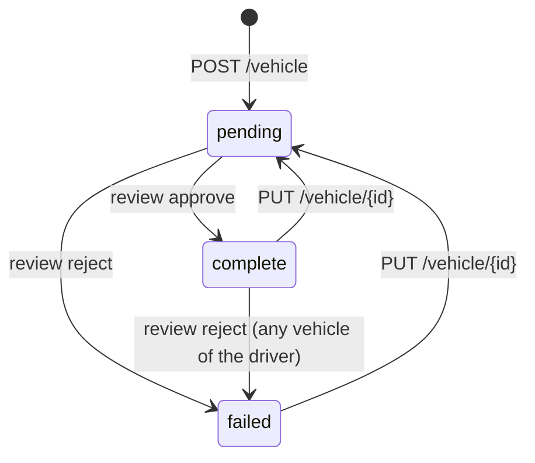

This page covers three related pieces of the API:

- **Vehicle types**: the global `VehicleTypes` table and the in-memory registry that every validator reads.
- **Mobile vehicle catalog**: the vehicle artwork that mobile release workflows publish, and which the dashboard may assign to vehicle types and price rows.
- **Personal vehicles**: driver-owned `Vehicles` rows, their CRUD endpoints, and the review step.

Fleet-owned vehicles, the `AvailableDriverVehicles` view, go-online vehicle resolution, and the `/dashboard/vehicles` inventory write path are documented in [Fleet vehicles and vehicle resolution](/engineering/fleets/vehicles). Prices per vehicle type are documented in [Pricing engine](/engineering/domains/pricing-engine) and [Pricing configuration](/engineering/domains/pricing-configuration).

<Note>
  There is no make and model reference catalog. `make`, `model`, `color`, and `license_plate` are free text that the driver types. The "vehicle catalog" in the code (`vehiclecatalog`, `MobileVehicleCatalogs`) is a catalog of artwork images, not car models.
</Note>

## Data touched

| Store | What | Written by |
| --- | --- | --- |
| `VehicleTypes` | Slug, display name, icon, `image_asset`, `min_seats`, `max_seats`, `sort_order`, `is_active`, `metadata` | Dashboard vehicle type routes |
| In-process registry | `atomic.Value` holding `map[VehicleType]VehicleTypeConfig` of active types | `VehicleTypeService.RefreshRegistry` |
| `MobileVehicleCatalogs` | One row per platform (`ios`, `android`): `source_commit`, `release_id`, `run_id`, `run_attempt`, `assets` JSON array | `POST /mobile-vehicle-catalog` |
| Supabase public bucket | `vehicle-artwork/{sha256}.png` | `SupabaseStorage.UploadVehicleArtwork` |
| `Vehicles` | Personal vehicle rows, `application_status`, reviewer fields | Driver vehicle routes, dashboard review |
| `Users.vehicle_id` | The driver's selected vehicle | `setIdleDriverVehicle` via `SetIdleUserVehicle` |
| GitHub OIDC JWKS | `https://token.actions.githubusercontent.com/.well-known/jwks`, cached 1 hour | `vehiclecatalog.verifier` |

`MobileVehicleCatalogs` has row-level security enabled and `REVOKE ALL ... FROM PUBLIC` (migration `000335_mobile_vehicle_catalog`).

## Endpoints

| Method | Path | Auth | Handler and purpose |
| --- | --- | --- | --- |
| `GET` | `/vehicle-types` | App JWT, role `user` | `vehicletype.VehicleTypeHandler.ListActive`. Active types ordered by `sort_order` |
| `GET` | `/dashboard/vehicle-types` | Clerk. Scope middleware only lets admins through | `ListActive` |
| `GET` | `/dashboard/vehicle-types/all` | Clerk, admin via scope middleware | `ListAll`, including inactive types |
| `POST` | `/dashboard/vehicle-types` | Clerk, `requireAdmin` | `Create` |
| `PATCH` | `/dashboard/vehicle-types/{id}` | Clerk, `requireAdmin` | `Update` |
| `DELETE` | `/dashboard/vehicle-types/{id}` | Clerk, `requireAdmin` | `Deactivate` (soft) |
| `GET` | `/dashboard/vehicle-artwork` | Clerk, inline `role == admin` check | `vehiclecatalog.RegisterRead`. Artwork keys present on both platforms |
| `POST` | `/mobile-vehicle-catalog` | GitHub Actions OIDC bearer token. Hidden from OpenAPI | `publishHandler`. Publishes one platform's catalog |
| `GET` | `/vehicle/` | App JWT, role `user` | `GetVehiclesByDriverID`. Vehicles in `AvailableDriverVehicles` for the caller |
| `POST` | `/vehicle/` | App JWT, role `user` | `CreateVehicle`. Personal vehicle only |
| `PUT` | `/vehicle/{id}` | App JWT, role `user` | `Update` |
| `POST` | `/dashboard/drivers/review` | Clerk, inline admin check | `ReviewDriverApplication`. Step `vehicle` approves or rejects vehicles |
| `GET`, `POST`, `PUT`, `DELETE` | `/dashboard/vehicles[/{id}]` | Clerk, admin | Fleet and personal inventory. See [Fleet vehicles](/engineering/fleets/vehicles#admin-inventory-writes) |

Routes are registered in `internal/server/http/router.go`. The public `/vehicle-types` route is mounted directly on `authenticatedGroup`. The catalog publish route is mounted on `baseGroup`, with no user auth.

## Vehicle types

### Schema and seed

Migration `000200_vehicle_types` creates `VehicleTypes` with `slug TEXT UNIQUE NOT NULL CHECK (slug != '')` and column defaults `icon_name 'car'`, `min_seats 4`, `max_seats 4`, `sort_order 0`, `is_active true`, `metadata '{}'`. It seeds four rows:

| Slug | Display name | Icon | `min_seats` | `max_seats` | `sort_order` |
| --- | --- | --- | --- | --- | --- |
| `x` | Car | `car` | 4 | 4 | 0 |
| `xl` | Big Car | `suv` | 6 | 6 | 1 |
| `cart` | Cart | `golf_cart` | 4 | 5 | 2 |
| `minibus` | Mini Bus | `minibus` | 8 | 8 | 3 |

The same migration rewrites empty `vehicle_type` values to `x` on `Vehicles` and `Rides`, and adds `CHECK (vehicle_type != '')` to both.

### The registry

`models.VehicleType` is a plain string. Validity is not an enum. It is membership in a package-level registry in `internal/models/vehicle_type_config.go`:

- `SetVehicleTypeRegistry` builds a map keyed by slug and stores it in an `atomic.Value`.
- `VehicleType.IsValid()` returns false until the registry is loaded, and false for any slug not in it.
- `VehicleType.GetConfig()` returns the full `VehicleTypeConfig`.

`RefreshRegistry` loads only **active** types (`ListActiveVehicleTypes`). It runs:

<Steps>
  <Step title="At startup">
    `cmd/api/main.go` calls `RefreshRegistry` once. If it fails, the process panics with **failed to initialize vehicle type registry**.
  </Step>
  <Step title="Every 5 minutes">
    A goroutine in `main.go` refreshes on a 5-minute ticker. The comment explains why: dashboard edits only refresh the instance that served them.
  </Step>
  <Step title="After each write on the serving instance">
    `Create`, `Update`, and `Deactivate` call `RefreshRegistry` after the database write. A refresh error is logged, not returned.
  </Step>
</Steps>

### Who reads the registry

| Reader | Effect |
| --- | --- |
| `Vehicle.Validate` (`models/vehicle.go`) | `type` must be valid. `num_seats` must be at least `min_seats` when `min_seats > 0` |
| `ConfirmRideRequest.Validate` (`models/ride.go`) | A rider can't confirm a ride with an inactive vehicle type |
| `AdminUpdateCommunityRequest.Validate` | `primary_vehicle_type` must be valid |
| Dashboard fleet service (`service/dashboard/fleet.go`) | Fleet primary and supported vehicle types must be valid |
| `VehicleTypeSeats` (`models/ride.go`) | Returns `max_seats` as the rider-facing seat count. Falls back to `4` when the type isn't in the registry |
| `VehicleTypeName` (`models/ride.go`) | Returns `display_name`. Falls back to the raw slug |

`max_seats` is rider capacity. It is **not** a limit on the vehicle. `Vehicle.Validate` enforces only the floor, and its comment says existing cars already exceed `max_seats`.

Worked example with the seed data:

- A driver registers an `xl` with `num_seats: 5`. `min_seats` is 6, so validation fails with `num_seats`: **must be at least 6**.
- The same driver registers an `x` with `num_seats: 7`. `min_seats` is 4 and there is no ceiling, so it passes.
- A rider sees `Seats: 5` on a `cart` ride option, because `VehicleTypeSeats` returns `max_seats`.

The mobile seat picker mirrors this in `hooks/useVehicleSeatLimits.ts`: the minimum comes from `/vehicle-types` (fallback 3 until it loads), and the maximum is a client constant of 20.

### Pricing

Vehicle types carry no price, multiplier, or surcharge. A price is a `RidePriceParameters` row keyed by community, fleet, and vehicle type. See [Pricing engine](/engineering/domains/pricing-engine). The only shared concept is artwork: both `VehicleTypes.image_asset` and `RidePriceParameters.image_asset` are validated against the same mobile catalog.

### Write rules

`VehicleTypeService` in `internal/service/vehicletype/vehicle_type_service.go`:

| Operation | Validation | SQL |
| --- | --- | --- |
| `Create` | `slug`, `display_name`, `icon_name` non-empty (`validateConfig`). Artwork check if `image_asset` is set | `CreateVehicleType` inserts every column from the body. Nil `metadata` becomes `{}` |
| `Update` | Artwork check only | `UpdateVehicleType` overwrites `image_asset`, `display_name`, `description`, `icon_name`, `min_seats`, `max_seats`, `sort_order`, `updated_at` |
| `Deactivate` | None | `DeactivateVehicleType` sets `is_active = FALSE`. Zero rows returns 404 **vehicle type not found** |

The admin gate is only in the handler (`requireAdmin` in `internal/server/http/dashboard/vehicle_type/vehicle_type_handler.go`). Its comment notes the service layer has no role logic.

## Mobile vehicle artwork catalog

The mobile app bundles vehicle images. A dashboard admin may only pick an image that every installed app build can render. The API learns which images exist from the mobile release workflows.

### Publication

`yelo-frontend/scripts/vehicle-catalog.mjs` reads `assets/vehicles/catalog.json` at the released commit and posts it to `POST /mobile-vehicle-catalog`. `publishHandler` in `internal/server/http/vehiclecatalog/routes.go`:

<Steps>
  <Step title="Verify release identity">
    The bearer token must be a GitHub Actions OIDC token (`RS256`, issuer `https://token.actions.githubusercontent.com`, audience `https://api.rideyelo.com/mobile-vehicle-catalog`, 10-second leeway). `verifier.verify` in `oidc.go` pins the repository to `rideyelo/yelo-frontend` by name and numeric ID, the ref to `refs/heads/main`, and the event to `workflow_dispatch`.
  </Step>
  <Step title="Check the workflow and environment pair">
    Only two workflow refs are accepted: `ota-promote.yml` with environment `ota-production`, and `finalize-app-store-release.yml` with environment `yelo-bot`. `run_id` and `run_attempt` must parse as positive integers.
  </Step>
  <Step title="Decode strictly">
    The body is capped at 20 MiB (`MaxBytesReader`). The decoder uses `DisallowUnknownFields` and rejects trailing JSON.
  </Step>
  <Step title="Validate">
    `validatePublication` and `validateArtwork` apply the limits below.
  </Step>
  <Step title="Upload bundled images">
    For each asset with bytes in `images`, `UploadVehicleArtwork` writes `vehicle-artwork/{sha256}.png` with `X-Upsert: false` and `Cache-Control: 31536000`. If the object already exists, `verifyExistingArtwork` downloads it and requires byte equality.
  </Step>
  <Step title="Upsert the platform row">
    `VehicleCatalogStore.Publish` upserts on `platform`, but only when the stored `(run_id, run_attempt)` is less than or equal to the incoming pair.
  </Step>
</Steps>

Validation limits:

| Field | Rule |
| --- | --- |
| `platform` | `ios` or `android` |
| `source_commit` | 40 lowercase hex characters |
| `release_id` | 1 to 200 bytes |
| `assets` | Non-null, at most 100, unique `key` |
| `key` | Matches `^[A-Za-z0-9_-]+\.png$`, at most 96 bytes |
| `label` | Non-blank, at most 80 runes |
| `sha256` | 64 lowercase hex characters |
| Bundled image | 8 bytes to 5 MiB, PNG signature, SHA-256 equals `sha256`, `url` must be empty |
| Remote image | `url` must be `https://assets.eascdn.net/...` with no userinfo or fragment |
| `images` | Every key must also appear in `assets` (**unlisted artwork**) |

Status codes: 401 with no bearer token, 403 for a rejected identity, 400 for invalid input, 503 when the store or uploader is missing, 502 when upload fails, 409 when `Publish` fails for any reason, and 204 on success.

Worked example of the ordering guard. The stored iOS row has `run_id 1200, run_attempt 2`:

| Incoming | Row comparison | Result |
| --- | --- | --- |
| `1200, 2` | Equal | Accepted. Retries are idempotent |
| `1200, 1` | Stored is greater | 0 rows, 409 **catalog publication failed or superseded** |
| `1201, 1` | Stored is less | Accepted |

### Which artwork is selectable

`VehicleCatalogStore.List` (`internal/data/repository/vehicle_catalog.go`) returns iOS assets whose `key` **and** `sha256` also appear in the Android row, ordered by label, then key. An image shipped only on one platform, or with different bytes on each, is not offered.

`VehicleCatalogStore.Validate(key, kind, id)` is wired into both `VehicleTypeService` and `DashboardService` in `internal/service/service.go`:

1. An empty key passes.
2. If the row being edited already has this key (`kind = 'type'` checks `VehicleTypes`, `kind = 'pricing'` checks `RidePriceParameters`), it passes. This keeps a row editable after a rollback removed its image.
3. Otherwise the key must be in `List`, or the call fails with **vehicle artwork is not available in both published mobile catalogs**.

## Personal vehicles

### Create

`POST /vehicle/` takes `models.CreateVehicleRequest`:

<Steps>
  <Step title="Map and default">
    `CreateVehicleRequest.ToVehicle` copies the body. An empty `type` becomes `x`.
  </Step>
  <Step title="Validate">
    `Vehicle.Validate` requires a registered `type`, and non-empty or non-zero `color`, `year`, `make`, `model`, `license_plate`, `license_plate_state`, `num_seats`, plus the `min_seats` floor.
  </Step>
  <Step title="Phone gate">
    When `DRIVER_VERIFIED_PHONE_REQUIRED` is true, `userrequirements.RequireVerifiedPhone` requires a non-blank `Users.phone_number` (409 phone required).
  </Step>
  <Step title="Auto-select the first vehicle">
    If `Users.vehicle_id` is nil, the service forces `IsActive = true`.
  </Step>
  <Step title="Insert">
    `sqlVehicleRepository.Create` locks the driver row (`lockRideParticipants`), inserts with `application_status = 'pending'` and `application_submission_time = now`, and calls `setIdleDriverVehicle` when `IsActive`.
  </Step>
  <Step title="Notify and refresh">
    If the driver now has exactly one vehicle, `NotifyDriverVehicleCreated` fires. `RefreshDriverApplicationActionRequired` runs last.
  </Step>
</Steps>

`setIdleDriverVehicle` runs `SetIdleUserVehicle`. The row must be visible to the driver, a fleet vehicle must be approved and from the driver's active membership, and the driver must be offline with no open session and no active ride, unless the vehicle is already selected. Otherwise it fails with **go offline and finish your ride before selecting an owned vehicle**.

### Update

`PUT /vehicle/{id}` uses the same request body:

- If `type` is omitted, the handler loads the existing vehicle and keeps its type instead of defaulting to `x`.
- The whole body is validated, even when the target is a fleet vehicle and the driver only wants to select it.
- `VehicleService.Update` rejects any change while `Users.is_online_driver` is true.
- A fleet vehicle is only selectable. See [Driver-side vehicle edits](/engineering/fleets/vehicles#driver-side-vehicle-edits).
- A personal vehicle must have `driver_id` equal to the caller, or the call fails with **vehicle belongs to another driver** (403).

`sqlVehicleRepository.Update` writes every field, then resets the application to `pending`, sets a new submission time, and clears `application_rejection_reason`, `application_reviewer`, and `application_review_time` (YELO-785). Any edit, even a color change on an approved car, sends the vehicle back to review. If `UpdateVehicle` matches zero rows (archived, fleet-linked, or wrong owner), the call fails with 404 **vehicle not found for driver**.

### Review

Admins review vehicles through `POST /dashboard/drivers/review` with `step: "vehicle"`, `action: "approve"` or `"reject"`, and a `vehicle_id`. `ReviewDriverApplication` maps `approve` to `complete` and `reject` to `failed`, then calls `DashboardService.ReviewDriverApplicationStep`:

| Action | SQL | Rows affected |
| --- | --- | --- |
| Approve | `ApproveDriverVehicles` | Every vehicle with `driver_id` equal to the user whose status isn't `complete` |
| Reject | `RejectDriverVehicles` | Every vehicle with `driver_id` equal to the user |

A reject requires `rejection_reason`. Approval notifications are skipped when `preApprovalStatus` reports the step was already complete.

The status machine for one personal vehicle:

## Where this lives in code

| Concern | File | Function or type |
| --- | --- | --- |
| Type model and registry | `internal/models/vehicle_type_config.go` | `VehicleTypeConfig`, `SetVehicleTypeRegistry`, `IsValid`, `GetConfig` |
| Seat and name helpers | `internal/models/ride.go` | `VehicleTypeSeats`, `VehicleTypeName` |
| Type service | `internal/service/vehicletype/vehicle_type_service.go` | `VehicleTypeService` |
| Type SQL | `internal/data/repository/queries/driver_fleet_primitives.sql`, `internal/data/repository/vehicle_type.go` | `CreateVehicleType`, `UpdateVehicleType`, `DeactivateVehicleType` |
| Public type route | `internal/server/http/vehicletype/vehicle_type_routes.go` | `RegisterRoutes` |
| Dashboard type routes | `internal/server/http/dashboard/vehicle_type/` | `VehicleTypeHandler.requireAdmin` |
| Registry startup and poll | `cmd/api/main.go` | `RefreshRegistry` calls |
| Catalog routes and validation | `internal/server/http/vehiclecatalog/routes.go` | `RegisterRead`, `RegisterPublish`, `validatePublication` |
| Release identity | `internal/server/http/vehiclecatalog/oidc.go` | `verifier.verify`, `verifier.key` |
| Catalog store | `internal/data/repository/vehicle_catalog.go` | `VehicleCatalogStore.List`, `Publish`, `Validate` |
| Artwork upload | `internal/data/supabasestorage/vehicle_artwork.go` | `UploadVehicleArtwork`, `verifyExistingArtwork` |
| Catalog models | `internal/models/vehicle_catalog.go` | `VehicleArtwork`, `MobileVehicleCatalog` |
| Vehicle model | `internal/models/vehicle.go` | `Vehicle`, `CreateVehicleRequest`, `Vehicle.Validate` |
| Driver vehicle routes | `internal/server/http/vehicle/` | `VehicleHandler` |
| Driver vehicle service | `internal/service/vehicle/vehicle.go` | `VehicleService.Create`, `Update` |
| Vehicle SQL | `internal/data/repository/vehicle.go`, `queries/driver_fleet_primitives.sql` | `CreateVehicle`, `UpdateVehicle` |
| Review | `internal/service/dashboard/dashboard.go`, `internal/data/repository/user_driver.go` | `ReviewDriverApplicationStep`, `ApproveDriverVehicles`, `RejectDriverVehicles` |
| Mobile publisher and seat limits | `yelo-frontend/scripts/vehicle-catalog.mjs`, `hooks/useVehicleSeatLimits.ts` | `validateCatalog`, `useVehicleSeatLimits` |

## Gotchas and edge cases

- **`PATCH /dashboard/vehicle-types/{id}` is a full replace.** `UpdateVehicleType` writes every listed column from the body. An omitted `min_seats` becomes 0, which disables the seat floor. An omitted `image_asset` clears the artwork. `Update` also skips `validateConfig`, so it can blank `display_name` and `icon_name`. The dashboard form (`VehicleTypeFormSheet.tsx`) sends every field, so this mainly affects direct API callers.
- **Some fields can't be changed after creation.** `slug`, `is_active`, and `metadata` aren't in the update SQL. No endpoint reactivates a deactivated type. The dashboard form sends `is_active` on edit, and the API ignores it. You need a manual database change.
- **New types are inactive unless you say otherwise.** `Create` inserts `is_active` from the body, and Go's zero value is `false`. A type created without `"is_active": true` never enters the registry. The dashboard form defaults **Active** to on.
- **Some failures surface as 500.** A duplicate slug fails the unique constraint in `CreateVehicleType`. A missing ID in `UpdateVehicleType` returns `pgx.ErrNoRows`. `sqlVehicleTypeRepository` wraps both with `NewServerErrorFromError`, so the caller gets a server error.
- **The registry is eventually consistent across instances.** Only the instance that served a write refreshes immediately. Other instances pick it up within 5 minutes. During that window, one instance can accept a vehicle type that another rejects.
- **Deactivation strands existing rows.** A deactivated slug fails `IsValid`, so drivers can't edit vehicles of that type without changing type, riders can't confirm rides with it, and `VehicleTypeSeats` falls back to 4.
- **Rejecting a vehicle rejects all of them.** `ReviewDriverApplication` validates `vehicle_id` but never passes it. `RejectDriverVehicles` updates every `Vehicles` row with the driver's ID, including approved and archived ones. `ApproveDriverVehicles` approves every non-complete one.
- **Reviews don't record the reviewer.** The handler passes `nil` as `reviewerID`, so `application_reviewer` is always null for dashboard reviews.
- **`is_active` on create is honored.** The `CreateVehicleRequest` comment says `is_active` is ignored by driver creation, but `ToVehicle` copies it and the repository selects the vehicle when it is true. A driver who already has a selected vehicle can switch to a new, still-pending vehicle this way.
- **`VehicleService.Review` is dead code.** No route calls it. The live review path is `DashboardService.ReviewDriverApplicationStep`.
- **Any failed publish is a 409.** `publishHandler` maps every `Publish` error to 409 **catalog publication failed or superseded**, including database outages.
- **An image on one platform only is not selectable.** `List` requires the same key and hash on both platforms. Until both release workflows publish, a new image doesn't appear in `GET /dashboard/vehicle-artwork`.
