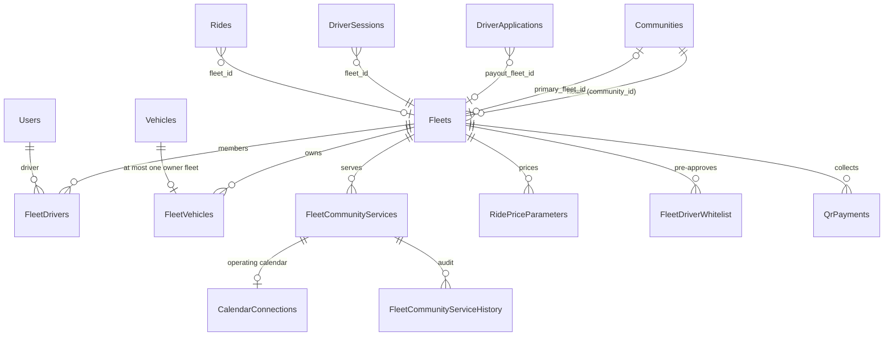

This page catalogs the fleet schema as it exists on `main`, with the runtime effect of each column. For the product-level model, see [Fleets](/concepts/fleets). The other pages in this section explain how the columns combine: [membership and payout routing](/engineering/fleets/membership-and-payout-routing), [isolation](/engineering/fleets/isolation), [vehicles](/engineering/fleets/vehicles), [service communities and calendars](/engineering/fleets/service-communities-and-calendars), [manager authorization](/engineering/fleets/dashboard-authorization), and [Stripe and lifecycle](/engineering/fleets/stripe-and-lifecycle).

The canonical schema is the concatenated migration file `yelo-api/internal/data/sqlc/schema.sql`. Each block is prefixed with `-- source: migrations/<file>`.

## Entity overview

## `Fleets`

Created in `000157_fleets`, extended by `000158`, `000177_fleet_onboarding`, `000208`, `000231`, and `000299_fleet_driver_join`. Go model: `models.Fleet` in `internal/models/fleet.go`. The sqlc row is `datasqlc.Fleet`, mapped by `userFleetFromSQLC` in `internal/data/repository/user_fleet.go`.

| Column | Default | Effect |
| --- | --- | --- |
| `id` | `gen_random_uuid()` | `CreateFleet` generates the ID in Go (`uuid.NewV4`) so the Stripe onboarding return URL can embed it before the insert. |
| `name` | none | Display name. `ListRideT0NotificationTargets` in `queries/community.sql` compares it literally to `'Yelo'` for the founding-driver filter, so renaming the Yelo fleet changes T0 targeting. |
| `logo_url` | `NULL` | Shown on rider options, join previews, and the vehicles map layer (`GetFleetsByIDs`). |
| `community_id` | none, `NOT NULL` since `000177` | The **home community**. Joining or switching to the fleet moves the driver's `Users.community_id` here. Dashboard CRUD routes also require the path community to equal this value. |
| `payment_model` | `'owner_operator'` | `owner_operator` or `fleet_merchant`. Immutable after creation: `UpdateDashboardFleet` has no parameter for it. |
| `has_custom_payouts` | `FALSE` | Read directly by the payment routing predicate. See [Payout routing](/engineering/fleets/membership-and-payout-routing#every-path-that-picks-a-stripe-account). |
| `has_owner_operators` | `TRUE` | Set from `payment_model` at creation (`CreateFleet`), editable afterwards. No runtime code path reads it for routing. The `000177` backfill derived `payment_model` from it. |
| `stripe_merchant_id` | `NULL` | Connected account ID. Indexed (`idx_fleets_stripe_merchant_id`) for webhook lookups. Several fleets can share one ID (fleet cloning). Kept on archive as a historical reference. |
| `stripe_status` | `'not_required'` | `not_required`, `pending`, `restricted`, or `complete`. Written by `handleFleetAccountUpdated` and by create, unlink, and link refresh. |
| `stripe_onboarding_url` | `NULL` | Last minted Account Link. It is a bearer credential for the connected account. |
| `primary_vehicle_type` | `'x'` | Must be included in `supported_vehicle_types` (`validateVehicleTypes`). Used as the fallback ride type when a community has no live or featured types. |
| `supported_vehicle_types` | `'{x}'` | Adding a type copies community pricing to the fleet. Removing one ends the fleet's price row for that type. See [Stripe and lifecycle](/engineering/fleets/stripe-and-lifecycle#update). |
| `requires_confirmation_code` | `TRUE` | When `FALSE`, `generateConfirmCodeForFleet` returns `nil`, so the ride has no PIN. |
| `is_student_only` | `FALSE` | `filterRideTypesForRider` hides the fleet's ride types from non-student riders, and `assignFleetBadges` gives the fleet's options the verified-student badge instead of the fleet badge. Migration `000231` set it for fleets named `Yelo`. |
| `is_active` | `TRUE` | Part of payout readiness and the `ActiveFleetCommunityServices` view. Set `FALSE` by fleet-merchant creation (until Stripe completes), unlink, and archive. Set `TRUE` only by `ActivateDashboardFleet` from the Stripe webhook. |
| `deleted_at` | `NULL` | Archive marker, set by `DeleteFleet`. Most reads filter on it. Migration `000346` triggers reject new references to an archived fleet. See [Archive guards](#archive-guards). |
| `driver_join_code` | `NULL` | Current invitation code. Partial unique index `fleets_driver_join_code_unique` where not null. `NULL` means the link is disabled. |
| `driver_join_code_rotated_at` | `NULL` | Set on rotate, disable, and archive. |
| `created_at`, `updated_at` | `NOW()` | `updated_at` is set explicitly by each write query. There is no trigger. |

### Derived predicates

Three predicates on `Fleets` recur across Go and SQL. Their SQL copies must stay aligned with the Go methods by hand.

| Predicate | Go | SQL copies | Definition |
| --- | --- | --- | --- |
| Payout-ready | `Fleet.IsDriverPayoutReady()` | `GetFleetSwitchTarget`, `SetEligibleDriverOnline`, `ActivateEligibleDriver`, `ListRideT0NotificationTargets`, `GetDriverApplicationState`, `GetDashboardUserDetail` | Not deleted, `is_active`, `fleet_merchant`, `has_custom_payouts`, trimmed `stripe_merchant_id` non-empty, `stripe_status = 'complete'`. |
| Joinable | `Fleet.CanAcceptDriverJoins()` | `GetFleetJoinPreviewByCode`, `LockFleetForJoin` | Not deleted and `is_active`. Owner-operator fleets additionally need `has_custom_payouts = FALSE`. Fleet-merchant fleets need payout-ready. |
| Routes to fleet account | `resolveMerchantType`, `selectStripeMerchantID` | `GetRidePaymentPreparation` (unused) | `has_custom_payouts` and `stripe_merchant_id` not nil. Nothing else. |

<Warning>
  The third predicate is much weaker than payout-ready. It ignores `payment_model`, `is_active`, `deleted_at`, `stripe_status`, and empty-string IDs. See [Payout routing](/engineering/fleets/membership-and-payout-routing#every-path-that-picks-a-stripe-account).
</Warning>

## `FleetDrivers`

Membership rows. Primary key `(fleet_id, driver_id)`. Both foreign keys `ON DELETE CASCADE`, but fleets are only archived, so inactive memberships survive archival. An archived fleet can't have active memberships: archive refuses while one exists, and trigger `guard_fleet_membership_archive` rejects activating one afterwards.

| Column | Effect |
| --- | --- |
| `is_active` | Marks the driver's **active fleet**. Partial unique index `fleet_drivers_one_active_per_driver` (`000299`) allows at most one `TRUE` row per driver. An inactive row still grants visibility of that fleet's shared vehicles through `AvailableDriverVehicles`. |

There is no `Users.active_fleet_id` column. The API derives `User.ActiveFleetId` in `GetUserProfileByID` (`queries/user_profile.sql`) with a lateral join on `FleetDrivers WHERE is_active ORDER BY fleet_id LIMIT 1`. That join doesn't check whether the fleet is archived or inactive.

Trigger `fleet_driver_default_vehicle` (`000333`) runs `select_fleet_default_vehicle()` after `INSERT` or `UPDATE OF is_active`. See [Vehicles](/engineering/fleets/vehicles#automatic-selection-triggers).

## `DriverApplications` fleet columns

Added in `000299_fleet_driver_join`.

| Column | Effect |
| --- | --- |
| `payout_fleet_id` | `ON DELETE SET NULL`. When set, the driver's Stripe step reads the fleet's readiness instead of the driver's personal `stripe_status` (`DriverApplication.EffectivePayoutStatus`). Set for fleet-merchant joins and switches, cleared for owner-operator joins and switches. |
| `payout_fleet_joined_at` | Join timestamp for the payout fleet. The join path resets it when the fleet changes. The switch path keeps the old value (`COALESCE`). |

## `DriverSessions` and `Rides`

| Column | Effect |
| --- | --- |
| `DriverSessions.fleet_id` | The fleet the driver is online under. This value, not `payout_fleet_id`, drives ride-board filtering and Stripe account selection. `ON DELETE SET NULL`. |
| `DriverSessions.vehicle_id` | Session vehicle, guarded by trigger `fleet_vehicle_session_guard`. |
| `Rides.fleet_id` | Set at confirm to the priced fleet (`ConfirmRequestedRide`). Overwritten with the session fleet on accept (`AssignAcceptedRideToDriver`). Cleared to `NULL` by `UnqueueDriverRides`. Preserved by `RequeueRideAfterDriverCancel`. Fleet KPIs and the driver directory aggregate on it. |
| `Rides.stripe_merchant_id` | The connected account used when the payment intent was authorized. Cancel, capture-with-tip, and tip paths reuse it. |

## `FleetVehicles`

| Column or index | Effect |
| --- | --- |
| `(fleet_id, vehicle_id)` primary key | Ownership link. |
| `fleet_vehicle_owner` unique on `vehicle_id` | A vehicle belongs to at most one fleet. |
| `is_default` | Explicit default. `fleet_default_vehicle` partial unique index allows one per fleet. |

`Vehicles.driver_id` became nullable and `Vehicles.archived_at` was added in `000333`. Archiving doesn't remove the `FleetVehicles` row.

## `FleetCommunityServices` and history

Created in `000316_fleet_community_services`. One row per fleet and community, `UNIQUE (fleet_id, community_id)`, plus `UNIQUE (id, community_id)` from `000318` for composite foreign keys.

| Column | Effect |
| --- | --- |
| `enabled` | Must equal `retired_at IS NULL` (`CHECK`). |
| `revision` | Optimistic concurrency token. The `BEFORE UPDATE` trigger forces `NEW.revision = OLD.revision + 1`, whatever the query writes. |
| `origin` | `admin`, `current_price`, `primary_fleet`, or `fleet_creation`. Informational only. |
| `updated_by` | Clerk user ID, or a system actor such as `pricing_configuration`, `community_archive`, `fleet_archive`, or `primary_fleet_configuration`. Copied into history. |

`FleetCommunityServiceHistory` gets one row per insert and update from `audit_fleet_community_service()`. The same trigger bumps `CommunityCacheInvalidations` for the community, which invalidates cached community reads.

The view `ActiveFleetCommunityServices` returns rows where the service is enabled, the fleet is active and not deleted, and the community is active and not archived.

## `FleetDriverWhitelist`

Created in `000168`. `email` is globally `UNIQUE`, so an email can be whitelisted for only one fleet. `UpsertFleetDriverWhitelist` moves an existing email to the new fleet and reactivates it. `added_by` became nullable in `000170`, and the dashboard handler always passes `nil`. Archive sets `is_active = FALSE` on the fleet's entries.

No runtime path reads the whitelist to enroll drivers. `reconcileFleetAssignmentForUser` doesn't consult it, and `FleetDriverWhitelistRepository.GetByEmail` has no callers.

## Calendar tables

`CalendarConnections` (`000318`) hangs off a service row through `(service_id, community_id)`. `service_id` is `UNIQUE`, so each fleet and community pair has at most one calendar. Snapshots, occurrences, and aliases hang off the connection. See [Service communities and calendars](/engineering/fleets/service-communities-and-calendars#operating-calendars).

## Other fleet-scoped tables

| Table | Fleet column | Notes |
| --- | --- | --- |
| `RidePriceParameters` | `fleet_id` (`ON DELETE CASCADE`) | Trigger `validate_current_price_parents` rejects open rows for deleted fleets or archived communities. |
| `ZonePricing` | `fleet_id` | Per-zone, per-fleet rates. Primary key `(zone_id, fleet_id)`. |
| `QrPaymentConfigs`, `QrPayments` | `fleet_id` | QR payment links are minted on the fleet's connected account. See [QR payments](/dashboard/qr-payments). |
| `Communities` | `primary_fleet_id` (`ON DELETE SET NULL`) | Default fleet for new drivers, fallback ride type, rider option sort order, and the source of rider-facing operating hours. |

## Archive guards

Migration `000346_fleet_archive_reference_guards` adds `guard_unarchived_fleet_reference()` and one `BEFORE INSERT OR UPDATE` trigger per referencing table. The trigger takes a `FOR SHARE` lock on the fleet row and raises SQLSTATE `23514` (**Fleet is archived or missing**) when the fleet is archived. The share lock conflicts with the archive `UPDATE`, so a new reference and an archive can't interleave.

| Trigger | Table and columns | Checked when |
| --- | --- | --- |
| `guard_fleet_membership_archive` | `FleetDrivers.fleet_id`, `is_active` | Insert, fleet change, or any write that leaves `is_active = TRUE` |
| `guard_fleet_ride_archive` | `Rides.fleet_id` | Insert or fleet change |
| `guard_fleet_session_archive` | `DriverSessions.fleet_id` | Insert or fleet change |
| `guard_fleet_primary_archive` | `Communities.primary_fleet_id` | Insert or change |
| `guard_fleet_vehicle_archive` | `FleetVehicles.fleet_id` | Insert or fleet change |
| `guard_fleet_payout_archive` | `DriverApplications.payout_fleet_id` | Insert or change |
| `guard_fleet_qr_archive` | `QrPaymentConfigs.fleet_id`, `is_active`, `stripe_payment_link_id` | Insert, fleet change, active row writes, or payment link change |

Historical rows stay editable as long as the fleet reference doesn't change. The migration adds no columns and backfills nothing.

## Database functions that read fleets

| Function | Purpose |
| --- | --- |
| `dashboard_user_tags(uuid, text[])` (`000321`, rewritten in `000343`, `000344`) | Adds a derived `Fleet: <name>` tag for the driver's active, non-deleted membership, only when the driver application is active. Manual tags starting with `Fleet: ` are dropped unless they match a current derived tag. |
| `select_fleet_default_vehicle()` | Picks the fleet's approved default vehicle when a membership becomes active. |
| `guard_fleet_vehicle_session()` | Rejects open sessions whose vehicle isn't approved for the driver and fleet. |
| `guard_unarchived_fleet_reference()` (`000346`) | Rejects new operational references to an archived fleet. See [Archive guards](#archive-guards). |
| `validate_fleet_service_parents()` | Serializes service and price writes with community archival and fleet deletion. |
| `ensure_primary_fleet_service()` | Creates a service row when `Communities.primary_fleet_id` changes. |
| `retire_archived_community_services()` | Retires services and ends open prices when a community is archived. |

## Where this lives in code

| Concern | Path |
| --- | --- |
| Schema | `yelo-api/internal/data/sqlc/schema.sql`, `yelo-api/migrations/000157_*` through `000346_*` |
| Go models | `yelo-api/internal/models/fleet.go`, `fleet_community_service.go`, `fleet_vehicle.go`, `fleet_driver_whitelist.go`, `driver.go` |
| Fleet CRUD queries | `yelo-api/internal/data/repository/queries/driver_fleet_primitives.sql` |
| Join and switch queries | `yelo-api/internal/data/repository/queries/fleet_join.sql` |
| Service queries | `yelo-api/internal/data/repository/queries/fleet_community_services.sql` |
| Row mapping | `userFleetFromSQLC` in `yelo-api/internal/data/repository/user_fleet.go` |

## Gotchas and edge cases

- **Archive keeps history, not operations.** `DeleteFleet` refuses while the fleet still has operational references (see [Archive](/engineering/fleets/stripe-and-lifecycle#archive)). Once archived, inactive `FleetDrivers` rows, `FleetVehicles` rows for archived vehicles, historical rides, and the Stripe reference remain.
- **Fleets deleted before `000346` may still have active references.** The migration performs no backfill. A fleet soft-deleted under the old single-statement delete can still have active memberships, payout assignments, open prices, and enabled services. `ActiveFleetId` can point at such a fleet, because the profile query doesn't join `Fleets`, and `reconcileFleetAssignmentForUser` returns early whenever `ActiveFleetId` is set.
- **The active-fleet index is enforced per row.** `SetDriverActiveFleet` flips every membership in one `UPDATE` (`SET is_active = (fleet_id = $1)`). A non-deferrable unique index is checked as each row changes, so whether this statement conflicts depends on the order in which PostgreSQL visits the rows. The join and admin membership paths avoid the problem by deactivating other rows in a separate statement first.
- **Whitelist emails are global.** Whitelisting an email for fleet B silently moves it off fleet A.
- **`has_owner_operators` is cosmetic.** It is editable but doesn't affect routing, join rules, or onboarding. `payment_model` controls those.
- **`000334_breeze_shared_cart` is data, not schema.** It seeds one shared cart for one hard-coded fleet ID. Other environments are unchanged.
