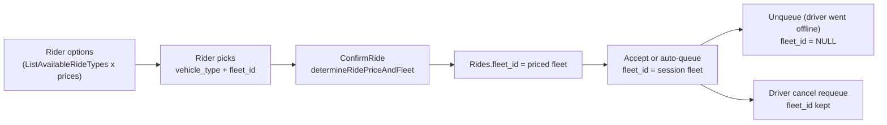

Fleet isolation means a ride priced by one fleet is only served by drivers online under that fleet. The API enforces this at several layers, and the rule has one deliberate exception: a ride whose `fleet_id` is `NULL` is open to every fleet. This page walks the ride from pricing to acceptance and lists every check. For general matching behavior, see [Matching and auto-queue](/concepts/matching-and-auto-queue) and [Rides implementation](/engineering/api/rides-implementation).

## How a ride gets its fleet

### Ride types a rider sees

`ListAvailableRideTypes` in `queries/ride_matching.sql` builds the rider's fleet and vehicle-type pairs for a community:

- **Live**: distinct `(ds.fleet_id, vehicle_type)` from open sessions of drivers whose `Users.community_id` is this community and who have `auto_queue = TRUE`.
- **Featured**: distinct `(fleet_id, vehicle_type)` from open `RidePriceParameters` rows in this community with `is_featured = TRUE`.
- Featured pairs that are also live are dropped, so a pair appears once, with `has_live_driver = TRUE`.
- Results are ordered by `has_live_driver DESC, fleets.name`.

If both sets are empty, `GetAvailableRideTypes` in `repository/ride_matching.go` falls back to one synthetic type: the community's primary fleet with its `primary_vehicle_type`. If the community has no primary fleet, this row has a nil fleet ID.

`filterRideTypesForRider` then removes `is_student_only` fleets unless `user.AccountType == student`.

`NewVehicleOptionsV2` joins ride types to computed prices on `(vehicle_type, fleet_id)`. A ride type without a matching open `per_ride` price row produces no option.

### Rider option ordering and badges

`sortVehicleOptionsLiveFirst` stable-sorts options: live options first, then the community's primary fleet first within each tier. Driver-specific options (direct booking) are then re-sorted among themselves by ETA while fleet rows keep their positions.

`assignVehicleOptionV2Badges` adds `cheapest` and `fastest` when there are at least two options, then calls `assignFleetBadges`. That gives options from `is_student_only` fleets the `verified_student` badge. Other options get the `fleet` badge, except options from the community's primary fleet, which get no fleet badge. Fleet-wide options carry `IsStudentOnly` from the ride type (`NewVehicleOptionsV2`), and direct driver options carry it from `buildFleetMetaMap`. It's an internal field (`json:"-"`), so riders only see the resulting badge. Each option keeps one badge (`maxBadgesPerOption = 1`), chosen by `badgePriority`: `verified_student`, then `fleet`, then `cheapest`, then `fastest`. A partner-fleet option therefore shows its fleet name instead of **cheapest** or **fastest**.

### Direct driver options

When driver options are enabled, `maybeDriverOptions` appends one option per nearby online driver (`internal/service/ride/driver_options.go`). The fleet rules are:

- The driver's fleet and vehicle type come from `ListDriverOptionProfiles`, which reads the driver's open session. The option carries `FleetId = session fleet`.
- `findMatchingPrice` requires a price for exactly that `(vehicle_type, fleet_id)`. A driver whose fleet doesn't price the type gets no option.
- `buildFleetMetaMap` is built from the rider-visible ride types, after the student filter. A driver whose fleet isn't in that map is skipped, so a student-only fleet's drivers are hidden from non-student riders too.
- `buildVehicleOptionGroups` in `option_groups.go` groups options by `(vehicle_type, fleet_id)`. A fleet-wide option becomes the parent and that fleet's drivers are its children. Two fleets offering the same type stay separate groups.

At confirm, `directDriverUnavailableReason` rejects a direct request with a reason code when the driver's current session no longer matches the priced fleet:

| Reason | Condition |
| --- | --- |
| `driver_offline` | No presence entry for the driver in the community |
| `no_active_session` | No open `DriverSessions` row |
| `session_changed` | Session fleet differs from the priced fleet, or the session vehicle differs from the presence vehicle |
| `vehicle_changed` | Profile fleet or vehicle type no longer matches the selected price |

### Price selection at confirm

`determineRidePriceAndFleet` in `service/ride/rider.go` resolves the stored price and fleet:

1. `selectConfiguredRidePrice` computes prices from open price rows and looks for `(VehicleType, FleetId)` equal to the request.
2. If the requested fleet has no price for that type, it logs **No configured price found for requested fleet/vehicle - falling back** and takes the first price with the same vehicle type from any fleet.
3. If no fleet prices that type, `determineFallbackRidePrice` uses default pricing. The fleet comes from `selectFleetIdForVehicleType`: the first ride type (after the student filter) with that vehicle type, otherwise the community's primary fleet.

`ConfirmRequestedRide` writes the chosen fleet to `Rides.fleet_id`. `generateConfirmCodeForFleet` loads that fleet and skips the PIN if `requires_confirmation_code` is `FALSE`.

## Checks on the driver side

| Stage | Where | Rule | `NULL` ride fleet |
| --- | --- | --- | --- |
| Ride board | `GetEnrichedRideBoard` in `service/ride/driver.go`, `ride_driver.sql` | No open session returns an empty board. Otherwise the board shows only rides whose `fleet_id` equals the session fleet. | Hidden, because `NULL = fleet` is false |
| Pending-ride alert on going online | `NotifyPendingRideForDriver` in `service/activation/activation.go` | Uses the same board query with the session fleet. | Hidden |
| Manual accept, service check | `validateRideFleet` | Ride fleet must equal session fleet. Error: **Unavailable Ride**. | Allowed |
| Accept and auto-queue, locked check | `validateRideAssignmentAdmission` in `repository/ride_command.go` | Rechecked under the ride and driver locks. Mismatch returns a command conflict. | Allowed |
| Session ownership | `validateRideAssignmentDriver` | Exactly one open session, and its fleet and vehicle must equal the assignment inputs. | Not applicable |
| Auto-queue candidates | `ListAutoQueueEligibleDrivers` in `user_driver.sql`, via `auto_queue.go` | Driver must have an open session under the ride's fleet. | Every fleet |
| Warm-pool activation | `warmDriverMatchesFleet` in `activation.go` | Online warm drivers must be in session under the ride's fleet. If loading session fleets fails, every warm candidate is dropped. | Every fleet |
| Offline driver activation | `ListNearbyInactiveDrivers` | Active membership in the ride's fleet, or, when the ride's fleet is the community's primary fleet, no active membership at all (`include_unaffiliated`). | Every fleet |
| T0 new-ride push | `notifyDriversAboutNewRide`, `ListRideT0NotificationTargets` | See below. | Skipped |
| Queue promotion | `PromoteAutoQueuedRide` | Exactly one open session, and its vehicle and fleet must equal the ride's. | Not applicable |

On accept, `AssignAcceptedRideToDriver` overwrites `Rides.fleet_id` with the session fleet. For a fleet-less ride, the accepting driver's fleet becomes the ride's fleet, and that fleet's routing predicate picks the Stripe account.

### T0 notification targets

`ListRideT0NotificationTargets` in `queries/community.sql` is the most complete isolation predicate in the codebase. A driver is notified only if:

- The ride is still `confirmed` and unassigned, its community isn't archived, and its fleet is active and not deleted.
- The driver lives in the ride's community and has an active membership in the ride's fleet.
- For the fleet named `Yelo`, the driver has a founding-driver tag (`Founding Driver`, `founding driver`, or `founding`).
- If online, the driver's session fleet is the ride's fleet. The vehicle checked is the session vehicle when online and `Users.vehicle_id` when offline.
- The vehicle matches the ride's vehicle type, is approved, isn't owned by another fleet, and is available to the driver for this fleet. There is no seat check, because `Rides.num_riders` is only written after the trip.
- The driver passes the same payout predicate used for going online.
- The driver's unfinished ride count is below `max_queue_length`.

## Zone pricing per fleet

`ZonePricing` rows are keyed by `(zone_id, fleet_id)`. `buildZoningContext` in `service/ride/rider.go` groups them into `ZoningContext.RatesByFleet`, so a zone rate applies only to prices computed for the same fleet. A fleet without a zone row prices the route with its plain parameters. Zone pricing is read for the ride's community only, and a failure to load zones or rates logs a warning and prices without zones. Service coverage doesn't gate it.

## Student-only fleets

`is_student_only` is enforced on the rider side only. `filterRideTypesForRider` removes the fleet from ride types for non-student riders, `determineFallbackRidePrice` applies the same filter before choosing a fallback fleet, and `assignFleetBadges` uses it for the verified-student badge. Nothing on the driver side reads it.

## Fleet-scoped views and counts

| Surface | Source | Scope |
| --- | --- | --- |
| Fleet driver directory | `ListDashboardFleetDrivers` | Any membership row (active or not) for the fleet, with `Users.community_id` equal to the requested community, activated applications only. Stats come from `Rides.fleet_id`. |
| Fleet KPIs and histogram | `GetDashboardFleetMetrics`, `ListDashboardFleetRideHistogram` in `queries/analytics.sql` | Every ride with this `fleet_id`, across all communities. **Market Users** counts users in the fleet's home community only. |
| Community fleet list | `ListDashboardCommunityFleets` | Fleets with an active service in the community. |
| Fleet push broadcasts | `ListFleetDriverPushTokens`, `ListFleetDriverIDs` | Active members in the community with notifications allowed, `LIMIT 50`. |

## Where this lives in code

| Concern | Path |
| --- | --- |
| Rider ride types and prices | `ListAvailableRideTypes` in `yelo-api/internal/data/repository/queries/ride_matching.sql`, `ListActiveRidePriceParameters` in `queries/community.sql`, `GetAvailableRideTypes` in `repository/ride_matching.go` |
| Rider option assembly | `filterRideTypesForRider`, `sortVehicleOptionsLiveFirst`, `assignFleetBadges`, `determineRidePriceAndFleet`, `selectFleetIdForVehicleType` in `yelo-api/internal/service/ride/rider.go`; `NewVehicleOptionsV2` in `internal/models/ride.go` |
| Board and accept | `GetEnrichedRideBoard`, `validateRideFleet`, `activeSessionFleet` in `yelo-api/internal/service/ride/driver.go` |
| Locked admission | `validateRideAssignmentDriver`, `validateRideAssignmentAdmission` in `yelo-api/internal/data/repository/ride_command.go` |
| Activation and auto-queue | `yelo-api/internal/service/activation/activation.go`, `auto_queue.go` |
| Requeue paths | `UnqueueDriverRides` in `queries/ride_matching.sql`, `RequeueRideAfterDriverCancel` in `queries/ride_lifecycle.sql` |
| T0 targets | `ListRideT0NotificationTargets` in `yelo-api/internal/data/repository/queries/community.sql` |

## Gotchas and edge cases

- **Offline unqueue drops the fleet.** `UnqueueDriverRides` sets `fleet_id = NULL` when a queued driver goes offline past the grace period. The ride returns to `confirmed` without a fleet: it disappears from every fleet's board, skips T0, and can be auto-queued, activated, or accepted by any fleet's driver. `RequeueRideAfterDriverCancel` keeps `fleet_id`, so the two requeue paths disagree.
- **Price fallback crosses fleets.** If the requested fleet has no price for the vehicle type at confirm (for example, the row ended between options and confirm), the rider is booked at another fleet's price, and the ride gets that fleet.
- **The student filter doesn't cover the last fallback.** `selectFleetIdForVehicleType` returns `primaryFleetId` when no filtered ride type matches, even if the primary fleet is student-only.
- **Service coverage doesn't gate riders.** `ListAvailableRideTypes` and `ListActiveRidePriceParameters` don't join `ActiveFleetCommunityServices` and don't check whether the fleet is active. Retiring a service keeps its prices open (by design, to preserve them), and an inactive fleet (Stripe pending or unlinked) keeps its prices open too. A featured price row for such a fleet still produces a rider option. Archiving a fleet ends its prices and requires no open sessions, so archived fleets drop out. See [Service communities](/engineering/fleets/service-communities-and-calendars#what-service-coverage-does-and-doesnt-control).
- **Live ride types follow the driver's community, not the fleet's.** A driver in community B who is online under a fleet homed in A contributes a live `(fleet, type)` pair to B.
- **Fleet identity is by name in T0.** `ListRideT0NotificationTargets` compares `Fleets.name` to `'Yelo'` for the founding-driver filter.
- **KPIs ignore the community selector.** The fleet page picks a community, but `GET /dashboard/fleet/{fleet_id}/kpis` takes no community and aggregates every community.
- **The directory includes former active members.** `ListDashboardFleetDrivers` doesn't filter `fd.is_active`, so a driver who switched to another fleet still appears if they live in the same community.
