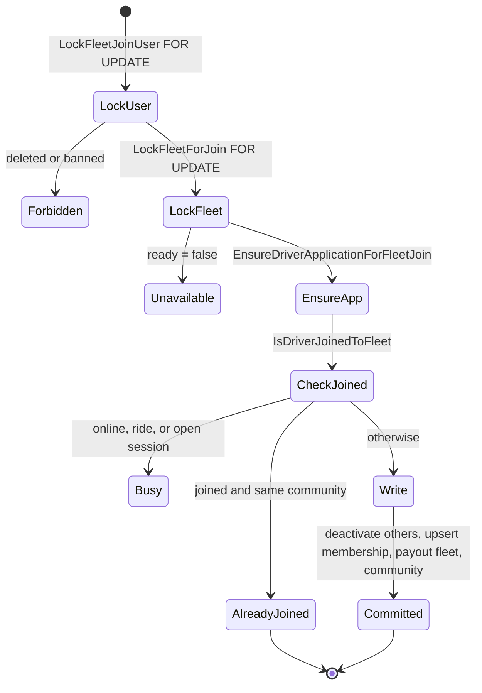

Drivers enter a fleet through six paths. All but automatic enrollment go through the fleet join repository and its locked enrollment transaction. This page covers all six. For the user-facing flow, see [Fleet driver invitations](/fleets/driver-invitations). For what the active fleet and payout fleet mean afterwards, see [Membership and payout routing](/engineering/fleets/membership-and-payout-routing).

| Path | Endpoint | Auth | Service |
| --- | --- | --- | --- |
| Invitation redeem | `POST /driver/fleet-join/{code}` | Driver session | `fleetjoin.Service.Redeem` → `EnrollDriver` |
| Admin assign | `PUT /dashboard/users/detail/{id}/fleet` | `admin` | `fleetjoin.Service.Assign` → `EnrollDriver` |
| Admin transfer | `PUT /dashboard/users/detail/{id}/fleet-transfer` | `admin` | `DashboardService.TransferUserFleet` → `TransferDriver` |
| Admin membership edit | `PUT /dashboard/users/detail/{id}/fleets` | `admin` | `DashboardService.UpdateUserFleetMemberships` → `UpdateDriverMemberships` |
| Legacy add by email | `POST /dashboard/fleet/{fleet_id}/drivers` | `admin` | `DashboardService.AddDriverToFleet` → `TransferUserFleet` |
| Default enrollment | None, automatic | Not applicable | `reconcileFleetAssignmentForUser` → `AddDriverToDefaultFleet` |

The email whitelist (`POST /dashboard/communities/{id}/fleets/{fleet_id}/whitelist`) still stores entries, but no path enrolls drivers from it. See [Email whitelist](#email-whitelist).

## Join codes

`newJoinCode` in `internal/service/fleetjoin/fleet_join.go` reads 16 bytes from `crypto/rand` and encodes them with `base64.RawURLEncoding`, which gives a 22-character code. Codes are validated against `^[A-Za-z0-9_-]{20,64}$` (`joinCodePattern`) before any database read. The mobile app uses the same pattern in `normalizeFleetJoinCode` (`yelo-frontend/lib/storage/fleetJoinIntent.ts`).

The public URL is `https://yelo.link/fleet-<code>`. The Dub short link redirects to `cfg.Dub.InviteLandingBaseURL + "/fleet/" + code`.

The code is stored in `Fleets.driver_join_code` behind a partial unique index. A fleet has at most one live code. Disabling sets it to `NULL`.

### Link endpoints

| Method | Path | Behavior |
| --- | --- | --- |
| `GET` | `/dashboard/fleets/driver-join-link/{fleet_id}` | Returns `url`, `enabled` (code present), `available` (`CanAcceptDriverJoins()`), and `rotated_at`. |
| `POST` | `/dashboard/fleets/driver-join-link/{fleet_id}/rotate` | Creates or replaces the code. Fails with 409 if the fleet can't accept joins. |
| `DELETE` | `/dashboard/fleets/driver-join-link/{fleet_id}` | Sets the code to `NULL`. Works even when the fleet can't accept joins. |

All three call `authorizeFleet` in `internal/server/http/fleetjoin/handler.go`: `admin`, or `fleet` with `HasFleetAccess(fleet_id)`. The scope middleware also allows them for fleet managers through `fleetNamedResourceScopeAllows`. See [Manager authorization](/engineering/fleets/dashboard-authorization).

### Rotation and concurrency

`RotateLink` does this:

<Steps>
  <Step title="Serialize in process">
    Takes `rotateMu`, a `sync.Mutex` on the service. This only serializes rotations inside one API instance.
  </Step>
  <Step title="Check joinability">
    Loads the fleet (`GetFleetForJoinByID`, no deleted filter) and requires `CanAcceptDriverJoins()`.
  </Step>
  <Step title="Read the old code">
    `GetFleetJoinCode` (filters deleted fleets).
  </Step>
  <Step title="Publish to Dub first">
    Calls `dub.UpsertLink` with key `fleet-<new code>`, `ExternalID` `fleet-driver-join:<fleet_id>`, the `fleet-driver` tag, `cfg.Dub.SystemFolderID`, and a title and description that depend on the payment model.
  </Step>
  <Step title="Compare and set">
    `SetFleetJoinCode` updates only if `driver_join_code IS NOT DISTINCT FROM` the old code. Zero rows means another instance rotated first, and the call fails with `ErrorTypeFleetJoinBusy` (409, **Invitation Changed**).
  </Step>
  <Step title="Reconcile on failure">
    If the compare-and-set fails, `reconcileJoinLink` re-reads the current code on a detached context and upserts the Dub link again for that code. Because the external ID is stable per fleet, this points the Dub record back at the winning code.
  </Step>
</Steps>

<Note>
  `DisableLink` only clears the database column. It doesn't touch Dub, so the short link still resolves to the landing page. The preview then returns 404 because no fleet has that code.
</Note>

## Preview

`GET /fleet-join/{code}` is public. `GetFleetJoinPreviewByCode` returns the fleet, its home community, `payouts_managed_by_fleet` (`payment_model = 'fleet_merchant'`), and `available`, which is the SQL copy of `CanAcceptDriverJoins()`. An invalid pattern and an unknown code both return 404 **fleet join link not found**. Archiving a fleet clears its code, so an archived fleet's link previews as 404.

## Enrollment transaction

`Redeem` calls `Preview` and rejects `available: false` early. `Assign` loads the fleet and checks `CanAcceptDriverJoins()` in Go. Both then call `enroll`, which runs `EnrollDriver` in `internal/data/repository/fleet_join.go`:

Details that matter:

- **Lock order is ride participant, user, then fleet.** `lockRideParticipants` takes the shared assignment lock first. Vehicle inventory writes (`lockFleetVehicleUsers`) and go-online use the same user-first order.
- **Readiness is rechecked under the fleet row lock** (`LockFleetForJoin.ready`), so a Stripe webhook or unlink that commits between preview and redeem is honored.
- **A driver application row is created if missing** (`INSERT ... ON CONFLICT DO NOTHING`). Joining is how a rider becomes a driver applicant.
- **"Already joined" depends on the payment model.** `IsDriverJoinedToFleet` returns true only if the membership is active and, for fleet-merchant fleets, `payout_fleet_id` equals the fleet. For owner-operator fleets, `payout_fleet_id` must be `NULL`. A member whose payout fleet is out of sync goes through the full write path again, which repairs it.
- **The short circuit also requires the same community.** An already-joined driver whose `community_id` has drifted goes through the busy check and gets moved back.
- **Writes run in this order:** `DeactivateOtherDriverFleets`, then `UpsertDriverFleetMembership` (`ON CONFLICT DO UPDATE SET is_active = TRUE`), then `SetDriverApplicationPayoutFleetOnJoin` or `ClearDriverApplicationPayoutFleet`, then `SetUserCommunityForFleetJoin`. The upsert fires `select_fleet_default_vehicle`. See [Vehicles](/engineering/fleets/vehicles#automatic-selection-triggers).

### After commit

`enroll` then:

1. Invalidates the auth cache and the user profile cache (logging but ignoring profile-cache errors).
2. Calls `DriverActivator.ActivateDriver`. `ErrorTypePhoneRequired` is ignored. Any other error is returned to the caller, even though the enrollment has already committed.
3. Reads the application and returns `FleetJoinResult` with `result` (`joined` or `already_joined`), `community_changed`, `driver_application_active`, and `remaining_steps`.

`community_changed` compares the community read under the user lock with the fleet's home community. For an already-joined driver on the short-circuit path it is always `false`.

## Admin transfer

`PUT /dashboard/users/detail/{id}/fleet-transfer` takes a `fleet_id` and calls `TransferDriver`, which runs the same `enrollDriver` transaction as a join with an admin flag. Compared with a join:

- It never short-circuits as already joined, so it always rewrites the membership and payout fleet.
- Only an unfinished ride blocks it. An online driver without a ride is taken offline first: `SetDriverOffline`, `CloseDriverSessionsWithoutActiveRides`, and `reconcileDriverAutoQueueAccounting` run inside the transaction.
- It keeps `Users.community_id`. The fleet's home community isn't applied.
- It deactivates other memberships but doesn't delete them.

After commit, `clearFleetEditPresence` invalidates the profile cache and removes the driver's presence entry. The service doesn't call `ActivateDriver`.

## Admin membership editing

`GET /dashboard/users/detail/{id}/fleets` returns `DriverFleetMemberships`: `community_id`, `active_fleet_id`, and every membership with `fleet_id`, `name`, `is_active`, and `is_archived`, ordered by fleet name. Archived fleets are included.

`PUT` on the same path takes `DriverFleetMembershipUpdate`:

| Field | Rule |
| --- | --- |
| `fleet_ids` | The full desired membership set. At most 100, unique, non-nil. |
| `active_fleet_id` | Must be in `fleet_ids`. Must be `null` if and only if `fleet_ids` is empty. |
| `expected_fleet_ids`, `expected_active_fleet_id` | The state the editor loaded. |
| `confirm` | Must be `true`. |

`UpdateDriverMemberships` in `internal/data/repository/driver_fleet_memberships.go` runs one transaction:

<Steps>
  <Step title="Lock and compare">
    Takes the ride participant lock and the user row lock. If the current memberships or active fleet differ from the expected values, it fails with 409 **Fleet Memberships Changed**.
  </Step>
  <Step title="Refuse busy drivers">
    An unfinished ride fails with **Finish Driving First**.
  </Step>
  <Step title="Lock fleets">
    Locks every current and requested fleet with `LockFleetForJoin`, sorted by ID. New memberships and the selected active fleet must be joinable (`ready`). Banned users can't gain new memberships. Existing memberships in archived or unready fleets can be kept or removed.
  </Step>
  <Step title="Apply">
    Takes the driver offline and closes idle sessions, inserts added memberships as inactive, and deletes memberships not in `fleet_ids`. If the active fleet changed, it runs the enrollment writes for the new fleet while keeping the driver's community. It then sets or clears the payout fleet, and clears `Users.vehicle_id` when the selected vehicle belongs to a fleet the driver no longer belongs to.
  </Step>
</Steps>

An empty `fleet_ids` clears the payout fleet and any selected shared vehicle. The driver can then be enrolled in the default fleet again by [automatic enrollment](/engineering/fleets/membership-and-payout-routing#automatic-fleet-assignment).

The dashboard surface is the **Fleet membership** section of the admin user sheet (`yelo-web/src/components/users/UserFleetMemberships.tsx`). See [Fleet membership](/dashboard/fleets#edit-a-drivers-fleet-memberships).

## Mobile deep-link handling

| Step | Code | Behavior |
| --- | --- | --- |
| Link capture | `app/+native-intent.tsx` | On host `yelo.link`, a first path segment starting with `fleet-` rewrites to `/fleet-join/<code>`. On host `invite.yelo.link`, a path `/fleet/<code>` does the same. |
| Pending intent | `setPendingFleetJoinCode` | Stores the normalized code under `@yelo/fleet_join_code` in AsyncStorage when the user must sign in first. |
| Restore | `components/FleetJoinIntentObserver.tsx` | After a JWT is available, navigates once per session to the pending code, unless it is already on a `/fleet-join/` route. |
| De-duplication | `markFleetJoinCodeHandled`, `hasHandledFleetJoinCode` | Keeps the last 20 handled codes under `@yelo/fleet_join_handled_codes_v1`. A handled pending code is cleared without navigating. |
| Screen | `app/fleet-join/[code].tsx` | Preview, join, then driver setup or the driver hub. |

## Legacy add by email

`POST /dashboard/fleet/{fleet_id}/drivers` is admin only. The handler rejects other roles with 403 **Only admins can enroll drivers directly. Share the fleet join link instead.**, and `DashboardService.AddDriverToFleet` checks `fleetServiceAdmin` again. It looks up the user by email and calls `TransferUserFleet`, so it has the same guarantees as [Admin transfer](#admin-transfer).

## Email whitelist

The whitelist stores emails pre-approved for a fleet. `CreateFleetWhitelistEntry`:

- Lowercases the email and checks a minimal shape (`isValidEmail`: one `@` and a dot in the domain).
- Rejects emails ending in `.edu`.
- Rejects emails that already belong to any user (`GetCountByEmail`).
- Runs `assertFleetInCommunity` in the handler, which requires the fleet to appear in `GetCommunityFleets` for the path community. That list comes from `ActiveFleetCommunityServices`, so the fleet must be active and actively serve that community.
- Upserts on the globally unique `email`, which moves an existing entry to the new fleet and reactivates it.

`PUT .../whitelist/{entry_id}` toggles `is_active` after `assertWhitelistEntryInFleet`. Archiving the fleet deactivates its entries.

No code path reads the whitelist to enroll a driver. `reconcileFleetAssignmentForUser` doesn't consult it, so a whitelisted email has no effect on the driver's fleet.

## Where this lives in code

| Concern | Path |
| --- | --- |
| Join service | `yelo-api/internal/service/fleetjoin/fleet_join.go` |
| Enrollment transaction | `EnrollDriver` in `yelo-api/internal/data/repository/fleet_join.go` |
| Join SQL | `yelo-api/internal/data/repository/queries/fleet_join.sql` |
| Routes and handlers | `yelo-api/internal/server/http/fleetjoin/routes.go`, `handler.go`; registration in `internal/server/http/router.go` |
| Admin transfer and membership edits | `TransferDriver` in `yelo-api/internal/data/repository/fleet_join.go`; `UpdateDriverMemberships` in `driver_fleet_memberships.go`; `TransferUserFleet`, `UpdateUserFleetMemberships` in `internal/service/dashboard/fleet_transfer.go`; routes in `internal/server/http/dashboard/users/routes.go` |
| Legacy add and whitelist handlers | `AddDriverToFleet`, `CreateFleetWhitelistEntry`, `UpdateFleetWhitelistEntry` in `yelo-api/internal/server/http/community/community_handler.go` |
| Whitelist service | `CreateFleetWhitelistEntry` in `yelo-api/internal/service/dashboard/dashboard.go` |
| Error types | `ErrorTypeFleetJoinBusy`, `ErrorTypeFleetPayoutUnavailable` in `yelo-api/internal/utilities/errors/error.go`, both mapped to 409 in `internal/server/http/httperrors/errors.go` |
| Mobile | `yelo-frontend/app/fleet-join/[code].tsx`, `lib/storage/fleetJoinIntent.ts`, `components/FleetJoinIntentObserver.tsx`, `app/+native-intent.tsx` |
| Design notes | `yelo-api/docs/owner-operator-fleet-joins.md`, `docs/admin-fleet-transfers.md` |

## Gotchas and edge cases

- **Success can look like failure.** If `ActivateDriver` fails with anything but `ErrorTypePhoneRequired`, `Redeem` and `Assign` return that error, but the membership, payout fleet, and community change have already committed. Retrying returns `already_joined`.
- **The rotation mutex is per instance.** Cross-instance races rely on the compare-and-set and surface as 409 **Invitation Changed**. The losing request has already upserted a Dub link for its own code, and reconciliation repoints it only if the database read succeeds.
- **Disabling doesn't unpublish.** Neither disable nor archive touches Dub. Old short links keep resolving until Dub is cleaned up by hand. They preview as 404 in the app.
- **The error title is always about payouts.** Both unavailable paths use `ErrorTypeFleetPayoutUnavailable` titled **Fleet Payouts Unavailable**, even for an inactive owner-operator fleet.
- **Owner-operator fleets with custom payouts are never joinable.** `CanAcceptDriverJoins` requires `has_custom_payouts = FALSE` for owner-operator fleets. Turning on custom payouts for an owner-operator fleet disables its invitations, admin assignment, and selection in the membership editor.
- **Admin paths keep the community; joins move it.** Redeem and `PUT .../fleet` move the driver to the fleet's home community. `fleet-transfer`, the membership editor, and legacy add by email leave `Users.community_id` unchanged.
- **The whitelist is inert.** Entries can still be created and toggled, but nothing enrolls drivers from them.
