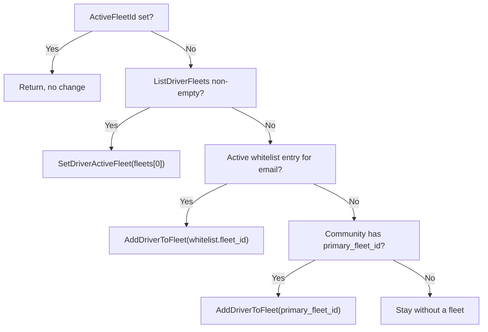

A driver has three fleet-related facts that are easy to confuse. They are stored in different tables and can disagree.

| Fact | Stored in | Read by |
| --- | --- | --- |
| **Active fleet** | `FleetDrivers.is_active = TRUE` (at most one row per driver) | Going online, vehicle resolution, T0 notifications, fleet tags |
| **Payout fleet** | `DriverApplications.payout_fleet_id` | Driver application Stripe step, activation, online eligibility |
| **Session fleet** | `DriverSessions.fleet_id` on the open session | Ride board, accept admission, Stripe account selection |

This page explains how each is written and which one wins where. For the join flow itself, see [Joins and invitations](/engineering/fleets/joins-and-invitations). For column definitions, see [Fleet data model](/engineering/fleets/data-model).

## How the active fleet is derived

`User.ActiveFleetId` comes from `GetUserProfileByID` in `queries/user_profile.sql`:

```sql
LEFT JOIN LATERAL (SELECT fleet_id FROM "FleetDrivers"
    WHERE driver_id = u.id AND is_active = TRUE ORDER BY fleet_id LIMIT 1) fd ON TRUE
```

The query doesn't check whether the fleet is deleted or inactive. `GetUserDriverStatus` (`queries/user_driver.sql`) returns the same value as `driver_active_fleet` for the mobile status poll.

## Writers of `FleetDrivers.is_active`

| Writer | Function | Deactivates others | Sets payout fleet | Moves community | Offline check | Joinability check |
| --- | --- | --- | --- | --- | --- | --- |
| Invitation redeem | `sqlFleetJoinRepository.EnrollDriver` | Yes, separate statement | Yes | Yes | Yes | Yes, under row lock |
| Admin assign | `EnrollDriver` via `fleetjoin.Service.Assign` | Yes | Yes | Yes | Yes | Yes |
| Driver switch | `sqlUserRepository.SetDriverActiveFleet` | Yes, same statement | Yes | Yes | Yes | Payout-ready for fleet-merchant only |
| Automatic assignment | `AddDriverToFleet` from `reconcileFleetAssignmentForUser` | Yes | No | No | No | No |
| Legacy add by email | `AddDriverToFleet` from `DashboardService.AddDriverToFleet` | Yes | No | No | No | No |

The first three paths keep all three facts aligned. The last two only touch `FleetDrivers`, which leaves `payout_fleet_id` and `Users.community_id` unchanged.

## Switching the active fleet

`POST /driver/active-fleet` calls `DriverService.SetActiveFleet`, which calls `SetDriverActiveFleet` in `internal/data/repository/user_fleet.go`. It runs in one transaction:

<Steps>
  <Step title="Lock the driver">
    `LockDriverForFleetSwitch` selects the user `FOR UPDATE` and computes `has_ride` (any ride not in `complete` or `pending_rider_rating`) and `has_session` (an open `DriverSessions` row). If the driver is online or either flag is set, the switch fails with `ErrorTypeFleetJoinBusy` (HTTP 409, **Finish Driving First**).
  </Step>
  <Step title="Load the target">
    `GetFleetSwitchTarget` joins `Fleets` to `FleetDrivers`, so a missing membership returns **driver is not a member of this fleet** (404). The query computes `payout_ready`.
  </Step>
  <Step title="Gate fleet-merchant targets">
    If the target uses `fleet_merchant` and isn't payout-ready, the switch fails with `ErrorTypeFleetPayoutUnavailable` (409, **Fleet Payouts Unavailable**). Owner-operator targets have no readiness gate.
  </Step>
  <Step title="Flip memberships">
    `SetDriverActiveFleet` runs `UPDATE "FleetDrivers" SET is_active = (fleet_id = $target) WHERE driver_id = $driver`. The `fleet_driver_default_vehicle` trigger fires for each changed row.
  </Step>
  <Step title="Update payout fleet and community">
    Fleet-merchant targets run `SetDriverApplicationPayoutFleet`. Owner-operator targets run `ClearDriverApplicationPayoutFleet`. Then `SetUserCommunityForFleetJoin` moves the driver to the target's home community.
  </Step>
</Steps>

After commit, the service invalidates the auth cache and the user profile cache. It deliberately doesn't close sessions, because the repository already refused to switch while a session is open.

## Automatic fleet assignment

`reconcileFleetAssignmentForUser` in `internal/service/driver/driver.go` runs from `ActivateDriver` (after a successful activation), `ReconcileDriverActivation` (Stripe webhooks, fleet readiness), and `RefreshOnlineStatus` (when `ActiveFleetId` is nil).



Tie-breaks and failure modes:

- `ListDriverFleets` has no `ORDER BY`, so "first fleet" is whatever order PostgreSQL returns. It excludes deleted fleets but not inactive ones.
- If `fleets[0]` is a fleet-merchant fleet that isn't payout-ready, `SetDriverActiveFleet` returns an error and the function doesn't try the next membership.
- The whitelist and primary-fleet branches use `AddDriverToFleet`, which doesn't check joinability, set `payout_fleet_id`, or move the driver's community. The whitelist row's own `community_id` is ignored.
- `ensureFleetAssignmentForUser` logs failures and swallows them. `RefreshOnlineStatus` then reloads the user and fails with **Fleet Not Found** if `ActiveFleetId` is still nil.

## Online eligibility

`RefreshOnlineStatus` gates going online in this order:

1. Verified phone, if `driverVerifiedPhoneRequired` is on.
2. `validateDriverApplication`: `DriverApplications.is_active` and `EffectivePayoutStatus() == complete`.
3. Active fleet present, with automatic assignment as above.
4. `resolveOnlineVehicle`. See [Vehicles](/engineering/fleets/vehicles#go-online-resolution).
5. Location inside the community bounding box, and `ensureVehicleFleetMatch`.
6. `RefreshDriverSession` in `repository/driver_availability.go`, under the driver session lock:
   - `GetDriverOnlineSelection.fleet_matches` requires exactly one active membership, for this fleet, and the fleet must be active and not deleted. Otherwise the call fails with **active fleet changed; refresh before going online**.
   - `ValidateDriverSessionVehicle` rechecks the vehicle.
   - `refreshSessionOwnership` keeps the open session if its fleet and vehicle match. Otherwise it closes sessions without active rides and opens a new one. If the driver has an active ride and the session doesn't match, it refuses rather than rewrite the fleet used to fulfill the ride.
   - `SetEligibleDriverOnline` repeats the payout predicate in SQL: either `payout_fleet_id IS NULL AND stripe_status = 'complete'`, or the payout fleet is payout-ready and the driver's membership in it is active.

`EffectivePayoutStatus` returns the personal `stripe_status` when `payout_fleet_id` is nil. Otherwise it returns `payout_fleet_status` from `GetDriverApplicationState`, which is `complete` only if the payout fleet is payout-ready and the driver's membership in it is active. It returns `restricted` if the fleet's Stripe status is `restricted`, and `pending` in all other cases.

<Note>
  Because only one membership can be active, a fleet-managed driver's payout fleet is effectively required to be their active fleet. A driver whose payout fleet was switched away from (through `AddDriverToFleet`, for example) reads as `pending` until they switch back or join again.
</Note>

## Every path that picks a Stripe account

`selectStripeMerchantID` in `internal/service/ride/driver.go` is the only routing function:

```go
func (s *RideService) selectStripeMerchantID(driver *models.User, fleet *models.Fleet) string {
	if fleet.HasCustomPayouts && fleet.StripeMerchantID != nil {
		return *fleet.StripeMerchantID
	}

	return driver.StripeMerchantID
}
```

The `fleet` argument is loaded by `getDriverSessionAndFleet`, which reads the open `DriverSessions` row and then `GetFleetById(session.FleetId)`. It uses the session fleet, not `Rides.fleet_id` and not `payout_fleet_id`.

| Path | Function | Fleet source | Account used |
| --- | --- | --- | --- |
| Manual accept | `AcceptRide` → `processRidePayment` | Session fleet at accept | `selectStripeMerchantID`, persisted to `Rides.stripe_merchant_id` |
| Queue promotion or auto-queue pickup | `authorizeRidePickup` → `processRidePayment` | Session fleet at promotion | Same |
| Rematch after driver cancel | `processRidePayment` → `reuseRideAuthorization` | Session fleet of the new driver | Reuses the intent only if the driver and account both match. Otherwise the previous hold is released and a new one is created. |
| Completion capture | `Complete` → `confirmPaymentIntent` | Session fleet at completion, recomputed | `selectStripeMerchantID` again |
| Cancel after a DB failure | `handleCompleteDBFailure` | Recomputed at completion | Same value as the capture |
| Tip-window capture | `tip_capture.go` | Not recomputed | `Rides.stripe_merchant_id` |
| Tip charge on free rides | `resolveTipMerchant` in `tip_charge.go` | `Rides.fleet_id` | Stored account if present, otherwise `selectStripeMerchantID(driver, rideFleet)` |
| QR payment links | `QrPaymentService.CreateConfig` | Config's fleet | `Fleets.stripe_merchant_id`, or an error if nil |
| Checkout attribution | `resolveCheckoutAttribution` in `service/payment/payment.go` | Metadata `fleet_id`, otherwise the first fleet sharing the connected account | Attribution only |

`recordMerchantSelectedEvent` writes a ride event with `merchant_type` from `resolveMerchantType` (`fleet` or `driver`), which uses the same predicate. Filter ride events on that type to audit routing.

## Where this lives in code

| Concern | Path |
| --- | --- |
| Switch transaction | `SetDriverActiveFleet` in `yelo-api/internal/data/repository/user_fleet.go` |
| Switch and join SQL | `LockDriverForFleetSwitch`, `GetFleetSwitchTarget`, `SetDriverApplicationPayoutFleet`, `ClearDriverApplicationPayoutFleet` in `yelo-api/internal/data/repository/queries/fleet_join.sql` |
| Driver endpoints | `GET /driver/fleet`, `POST /driver/active-fleet` in `yelo-api/internal/server/http/driver/driver_routes.go` |
| Automatic assignment, activation, go online | `yelo-api/internal/service/driver/driver.go` |
| Session commit | `RefreshDriverSession` in `yelo-api/internal/data/repository/driver_availability.go` |
| Online and activation SQL | `SetEligibleDriverOnline`, `ActivateEligibleDriver`, `GetDriverOnlineSelection`, `GetDriverApplicationState` in `yelo-api/internal/data/repository/queries/user_driver.sql` |
| Payout status model | `DriverApplication.EffectivePayoutStatus` in `yelo-api/internal/models/driver.go` |
| Stripe account selection | `selectStripeMerchantID`, `processRidePayment`, `reuseRideAuthorization`, `Complete` in `yelo-api/internal/service/ride/driver.go` |
| Tips | `yelo-api/internal/service/ride/tip_charge.go`, `tip_capture.go` |

## Gotchas and edge cases

- **Routing ignores readiness.** A fleet with `has_custom_payouts = TRUE` and any non-nil `stripe_merchant_id` receives fares, even if it is an owner-operator fleet, inactive, restricted, or has an empty-string account ID. Online eligibility checks readiness, and routing doesn't.
- **Payout fleet and routing fleet can differ.** A driver with `payout_fleet_id = NULL` (added through `AddDriverToFleet` or the primary-fleet fallback) goes online on personal Stripe readiness. If their session fleet has custom payouts, fares still go to the fleet's account.
- **Capture recomputes the account.** `Complete` calls `selectStripeMerchantID` again instead of reusing `Rides.stripe_merchant_id`. If an admin unlinks Stripe or toggles `has_custom_payouts` while a ride is in progress, the capture targets a different connected account than the one that holds the authorization. Deleting the fleet sets `stripe_merchant_id` to `NULL`, which makes capture fall back to the driver's account.
- **Rematch across an account change fails.** `reuseRideAuthorization` treats "same driver, different account" as **ride authorization belongs to an unknown assignment**.
- **Switch timestamps stick.** `SetDriverApplicationPayoutFleet` uses `COALESCE(payout_fleet_joined_at, NOW())`, so a switch from fleet A to fleet B keeps A's join time. The join path uses `SetDriverApplicationPayoutFleetOnJoin`, which resets it.
- **Deleted owner-operator fleets can still be selected.** `GetFleetSwitchTarget` only checks membership, and readiness only for fleet-merchant fleets. A driver can switch to a deleted owner-operator fleet through the API, then fail to go online because `fleet_matches` requires an active, non-deleted fleet. `GET /driver/fleet` hides deleted fleets, so the app won't offer this.
- **Busy means any unfinished ride.** `has_ride` counts every ride not in `complete` or `pending_rider_rating`, including `queued` rides, so a driver with a queued ride can't switch fleets.
- **Legacy adds skip cache invalidation.** `AddDriverToFleet` doesn't invalidate the auth or profile caches, unlike the join and switch paths.
