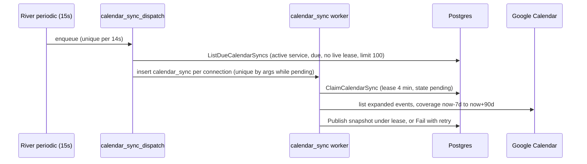

A fleet has one home community (`Fleets.community_id`) and any number of **service communities** (`FleetCommunityServices` rows). Service rows scope dashboard pricing lists and own operating calendars. This page covers their lifecycle and the calendar pipeline that hangs off them. For the admin UI, see [Fleets](/dashboard/fleets#manage-service-communities).

## Home community versus service communities

| | Home community | Service communities |
| --- | --- | --- |
| Storage | `Fleets.community_id` | `FleetCommunityServices` |
| Cardinality | Exactly one, fixed at creation | Zero or more |
| Editable | No API writes it after creation | Admin add, retire, restore |
| Effects | Driver's community after join or switch; dashboard CRUD route scoping; KPI **Market Users**; clone source for pricing | Dashboard pricing lists, community fleet lists, calendar scope and sync eligibility, fleet detail `active_communities` |

A fleet doesn't automatically serve its home community after creation unless the creation path inserted a row. `CreateFleet` does insert one (origin `fleet_creation`).

## How service rows appear

| Origin | Created by | When |
| --- | --- | --- |
| `fleet_creation` | `sqlDashboardRepository.CreateFleet` | Same transaction as the fleet insert, for the home community |
| `admin` | `SetFleetCommunityService` with `expected_revision = 0` and `enabled = true` | Admin adds a community |
| `current_price` | `ensureFleetPriceService` | First price row created or updated for a fleet in a community with no service row |
| `primary_fleet` | Trigger `ensure_primary_fleet_service` | `Communities.primary_fleet_id` changes to a non-null fleet on a non-archived community |
| `primary_fleet` or `current_price` | Migration `000316` backfill | Existing primary fleets and currently open prices at migration time |

Every automatic path uses `ON CONFLICT DO NOTHING` or checks for an existing row first. A retired row is never re-enabled automatically. Price writes against a retired service fail with **Restore this fleet's service community before creating or updating pricing**.

## Retire and restore

`PUT /dashboard/fleets/services/{fleet_id}/{community_id}` with a body of `enabled` and `expected_revision`. Both `GetServices` and `SetService` require the `admin` role in the handler and again in `DashboardService` (`fleetServiceAdmin`).

`SetFleetCommunityService` in `internal/data/repository/fleet_community_service.go`:

<Steps>
  <Step title="Lock parents in a fixed order">
    `lockFleetServiceParents` locks the community (`archived_at IS NULL ... FOR UPDATE`), then the fleet (`deleted_at IS NULL ... FOR UPDATE`). This community-then-fleet order matches the `validate_fleet_service_parents` trigger and community archival, which prevents deadlocks.
  </Step>
  <Step title="Create or compare revisions">
    With no existing row, only `expected_revision = 0` with `enabled = true` is accepted. Otherwise the stored `revision` must equal `expected_revision`. A mismatch returns `ErrorTypeDuplicate` (409, **Service changed**).
  </Step>
  <Step title="Write">
    `UpdateFleetCommunityService` sets `enabled`, `retired_at`, and `updated_by`. The `BEFORE UPDATE` trigger forces `revision = OLD.revision + 1` and blocks changes to `fleet_id` or `community_id`.
  </Step>
  <Step title="Audit and invalidate">
    `audit_fleet_community_service` appends to `FleetCommunityServiceHistory` and bumps `CommunityCacheInvalidations` for the community.
  </Step>
</Steps>

Retirement keeps the fleet's price rows open (`end_time` stays `NULL`) so a restore brings back the same configuration. The dashboard's **Stored pricing** view reads `ListDashboardRidePriceParameterHistory`, which includes rows whose service isn't active.

### Community archival

Archiving a community (the `ArchiveCommunity` query, or any direct `UPDATE` of `archived_at`) fires `retire_archived_community_services`. It retires every enabled service in the community with `updated_by = 'community_archive'` and sets `end_time = NOW()` on every open price row in the community. An archived community's services can't be restored, because the parent lock rejects archived communities.

### Fleet archival

Archiving a fleet (`DELETE /dashboard/communities/{id}/fleets/{fleet_id}`) runs `RetireArchivedFleetServices` in the same transaction as the archive. It retires every enabled service for the fleet with `updated_by = 'fleet_archive'`. `EndArchivedFleetPricing` then ends every current and future price row for the fleet, in every community, at `GREATEST(NOW(), start_time)`. An archived fleet's services can't be restored, because the parent lock rejects archived fleets. See [Archive](/engineering/fleets/stripe-and-lifecycle#archive).

Community archival and fleet archival are the only lifecycle events that end fleet prices automatically.

Temporarily deactivating a community (`is_active = FALSE`) or a fleet only hides rows from `ActiveFleetCommunityServices`. It doesn't retire or end anything.

## What service coverage does and doesn't control

`ActiveFleetCommunityServices` is the filter. The table shows which reads use it.

| Read | Uses the view |
| --- | --- |
| Dashboard current pricing (`ListDashboardRidePriceParameters`, `ListDashboardActiveRidePriceParameters`, fleet detail prices) | Yes |
| Community fleet list for managers and admins (`ListDashboardCommunityFleets`) | Yes |
| Fleet list `active_communities`, `community_count`, `served_communities` | Yes |
| Calendar scope, sync claim, published snapshot | Yes |
| Rider pricing (`ListActiveRidePriceParameters`) | No |
| Rider ride types (`ListAvailableRideTypes`) | No |
| Matching, ride board, accept | No |

<Warning>
  Coverage is a dashboard and calendar concept. Rider pricing reads every open `per_ride` price row in the community. A retired service's prices stay open by design, so they stay visible to riders whenever the fleet also has a featured price row or a live session there. The same applies to an inactive fleet, for example one whose Stripe account was unlinked. Archiving a fleet or community ends its prices, which removes it from riders.
</Warning>

## Operating calendars

Each service row can have one `CalendarConnections` row (`service_id` is unique). The Google account is a single platform-wide owner stored in `GoogleCalendarOwner` and connected from **Access**. Per-service calendars are secondary calendars owned by that account.

### Configuration

| Environment variable | Effect |
| --- | --- |
| `GOOGLE_CALENDAR_ENABLED` | Enables the owner connection. Default `false`. |
| `GOOGLE_CALENDAR_SYNC_ENABLED` | Enables import. Requires the owner connection to be enabled. Default `false`. |
| `GOOGLE_CALENDAR_OWNER_EMAIL`, `GOOGLE_CALENDAR_CLIENT_ID`, `GOOGLE_CALENDAR_CLIENT_SECRET`, `GOOGLE_CALENDAR_CALLBACK_URL`, `GOOGLE_CALENDAR_DASHBOARD_URL` | OAuth client and owner identity, validated by `Calendar.Validate` in `internal/utilities/config/calendar.go`. |

When either flag is off, `View` reports state `setup_required`, and attach and prefix edits are refused.

### Endpoints and access

Routes live under `/dashboard/fleets/{fleet_id}/communities/{community_id}/calendar` (`internal/server/http/dashboard/calendar/routes.go`) and send `Cache-Control: no-store`.

| Method | Path suffix | Access |
| --- | --- | --- |
| `GET` | none | Admin, or a `fleet` or `operator` role with a claim for this fleet and community |
| `PUT` | none | Admin only. Attaches a calendar or replaces its ID. |
| `PATCH` | `/prefixes` | Admin only. Renames a zone prefix. |

`CalendarAccess` in `internal/service/operatinghours/dashboard.go` returns 404 **Calendar not found** to non-admins without a matching claim, so it doesn't leak whether the calendar exists. A claim with an empty `community_id` matches any community for that fleet.

### Attach

`DashboardService.Attach` validates in this order:

1. The calendar ID is trimmed, not `primary`, at most 1,024 characters, without slashes or control characters. There are 1 to 50 aliases, each a unique key matching `ValidAlias` (starts with `A` to `Z`, then letters, digits, `_`, or `-`, 32 characters at most) and a unique zone.
2. The service is active (`GetDashboardCalendarScope` joins the view). The community timezone status is `resolved`, and `expected_geography_revision` equals the community's current `geography_revision`. Otherwise the call returns a 409 binding conflict.
3. The owner token is refreshed, and Google confirms the connected account owns the calendar.
4. The calendar's timezone equals the community's `time_zone`.
5. The repository locks the service (`enabled ... FOR UPDATE`) and the zones (`FOR SHARE`), then creates the connection and aliases or replaces the calendar ID. `ReplaceCalendarID` resets `last_success_at`, bumps `lease_token`, and clears the lease, which hides old hours until the next successful import.

### Sync pipeline

- **Coverage** is fixed at claim time: seven days back and 90 days ahead. The `CalendarSnapshots` check caps coverage at 100 days.
- **Validation is all or nothing.** `ValidateSnapshot` collects diagnostics for every bad event, and one bad event fails the import. Rejected events include untimed or all-day events, events without an explicit offset, unexpanded recurrences, unsupported statuses or event types, missing end times, titles without a valid `[KEY,...]` prefix, and events outside coverage. Cancelled events are skipped.
- **Publication** requires the lease still be held and `dirty_generation` unchanged. Snapshots are immutable (`calendar_immutable` triggers). Only the connection's lease holder can insert the next revision (`guard_calendar_snapshot_insert`). Older snapshots are deleted after publication.
- **Success** schedules the next sync 270 to 330 seconds later (random jitter).
- **Failure** maps provider errors to a fixed allowlist of codes (`needs_auth`, `rate_limited`, `resource_unavailable`, `google_unavailable`). It retries after five minutes or the provider's `Retry-After`, capped at 24 hours. If the configuration generation changed during the attempt, it retries immediately. The River job completes either way, so `next_sync_at` in the database is the only backoff.

### Dashboard states

`CalendarDashboardRepository.View` reads under `REPEATABLE READ` and derives `State`:

| State | Condition |
| --- | --- |
| `setup_required` | Owner connection or sync disabled |
| `timezone_required` | Community timezone isn't `resolved` |
| `unlinked` | No connection row |
| `disabled` | Connection `enabled = FALSE` |
| `awaiting_calendar`, `pending`, `ready`, `validation_error`, `needs_auth`, `error` | Stored `sync_state` |
| `pending` | `ready` but the published snapshot no longer matches the community's timezone or geography revision |
| `stale` | Coverage has ended, or `ready` with no success in the last seven minutes |

Hours are returned from local midnight today until the earlier of 31 days or coverage end.

### Rider-facing hours

`sqlCommunityRepository` loads the community (around `internal/data/repository/community.go:95`). If the community has a `primary_fleet_id`, it calls the same `View` for the primary fleet and the community. When a calendar ID is attached and the state isn't `disabled`, it:

- Sets `CalendarSchedule` from the calendar.
- Replaces `OperatingWindows` with a weekly projection of the next seven local dates (`calendarWeeklyProjection`) for older clients.
- Sets `LimitedHoursEnabled = true`.
- Recomputes `MarketStatus` with `primaryCalendarMarketStatus`.

Only the primary fleet's calendar reaches riders. Other fleets' calendars are visible in the dashboard only.

## Where this lives in code

| Concern | Path |
| --- | --- |
| Service schema and triggers | `yelo-api/migrations/000316_fleet_community_services.up.sql` |
| Service repository | `yelo-api/internal/data/repository/fleet_community_service.go`, `queries/fleet_community_services.sql` |
| Service handlers | `yelo-api/internal/server/http/dashboard/fleet/services.go`, `fleet_routes.go` |
| Service authorization | `fleetServiceAdmin` in `yelo-api/internal/service/dashboard/fleet_community_service.go` |
| Calendar schema | `yelo-api/migrations/000317_*` through `000320_*` |
| Calendar services | `yelo-api/internal/service/operatinghours/dashboard.go`, `sync.go`, `ingest.go`, `aliases.go`, `owner.go` |
| Calendar repositories | `yelo-api/internal/data/repository/calendar_dashboard.go`, `calendar_sync.go`, `queries/calendar_*.sql` |
| Sync jobs | `yelo-api/internal/notify/queue/calendar_sync.go`, periodic registration in `queue.go` |
| Rider projection | `yelo-api/internal/data/repository/community.go` |
| Prefix renames | `yelo-api/docs/calendar-prefixes.md` |

## Gotchas and edge cases

- **Archived fleets' services are frozen.** Archive retires them, and `GetFleetCommunityServices` returns 404 for an archived fleet, so the dashboard can't show or restore them. Fleets deleted before migration `000346` may still have enabled rows, hidden only by the view.
- **You can't create a disabled service.** Sending `enabled: false` with `expected_revision: 0` for a missing row returns 409, not a no-op.
- **Fleet deactivation pauses calendars.** `ListDueCalendarSyncs` and `ClaimCalendarSync` require an active service, so unlinking Stripe stops imports. `GetPublishedCalendarSnapshot` also joins the view, so the dashboard and rider projection stop showing hours until the fleet is reactivated.
- **Geography edits invalidate published hours.** A published snapshot is used only while its `geography_revision` and `time_zone` match the community. Editing zones or the timezone hides hours until the next import succeeds.
- **Aliases can't be deleted.** Migration `000319` replaced `calendar_alias_immutable` with `calendar_alias_update` (renames only) and `calendar_alias_delete`, which still raises on delete. A key rename also fires `calendar_alias_update_dirty`, which schedules a fresh import. Removing a zone from a calendar isn't supported through the API.
- **Primary fleet changes move the rider schedule.** Changing `Communities.primary_fleet_id` switches which calendar riders see. If the new primary fleet has no attached calendar, riders fall back to `CommunityOperatingWindows`.
