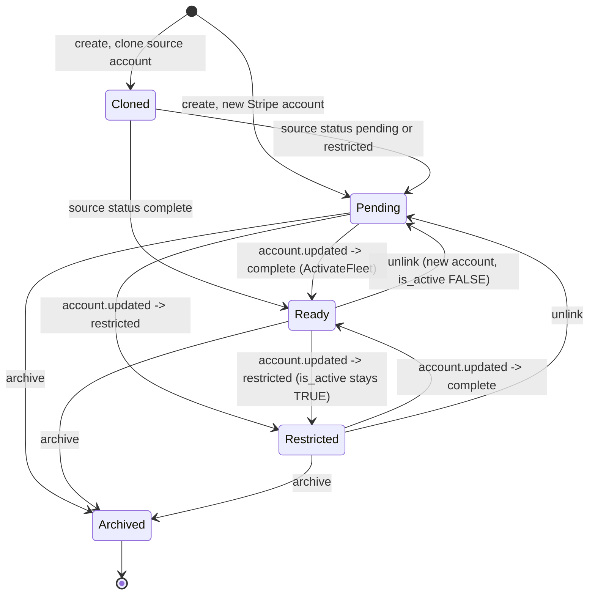

This page follows a fleet from creation to archival, with the Stripe side of each step. For payout routing on rides, see [Membership and payout routing](/engineering/fleets/membership-and-payout-routing). For the admin UI, see [Fleets](/dashboard/fleets).

## State model

A fleet-merchant fleet moves through these combinations of `is_active`, `stripe_status`, and `deleted_at`. Owner-operator fleets are created as `is_active = TRUE`, `stripe_status = 'not_required'`, and only leave that state on archive.

| State | `is_active` | `stripe_status` | Payout-ready |
| --- | --- | --- | --- |
| Pending | `FALSE` | `pending` | No |
| Ready | `TRUE` | `complete` | Yes, if `has_custom_payouts` |
| Restricted | Unchanged, usually `TRUE` | `restricted` | No |
| Archived | `FALSE` | Unchanged | No |

The dashboard list derives its badge in `StatusBadge` (`yelo-web/src/sites/dashboard/pages/ManageFleetsPage.tsx`) in this priority: deleted, `restricted`, `pending`, `is_active`, otherwise inactive. The list query excludes archived fleets, so the **Deleted** branch never renders.

## Create

`POST /dashboard/communities/{id}/fleets` is admin only. `CreateFleetAPIRequest.Validate` requires a name, a valid `payment_model`, and at least one supported type. `DashboardService.CreateFleet` in `internal/service/dashboard/fleet.go` then:

<Steps>
  <Step title="Validate vehicle types">
    `validateVehicleTypes`: every type is valid and the primary type is in the supported list.
  </Step>
  <Step title="Resolve the clone source">
    With `source_fleet_id`, loads the source (`GetFleetByID`, which returns deleted fleets) and rejects it if `deleted_at` is set.
  </Step>
  <Step title="Set up Stripe">
    `setupStripeForCloneOrNew`:
    - Owner-operator: `stripe_status = 'not_required'`, `is_active = TRUE`, no Stripe call.
    - Fleet-merchant cloning a source that has an account: copies `stripe_merchant_id` and `stripe_status`, sets `is_active` to whether the source is `complete`, and stores no onboarding URL.
    - Otherwise: `CreateFleetExpressAccount` (Express, US, `card_payments` and `transfers` requested, business type `company`), then an Account Link with `collection_options.fields = eventually_due`. The refresh URL is `cfg.Stripe.ReturnUrl + "?fleet=<id>"`. The fleet starts as `pending` and inactive. If the link fails, the new account is deleted.
  </Step>
  <Step title="Insert">
    `sqlDashboardRepository.CreateFleet` locks the community (`archived_at IS NULL`), inserts the fleet, and inserts a `fleet_creation` service row for the home community in one transaction. If the insert fails, the new Stripe account is deleted.
  </Step>
  <Step title="Seed pricing">
    Outside that transaction. With a source and `copy_pricing_from_source` not `false`, `copyPricingFromSourceFleet` copies the source fleet's first open price per supported type from the source's home community into the new fleet's home community, falling back to community pricing per type. Otherwise `copyPricingToFleet` copies, for each supported type, the first open row of that type from any other fleet in the community.
  </Step>
</Steps>

`has_owner_operators` is set to `payment_model == owner_operator`, and `requires_confirmation_code` defaults to `TRUE`.

## Update

`PATCH /dashboard/communities/{id}/fleets/{fleet_id}` is allowed for admins and the fleet's own managers. See [Manager authorization](/engineering/fleets/dashboard-authorization). The path community must be the home community.

`UpdateDashboardFleet` is a `COALESCE` partial update over `name`, `logo_url`, `primary_vehicle_type`, `supported_vehicle_types`, `has_custom_payouts`, `requires_confirmation_code`, `is_student_only`, and `has_owner_operators`. `payment_model`, `community_id`, and the Stripe columns can't be changed here.

When `supported_vehicle_types` changes, `applyVehicleTypeUpdates` runs **before** the fleet row is written:

- Added types go through `copyPricingToFleet` into the home community.
- Removed types go through `expirePricingForFleet`, which ends the fleet's first open price row of each removed type in the home community.

Price changes only touch the home community. Prices in other service communities are left open for removed types.

Effects of the toggles:

| Field | Immediate effect |
| --- | --- |
| `has_custom_payouts` | Changes payout readiness, joinability, and routing for the next authorization. Turning it off on a fleet-merchant fleet makes its fleet-managed drivers read as `pending` and blocks them from going online. Turning it on for an owner-operator fleet disables invitations. |
| `requires_confirmation_code` | Applies to rides confirmed afterwards. Existing rides keep their code. |
| `is_student_only` | Applies to the next rider options request, including the verified-student badge. |
| `name` | Changes derived `Fleet: <name>` tags immediately. Renaming the `Yelo` fleet changes T0 targeting. |

## Stripe status sources

| Source | Code | Effect |
| --- | --- | --- |
| `account.updated` webhook | `PaymentService.AccountUpdated` → `handleFleetAccountUpdated` in `internal/service/payment/payment.go` | Matches every non-archived fleet with this `stripe_merchant_id`. Past-due or currently-due requirements set `restricted`. Payouts disabled sets `pending`. Otherwise `complete`. |
| Daily reconciliation | `reconciliation_jobs.go`, `queries/stripe_reconciliation.sql` | Discovers every non-archived fleet account and re-runs `AccountUpdated` about every 24 hours per account. Accounts Stripe rejects as invalid are rechecked weekly. |
| Refresh link | `RefreshStripeOnboardingLink` | Mints a new Account Link and stores it, keeping the current status. Admin only. |
| Unlink | `UnlinkStripe` | Sets `pending` with a new account. |

On `complete`, `handleFleetAccountUpdated` also:

1. Calls `ActivateFleet` (`is_active = TRUE` where not deleted).
2. Lists `ListEligibleFleetJoinDrivers`: inactive applications whose `payout_fleet_id` is this fleet, with approved profile photo and license and at least one approved available vehicle.
3. Calls `ReconcileDriverActivation` for each, in UUID order. The first error aborts the loop and the remaining fleets.

Non-`complete` statuses never deactivate the fleet. Readiness still fails because it requires `stripe_status = 'complete'`.

If a connected account matches any fleet, the webhook takes the fleet branch and skips the driver branch, even if a user has the same account ID.

### Stripe status for the dashboard

`GetFleetStripeStatus` calls Stripe on every request. It returns `connected: false` if there is no account ID. Otherwise it returns `payouts_enabled`, `charges_enabled`, `disabled_reason`, currently due, past due, and error reasons. It mints an Express login link only when `details_submitted`, and a link failure degrades to no link.

## Unlink

`POST .../stripe/unlink` is allowed for admins and the fleet's managers, for fleet-merchant fleets only. `DashboardService.UnlinkStripe`:

1. `cleanupOrphanedStripeAccount`: if exactly one non-deleted fleet (this one) uses the current account, deletes the account at Stripe. A delete failure is logged and ignored. Shared accounts are never deleted.
2. Creates a new Express account and an Account Link. If the link fails, deletes the new account.
3. `SetDashboardFleetStripeMerchantID`: new account ID, `is_active = FALSE`.
4. `UpdateFleetStripeStatus`: `pending` with the new onboarding URL.

None of these steps are in a database transaction.

## Archive

`DELETE /dashboard/communities/{id}/fleets/{fleet_id}` is allowed for admins and the fleet's managers. The dashboard labels it **Archive fleet**. `sqlDashboardRepository.DeleteFleet` runs one transaction:

<Steps>
  <Step title="Lock the fleet">
    `LockFleetServiceFleet` locks the non-archived fleet row. A missing or already archived fleet returns 404 **fleet not found**.
  </Step>
  <Step title="Check blockers">
    `GetFleetArchiveBlockers` (`queries/fleet_archive.sql`) checks seven conditions. Any hit returns 400 **Cannot archive fleet:** followed by every matching reason.
  </Step>
  <Step title="Archive">
    `DeactivateDashboardFleet` sets `is_active = FALSE`, `deleted_at = NOW()`, `driver_join_code = NULL`, and `driver_join_code_rotated_at = NOW()`. It keeps `stripe_merchant_id`.
  </Step>
  <Step title="Retire dependents">
    `RetireArchivedFleetServices` retires enabled services (`updated_by = 'fleet_archive'`). `EndArchivedFleetPricing` ends current and future price rows at `GREATEST(NOW(), start_time)`. `DisableArchivedFleetWhitelist` deactivates whitelist entries.
  </Step>
</Steps>

| Blocker | Reason text | Resolve by |
| --- | --- | --- |
| Any `FleetDrivers` row with `is_active` | switch drivers who still have this fleet active | Move each driver's active fleet with the membership editor |
| Any `DriverApplications.payout_fleet_id` for the fleet | move remaining driver payout assignments | Select another active fleet for those drivers |
| Any open `DriverSessions` row | end open driver sessions | Drivers go offline, or an admin membership edit takes them offline |
| Any ride not `complete`, `pending_rider_rating`, or `no_drivers_available` | finish or cancel outstanding rides | Finish or cancel the rides |
| Any `Communities.primary_fleet_id` reference | replace community primary-fleet references | Change the community's **Primary Fleet** |
| Any unarchived `FleetVehicles` vehicle, or an archived one still selected in `Users.vehicle_id` | archive or reassign fleet vehicles and clear their selections | Archive or reassign the vehicles |
| Any active `QrPaymentConfigs` row | deactivate fleet QR payment links | Deactivate the payment links |

After archive:

| Object | State |
| --- | --- |
| Stripe account | Not deleted. The reference stays on the fleet row for history, but webhooks and reconciliation ignore archived fleets. |
| Inactive `FleetDrivers` rows | Kept. The membership editor lists them as archived. They grant no shared-vehicle access and can't be selected. |
| `FleetCommunityServices` | Retired. `CalendarConnections` stop syncing. |
| `RidePriceParameters` | Ended. |
| `driver_join_code` | Cleared. The Dub short link isn't touched and previews as 404. |
| `FleetDriverWhitelist` | Deactivated. |
| New references | Rejected by the [archive guards](/engineering/fleets/data-model#archive-guards). |

## Where this lives in code

| Concern | Path |
| --- | --- |
| Lifecycle service | `yelo-api/internal/service/dashboard/fleet.go` |
| Lifecycle SQL | `CreateDashboardFleet`, `UpdateDashboardFleet`, `DeactivateDashboardFleet`, `SetDashboardFleetStripeStatus`, `ActivateDashboardFleet`, `SetDashboardFleetStripeMerchantID` in `yelo-api/internal/data/repository/queries/driver_fleet_primitives.sql` |
| Archive checks | `checkFleetArchiveBlockers` in `yelo-api/internal/data/repository/fleet_archive.go`, `queries/fleet_archive.sql`, `migrations/000346_fleet_archive_reference_guards.up.sql` |
| Repository | `yelo-api/internal/data/repository/dashboard.go` |
| Handlers | `yelo-api/internal/server/http/community/community_handler.go`; routes in `community_router.go` (`registerFleetRoutes`) |
| Request validation | `yelo-api/internal/server/http/community/requests/fleet.go` |
| Stripe client | `CreateFleetExpressAccount`, `GetExpressAccountOnboardingLink` in `yelo-api/internal/data/stripe/account.go` |
| Webhook and reconciliation | `yelo-api/internal/service/payment/payment.go`, `reconciliation_jobs.go` |
| Dashboard status badge | `yelo-web/src/sites/dashboard/pages/ManageFleetsPage.tsx` |

## Gotchas and edge cases

- **Unlink deletes before it creates.** If `CreateFleetExpressAccount` or the database update fails after `cleanupOrphanedStripeAccount` deleted the old account, the fleet keeps pointing at a deleted account.
- **Unlink during a ride breaks capture.** Completion recomputes the account from the fleet, so a ride authorized on the old account is captured against the new one.
- **Cloned fleets share one account.** Webhooks update every fleet on the account at once. Unlinking one clone gives it a new account and leaves the shared one in place. A clone stores no onboarding URL, so **Refresh Link** mints one for the shared account.
- **Creation isn't atomic.** Pricing is seeded after the fleet commits. A pricing failure returns an error, but the fleet, its service row, and possibly its Stripe account exist.
- **Price copy and expiry only see active coverage.** `copyPricingToFleet`, `copyPricingFromSourceFleet`, and `expirePricingForFleet` read `GetAllRidePriceParameters`, which joins `ActiveFleetCommunityServices`. A source fleet that is inactive or pending Stripe contributes nothing, and removing a vehicle type from an inactive fleet doesn't end its price row.
- **Pricing tie-breaks are alphabetical.** `copyPricingToFleet` takes the first matching row from `ListDashboardRidePriceParameters`, ordered by fleet name, then vehicle type, then newest start time. A new fleet inherits prices from the alphabetically first fleet that prices the type.
- **Fleet-merchant fleets without custom payouts are never ready.** Creating one with `has_custom_payouts = false` still creates a Stripe account, and the webhook will activate the fleet, but it can't accept joins and its drivers can't use fleet-managed payouts.
- **The Deleted badge is unreachable.** `ListDashboardFleets` filters `deleted_at IS NULL`, so the list never contains an archived fleet.
- **Archive isn't reversible through the API.** Every write query filters `deleted_at IS NULL`, and there is no restore endpoint.
- **Managers can archive their own fleet.** `DeleteFleet` uses `assertFleetAccess`, so the blockers are the only safeguard. See [Manager authorization](/engineering/fleets/dashboard-authorization).
- **Unlink can delete an account an archived fleet still references.** `cleanupOrphanedStripeAccount` counts only non-archived fleets on the account. If the only other fleet sharing it is archived, unlinking deletes the account at Stripe.
- **Webhook activation stops at the first driver error.** `handleFleetAccountUpdated` returns on the first `ReconcileDriverActivation` error, skipping the remaining drivers and fleets on the account until the next webhook or reconciliation.
