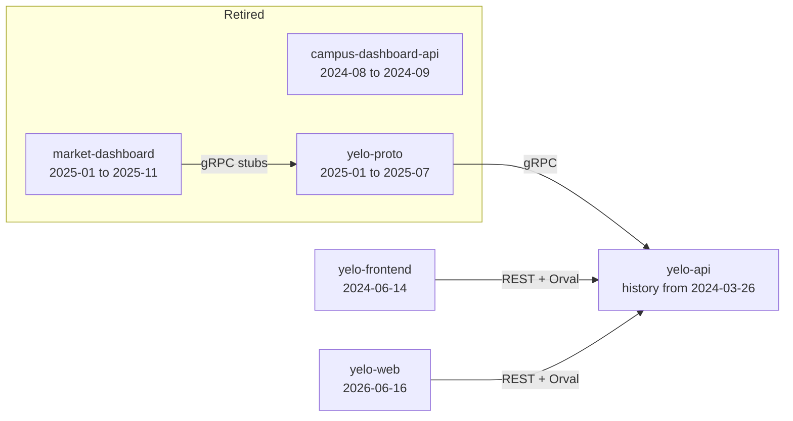

This page traces the major architectural changes across the three Yelo repositories. Every date comes from a commit or a merged pull request. For week-by-week detail since late August 2026, see the [API](/changelog/api), [mobile](/changelog/mobile), and [web](/changelog/web) changelogs. For the reasoning behind the larger changes, see [Architecture decisions](/engineering/history/decisions).

## How dates are chosen

- **GitHub pull requests** use the merge date in UTC. That can be a day after the local commit date.
- **Earlier work** uses the commit date. yelo-api's first GitHub pull request, [#2](https://github.com/rideyelo/yelo-api/pull/2), merged on 2026-01-19. yelo-frontend's first, [#1](https://github.com/rideyelo/yelo-frontend/pull/1), merged on 2025-09-08.
- **Release branches.** From January to August 2026, most API work merged into `dev` or a version branch first, then into `main` through a release pull request. The table notes both where it matters.

| Release PR | Merged into `main` | Carried |
| --- | --- | --- |
| [#12](https://github.com/rideyelo/yelo-api/pull/12) `dev` to `main` | 2026-04-04 | 4.3.x to 4.4.3: pgx pool, advisory locks, OpenTelemetry, fuego, Redis, Clerk, auth v2, ClickHouse deprecation, auto-queue |
| [#17](https://github.com/rideyelo/yelo-api/pull/17) `dev` to `main` | 2026-06-17 | 5.1.0: ClickHouse dependency removal, auth v1 removal, zones groundwork, QR payments, tipping, tiered pricing |
| [#30](https://github.com/rideyelo/yelo-api/pull/30) 5.6.0 to `main` | 2026-08-03 | Zones and zone pricing, friend graph, notification templates on River |

After August 2026, feature branches merge straight into `main` and every merge releases automatically. See [Deployment](/engineering/deployment).

## Repository map

The three archived repositories are `campus-dashboard-api` (Go, "Dashboard for Campus Managers to manage events", last push 2024-09-04), `market-dashboard` (TypeScript, last commit 2025-11-23 on `dev`), and `yelo-proto` (protobuf stubs, last push 2025-07-18).

## 2024: first API and app

| Date | Repo | Milestone | Source |
| --- | --- | --- | --- |
| 2024-03-26 | api | Git history begins with the initial Go commit on Go 1.22. The GitHub repository was created on 2024-05-28. | `46696880` |
| 2024-04-11 | api | Three-layer structure (handlers, services, storage) set up. | `cc1a9dbb` "Set up 3 layer architechture" |
| 2024-05-09 | api | pgx v5 and gofrs UUIDs adopted with the first user endpoint. | `31f378ec` |
| 2024-05-20 | api | First Google Cloud deployment configuration (`.gcloudignore`). | `8b9e0115` |
| 2024-05-25 | api | SendGrid mail client added for email OTPs. | `ea2868f6` |
| 2024-06-14 | frontend | Repository created as an Expo SDK 51, React Native 0.74 app. | `5986ea59` |
| 2024-06-15 | api | Stripe PaymentIntents added. | `e276870f` |
| 2024-06-23 | api | First golang-migrate migration, `000001_init_db`. | [Migrations log](/engineering/history/migrations-log#foundation-2024) |
| 2024-06-30 | api | PostHog wired into the logger. | `debedeab` |
| 2024-08-04 | api | Twilio phone OTP endpoints. | `2341607c` |
| 2024-08-13 | api | `DashboardUsers` table for the first password-based dashboard. | Migration 038 |
| 2024-08-15 | api | ClickHouse connection added. Messages, follows, notification logs, and request logs move there over the next months. | `eb7bc428` |
| 2024-08-24 | api | Expo push notification sending. | `005e1999` |

## 2025: dashboards, Cloud Run, and fleets

| Date | Repo | Milestone | Source |
| --- | --- | --- | --- |
| 2025-01-21 | api | Dashboard gRPC server with protobuf definitions, moved into a `yelo-proto` submodule the next day. `market-dashboard` and `yelo-proto` were created on 2025-01-22. | `64b6c7ab`, `bc68caa5` |
| 2025-01-24 | api | Driver application state moves from `Users` into `DriverApplications`. | Migrations 116, 117 |
| 2025-03-01 | api | Go 1.23. | `6066ab1c` |
| 2025-07-18 | api | Deployment switches to Cloud Run with a Dockerfile. | `325dc315` |
| 2025-07-25 | api | The in-process `internal/dashboard` gRPC handlers are deleted. | `39dbf0c9` |
| 2025-08-31 | api | Fleets: `Fleets`, `FleetDrivers`, `FleetVehicles`, and a community primary fleet. | Migration 157 |
| 2025-09-08 | frontend | First GitHub pull request, "New feed + 1000 things", on Expo SDK 53. | [#1](https://github.com/rideyelo/yelo-frontend/pull/1) |

## January to April 2026: API rebuild

| Date | Repo | Milestone | Source |
| --- | --- | --- | --- |
| 2026-01-29 | api | `pgxpool` owns connection acquire and release; configuration centralized. | `17ac60b3`, via [#3](https://github.com/rideyelo/yelo-api/pull/3) |
| 2026-02-03 | api | Ride locking moves from an in-memory `sync.Mutex` to PostgreSQL advisory locks. Go 1.24. | `c2768072`, via #3 |
| 2026-02-05 | api | Dependency injection for clients and repositories, mockery mocks, testcontainers, stricter lint. | `270a9a23`, `8b5adaa0` |
| 2026-02-07 | api | OpenTelemetry and Prometheus, deep health checks, request and user ID middleware. | `728ce7cd` |
| 2026-02-09 | api | **Breaking.** swag replaced by fuego for OpenAPI generation, validation, and handler registration. Go 1.25.7. | `e6e72539` |
| 2026-02-11 | frontend | Expo SDK 54. | `17b8a1db` |
| 2026-02-17 | api | Dashboard service and first REST dashboard endpoints in the API. | `dcdbe833` |
| 2026-02-17 | frontend | Generated API client switches to Orval. | `9f6d226a` |
| 2026-02-18 | api | Redis holds distributed ride board and fee state. | `5cc3c6b4` |
| 2026-03-02 | api | Clerk SDK; dashboard routes move behind Clerk middleware. | `baf8b941`, `3e1f1a7e` |
| 2026-03-06 | api | Auth v2 routes (`/authv2/*`) with presignup tokens. | [#4](https://github.com/rideyelo/yelo-api/pull/4), `b8de2101` |
| 2026-03-07 | api | Fleet driver email whitelist. | [#7](https://github.com/rideyelo/yelo-api/pull/7) |
| 2026-03-11 | api | Custom Expo push service replaces the `oliveroneill` Expo SDK. | `4aae3c49` |
| 2026-03-20 | api | Logging middleware and ClickHouse request repository removed. | `27460e18`, via [#9](https://github.com/rideyelo/yelo-api/pull/9) |
| 2026-03-21 | api | ClickHouse data moves to Postgres tables. | `857d3043`, migrations 174, 180 |
| 2026-03-21 | frontend | Expo SDK 55. | `3b003a0c` |
| 2026-03-23 | api | Sentry, Jaeger, pprof, and Redis and pgx tracing. | `cc498d67` |
| 2026-04-04 | api | Auto-queue. `dev` merges into `main`. | [#10](https://github.com/rideyelo/yelo-api/pull/10), [#12](https://github.com/rideyelo/yelo-api/pull/12) |
| 2026-04-11 | api | GitHub Actions CI begins. | `6ce5445b` |
| 2026-04-15 | api | ClickHouse client removed from `go.mod`. Go 1.26. | `76730a79`, via [#16](https://github.com/rideyelo/yelo-api/pull/16) |

## June to August 2026: yelo-web, River, and auth v3

| Date | Repo | Milestone | Source |
| --- | --- | --- | --- |
| 2026-06-16 | web | yelo-web created as a multisite Vite project with `dashboard`, `drive`, `event`, `pay`, and `signup` sites. The dashboard is a Clerk-authenticated admin app. | `cb72e4f` |
| 2026-06-16 | api | Auth v1 (`/auth/*`: phone and email OTP, OAuth, waitlist) removed. | `e6d345b5`, via #16 |
| 2026-06-17 | api | 5.1.0 reaches `main`. | [#17](https://github.com/rideyelo/yelo-api/pull/17) |
| 2026-06-23 | web | Home and Maestro viewer sites. | `360fdd0`, `f6a3a84` |
| 2026-06-26 | web | Orval client generation. | `06baf1a` |
| 2026-06-29 | frontend | Expo SDK 56. | `addfe672` |
| 2026-07-06 | web | `invite` site and guest signup with Google and Apple. | `c28ed25`, `d78ef46` |
| 2026-07-14 | api | Notifications move onto a durable delivery pipeline on River. | `8de5bca4` |
| 2026-07-15 | web | World Cup site imported and converted from Next.js to Vite. | `0c54b66` |
| 2026-07-17 | api | Notification template, variant, version, delivery tables and River schema (migrations 237 to 248). | [Migrations log](/engineering/history/migrations-log#zones-social-and-durable-notifications-summer-2026) |
| 2026-07-20 | web | First Cloudflare Worker (World Cup router). | `5b60dfa` |
| 2026-07-21 | frontend | Expo SDK 57. | `1e24aa1f` |
| 2026-07-30 | api, web | River UI embedded in the dashboard behind Clerk. | `8f35ddba`, `26c1793` |
| 2026-08-03 | api | 5.6.0 reaches `main`, including River. | [#30](https://github.com/rideyelo/yelo-api/pull/30) |
| 2026-08-05 | api | Auth v3: web-native Google, Apple, and phone flows with transactions and handoff codes. | [#37](https://github.com/rideyelo/yelo-api/pull/37) |
| 2026-08-06 | web | Link-preview cards render in a Cloudflare Worker. | [web #20](https://github.com/rideyelo/yelo-web/pull/20) |
| 2026-08-14 | web | Astro landing page replaced by a React landing page. | [web #27](https://github.com/rideyelo/yelo-web/pull/27) |
| 2026-08-17 | frontend | Release version branches replaced by CI-cut tags. | [frontend #380](https://github.com/rideyelo/yelo-frontend/pull/380) |
| 2026-08-18 | web | Nx affected-site deploys and GitHub OIDC for Firebase. | [web #42](https://github.com/rideyelo/yelo-web/pull/42), [web #37](https://github.com/rideyelo/yelo-web/pull/37) |
| 2026-08-20 | api | API quality pass: deny-by-default dashboard scopes, 352 routes cut to 303, legacy notification log tables dropped (migration 264). | [#62](https://github.com/rideyelo/yelo-api/pull/62) |
| 2026-08-24 | api | Deterministic checked-in `openapi.json` and bot pull requests to update consumers. | [#64](https://github.com/rideyelo/yelo-api/pull/64), [#65](https://github.com/rideyelo/yelo-api/pull/65) |
| 2026-08-25 | api | Automated production releases: migrations run as a Cloud Run job, candidates deploy at 0% traffic, smoke tests gate promotion. Auth v3 web refresh sessions. | [#71](https://github.com/rideyelo/yelo-api/pull/71), [#82](https://github.com/rideyelo/yelo-api/pull/82) |
| 2026-08-28 | api | Transactional email moves from SendGrid to Resend; StudID student verification. | [#115](https://github.com/rideyelo/yelo-api/pull/115) |
| 2026-08-31 | api | sqlc pilot on ride history. | [#124](https://github.com/rideyelo/yelo-api/pull/124) |

## September 2026: durable domain systems

| Date | Repo | Milestone | Source |
| --- | --- | --- | --- |
| 2026-09-03 | api | sqlc migration complete: 659 generated statements across 21 query files; the test harness runs in production pgx mode. | [#158](https://github.com/rideyelo/yelo-api/pull/158) |
| 2026-09-03 | api | Isolated E2E control plane that follows production. | [#155](https://github.com/rideyelo/yelo-api/pull/155) |
| 2026-09-03 | frontend | Auth v3 becomes hosted-first with a native fallback. Maestro replaced by agent-device. | [frontend #496](https://github.com/rideyelo/yelo-frontend/pull/496), [frontend #498](https://github.com/rideyelo/yelo-frontend/pull/498) |
| 2026-09-03 | web | Unused `pay` and `drive` sites removed; Clerk Core 3. Maestro viewer replaced by shareable run reports. | [web #93](https://github.com/rideyelo/yelo-web/pull/93), [web #97](https://github.com/rideyelo/yelo-web/pull/97) |
| 2026-09-04 | api | sqlc parity oracles and migration tooling retired. Fleet driver invitation links. | [#159](https://github.com/rideyelo/yelo-api/pull/159), [#163](https://github.com/rideyelo/yelo-api/pull/163) |
| 2026-09-07 | api | Durable ride messaging: ordinals, read state, idempotent sends, push-triggered sync. | [#170](https://github.com/rideyelo/yelo-api/pull/170) |
| 2026-09-08 | api | Student verification separated from geographic community assignment. Stripe account reconciliation and Quo pacing move onto River. Driver leads CRM. | [#172](https://github.com/rideyelo/yelo-api/pull/172), [#173](https://github.com/rideyelo/yelo-api/pull/173), [#174](https://github.com/rideyelo/yelo-api/pull/174) |
| 2026-09-11 | api | Recent location sync. | [#187](https://github.com/rideyelo/yelo-api/pull/187) |
| 2026-09-15 | api | Fleet schedules import from Google Calendar; community timezones derived from bounds; waitlisting retired. | [#197](https://github.com/rideyelo/yelo-api/pull/197) |
| 2026-09-17 | api | Contact sync engine for Resend and Quo. Application-owned place identity. Marketing segments. Dashboard community and fleet scopes enforced. | [#227](https://github.com/rideyelo/yelo-api/pull/227), [#238](https://github.com/rideyelo/yelo-api/pull/238), [#239](https://github.com/rideyelo/yelo-api/pull/239), [#228](https://github.com/rideyelo/yelo-api/pull/228) |
| 2026-09-18 | api | Fleet-owned shared vehicles and mobile-owned vehicle artwork catalogs. | [#242](https://github.com/rideyelo/yelo-api/pull/242) |
| 2026-09-19 | api | Owner-operator fleet joins. Ride state protocol: revisions, assignment generations, and authoritative snapshots. Minimum app version 5.7.3. | [#251](https://github.com/rideyelo/yelo-api/pull/251), [#253](https://github.com/rideyelo/yelo-api/pull/253) |
| 2026-09-19 | frontend | Rider and driver flows recover from authoritative ride state. | [frontend #628](https://github.com/rideyelo/yelo-frontend/pull/628) |
| 2026-09-25 | api | Canonical, opt-in community top locations. Fleet membership editing and archive guards. | [#265](https://github.com/rideyelo/yelo-api/pull/265), [#273](https://github.com/rideyelo/yelo-api/pull/273) |
| 2026-09-26 | api, web | Live market operations replace supply and demand (`/dashboard/live/*`, `/live`). Guarded silent ride cancellation. | [#277](https://github.com/rideyelo/yelo-api/pull/277), [web #158](https://github.com/rideyelo/yelo-web/pull/158), [#278](https://github.com/rideyelo/yelo-api/pull/278) |

## Toolchain versions over time

| Component | Progression |
| --- | --- |
| Go | 1.22.0 (2024-03) → 1.23.0 (2025-03-01) → 1.24.1 (2026-02-03) → 1.25.7 (2026-02-09) → 1.26.1 (2026-04-15) → 1.26.2 (2026-05-05) → 1.26.5 (2026-08-06) |
| HTTP framework | chi router (2024-03) → swag annotations for OpenAPI (2026-02-07) → fuego for routing, validation, and OpenAPI (2026-02-09). fuego v0.20.0 since 2026-08-06. A few middlewares still import chi. |
| Data access | Hand-written pgx SQL → sqlc for every repository statement (2026-09-03). |
| Background work | In-process tickers and goroutines → River on Postgres (2026-07-14 onward). |
| Analytics store | ClickHouse (2024-08-15) → Postgres tables (2026-03-21), dependency removed 2026-04-15. |
| Email | SendGrid (2024-05-25) → Resend (2026-08-28). |
| Dashboard auth | `DashboardUsers` passwords (2024-08) → Clerk (2026-03-02). |
| Rider and driver auth | v1 `/auth/*` → v2 `/authv2/*` (2026-03-06) → v3 `/authv3/*` (2026-08-05). v1 removed 2026-06-16. v2 still serves some flows; see [Deprecated and legacy](/engineering/history/deprecated-and-legacy#auth-v2). |
| Expo SDK | 51 (2024-06) → 53 (2025-09) → 54 (2026-02) → 55 (2026-03) → 56 (2026-06) → 57 (2026-07) |
| Mobile E2E | Maestro (2026-03-10) → agent-device (2026-09-03) |
