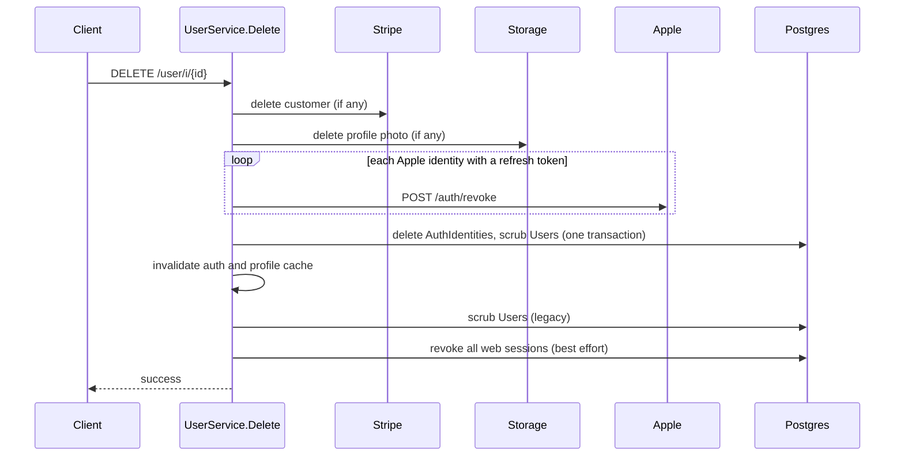

Account deletion is a soft delete. The `Users` row stays, with personal fields blanked and `is_deleted = true`. Login identities are hard-deleted so the same Apple, Google, or phone identity can create a fresh account later.

## Entry points

| Surface | Request | Credential |
| --- | --- | --- |
| Mobile account deletion modal (`components/modals/AccountDeletion.tsx`) | `DELETE /user/i/{id}` | Full user JWT |
| Web `/delete-account` page | Auth v2 phone OTP, then `DELETE /user/i/{id}` | Full JWT from Auth v2 phone verification |

`UserHandler.Delete` in `internal/server/http/user/user_handler.go` ignores the `{id}` path parameter. It always deletes the authenticated caller, even though the route description in `user_routes.go` says admins can call it. No admin or dashboard deletion endpoint exists.

## Order of operations

`UserService.Delete` in `internal/service/user/user.go` runs these steps in order. Any error stops the sequence and returns to the client.

<Steps>
  <Step title="Load the user">
    `GetByID`. A missing user returns 404.
  </Step>
  <Step title="Delete the Stripe customer">
    If `stripe_customer_id` is set, call Stripe `Customers.Del`. The Connect Express account in `stripe_merchant_id` is not touched.
  </Step>
  <Step title="Delete the profile photo">
    If `photo_url` is set, call `StorageClient.DeleteFile` with `["profile_pictures", <user id>, <last path segment of photo_url>]`. The storage wrapper passes those three strings to storage-go `RemoveFile` without joining them, and each element is treated as a full object path, so nothing matches and no file is removed. The thumbnail isn't targeted.
  </Step>
  <Step title="Revoke Apple and remove identities">
    `IdentityLifecycle.PrepareUserDeletion` in `internal/service/authv3/identity_lifecycle.go` lists the user's `AuthIdentities`. For each Apple identity with an encrypted refresh token, it decrypts the token and calls Apple's `/auth/revoke`. Any decrypt or revoke failure returns `ProviderUnavailable` (503) and stops before touching the database. Then `DeleteIdentitiesAndScrubUser` deletes every identity and scrubs the user in one transaction.
  </Step>
  <Step title="Invalidate caches early">
    The auth cache and profile cache are invalidated immediately after the identity transaction commits, so a later failure can't leave a cached, authenticated session.
  </Step>
  <Step title="Scrub again">
    `DeletePersonalDetails` runs `ScrubUserPersonalDetails`, the legacy scrub. It is idempotent with the previous step.
  </Step>
  <Step title="Revoke web sessions">
    `RevokeAllWebSessionsForUser`, best effort. A failure is logged, not returned.
  </Step>
  <Step title="Invalidate caches again">
    Auth cache and profile cache. Friend map data refreshes through `SocialChanged`.
  </Step>
</Steps>

When Auth v3 keys aren't configured (`newAuthV3IdentityLifecycle` returns nil because the subject or rate-limit HMAC key is missing), step 4 is skipped entirely. Identities are **not** deleted in that mode.

## What gets scrubbed

Both scrub queries set these `Users` columns:

| Column | New value |
| --- | --- |
| `first_name`, `last_name` | `''` |
| `email`, `phone_number` | `''` |
| `photo_url`, `photo_thumbnail_url` | `''` |
| `driver_profile_picture_url`, `driver_profile_picture_thumbnail_url` | `''` |
| `is_deleted` | `true` |
| `deleted_at` | Deletion time |

Blanking the email frees the `Users_email_key` unique index. Blanking the phone removes the account from Auth v3 and Auth v2 phone matching.

## What is kept

| Data | Location | Notes |
| --- | --- | --- |
| The `Users` row | `Users` | ID, community, school, account type, `referral_code` and `old_referral_code`, `stripe_customer_id`, `stripe_merchant_id`, `push_notification_token`, last location, `is_test`, timestamps |
| Driver's license photo URLs | `Users.drivers_license_front_url`, `drivers_license_back_url` | Not scrubbed, and the files aren't deleted |
| Rider profile photo and thumbnail files | Storage | The delete call doesn't match any object. Only the URLs are blanked. |
| Driver profile photo file | Storage | Only the URL is blanked |
| Stripe Connect account | Stripe | Not deleted |
| Rides, payments, tips, ratings | Ride and payment tables | Referenced by user ID |
| School proofs | `EducationVerifications` | Including the verified school email and provider subject |
| Legal acceptances | `UserLegalAcceptances` | Immutable record of Terms and Privacy versions |
| Sign-in history | `AuthTransactions`, `AuthHandoffCodes` | Until runtime cleanup deletes them |
| Attribution | `AttributionTouches`, `UserAttribution` | Still bound to the user ID |
| Referrals | `Referrals` | Both directions |
| Driver application | `DriverApplications` | Row kept |
| Denied subjects | `AuthDeniedSubjects` | Unchanged. Deletion never adds one. |

<Note>
Foreign keys on Auth v3 tables are `ON DELETE CASCADE` or `SET NULL` for a hard delete of the `Users` row, per the comment in `migrations/000256_auth_v3_storage.up.sql`. No code path hard-deletes users today.
</Note>

## Why deletion doesn't tombstone

`DeleteIdentitiesAndScrubUser` deliberately writes nothing to `AuthDeniedSubjects`. A phone identity's subject is the phone number, so a tombstone would permanently block that number from signing up again. With identities removed, a returning Apple, Google, or phone identity finds no identity row and no candidate (the scrubbed row has no email or phone), and resolution creates a new account.

## Apple revocation details

- Revocation uses `client_id = AUTH_V3_APPLE_SERVICES_ID` and a fresh ES256 client secret (`AppleClient.RevokeRefreshToken` in `internal/service/authv3/providers/apple.go`). Only HTTP 200 counts as success.
- The refresh token was encrypted with `AUTH_V3_REFRESH_TOKEN_KEYS`. If the key that encrypted it has been removed, decryption fails and deletion is blocked with 503.
- Identities without a stored refresh token (Google, phone, or native Apple sign-ins that sent no authorization code) are simply deleted.

## Effect on live sessions

| Session | After deletion |
| --- | --- |
| Native user JWT | Every JWT-protected call returns 401 `AccountDeletedError`. The app signs out on the first one. |
| Web access token | Same 401. The signup site clears its token and goes to `/`. |
| Web refresh session | Revoked. Any later refresh also fails because the user is deleted. |
| Presignup token | Still accepted by the presignup middleware. `/authv2/status` returns status `deleted`. |
| In-flight Auth v3 transaction | Exchange and resume return 401 `account is unavailable` |

## Web deletion page

The signup site's `/delete-account` flow (`yelo-web/src/sites/signup/delete-account/`) verifies the phone with Auth v2, not Auth v3.

1. `POST /authv2/phone/request-otp`, subject to the Auth v2 limits in [Phone OTP and abuse controls](/engineering/identity/phone-otp-and-rate-limits#auth-v2-legacy-limits).
2. `POST /authv2/phone/verify-otp`. Only a response with `status: authenticated` continues (`classifyVerifyResponse`). That requires a phone, an email, and a completed profile.
3. The user types `DELETE` (case-insensitive, trimmed).
4. `DELETE /user/i/{id}` with the Auth v2 token.

`isAlreadyDeletedError` treats a 401 or 404 on a retry as success, because the account may already be deleted after a partial failure or a lost response.

## Where this lives in code

| Concern | Path |
| --- | --- |
| Deletion service | `UserService.Delete` in `yelo-api/internal/service/user/user.go` |
| Identity lifecycle and Apple revocation | `yelo-api/internal/service/authv3/identity_lifecycle.go`, `yelo-api/internal/service/authv3_identity_lifecycle.go` |
| Identity delete and scrub | `DeleteIdentitiesAndScrubUser` in `yelo-api/internal/data/repository/authv3.go` |
| Legacy scrub | `ScrubUserPersonalDetails` in `yelo-api/internal/data/repository/queries/user_profile.sql` |
| Handler | `yelo-api/internal/server/http/user/user_handler.go` |
| Web page | `yelo-web/src/sites/signup/delete-account/DeleteAccountPage.tsx`, `deleteAccount.ts` |
| Mobile sign-out on deletion | `yelo-frontend/providers/AxiosProvider.tsx`, `yelo-frontend/lib/auth/accountDeleted.ts` |

## Gotchas and edge cases

- **Retries can get stuck on Stripe.** Stripe deletion runs first and `stripe_customer_id` is never cleared. `DeleteCustomer` wraps every Stripe error, including `resource_missing`, as a server error. If the photo step, Apple revocation, or the identity transaction fails, a retry calls Stripe again for the already-deleted customer and likely fails at step 2 every time. Once `is_deleted` commits, retries get 401 from the JWT middleware and never reach Stripe.
- **Native Apple grants are revoked with the web client ID.** `ExchangeNativeCode` obtains the refresh token with `AUTH_V3_APPLE_NATIVE_CLIENT_ID` (the bundle ID), but `RevokeRefreshToken` always sends `AUTH_V3_APPLE_SERVICES_ID`, and `AuthIdentities` stores no client ID per identity. When the two IDs differ, Apple is likely to reject the revocation, which blocks deletion with 503 for every user who signed in natively with an authorization code. This hasn't been confirmed against Apple.
- **Apple outages block deletion.** Revocation is fail-closed by design, so an Apple outage or a bad Apple key returns 503 and leaves the account fully intact.
- **Web deletion excludes most Auth v3 accounts.** Auth v3 phone sign-ups have no email, and Google or Apple sign-ups may have no phone. Neither gets `authenticated` from Auth v2 phone verification, so the web page shows its fallback instead. Those users must delete from the app.
- **Proofs block re-verification.** A retained `EducationVerifications` row keeps its unique provider subject. The same school Google account, Microsoft account, or StudID identity can't verify a new account later (`identity_conflict`). Email code proofs have no subject, so they don't block.
- **License photos survive.** The license URL columns and files aren't removed. Treat this as a retention gap if you answer a data request.
- **Profile photos survive.** The rider profile photo delete passes path segments instead of one joined path, so the original and thumbnail stay in storage.
- **A partially deleted account looks deleted.** Once the identity transaction commits, the user is `is_deleted = true` even if the legacy scrub later fails. Clients must treat 401 `AccountDeletedError` as success.
