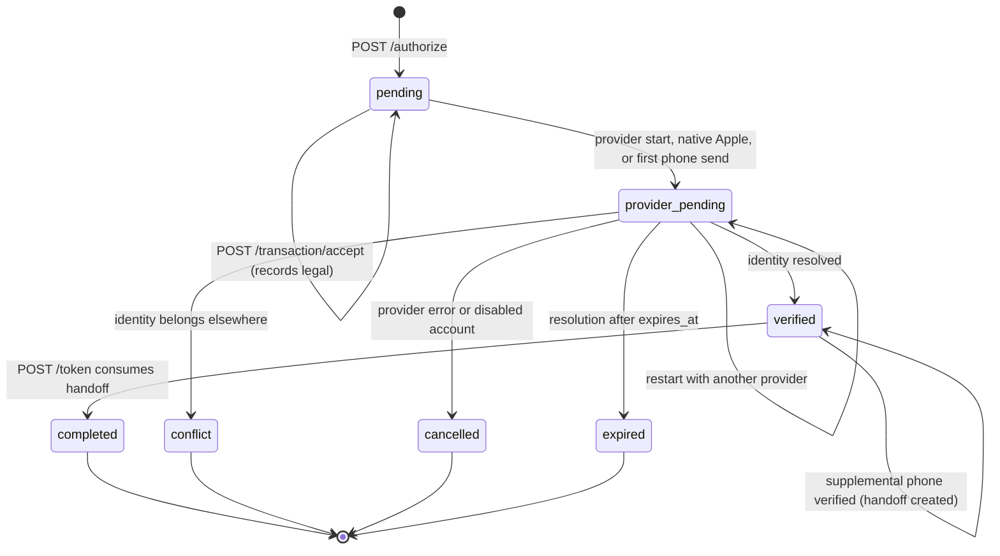

Every Auth v3 sign-in or link is one row in `AuthTransactions`. Each endpoint is a guarded state transition on that row. This page follows a transaction from creation to deletion. For what each provider does in the middle, see [Provider flows](/engineering/identity/provider-flows).

## State machine

Statuses come from `AuthV3TransactionStatus` in `internal/models/authv3.go`. The table's check constraints require a `user_id` and `provider` for `verified` and `completed`, and a `completed_at` for `completed`.

Transitions go through `TransitionActiveAuthV3Transaction`, which only updates the row if its status is in the expected set **and** `expires_at` is still in the future. A transition that loses a race returns no row, and `transactionStateError` in `internal/service/authv3/service.go` re-reads the row to explain why: `AuthTransactionExpired` (410), `IdentityConflict` (409), or a generic 401.

## Secrets and binding

A transaction is protected by three client-held values and one server-held value.

| Value | Who generates it | Stored server-side as | Checked at |
| --- | --- | --- | --- |
| `state` | Client, 32 to 256 unreserved ASCII characters with at least 8 distinct characters (`validateClientState`) | `state_hash` | Accept, provider start, callback, resolution, and by the client on the callback URL |
| PKCE verifier | Client. Only the S256 challenge is sent. The challenge must be exactly 43 base64url characters. | `code_challenge` | `POST /token` |
| Nonce | Server | `nonce_hash` | Provider ID token `nonce` claim |
| Request secret | Server, sealed with `AUTH_V3_STATE_HMAC_KEYS` | `request_secret_hash` (unique) | Every transaction-scoped call via `Authorization: AuthV3 <secret>` |

The request secret is an HMAC-signed JSON envelope (`requestEnvelope` in `internal/service/authv3/types.go`) that contains the client state, the nonce, 32 bytes of entropy, and the expiry. It is signed, not encrypted. `HMACStateCodec.Open` in `internal/service/authv3/state.go` rejects unknown fields, trailing JSON, and tokens over 8,192 characters. Every lookup by secret also re-checks that the envelope's state and nonce hash to the stored values, so a secret can't be replayed against another transaction.

The API returns the secret only inside the `web_url` fragment (`#request=...`). Fragments never reach servers or `Referer` headers. The hosted page strips the fragment with `history.replaceState` before React mounts (`captureAuthV3RequestSecret` in `yelo-web/src/sites/signup/auth-v3/requestSecret.ts`).

## Authorize

`POST /authv3/authorize` (`Service.authorize` in `internal/service/authv3/service.go`) validates in this order, and each failure is a 400:

1. Auth v3 is enabled.
2. `client_id` and `redirect_uri` match the allowlist pair exactly (`ValidateClientRedirect`).
3. The PKCE method is `S256` and the challenge is well formed.
4. The client state passes `validateClientState`.
5. The channel is `app` or `web`.
6. `attempt_id`, if present, is not the nil UUID.

The service then builds the entry URL:

- **App channel:** `AUTH_V3_PUBLIC_WEB_ORIGIN` + `/auth/v3?channel=app&transaction_id=<id>#request=<secret>`. The app's own redirect URI (`com.rideyelo://auth/v3/callback`) is only used for the final callback.
- **Web channel:** the validated `redirect_uri` with any trailing `/callback` removed, so a web client stays on its own allowlisted origin.

The response includes `nonce` only for app transactions. Native Apple needs it; browser flows round-trip it through provider state instead.

`native_phone_step` is stored only when the channel is `app`. On web it is silently dropped.

### Attempt IDs and rotation

Mobile sends an `attempt_id` so that a retried **Get Started** tap doesn't create a pile of orphan transactions. With an attempt ID:

- The nonce and entropy are **derived** from `client_id:attempt_id` with the first state HMAC key (`DeriveOpaque`), instead of random. A retry therefore gets the same nonce.
- `CreateOrRotateAuthV3Transaction` upserts on `(client_id, attempt_id)`. It rotates the secret hash, state hash, PKCE challenge, redirect, and expiry **only if** the existing row is still `pending`, has no `accepted_at`, and hasn't expired.
- If the row has progressed, the upsert returns no row and the API answers `ErrorTypeDuplicate` (409, "Sign in already started"). The mobile client catches the 409 once and retries with a fresh attempt ID (`providers/AuthV3Provider.tsx`).
- If the upsert returns an existing row whose purpose, channel, client, redirect, challenge, state hash, or nonce hash differs from the request, the API returns 400 `attempt_id is already bound to another or inactive authorization`.

<Warning>
Because accept sets `accepted_at`, an attempt can't be rotated after the user taps a method on the hosted page. Any retry after that point must use a new attempt ID.
</Warning>

## Accept legal terms

`POST /authv3/transaction/accept` records Terms and Privacy acceptance and optional attribution. `Service.accept`:

1. Requires `accepted: true` and versions that exactly equal `AUTH_V3_TERMS_VERSION` and `AUTH_V3_PRIVACY_VERSION`.
2. Validates attribution **before** writing anything, so a malformed attribution payload can be fixed and retried atomically. `anonymous_id` (at most 128 characters, no control characters) and `landing_surface` are required when attribution is present. Other fields are trimmed and cut to 256 characters, or 1,024 for `referrer_path`.
3. Locks the transaction row by secret hash.
4. If the transaction is already past `pending`, returns success only when the stored versions exactly match the request and the status is `provider_pending` or `verified`. This lets a hosted page that remounts after a provider round-trip re-send its acceptance. Anything else returns 410.
5. Writes acceptance with `COALESCE`, so the first `accepted_at` and first location win.
6. Creates an `AttributionTouches` row only on the first acceptance.
7. Retries the whole serializable transaction up to 5 times on `40001` or `40P01`.

The HTTP handler also resolves a coarse location from the requester IP (`CoarseIPResolver`) and stores it with `location_source = 'ip'`. A geolocation failure never blocks acceptance.

<Note>
The hosted page calls accept only when the user taps a method, never on page load (`ensureAccepted` in `AuthV3Page.tsx`). The acceptance is the legal record, so it must follow a user action.
</Note>

## Start a provider

`POST /authv3/providers/{google,apple}/start` (`Service.StartProvider`):

- Rejects the phone provider (phone has its own endpoints).
- Allows `pending` and `provider_pending`. Backing out of Google and choosing Apple re-points the same transaction.
- Requires current legal acceptance. Otherwise 400 `legal acceptance is required before provider authentication`.
- Seals a fresh provider state (`authv3-provider-v1`) that carries the transaction ID, provider, client state, nonce, new entropy, and an expiry of `min(now + provider TTL, transaction expiry)`.
- Builds the provider URL **before** transitioning, so a provider metadata outage leaves the transaction untouched.

The phone provider reaches `provider_pending` on the first `phone/send` instead (`PhoneOrchestrator.phoneTransaction`). Native Apple does it in `claimNativeProvider`.

## Callback and resolution

Google redirects with `GET /providers/google/callback`. Apple posts `form_post` to `POST /providers/apple/callback`. Both handlers in `internal/server/http/authv3/handler.go`:

- Reject any query or form key outside a fixed allowlist, and any repeated key.
- Treat a provider `error` as a cancellation. `ResolveProviderFailure` moves `provider_pending` to `cancelled` and never reflects provider error text.
- Call `authenticatedCallback`, which opens the sealed state and requires: the right kind and provider, a transaction whose stored provider matches, matching state and nonce hashes, neither the state nor the transaction expired, and status `provider_pending`.

Then the provider code is exchanged and `ResolveVerifiedIdentity` runs. See [Identity resolution and linking](/engineering/identity/identity-resolution) for the algorithm. On success it sets the transaction to `verified`, copies legal acceptance into `UserLegalAcceptances`, sets `Users.is_terms_agreed`, binds attribution touches to the user, and either creates a handoff code or asks for a phone.

### What the callback redirects to

`callbackRedirect` builds a `303 See Other`:

| Outcome | Redirect |
| --- | --- |
| Success | `<redirect_uri>?code=<handoff>&state=<state>` |
| Failure after the transaction was identified | `<redirect_uri>?error=<stable code>&state=<state>&request_id=<id>` |
| App phone step, `native_phone_step=true` | `<redirect_uri>?step=phone&state=<state>` |
| Phone step, all other cases | `<public web origin>/auth/v3?channel=app&transaction_id=<id>#step=phone` |
| Failure before the transaction was identified | A JSON error, not a redirect |

Stable error codes come from `stableCallbackError`: `identity_conflict`, `account_merge_required`, `verify_existing_account`, `transaction_expired`, `temporarily_unavailable`, or `authentication_failed`. `safeCallbackTarget` refuses `javascript:`, `data:`, `file:`, and `vbscript:` schemes even if they slip into the allowlist.

## Handoff code

`createHandoff` inserts into `AuthHandoffCodes` only when the transaction is `verified`, owned by the same user, and unexpired. The code expires at `min(now + handoff TTL, transaction expiry)`. The table enforces one handoff per transaction (`transaction_id` is unique).

## Token exchange

`POST /authv3/token` (`Service.ExchangeToken` in `internal/service/authv3/token.go`):

1. Validates the client and redirect pair. A mismatch returns `HandoffCodeInvalid` (400), not a redirect error, so the endpoint doesn't reveal which part was wrong.
2. Computes the S256 challenge from `code_verifier`. The verifier must be 43 to 128 unreserved characters.
3. In one serializable transaction, locks the handoff and transaction rows where the code hash, challenge, client ID, and redirect URI all match, the code is unconsumed and unexpired, and the transaction is `verified` and unexpired.
4. Rejects deleted or banned users with 401 `account is unavailable`.
5. Signs the token **inside** the database transaction, before consuming the code. A signing failure can't burn the code.
6. Consumes the code and sets the transaction to `completed` in one statement (`ConsumeAuthV3HandoffCode`).
7. For web transactions, creates a web session and sets the refresh cookie.

The response `status` is `authenticated` only when `profile_completed` is true **and** both names are non-blank. Otherwise it is `needs_profile` with an onboarding token.

<Warning>
Never retry `POST /token`. Its first response may have committed. Mobile uses `POST /transaction/resume` instead, which can mint a fresh handoff for a still-`verified` transaction but never reopens a `completed` one (`lib/auth/resumeTransaction.ts`).
</Warning>

## Resume

`POST /authv3/transaction/resume` authenticates the request secret under a row lock (`Service.Resume` in `internal/service/authv3/resume.go`) and returns one of:

| Status | When |
| --- | --- |
| `needs_provider` | Transaction is `pending` or `provider_pending` |
| `needs_phone` | App transaction, `verified`, and the user is provisional or has no phone |
| `handoff` | `verified` otherwise. A **new** handoff code is created. |
| 410 | `completed`, `conflict`, `expired`, `cancelled`, or past expiry |

<Warning>
`AuthHandoffCodes.transaction_id` is unique, and `CreateAuthV3HandoffCode` has no `ON CONFLICT` clause. Resolution already created a handoff for almost every `verified` transaction, so the `handoff` branch of resume is likely to hit a unique violation and return a 500 instead of a fresh code. No integration test covers resume after a handoff exists. Treat this as a suspected bug when you debug a "lost callback" report.
</Warning>

## Finish profile

`POST /authv3/profile` with the onboarding token (`Service.FinishProfile` in `internal/service/authv3/onboarding.go`):

- Requires the onboarding token's transaction to be `completed`, a `signin` purpose, and owned by the token's user.
- Returns the existing profile unchanged if it is already complete. The call is idempotent for the life of the onboarding token.
- Trims names with Unicode whitespace rules, rejects control characters, and requires 1 to 100 runes each.
- `use_provider_photo` only accepts a photo URL already stored on one of the user's `AuthIdentities` (`IsAuthV3ProviderPhotoTrusted`). The client can't choose an arbitrary URL.
- Generates a referral code under a Postgres advisory lock. A collision returns `ErrorTypeDuplicate`, which the retry loop treats as retryable (up to 5 attempts).
- A referral code captured on the transaction's attribution wins. Presenting a **different** code returns 400 `referral code is already bound to this sign-in`. Self-referral and unknown codes return 400 `referral code is invalid`. An existing `Referrals` row is never overwritten.
- Sets `profile_completed = true` and clears `auth_v3_provisional`.
- Always issues a **native** user token (6,360 hours), even for web transactions.

## Cleanup

The `AuthV3Runtime` background loop runs `RuntimeCleanupService.Run` every 5 minutes (`cmd/api/main.go`). One Postgres transaction deletes, in order, up to 500 rows of each:

| Rows | Deleted when |
| --- | --- |
| `AuthPhoneAttempts` | `expires_at` has passed |
| `AuthRateLimitCounters` | The window's `expires_at` has passed |
| `AuthHandoffCodes` | 24 hours after expiry, or 24 hours after consumption |
| `AuthTransactions` | 30 days after expiry, and only if no handoff code row remains |

All deletes use `FOR UPDATE SKIP LOCKED`, so the loop never blocks live sign-ins. Deleting a transaction cascades to its phone attempt and handoff code and sets `auth_transaction_id` to null on legal acceptances and attribution touches.

## Where this lives in code

| Concern | Path |
| --- | --- |
| Authorize, accept, provider start, callback | `yelo-api/internal/service/authv3/service.go` |
| State sealing and nonce derivation | `yelo-api/internal/service/authv3/state.go` |
| PKCE and redirect matching | `yelo-api/internal/service/authv3/security.go` |
| Resolution and handoff | `yelo-api/internal/service/authv3/resolver.go` |
| Token exchange | `yelo-api/internal/service/authv3/token.go` |
| Resume | `yelo-api/internal/service/authv3/resume.go` |
| Profile completion | `yelo-api/internal/service/authv3/onboarding.go`, `CompleteAuthV3Profile` in `yelo-api/internal/data/repository/authv3.go` |
| Cleanup | `yelo-api/internal/service/authv3/runtime_cleanup.go`, `DeleteExpiredAuthV3RuntimeState` |
| HTTP handlers and redirects | `yelo-api/internal/server/http/authv3/handler.go` |
| SQL | `yelo-api/internal/data/repository/queries/authv3.sql` |

## Gotchas and edge cases

- **Changing legal versions mid-flight.** A deploy that changes `AUTH_V3_TERMS_VERSION` makes every accepted-but-unresolved transaction fail resolution with `current legal acceptance is required`. The user must restart.
- **Rotating the first state HMAC key.** Derived nonces change, so a pending attempt that retries authorize with the same attempt ID gets 400 (nonce hash mismatch). Existing secrets still verify with the old key.
- **Mobile and server TTLs differ.** Mobile keeps attempts and drafts for 15 minutes (`AUTH_V3_ATTEMPT_TTL_MS`, `AUTH_V3_TRANSACTION_TTL_MS`), but the server transaction TTL defaults to 10 minutes. Mobile reuses a draft only while it has more than 60 seconds left on the server `expires_at`.
- **Web onboarding tokens last an hour.** For web exchanges, `ExchangeToken` signs the onboarding token with `WebAccessTTL`, not `OnboardingTTL`.
- **Web sessions start before the profile exists.** A web exchange that returns `needs_profile` still creates a web refresh session. Refreshing that session mints a full `user` token even though the profile isn't complete, because `RefreshWebSession` doesn't check `profile_completed`.
- **Expired status is rarely written.** Most expired transactions stay in their last live status. `expired` is only written when resolution happens after expiry. Cleanup finds stale rows by `expires_at`, not by status.
- **Accepting twice is safe, changing versions isn't.** Re-accepting with the same versions is idempotent. Re-accepting a `pending` transaction with different versions returns 401 `auth transaction could not be accepted`, because `AcceptAuthV3Transaction` refuses to rewrite existing acceptance.
