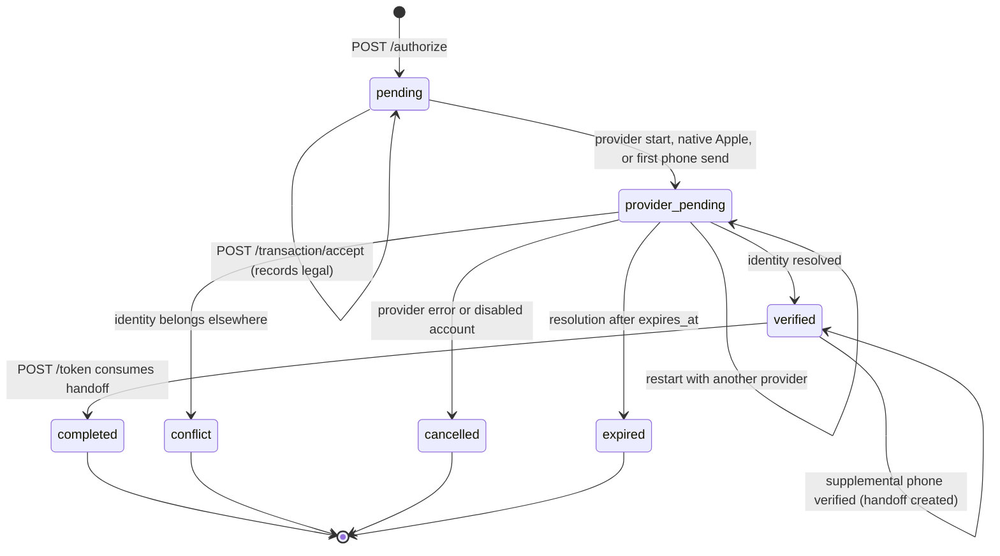
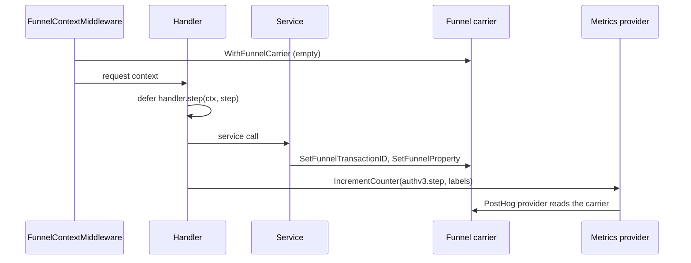

Every Auth v3 sign-in or link is one row in `AuthTransactions`. Each endpoint is a guarded state transition on that row. This page follows a transaction from creation to deletion. For what each provider does in the middle, see [Provider flows](/engineering/identity/provider-flows).

## State machine


```mermaid
stateDiagram-v2
  [*] --> pending: POST /authorize
  pending --> pending: POST /transaction/accept (records legal)
  pending --> provider_pending: provider start, native Apple, or first phone send
  provider_pending --> provider_pending: restart with another provider
  provider_pending --> verified: identity resolved
  provider_pending --> conflict: identity belongs elsewhere
  provider_pending --> cancelled: provider error or disabled account
  provider_pending --> expired: resolution after expires_at
  verified --> completed: POST /token consumes handoff
  verified --> verified: supplemental phone verified (handoff created)
  completed --> [*]
  conflict --> [*]
  cancelled --> [*]
  expired --> [*]
```

Statuses come from `AuthV3TransactionStatus` in `internal/models/authv3.go`. The table's check constraints require a `user_id` and `provider` for `verified` and `completed`, and a `completed_at` for `completed`.

Transitions go through `TransitionActiveAuthV3Transaction`, which only updates the row if its status is in the expected set **and** `expires_at` is still in the future. A transition that loses a race returns no row, and `transactionStateError` in `internal/service/authv3/service.go` re-reads the row to explain why: `AuthTransactionExpired` (410), `IdentityConflict` (409), or a generic 401.

## Secrets and binding

A transaction is protected by three client-held values and one server-held value.

| Value | Who generates it | Stored server-side as | Checked at |
| --- | --- | --- | --- |
| `state` | Client, 32 to 256 unreserved ASCII characters with at least 8 distinct characters (`validateClientState`) | `state_hash` | Accept, provider start, callback, resolution, and by the client on the callback URL |
| PKCE verifier | Client. Only the S256 challenge is sent. The challenge must be exactly 43 base64url characters. | `code_challenge` | `POST /token` |
| Nonce | Server | `nonce_hash` | Provider ID token `nonce` claim |
| Request secret | Server, sealed with `AUTH_V3_STATE_HMAC_KEYS` | `request_secret_hash` (unique) | Every transaction-scoped call via `Authorization: AuthV3 <secret>` |

The request secret is an HMAC-signed JSON envelope (`requestEnvelope` in `internal/service/authv3/types.go`) that contains the client state, the nonce, 32 bytes of entropy, and the expiry. It is signed, not encrypted. `HMACStateCodec.Open` in `internal/service/authv3/state.go` rejects unknown fields, trailing JSON, and tokens over 8,192 characters. Every lookup by secret also re-checks that the envelope's state and nonce hash to the stored values, so a secret can't be replayed against another transaction.

The API returns the secret only inside the `web_url` fragment (`#request=...`). Fragments never reach servers or `Referer` headers. The hosted page strips the fragment with `history.replaceState` before React mounts (`captureAuthV3RequestSecret` in `yelo-web/src/sites/signup/auth-v3/requestSecret.ts`).

## Authorize

`POST /authv3/authorize` (`Service.authorize` in `internal/service/authv3/service.go`) validates in this order, and each failure is a 400:

1. Auth v3 is enabled.
2. `client_id` and `redirect_uri` match the allowlist pair exactly (`ValidateClientRedirect`).
3. The PKCE method is `S256` and the challenge is well formed.
4. The client state passes `validateClientState`.
5. The channel is `app` or `web`.
6. `attempt_id`, if present, is not the nil UUID.

The service then builds the entry URL:

- **App channel:** `AUTH_V3_PUBLIC_WEB_ORIGIN` + `/auth/v3?channel=app&transaction_id=<id>#request=<secret>`. The app's own redirect URI (`com.rideyelo://auth/v3/callback`) is only used for the final callback.
- **Web channel:** the validated `redirect_uri` with any trailing `/callback` removed, so a web client stays on its own allowlisted origin.

The response includes `nonce` only for app transactions. Native Apple needs it; browser flows round-trip it through provider state instead.

`native_phone_step` is stored only when the channel is `app`. On web it is silently dropped.

### Attempt IDs and rotation

Mobile sends an `attempt_id` so that a retried **Get Started** tap doesn't create a pile of orphan transactions. With an attempt ID:

- The nonce and entropy are **derived** from `client_id:attempt_id` with the first state HMAC key (`DeriveOpaque`), instead of random. A retry therefore gets the same nonce.
- `CreateOrRotateAuthV3Transaction` upserts on `(client_id, attempt_id)`. It rotates the secret hash, state hash, PKCE challenge, redirect, and expiry **only if** the existing row is still `pending`, has no `accepted_at`, and hasn't expired.
- If the row has progressed, the upsert returns no row and the API answers `ErrorTypeDuplicate` (409, "Sign in already started"). The mobile client catches the 409 once and retries with a fresh attempt ID (`providers/AuthV3Provider.tsx`).
- If the upsert returns an existing row whose purpose, channel, client, redirect, challenge, state hash, or nonce hash differs from the request, the API returns 400 `attempt_id is already bound to another or inactive authorization`.

<Warning>
Because accept sets `accepted_at`, an attempt can't be rotated after the user taps a method on the hosted page. An expired attempt can't be rotated either. Any retry after that point must use a new attempt ID. Mobile already starts a fresh attempt ID when its draft is marked accepted or the attempt is older than 15 minutes, and retries with a fresh ID once on a 409.
</Warning>

## Accept legal terms

`POST /authv3/transaction/accept` records Terms and Privacy acceptance and optional attribution. `Service.accept`:

1. Requires `accepted: true` and versions that exactly equal `AUTH_V3_TERMS_VERSION` and `AUTH_V3_PRIVACY_VERSION`.
2. Validates attribution **before** writing anything, so a malformed attribution payload can be fixed and retried atomically. `anonymous_id` (at most 128 characters, no control characters) and `landing_surface` are required when attribution is present. Other fields are trimmed and cut to 256 characters, or 1,024 for `referrer_path`.
3. Locks the transaction row by secret hash.
4. If the transaction is already past `pending`, returns success only when the stored versions exactly match the request and the status is `provider_pending` or `verified`. This lets a hosted page that remounts after a provider round-trip re-send its acceptance. Anything else returns 410.
5. Writes acceptance with `COALESCE`, so the first `accepted_at` and first location win.
6. Creates an `AttributionTouches` row only on the first acceptance.
7. Retries the whole serializable transaction up to 5 times on `40001` or `40P01`.

The HTTP handler also asks its `CoarseIPResolver` for a coarse location and stores it with `location_source = 'ip'`. A geolocation failure never blocks acceptance. See [Coarse location for acceptance](#coarse-location-for-acceptance).

<Note>
The hosted page calls accept only when the user taps a method, never on page load (`ensureAccepted` in `AuthV3Page.tsx`). The acceptance is the legal record, so it must follow a user action.
</Note>

## Record an anonymous link touch

`POST /authv3/attribution/touch` (`Handler.RecordTouch`, `Service.RecordTouch`) logs a link landing before any transaction exists. Landing pages on `joinyelo.com` (invite, QR, tip, and claim pages) call it on page load. The hosted `/auth/v3` page doesn't, because it reports attribution with acceptance.

- The body is the same attribution object accept takes, with the same validation. `anonymous_id` and `landing_surface` are required.
- The touch is stored with `auth_transaction_id = NULL` and `user_id = NULL`.
- Rate scope `attribution_touch` allows 120 requests per 10 minutes.
- The call isn't counted in the funnel step metric, because a landing isn't a sign-in attempt.
- A success returns `{ "success": true }`. The web client sends it with `keepalive` and ignores errors.

```bash
curl -X POST "$API_BASE_URL/authv3/attribution/touch" \
  -H 'Content-Type: application/json' \
  -d '{"anonymous_id":"4f9c2a7e-1b3d-4c8e-9a6f-2d5e7b1c0a93","landing_surface":"/i","referral_code":"SL-7QK2M","utm_medium":"qr"}'
```

## Start a provider

`POST /authv3/providers/{google,apple}/start` (`Service.StartProvider`):

- Rejects the phone provider (phone has its own endpoints).
- Allows `pending` and `provider_pending`. Backing out of Google and choosing Apple re-points the same transaction.
- Requires current legal acceptance. Otherwise 400 `legal acceptance is required before provider authentication`.
- Seals a fresh provider state (`authv3-provider-v1`) that carries the transaction ID, provider, client state, nonce, new entropy, and an expiry of `min(now + provider TTL, transaction expiry)`.
- Builds the provider URL **before** transitioning, so a provider metadata outage leaves the transaction untouched.

The phone provider reaches `provider_pending` on the first `phone/send` instead (`PhoneOrchestrator.phoneTransaction`). Native Apple does it in `claimNativeProvider`.

## Callback and resolution

Google redirects with `GET /providers/google/callback`. Apple posts `form_post` to `POST /providers/apple/callback`. Both handlers in `internal/server/http/authv3/handler.go`:

- Reject any query or form key outside a fixed allowlist, and any repeated key.
- Treat a provider `error` as a cancellation. `ResolveProviderFailure` moves `provider_pending` to `cancelled` and never reflects provider error text.
- Call `authenticatedCallback`, which opens the sealed state and requires: the right kind and provider, a transaction whose stored provider matches, matching state and nonce hashes, neither the state nor the transaction expired, and status `provider_pending`.

Then the provider code is exchanged and `ResolveVerifiedIdentity` runs. See [Identity resolution and linking](/engineering/identity/identity-resolution) for the algorithm. On success it sets the transaction to `verified`, copies legal acceptance into `UserLegalAcceptances`, sets `Users.is_terms_agreed`, binds attribution touches to the user (including unclaimed anonymous touches that share the transaction's `anonymous_id` and are at most 90 days old), and either creates a handoff code or asks for a phone.

### What the callback redirects to

`callbackRedirect` builds a `303 See Other`:

| Outcome | Redirect |
| --- | --- |
| Success | `<redirect_uri>?code=<handoff>&state=<state>` |
| Failure after the transaction was identified | `<redirect_uri>?error=<stable code>&state=<state>&request_id=<id>` |
| App phone step, `native_phone_step=true` | `<redirect_uri>?step=phone&state=<state>` |
| Phone step, all other cases | `<public web origin>/auth/v3?channel=app&transaction_id=<id>#step=phone` |
| Failure before the transaction was identified | A JSON error, not a redirect |

Stable error codes come from `stableCallbackError`: `identity_conflict`, `account_merge_required`, `verify_existing_account`, `transaction_expired`, `temporarily_unavailable`, or `authentication_failed`. `safeCallbackTarget` refuses `javascript:`, `data:`, `file:`, and `vbscript:` schemes even if they slip into the allowlist.

## Handoff code

`createHandoff` inserts into `AuthHandoffCodes` only when the transaction is `verified`, owned by the same user, and unexpired. The code expires at `min(now + handoff TTL, transaction expiry)`. The table enforces one handoff per transaction (`transaction_id` is unique).

## Token exchange

`POST /authv3/token` (`Service.ExchangeToken` in `internal/service/authv3/token.go`):

1. Validates the client and redirect pair. A mismatch returns `HandoffCodeInvalid` (400), not a redirect error, so the endpoint doesn't reveal which part was wrong.
2. Computes the S256 challenge from `code_verifier`. The verifier must be 43 to 128 unreserved characters.
3. In one serializable transaction, locks the handoff and transaction rows where the code hash, challenge, client ID, and redirect URI all match, the code is unconsumed and unexpired, and the transaction is `verified` and unexpired.
4. Rejects deleted or banned users with 401 `account is unavailable`.
5. Signs the token **inside** the database transaction, before consuming the code. A signing failure can't burn the code.
6. Consumes the code and sets the transaction to `completed` in one statement (`ConsumeAuthV3HandoffCode`).
7. For web transactions, creates a web session and sets the refresh cookie.

The response `status` is `authenticated` only when `profile_completed` is true **and** both names are non-blank. Otherwise it is `needs_profile` with an onboarding token.

<Warning>
Never retry `POST /token`. Its first response may have committed. Mobile uses `POST /transaction/resume` instead, which can mint a fresh handoff for a still-`verified` transaction but never reopens a `completed` one (`lib/auth/resumeTransaction.ts`).
</Warning>

## Resume

`POST /authv3/transaction/resume` authenticates the request secret under a row lock (`Service.Resume` in `internal/service/authv3/resume.go`) and returns one of:

| Status | When |
| --- | --- |
| `needs_provider` | Transaction is `pending` or `provider_pending` |
| `needs_phone` | App transaction, `verified`, and the user is provisional or has no phone |
| `handoff` | `verified` otherwise. A **new** handoff code is created. |
| 410 | `completed`, `conflict`, `expired`, `cancelled`, or past expiry |

<Warning>
Known bug: `AuthHandoffCodes.transaction_id` is unique, and `CreateAuthV3HandoffCode` has no `ON CONFLICT` clause. Nothing deletes the existing code first. A transaction stays `verified` after resolution creates its handoff, so the `handoff` branch of resume hits a unique violation (`23505`), which isn't retryable and returns a 500 instead of a fresh code. `resume_test.go` doesn't catch it, because it sets `verified` without a prior handoff and the fake repository doesn't enforce uniqueness. Check for this when you debug a "lost callback" report.
</Warning>

## Finish profile

`POST /authv3/profile` with the onboarding token (`Service.FinishProfile` in `internal/service/authv3/onboarding.go`):

- Requires the onboarding token's transaction to be `completed`, a `signin` purpose, and owned by the token's user.
- Returns the existing profile unchanged if it is already complete. The call is idempotent for the life of the onboarding token.
- Trims names with Unicode whitespace rules, rejects control characters, and requires 1 to 100 runes each.
- `use_provider_photo` only accepts a photo URL already stored on one of the user's `AuthIdentities` (`IsAuthV3ProviderPhotoTrusted`). The client can't choose an arbitrary URL.
- Generates a referral code under a Postgres advisory lock. A collision returns `ErrorTypeDuplicate`, which the retry loop treats as retryable (up to 5 attempts).
- A referral code captured on the transaction's attribution wins. Presenting a **different** code returns 400 `referral code is already bound to this sign-in`. Self-referral and unknown codes return 400 `referral code is invalid`. An existing `Referrals` row is never overwritten.
- If neither the transaction nor the request carries a code, the most recent code on the user's claimed anonymous touches is applied (`applyAuthV3AmbientReferral`). The user never presented that code, so an invalid, self-referring, or conflicting one is silently dropped. Only a server error fails the profile.
- After completion, if any claimed touch carries a `dub_click_id`, a Dub `Sign Up` lead is sent asynchronously with the latest click ID and the user ID.
- Sets `profile_completed = true` and clears `auth_v3_provisional`.
- Always issues a **native** user token (6,360 hours), even for web transactions.

## Cleanup

The `AuthV3Runtime` background loop runs `RuntimeCleanupService.Run` every 5 minutes (`cmd/api/main.go`). One Postgres transaction deletes, in order, up to 500 rows of each:

| Rows | Deleted when |
| --- | --- |
| `AuthPhoneAttempts` | `expires_at` has passed |
| `AuthRateLimitCounters` | The window's `expires_at` has passed |
| `AuthHandoffCodes` | 24 hours after expiry, or 24 hours after consumption |
| `AuthTransactions` | 30 days after expiry, and only if no handoff code row remains |

All deletes use `FOR UPDATE SKIP LOCKED`, so the loop never blocks live sign-ins. Deleting a transaction cascades to its phone attempt and handoff code and sets `auth_transaction_id` to null on legal acceptances and attribution touches.

## Funnel instrumentation

The Auth v3 sign-in and onboarding handlers each report one outcome per call, so you can chart the sign-in funnel without reading `AuthTransactions`. The label and property catalogs live in [Metrics](/reference/metrics#metric-catalog) and [Analytics events](/reference/analytics-events#metrics-provider-events). This section covers how the pieces connect.


```mermaid
sequenceDiagram
  participant M as FunnelContextMiddleware
  participant H as Handler
  participant S as Service
  participant C as Funnel carrier
  participant P as Metrics provider
  M->>C: WithFunnelCarrier (empty)
  M->>H: request context
  H->>H: defer handler.step(ctx, step)
  H->>S: service call
  S->>C: SetFunnelTransactionID, SetFunnelProperty
  H->>P: IncrementCounter(authv3.step, labels)
  P->>C: PostHog provider reads the carrier
```

### Step counter

`handler.step` in `internal/server/http/authv3/telemetry.go` tags the request span with `authv3.step` and returns a finisher. Handlers defer the finisher against a named error return, so every early return is counted exactly once.

The finisher sets the span attribute `authv3.outcome` and increments the counter `authv3.step` by 1 with these labels:

| Label | Value |
| --- | --- |
| `step`, `stage`, `operation` | The step name. All three carry the same value |
| `outcome` | `ok`, or the result of `outcomeFor` |
| `result` | `success` or `failure` |
| `failure_reason` | Empty on success. The same value as `outcome` on failure |

`outcomeFor` returns the error's `ErrorType` for the API's own error type and the literal `error` for anything else. Labels are limited to these closed sets. Transaction IDs, user IDs, phone numbers, provider subjects, and IPs must never become labels.

Steps along the lifecycle on this page:

| `step` | Handler | Lifecycle section |
| --- | --- | --- |
| `authorize` | `Authorize` | [Authorize](#authorize) |
| `accept` | `Accept` | [Accept legal terms](#accept-legal-terms) |
| `provider_start` | `startProvider`, `nativeAppleStart` | [Start a provider](#start-a-provider) |
| `phone_send`, `phone_verify` | `SendPhone`, `VerifyPhone` | [Start a provider](#start-a-provider) |
| `callback` | `GoogleCallback`, `AppleCallback`, `nativeAppleCallback` | [Callback and resolution](#callback-and-resolution) |
| `token` | `Token` | [Token exchange](#token-exchange) |
| `resume` | `Resume` | [Resume](#resume) |
| `profile` | `FinishProfile` | [Finish profile](#finish-profile) |

The other recorded steps are `configuration`, `authorize_link`, `status`, and `community_resolve`. `StepSessionRefresh` (`session_refresh`) is declared, but no handler records it. `RecordTouch`, `RefreshSession`, `LogoutSession`, and the connected-identity and student-verification handlers don't call `handler.step`.

A handler built without `WithMetrics` uses `noopFunnelMetrics` and counts nothing. `internal/server/http/router.go` passes `WithMetrics(s.service.Metrics)` to the public, onboarding, and authenticated route sets.

### Funnel carrier

Handlers learn the transaction ID partway through a request, after the request context exists. A plain context value can't carry it back to the deferred finisher, so `internal/utilities/metrics/funnel.go` uses a mutable carrier.

- `FunnelContextMiddleware` calls `metrics.WithFunnelCarrier` on every request. `router.go` mounts it on the `/authv3` group, which exists only when Auth v3 is enabled.
- `metrics.SetFunnelTransactionID` stores the transaction ID.
- `metrics.SetFunnelProperty` stores one string property. It ignores an empty key or an empty value.
- Both setters do nothing when no carrier is installed.

| Property | Set by |
| --- | --- |
| Transaction ID | `recordTransaction` in the handler package, and `recordTransactionContext` in `internal/service/authv3/telemetry.go` |
| `client_id`, `channel` | `recordFunnelRequest` in `Authorize`, from the request body. `recordTransactionContext` sets them again from the stored transaction |
| `attempt_id` | `recordAttempt`, in both packages |
| `provider` | `recordFunnelProvider`, in the provider start, Google and Apple callback, and phone handlers |
| `auth_surface` | `recordTransactionContext`. `native` for an app transaction with `native_phone_step`, otherwise `hosted` |
| `is_test`, `is_internal` | `recordUserClassification`, after resolution. `is_internal` is true for an `@rideyelo.com` email. The email itself is never recorded |

The transaction ID and attempt ID also go onto the span as `authv3.transaction_id` and `authv3.attempt_id`, so one ID is enough to find the server trace.

### PostHog event

`PostHogMetricsProvider.enqueueCapture` in `internal/utilities/metrics/posthog.go` reads the carrier. For `authv3.step`, it adds `event_schema_version: 2`, `surface: api`, `platform: server`, `environment`, and every carrier property. It adds `transaction_id` and `request_id` when they are known.

The distinct ID is the authenticated user ID when the request has one. Otherwise it is the transaction ID, and with neither it is the shared server identity. The last two set `$process_person_profile: false`, so one sign-in's steps share an ID without creating a person.

The carrier properties reach only PostHog. They never become counter labels.

### Coarse location for acceptance

`TrustedGeoHeaderResolver` in `internal/server/http/authv3/trusted_geo_resolver.go` is the only `CoarseIPResolver` implementation outside test mocks. It feeds [Accept legal terms](#accept-legal-terms), not the funnel event.

`newAuthV3CoarseIPResolver` in `internal/service/authv3_composition.go` builds it only when `AUTH_V3_TRUSTED_GEO_HEADER` is set. An empty value leaves the handler's resolver nil, and `Accept` records no location. Config validation requires the value to be one valid HTTP header name and requires `AUTH_V3_TRUSTED_PROXY_CIDRS`.

`Resolve` trusts the header only from a trusted proxy:

| Condition | Result |
| --- | --- |
| The immediate peer (`RemoteAddr`) isn't in the trusted CIDRs | No location, no error |
| The header is absent | No location, no error |
| The header is repeated, empty, or longer than 128 bytes | Error `trusted geo header is invalid` |
| The value isn't two comma-separated numbers | Same error |
| A number is NaN or infinite, latitude is outside -90 to 90, or longitude is outside -180 to 180 | Same error |
| Otherwise | `CoarseIPLocation` with the latitude and longitude |

The resolver never reads forwarding headers to decide trust, and it never reads the request body. `Accept` calls `AcceptWithServerLocation` only when the resolver returns a location without an error. In every other case it calls plain `Accept`, so a bad header never blocks acceptance.

## Where this lives in code

| Concern | Path |
| --- | --- |
| Authorize, accept, provider start, callback | `yelo-api/internal/service/authv3/service.go` |
| State sealing and nonce derivation | `yelo-api/internal/service/authv3/state.go` |
| PKCE and redirect matching | `yelo-api/internal/service/authv3/security.go` |
| Resolution and handoff | `yelo-api/internal/service/authv3/resolver.go` |
| Token exchange | `yelo-api/internal/service/authv3/token.go` |
| Resume | `yelo-api/internal/service/authv3/resume.go` |
| Profile completion | `yelo-api/internal/service/authv3/onboarding.go`, `CompleteAuthV3Profile` in `yelo-api/internal/data/repository/authv3.go` |
| Cleanup | `yelo-api/internal/service/authv3/runtime_cleanup.go`, `DeleteExpiredAuthV3RuntimeState` |
| HTTP handlers and redirects | `yelo-api/internal/server/http/authv3/handler.go` |
| Funnel step counter | `yelo-api/internal/server/http/authv3/telemetry.go`, `yelo-api/internal/service/authv3/telemetry.go` |
| Funnel carrier and PostHog event | `yelo-api/internal/utilities/metrics/funnel.go`, `yelo-api/internal/utilities/metrics/posthog.go` |
| Coarse location header | `yelo-api/internal/server/http/authv3/trusted_geo_resolver.go` |
| SQL | `yelo-api/internal/data/repository/queries/authv3.sql` |

## Gotchas and edge cases

- **Changing legal versions mid-flight.** A deploy that changes `AUTH_V3_TERMS_VERSION` makes every accepted-but-unresolved transaction fail resolution with `current legal acceptance is required`. The user must restart.
- **Rotating the first state HMAC key.** Derived nonces change. A pending attempt that retries authorize with the same attempt ID still succeeds, because the upsert overwrites `nonce_hash`, `state_hash`, and `code_challenge`, and the client receives the new nonce. Existing secrets still verify with the old key.
- **Mobile follows the server expiry.** The mobile draft uses the server's `expires_at` (10 minutes by default). `AUTH_V3_TRANSACTION_TTL_MS` (15 minutes) is only a fallback when `expires_at` can't be parsed, and `AUTH_V3_ATTEMPT_TTL_MS` (15 minutes) only decides whether the local attempt ID is reused. Mobile reuses a draft only while it has more than 60 seconds left and the same `native_phone_step` value.
- **Web onboarding tokens last an hour.** For web exchanges, `ExchangeToken` signs the onboarding token with `WebAccessTTL`, not `OnboardingTTL`.
- **Web sessions start before the profile exists.** A web exchange that returns `needs_profile` still creates a web refresh session. Refreshing that session mints a full `user` token even though the profile isn't complete, because `RefreshWebSession` doesn't check `profile_completed`.
- **Expired status is rarely written.** Most expired transactions stay in their last live status. `expired` is only written when resolution happens after expiry. Cleanup finds stale rows by `expires_at`, not by status.
- **Accepting twice is safe, changing versions isn't.** Re-accepting with the same versions is idempotent. Request versions that differ from the current config fail validation with 400. A 401 `auth transaction could not be accepted` only happens when the config versions changed after the first accept, because `AcceptAuthV3Transaction` refuses to rewrite existing acceptance.
