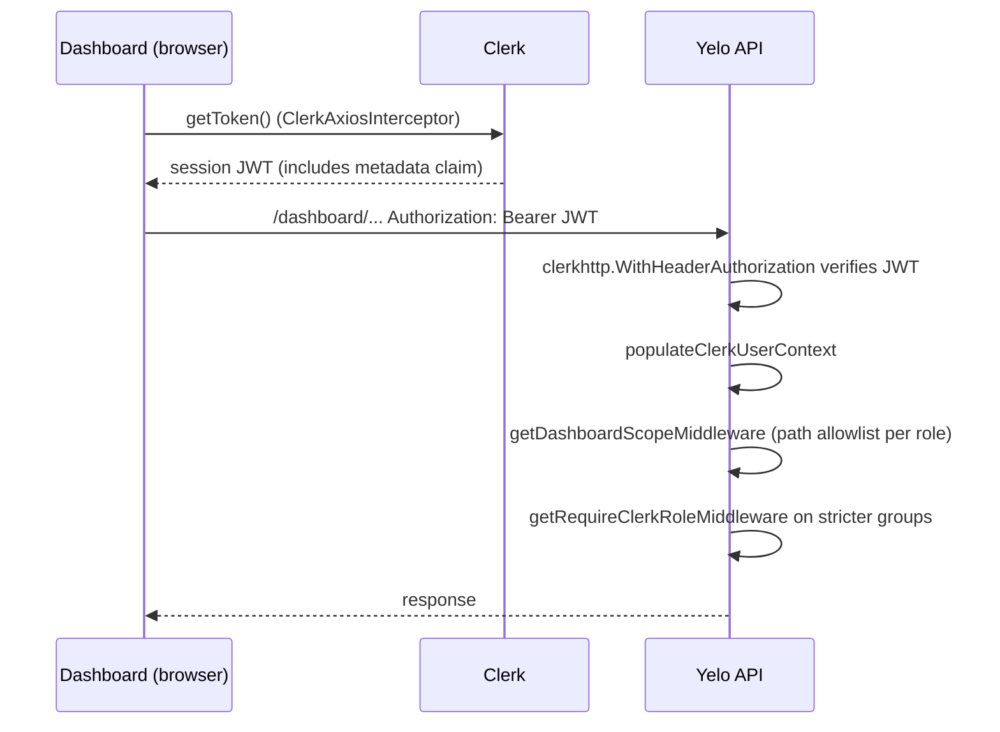

Dashboard staff authenticate with Clerk. Their identity is a Clerk user ID, and their permissions are Clerk **public metadata**. Nothing links a Clerk user to a Yelo `Users` row. For what each role can see, see [Dashboard roles and access](/administration/dashboard-roles). For the API scope gate and role gates, see [Authentication](/engineering/api/authentication#clerk-dashboard-auth).

## Metadata shape

The API and the web app read the same keys:

| Key | Type | Used by |
| --- | --- | --- |
| `role` | `admin`, `intern`, or `fleet` | Everything |
| `community_id` | UUID string | Interns. Also the legacy single-fleet shape. |
| `fleet_id` | UUID string | Legacy single-fleet shape only |
| `fleet_assignments` | Array of `{ fleet_id, community_id }` | Fleet managers |
| `onboarded` | Boolean | Written by invites and updates. Nothing reads it for gating. |

## Where each side reads it

| Side | Source | Code |
| --- | --- | --- |
| API | The `metadata` claim inside the Clerk **session token** | `ClerkCustomClaims` and `populateClerkUserContext` in `internal/server/http/clerk_middleware.go` |
| Web dashboard | `user.publicMetadata` from the Clerk frontend SDK | `useRole` in `yelo-web/src/hooks/useRole.ts` |

<Warning>
The API only sees roles that appear in the session token under a `metadata` claim. Clerk doesn't include public metadata in session tokens by default, so the Clerk instance's session token customization must map public metadata to `metadata`. If that setting is missing or renamed, every dashboard request fails the scope gate with 401 while the web app still renders the right sidebar.
</Warning>

### Claim normalization

`populateClerkUserContext` builds a `ClerkUserContext` in this order:

1. `role` is copied if non-empty.
2. If `fleet_assignments` is non-empty, it wins. `FleetID` and `CommunityID` are copied from the **first** assignment for older handlers.
3. Else if `fleet_id` is set, the legacy pair becomes a one-item assignment list.
4. Else if only `community_id` is set, it's treated as an intern community.

The web hook does the same, but it also drops assignments whose `fleet_id` or `community_id` is empty. The API keeps them and lets the scope gate reject malformed values.

## Request flow

- `ClerkAxiosInterceptor` in `yelo-web/src/lib/clerk-axios-interceptor.tsx` fetches a token for every request. If `getToken` throws, the request is rejected instead of being sent unauthenticated.
- A request without a valid Clerk session returns 401 with an empty body.
- `main.go` calls `clerk.SetKey(CLERK_SECRET_KEY)` only if the key is set. Without it, Clerk verification can't succeed.

## Invite and access endpoints

All three live under `/dashboard/access` (`internal/server/http/dashboard/access/`). Each handler returns 403 unless the caller's role is `admin`.

| Endpoint | Purpose |
| --- | --- |
| `GET /dashboard/access/users?role=<role>` | List Clerk users whose role is `intern`, `fleet`, or `admin` |
| `POST /dashboard/access/invite` | Invite a new user or update an existing one |
| `PATCH /dashboard/access/users/{clerk_user_id}` | Change role, intern community, or fleet assignments |

### Invite

`POST /dashboard/access/invite` takes `email` (required, validated), `role` (`intern`, `fleet`, or `admin`), and optionally `community_id`, `fleet_id`, or `fleet_assignments`. `DashboardService.InviteUser` in `internal/service/dashboard/dashboard.go` branches:

<Tabs>
  <Tab title="Fleet role">
    1. Build assignments from `fleet_assignments`, or from `fleet_id` plus `community_id`.
    2. Look up a Clerk user by email.
    3. **Existing user:** merge the new assignments into the existing list (deduplicated by the `fleet_id` and `community_id` pair), set `role = fleet`, `onboarded = true`, and null the legacy `fleet_id` and `community_id` keys. Returns status `updated`.
    4. **New user:** create a Clerk invitation whose public metadata is `role`, `onboarded`, and `fleet_assignments`.
  </Tab>
  <Tab title="Intern or admin role">
    1. Metadata is `role` and `onboarded = true`, plus `community_id` for an intern when provided.
    2. **Existing user:** update their public metadata directly. Returns status `updated`.
    3. **New user:** create an invitation with `IgnoreExisting`. If Clerk reports the invitation as `accepted` (the user existed after all), look the user up again and update their metadata.
  </Tab>
</Tabs>

The invitation sets no redirect URL, so Clerk's default invitation landing applies. For a new invitee, the code relies on Clerk copying the invitation's public metadata onto the user created from it.

### Update

`UpdateAccessUser` reads the user's current public metadata, then:

- Validates and sets a new `role`, and sets `onboarded = true`.
- For interns, sets `community_id` if provided.
- For fleet managers, **replaces** `fleet_assignments` with the provided list and nulls the legacy keys.

### List

`ListAccessUsers` pages through **every** Clerk user 100 at a time and filters by `role` in memory. Latency grows with the total number of Clerk users.

## Role changes

When metadata changes, the web app remounts the whole data layer: `DashboardSession` keys `DashboardData` on `JSON.stringify([user.id, user.publicMetadata])`, so the React Query client is recreated and cleared (`yelo-web/src/sites/dashboard/main.tsx`). The API sees the change when the browser's Clerk session token is refreshed and includes the new metadata.

## Where this lives in code

| Concern | Path |
| --- | --- |
| Clerk verification and claims | `yelo-api/internal/server/http/clerk_middleware.go` |
| Scope gate | `yelo-api/internal/server/http/dashboard_scope.go` |
| Dashboard routing | `yelo-api/internal/server/http/router.go` |
| Access endpoints | `yelo-api/internal/server/http/dashboard/access/` |
| Invite and update logic | `InviteUser`, `UpdateAccessUser`, `ListAccessUsers` in `yelo-api/internal/service/dashboard/dashboard.go` |
| Request model | `yelo-api/internal/models/invite.go` |
| Web role hook | `yelo-web/src/hooks/useRole.ts` |
| Web gating | `yelo-web/src/sites/dashboard/App.tsx`, `yelo-web/src/sites/dashboard/main.tsx` |
| Invite UI | `yelo-web/src/components/access/InviteUserSheet.tsx`, `yelo-web/src/hooks/useAccess.ts` |

## Gotchas and edge cases

- **Inviting an admin as a fleet manager demotes them.** The fleet branch always writes `role = fleet` for an existing user. Inviting an existing admin's email to a fleet silently removes admin access.
- **Metadata updates merge, they don't replace.** Changing a fleet manager to an intern leaves `fleet_assignments` in their metadata. The API ignores it for interns only because `role` decides which fields matter, and `populateClerkUserContext` still copies the first assignment's `FleetID`.
- **Client and server can disagree for a short time.** The web app reads `publicMetadata` immediately after a change, but the API reads the session token, which only picks up the change after Clerk refreshes it. Right after a role change, the sidebar can show pages whose API calls still return 401.
- **Nothing validates IDs on invite.** `community_id` and `fleet_id` aren't checked for format or existence. A typo produces a user who can sign in but gets 401 on every dashboard call.
- **`onboarded` does nothing.** It's written on every invite and update and read into `ClerkUserContext`, but no handler or route checks it.
- **Unknown roles see "Unauthorized".** A Clerk user with no role can sign in to the dashboard. `RootRoute` shows "You do not have a valid role assigned", and every API call returns 401 from the scope gate.
- **Staff who ride have two accounts.** Clerk sign-in and app sign-in are unrelated. Dashboard actions never act as the staff member's rider account.
