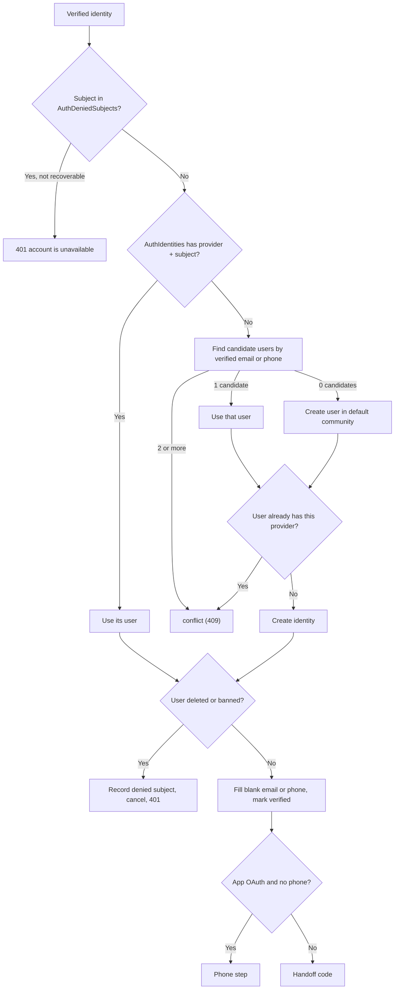
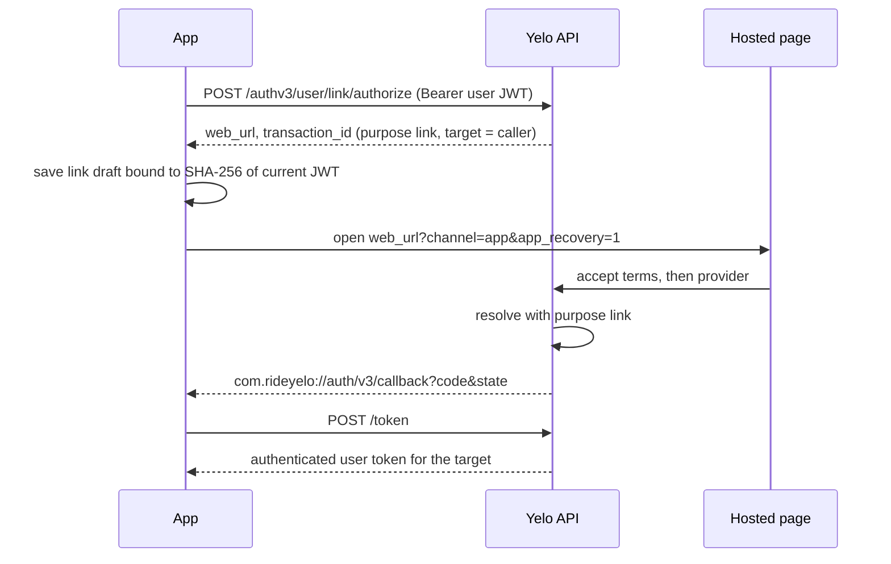

When a provider proves who someone is, `ResolveVerifiedIdentity` in `internal/service/authv3/resolver.go` decides which account that is, or whether to create one. The algorithm is deliberately conservative: it links automatically only when exactly one verified account matches, and it never merges two established accounts.

## Inputs

The resolver receives claims, never raw provider tokens or OTPs:

| Field | Source |
| --- | --- |
| `Provider`, `Subject` | `google` or `apple` with the ID token `sub`, or `phone` with the E.164 number as the subject |
| `Email` | Kept only if the provider marked it verified. Lowercased and trimmed. |
| `PhoneNumber` | Only set for the phone provider, after a successful OTP check |
| Names, photo | Provider claims. Names are at most 100 runes. Photos must be `https` URLs with no user info. |
| `AppleRefreshToken` | Encrypted before it touches the database |

`normalizeVerifiedIdentity` drops an unverified email or phone, so unverified claims never influence matching.

## The algorithm

<Steps>
  <Step title="Pre-checks outside the transaction">
    Validate the claims and the original client state. Look up the HMAC of `(provider, subject)` in `AuthDeniedSubjects`. A non-recoverable hit returns 401 immediately, without touching the transaction. Then `defaultCommunityIfPotentiallyNeeded` loads the default community, but only if this call could create a user: not a link, not a supplemental phone step, no existing identity, and no candidates.
  </Step>
  <Step title="Lock and re-check the transaction">
    In a serializable transaction, lock the `AuthTransactions` row. It must be `provider_pending`, its stored provider must match (except for the supplemental phone step), its state hash must match, it must be unexpired, and legal acceptance must be current. A late resolution transitions it to `expired`.
  </Step>
  <Step title="Re-check denied subjects under lock">
    If the subject was denied between the pre-check and now, cancel the transaction and return 401.
  </Step>
  <Step title="Find the user">
    Look up `AuthIdentities` by `(provider, provider_subject)` with `FOR UPDATE`. If found, that is the user. Otherwise run candidate matching (below).
  </Step>
  <Step title="Refuse disabled users">
    Lock the user row. A missing, deleted, or banned user records a denied subject with reason `disabled_user`, `deleted_user`, or `banned_user`, cancels the transaction, and returns 401 `account is unavailable`.
  </Step>
  <Step title="Write the identity">
    Create the identity, or refresh it. A refresh never erases data: email, phone, names, photo, and the Apple refresh token use `COALESCE`, and the verified flags use `OR`. `last_authenticated_at` always updates.
  </Step>
  <Step title="Fill blank identifiers">
    `FillVerifiedAuthV3UserIdentifiers` writes the verified email or phone to `Users` **only if the column is blank**. It never overwrites an existing value.
  </Step>
  <Step title="Finish">
    Transition to `verified`, copy legal acceptance into `UserLegalAcceptances`, bind attribution, then either create a handoff or send the client to the phone step.
  </Step>
</Steps>

### Retries

The whole transaction retries up to 5 times on serialization failures (`40001`, `40P01`) and on `IdentityConflict` errors raised by unique-constraint races. The backoff is `10ms << attempt` plus random jitter of the same size (`waitForSerializableRetry`). A conflict **decided** by the algorithm (`commitConflict`) is not retried: it commits the `conflict` status and returns 409.

A signup Slack alert is queued only after the transaction commits, only when a user was created, and only when a handoff was reached. Abandoned provisional shells never alert.

## Candidate matching

`FindAuthV3CandidateUserIDs` in `internal/data/repository/queries/authv3.sql` unions two sources:

| Source | Match rule |
| --- | --- |
| `Users` with `is_verified = true` | `lower(btrim(email))` equals the verified email, or the phone equals the verified phone exactly, or the phone's digits equal the E.164 digits, or equal the 10-digit national number |
| `AuthIdentities` | `email_verified = true` and the normalized email matches, or `phone_verified = true` and the phone matches exactly |

Legacy `Users` rows with `is_verified = false` are never candidates, even if their email matches. This stops someone from claiming an old account by owning a provider email that was never proven on that account.

<Note>
Phone matching tolerates legacy formats (`(802) 242-8819`, `8022428819`) through the digits-only index from `migrations/000261_users_phone_digits_index.up.sql`. Email matching tolerates case and surrounding spaces.
</Note>

### Decision table for sign-in

| Existing identity | Candidates | Result |
| --- | --- | --- |
| Found | Not checked | Sign in as its owner |
| None | 0 | Create a user |
| None | 1 | Link the new identity to that user, unless it already has one for this provider (then 409) |
| None | 2 or more | 409 `identity_conflict` |

### New users

`CreateAuthV3CompatibleUser` inserts a `Users` row and an empty `DriverApplications` row in one statement. Defaults: `account_type = 'community'`, `is_verified = true`, `is_terms_agreed = true`, `profile_completed = false`, empty names and referral code, and both `community_id` and `home_community_id` set to the default community. Location-based community resolution runs later. See [Communities and zones](/concepts/communities-and-zones).

## Provisional shells and phone recovery

App-channel Google and Apple sign-ins require a phone. If such a sign-in creates a user, the row is created with `auth_v3_provisional = true` (`migrations/000263_auth_v3_account_recovery.up.sql`). A provisional user can't get a token until the phone step finishes.

If the provider email also belongs to an **unverified** legacy row, the shell is created with a blank email so the unique email index doesn't block it. The verified email stays on the `AuthIdentities` row meanwhile.

When the phone is verified, `resolveSupplementalPhoneInTransaction` runs:

1. The transaction must be unexpired and legally accepted, the user must not be deleted or banned, and the user must still have no phone.
2. Find phone owners: non-deleted `Users` with that number in any format (verified or not), plus identities with that verified phone. Remove the current user.
3. More than one other owner returns 409 `account_merge_required`.
4. One other owner and a non-provisional user also returns 409 `account_merge_required`.
5. Provisional user: call `ResolveProvisionalUser`.
6. If the phone identity already belongs to someone else, return 409 `account_merge_required`. If the user already has a different phone identity, return 409 `identity_conflict`.
7. Create or refresh the phone identity, fill the phone, and create the handoff.

`ResolveProvisionalUser` in `internal/data/repository/authv3.go` either finalizes the shell or folds it into the one existing account that owns the phone:

| Check | Failure |
| --- | --- |
| Transaction is `verified`, `signin`, `app`, Google or Apple, owned by the shell | 401 |
| Shell is still provisional, not deleted, not banned, profile not completed | 409 `account_merge_required` |
| Target is not deleted, banned, or provisional | 409 `account_merge_required` |
| Target has no identity for the same provider with a different subject | 409 `account_merge_required` |

When folding into an existing account, it runs these writes in the same serializable transaction:

1. Clear the verified OAuth email from any **other** unverified, non-deleted legacy row that claims it.
2. Blank the shell's email and phone.
3. Move `AuthIdentities`, `AuthTransactions`, `AuthHandoffCodes`, and `AttributionTouches` to the target.
4. Copy legal acceptances to the target, then delete the shell's copies.
5. Merge `UserAttribution`. The target's first touch wins and the shell's last touch wins.
6. Delete the shell's `DriverApplications` row and scrub the shell as deleted.
7. Finalize the target: fill a blank email and phone, set `is_verified = true`, clear `auth_v3_provisional`.

This is the only automatic account merge in the codebase. It never touches an account with a completed profile as the source.

## Explicit linking

A signed-in user adds a login method from the profile **Accounts** screen (`app/(app)/profile/accounts.tsx`).

Link resolution differs from sign-in:

- The target user comes from the authenticated JWT, never from the request body (`AuthorizeLink`).
- If the identity already exists, it must already belong to the target. Otherwise 409.
- If it doesn't exist, every candidate must be the target. An empty candidate set is fine. Anything else is 409.
- Linking never creates a user and never requires a phone step.
- The target can hold only one identity per provider. Linking a second Google account returns 409.

The mobile link draft is stored under `authv3-link-draft-v1` and is bound to a hash of the session JWT, so a draft started by one account can't complete for another (`yelo-frontend/lib/auth/linkTransaction.ts`). The exchange must return `authenticated`, or the app throws `linked_session_incomplete`.

There is no endpoint to unlink a login identity. `GET /authv3/user/identities` only lists them. `DELETE /authv3/user/student/connections/{provider}` removes school proofs, not login methods.

## Denied subjects

`AuthDeniedSubjects` stores `HMAC(AUTH_V3_SUBJECT_HMAC_KEY, "denied-subject:<provider>" + subject)`, never the raw subject.

| Reason | Written by | Recoverable |
| --- | --- | --- |
| `disabled_user` | Resolution found no user row for an identity | No |
| `deleted_user` | Resolution matched a deleted user | No |
| `banned_user` | Resolution matched a banned user | No |
| `ambiguous_match`, `provider_slot_occupied` | Older builds only. Purged by migration 263. | Yes |

The upsert keeps the first `disabled_user_id` and reason.

<Warning>
Account deletion deliberately writes no tombstone (`DeleteIdentitiesAndScrubUser`). An earlier version did, and because a phone identity's subject is the phone number, deleting an account burned that number for sign-up forever.
</Warning>

## Uniqueness rules

| Rule | Enforced by | Behavior on violation |
| --- | --- | --- |
| One non-empty email per `Users` row | Partial unique index `Users_email_key` on `email` where `email <> ''` (`migrations/000114_email-uniqueness.up.sql`) | 409 `verify_existing_account` (`MapAuthConstraintError`) |
| Phone numbers | Not unique. Only plain and digits-only indexes exist. | Duplicates are possible. Auth v2 phone login returns `IdentityConflict` on two exact matches. |
| One owner per provider subject | `auth_identities_provider_subject_unique` | 409 `identity_conflict` |
| One identity per provider per user | `auth_identities_user_provider_unique` | 409 `identity_conflict` |
| Phone identity shape | `auth_identities_phone_verification_check`: verified, E.164, subject equals phone | Insert fails |
| One school proof per provider per user, one owner per school provider subject | `education_verifications_user_provider_unique`, `education_verifications_provider_subject_unique` | 409 `identity_conflict` |
| One referrer per referee | `Referrals.referee_id` unique | Existing referrer kept |

## Where this lives in code

| Concern | Path |
| --- | --- |
| Resolution algorithm | `yelo-api/internal/service/authv3/resolver.go` (`ResolveVerifiedIdentity`, `resolveInTransaction`, `resolveSupplementalPhoneInTransaction`) |
| Candidate and owner queries | `yelo-api/internal/data/repository/queries/authv3.sql` |
| Provisional merge | `ResolveProvisionalUser` in `yelo-api/internal/data/repository/authv3.go` |
| Constraint mapping | `yelo-api/internal/data/repository/auth_constraint_error.go` |
| Subject hashing | `yelo-api/internal/service/authv3/pseudonym.go` |
| Link endpoints | `yelo-api/internal/server/http/authv3/routes.go`, `handler.go` |
| Mobile linking | `yelo-frontend/lib/auth/linkTransaction.ts`, `yelo-frontend/app/(app)/profile/accounts.tsx` |

## Gotchas and edge cases

- **Unbanning doesn't restore sign-in.** A banned user who tries to sign in gets a permanent `banned_user` tombstone. There is no unban code path, and flipping `is_banned` back to false in the database doesn't remove the tombstone. Delete the `AuthDeniedSubjects` row too, keyed by the HMAC, which you can only compute with the subject key.
- **A ban also burns the phone number.** For a phone identity, the tombstoned subject is the number itself. Nobody can sign up with that number again.
- **Recovery edits unrelated rows.** Folding a shell clears the verified OAuth email from other unverified legacy rows, not just the shell and target.
- **Phone owners include unverified rows, candidates don't.** Phone recovery counts any non-deleted `Users` row with the number. First-time candidate matching counts only `is_verified` rows. An unverified legacy row can therefore block an OAuth sign-up with `account_merge_required` at the phone step when the user isn't provisional or there are two or more owners. For a provisional shell with exactly one other owner, that row becomes the merge target instead.
- **Web sign-ins can collide on email.** The web channel never creates provisional shells. A web Google sign-in whose email matches an unverified legacy row fails with `verify_existing_account`. If the legacy email differs only in case or surrounding spaces, the raw-value index doesn't collide, and the sign-in silently creates a second account.
- **Email case on legacy rows.** The unique index is on the raw `email` value, so two legacy rows can differ only by case. Auth v3 lowercases on write, and matching uses `lower(btrim(email))`, so both can become candidates and cause a 409.
- **Filling never overwrites.** If a user signed up with one email and later links a Google account with another, `Users.email` keeps the first. The Google email lives only on the identity.
