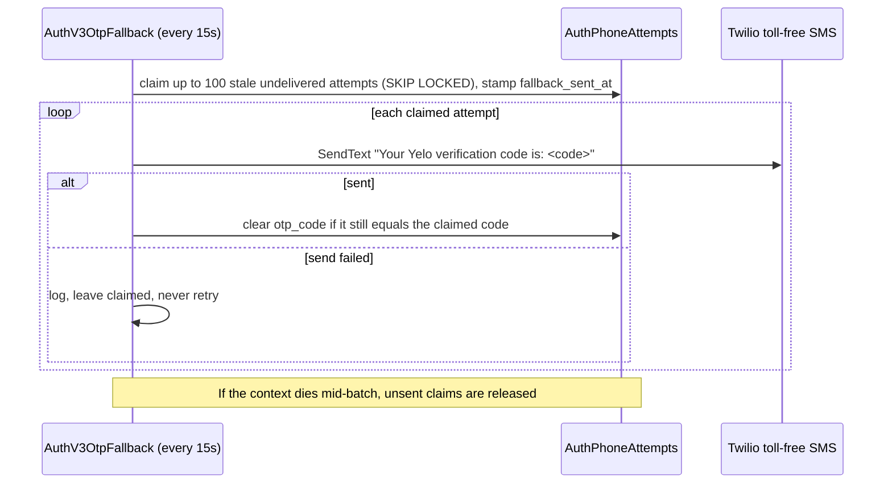

Phone codes cost money and are the main abuse target in sign-in. Auth v3 protects them with three layers: per-IP HTTP limits, per-transaction attempt limits, and cross-transaction limits per phone number and per requester. All counters live in Postgres so they hold across every Cloud Run instance.

## Requester identity

Every limit keyed by "requester" uses a coarse network prefix, never a full IP or a device ID.

- IPv4 addresses are truncated to `/24`. IPv6 addresses are truncated to `/56` (`coarseIPRequester` in `internal/server/http/authv3/service.go`).
- With `AUTH_V3_TRUSTED_PROXY_CIDRS` empty, only the immediate TCP peer counts. `X-Forwarded-For` is ignored.
- With trusted CIDRs set, `TrustedProxyRequesterResolver` walks `X-Forwarded-For` from the right and takes the first address that isn't a trusted proxy. A chain over 4,096 characters or 32 entries, or any unparseable entry, fails the request as `ProviderUnavailable` (503).
- Prefixes are hashed with `AUTH_V3_RATE_LIMIT_HMAC_KEY` and a domain label before storage (`HMACPseudonymizer.RequesterHash`). Raw IPs never reach the database.

<Warning>
If the API sits behind a proxy or load balancer that isn't listed in `AUTH_V3_TRUSTED_PROXY_CIDRS`, the immediate peer is that proxy, not the user. Every user then shares a handful of requester buckets, and the per-requester limits below apply to your whole user base at once. Check the deployed value whenever the ingress path changes.
</Warning>

## HTTP limits per endpoint

`DurableRateLimiter` in `internal/server/http/authv3/durable_rate_limiter.go` runs before any other work in each handler. Counters are fixed windows that start at the first request.

| Scope | Endpoints | Window | Max per requester prefix |
| --- | --- | --- | --- |
| `configuration` | `GET /authv3/config` | 10 minutes | 120 |
| `authorize` | `POST /authorize`, `POST /user/link/authorize` | 10 minutes | 30 |
| `accept` | `POST /transaction/accept` and `POST /transaction/resume` (shared bucket) | 10 minutes | 60 |
| `provider_start` | Google and Apple start, native Apple | 10 minutes | 60 |
| `provider_callback` | Google and Apple callbacks | 10 minutes | 120 |
| `token` | `POST /token` | 10 minutes | 60 |
| `phone_send` | `POST /providers/phone/send` | 1 hour | 120 |
| `phone_verify` | `POST /providers/phone/verify` | 1 hour | 240 |

A denial returns 429 with a `Retry-After` HTTP date equal to the window's end. In E2E mode every max is multiplied by 100.

Session refresh, logout, the onboarding routes, and the authenticated `/authv3/user` routes other than link authorize have no HTTP limit.

## Auth v3 phone limits

Defaults come from `DefaultPhoneOrchestrationConfig` in `internal/service/authv3/phone_orchestration.go`. They are not configurable through env vars.

| Limit | Value | Scope |
| --- | --- | --- |
| Attempt lifetime | 10 minutes from the **first** send, capped at the transaction expiry | Per transaction |
| Cooldown between sends | 30 seconds | Per transaction |
| Sends | 5 | Per transaction |
| Verifies | 5 | Per transaction |
| Sends per phone number | 10 per hour | All transactions |
| Sends per requester | 20 per hour | All transactions |
| Verifies per phone number | 20 per hour | All transactions |
| Verifies per requester | 40 per hour | All transactions |

In E2E mode the four cross-transaction maxima are multiplied by 100 (`authV3PhoneOrchestrationConfig`). Per-transaction limits don't change.

### Send, step by step

<Steps>
  <Step title="Normalize">
    `NormalizeUS` in `internal/service/authv3/phone/policy.go` accepts only numbers that libphonenumber considers valid for the US and that format back to the same E.164 value. `+1 555` numbers bypass that check because they are reserved test numbers.
  </Step>
  <Step title="Authenticate the transaction">
    The request secret must be valid, the transaction unexpired, and legal acceptance current. The transaction must be phone `provider_pending`, a `verified` app Google or Apple transaction whose user still has no phone, or `pending` or `provider_pending` (which is re-pointed to phone).
  </Step>
  <Step title="Reserve atomically">
    One Postgres transaction reserves the phone and requester counters in sorted order, then upserts the `AuthPhoneAttempts` row (`ReservePhoneSend`). If any gate fails, everything rolls back, so a denied request consumes nothing.
  </Step>
  <Step title="Generate and store the code">
    `GenerateCode` draws a zero-padded 5-digit code from `crypto/rand`. The code is written to `AuthPhoneAttempts.otp_code` **before** the SMS, so the fallback sweep can recover it if the process dies mid-send.
  </Step>
  <Step title="Send">
    Test numbers return `sent` without calling Twilio. Otherwise `StartVerification` sends the code as a Twilio Verify custom code. The verification SID is stored afterward, because delivery events match on it.
  </Step>
</Steps>

A resend to a **different** number re-binds the attempt to the new number and requester, and clears the stored code, SID, and delivery state. `send_count` keeps accumulating across numbers. The per-transaction cooldown and cap still apply.

### Verify, step by step

1. The code must be 4 to 10 characters with no surrounding whitespace. The provider layer further requires digits only.
2. `ReservePhoneVerify` increments `verify_count` only if the phone hash **and requester hash** match the last send, the attempt is unverified and unexpired, and the count is under 5.
3. Test numbers verify only with `12345`. Others call `CheckVerification`.
4. On success, the attempt is marked verified and `otp_code` is cleared.
5. The identity is resolved with the phone as the subject.

If the attempt is already verified with the same bindings, verification skips the provider and re-runs resolution. This recovers a client whose first verify response was lost. The hosted page does this automatically on a timeout by calling resume first (`AuthV3Client.verifyPhone` in `authV3Client.ts`).

### Outcomes and errors

| Outcome | HTTP | User-facing title |
| --- | --- | --- |
| Cooldown, per-attempt cap, or cross-transaction cap | 429 with `Retry-After` | "Try Again Later" |
| Attempt expired | 410 | Transaction expired |
| Already verified (send) | 401 | Invalid transaction |
| Phone or requester doesn't match the send | 401 `phone verification transaction is invalid` | Generic |
| Twilio rejects the destination on send | 400 | "Can't Text That Number" |
| Wrong code | 400 | "Wrong Code" |
| Twilio says expired or not found on verify | 400 | "Code Expired" |
| Twilio rate limit | 429 | "Try Again Later" |
| Twilio outage or Verify not configured | 503 | Provider unavailable |

## Twilio Verify

- Auth v3 always supplies its own code. `SendReserved` refuses an empty code, because Twilio would generate one the fallback sweep couldn't resend.
- The Twilio Verify service's code length must be 5. The comment on `codeLength` in `internal/service/authv3/phone/code.go` warns that Twilio rejects a mismatched custom code.
- `StartVerification` in `internal/data/twilio/twilio.go` retries transient network errors inside a circuit breaker, but never retries input or rate-limit errors.
- A success with no SID is logged as an anomaly. The user probably got the code, but the fallback sweep can't track it.

## Fallback sweep

When Twilio Verify doesn't confirm delivery, the `AuthV3OtpFallback` loop resends the same code through the legacy toll-free sender (`PhoneFallbackService.Run` in `internal/service/authv3/phone_fallback.go`).

An attempt is eligible when all of these hold:

- `otp_code` and `verification_sid` are set,
- the last send was more than `TWILIO_OTP_FALLBACK_DELAY` ago (default 60 seconds),
- `delivery_status` isn't `delivered` and `delivered_at` is null,
- it hasn't been verified or already fallen back, and
- it hasn't expired.

The fallback texts the same code that Twilio Verify holds, so `CheckVerification` still approves it. The loop only runs when `TWILIO_OTP_FALLBACK_ENABLED=true`. The claim is one atomic `UPDATE ... FOR UPDATE SKIP LOCKED`, so concurrent instances never text the same row twice.

## Delivery events

`POST /twilio-verify-events` (`internal/server/http/verifyevents/verifyevents.go`) receives Twilio Event Streams CloudEvents.

1. Read at most 1 MiB.
2. If both `TWILIO_EVENTS_WEBHOOK_USER` and `TWILIO_EVENTS_WEBHOOK_PASSWORD` are set, require matching basic auth. If only one is set, reject everything.
3. Validate `X-Twilio-Signature` over the body, against a URL rebuilt from `X-Forwarded-Proto` and `X-Forwarded-Host`, including the `bodySHA256` query parameter.
4. Reject payloads with more than 200 events.
5. For each event with a SID and status, store the lowercased status. `delivered` also sets `delivered_at`. Unknown SIDs match nothing and log a warning.

<Note>
Events for other Verify services, or a schema change on Twilio's side, show up as unmatched events. The code comments treat a stream of matched events as the gate for enabling the fallback: if nothing matches, enabling the fallback would double-text every user.
</Note>

## Auth v2 legacy limits

`POST /authv2/phone/request-otp` has no transaction secret, so it is protected differently (`allowPhoneSend` in `internal/server/http/authv2/handler.go`).

| Bucket | Window | Max |
| --- | --- | --- |
| `legacy_phone_send`, per requester prefix | 1 hour | 20 |
| `legacy_phone_send_global`, one shared bucket for all callers | 1 hour | 60 |

Both buckets are reserved atomically. If the requester can't be resolved, only the global bucket applies. These limits exist only when Auth v3 is enabled, because they reuse its limiter. With Auth v3 off, the endpoint has no durable limit.

The Auth v2 service adds its own rules in Redis (`internal/service/authv2/authv2.go`): one record per phone under `authv2:phone_otp:<phone>`, a 15-minute TTL, a 60-second cooldown, and 5 failed verifies before the record is deleted. When `TWILIO_VERIFY_SERVICE_SID` is set, Twilio generates the code and the Redis record stores an empty OTP. Test numbers always use the local `12345` path.

## Where this lives in code

| Concern | Path |
| --- | --- |
| Orchestration and limits | `yelo-api/internal/service/authv3/phone_orchestration.go` |
| Normalization, test numbers, masking | `yelo-api/internal/service/authv3/phone/policy.go` |
| Provider adapter | `yelo-api/internal/service/authv3/phone/adapter.go` |
| Code generation | `yelo-api/internal/service/authv3/phone/code.go` |
| Reservations and denial classification | `ReservePhoneSend`, `ReservePhoneVerify`, `classifyPhoneReservationDenial` in `yelo-api/internal/data/repository/authv3.go` |
| HTTP limiter and requester resolution | `yelo-api/internal/server/http/authv3/durable_rate_limiter.go`, `service.go` |
| Fallback sweep | `yelo-api/internal/service/authv3/phone_fallback.go`, `startBackgroundTasks` in `yelo-api/cmd/api/main.go` |
| Delivery events | `yelo-api/internal/server/http/verifyevents/verifyevents.go` |
| Twilio client | `yelo-api/internal/data/twilio/twilio.go` |
| Auth v2 OTP | `yelo-api/internal/service/authv2/phone.go`, `yelo-api/internal/server/http/authv2/handler.go` |

## Gotchas and edge cases

- **Changing networks between send and verify fails.** Verification requires the same requester prefix as the last send. A user who requests a code on Wi-Fi and enters it on cellular gets a 401 `phone verification transaction is invalid`. Sending again from the new network re-binds the attempt.
- **Resends don't extend the attempt.** The attempt expires 10 minutes after the first send. A resend at minute 9 leaves one minute to verify.
- **Provider failures still spend budget.** Counters are committed before Twilio is called. A Twilio outage burns per-number and per-requester budget.
- **The global Auth v2 bucket is tiny.** 60 sends per hour across all users. The web `/delete-account` page uses this endpoint, so a burst of deletions or abuse there blocks every other Auth v2 SMS for up to an hour.
- **Test numbers still consume counters.** `+1555` sends skip Twilio but go through every reservation.
- **Fallback sends are never retried.** A failed toll-free send leaves the row claimed, so the user never gets a fallback. They must tap resend.
- **Auth v2 cooldown is twice Auth v3's.** Auth v2 enforces 60 seconds between sends. Auth v3 enforces 30.
