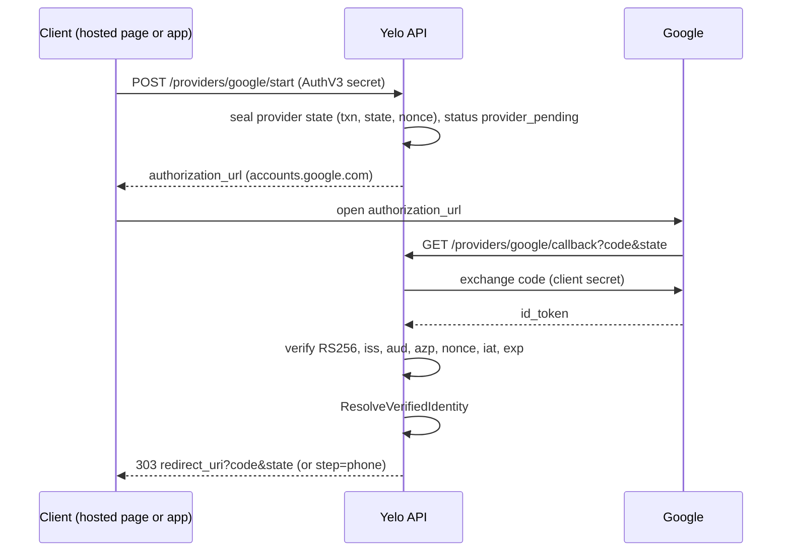
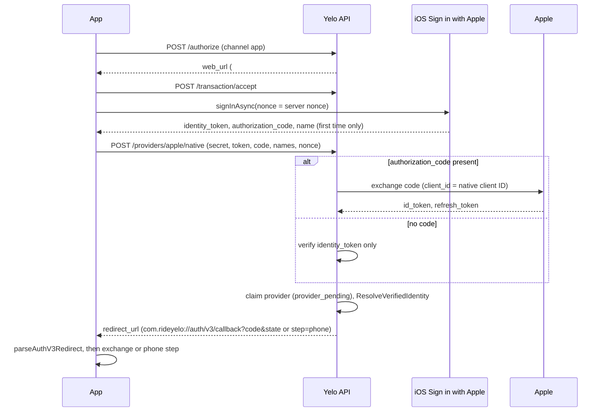
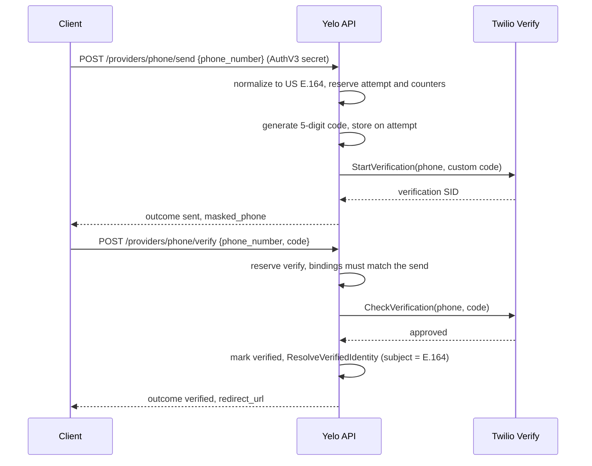

Auth v3 supports three providers (`google`, `apple`, `phone`) across two channels (`app`, `web`) and three client surfaces. This page traces each combination. The transaction mechanics shared by all of them are in [Auth v3 transaction lifecycle](/engineering/identity/auth-v3-transactions).

## Surfaces at a glance

| Surface | Channel | `client_id` | Redirect URI | Who talks to the provider |
| --- | --- | --- | --- | --- |
| Mobile, hosted page (production default) | `app` | `yelo-ios` or `yelo-android` | `com.rideyelo://auth/v3/callback` | The hosted page in `ASWebAuthenticationSession` or a Custom Tab |
| Mobile, native screens (fallback and E2E) | `app` | `yelo-ios` or `yelo-android` | Same | The app: native Apple, Google in a browser, phone via API |
| Web signup site | `web` | `yelo-web` | `<public web origin>/auth/v3` or `/auth/v3/callback` | The hosted page |
| E2E app | `app` | `yelo-ios` or `yelo-android` | `com.rideyelo.e2e://auth/v3/callback` | Phone only |

`authV3ClientID` in `yelo-frontend/lib/auth/security.ts` picks the client ID from `Platform.OS`. The web page always uses `yelo-web` (`webFlow.ts`).

## Provider availability

`GET /authv3/config` (`GetPublicConfiguration`) reports `google` and `apple` as available when their provider clients were constructed, and `phone` when Twilio Verify is enabled or the API runs in E2E mode. In E2E, `buildAuthV3ProviderClients` builds no Google or Apple client, so both report `false` and their start endpoints return `ProviderUnavailable` (503).

## Google

Google always uses the server-side authorization code flow with the client secret (`GoogleClient` in `internal/service/authv3/providers/google.go`). There is no native Google SDK on mobile. Yelo requests `openid email profile` and never requests offline access, so it stores no Google refresh token.

ID token checks (`verifyIDToken` and `validateClaims` in `providers/token.go`):

- Only `RS256`, with the key selected by `kid` from the cached JWKS. Metadata and keys are cached for the provider's `Cache-Control` max-age, clamped to at most 1 hour, with a 5-minute default.
- `iss` must equal the discovered issuer, `aud` must contain the client ID, and `azp` must equal the client ID when present or when there are multiple audiences.
- `iat` is required and may be at most 1 minute in the future. `exp` gets 1 minute of leeway.
- `nonce` must equal the transaction nonce exactly.
- The email is kept only when `email_verified` is true. `email_verified` accepts a boolean or the strings `"true"` and `"false"`.

On the mobile native screen, the app validates the returned `authorization_url` against an exact host allowlist (`accounts.google.com`, `appleid.apple.com`) before opening it (`isSafeProviderURL`), because the user types a password into that page.

## Apple on the web callback

Apple uses `response_mode=form_post`, so Apple's browser POSTs to `POST /authv3/providers/apple/callback` as `application/x-www-form-urlencoded`. The form may include a `user` JSON field with the name, which Apple sends **only on the first authorization** for a given Apple ID and app.

- The client secret is an ES256 JWT signed with the Apple private key (`clientSecretFor`), valid 5 minutes, minted per request.
- The web flow's audience is `AUTH_V3_APPLE_SERVICES_ID`.
- `parseAppleUserNames` caps the `user` payload at 8 KB and each name at 100 runes, and rejects control characters.
- The token response's `refresh_token` is kept and encrypted with `AUTH_V3_REFRESH_TOKEN_KEYS`. Account deletion uses it to revoke the Apple grant. See [Account deletion and retention](/engineering/identity/account-deletion).

## Apple native (iOS)

The native path skips the browser and posts the on-device credential to `POST /authv3/providers/apple/native` (`Service.NativeApple` in `internal/service/authv3/native.go`).

Rules that differ from the web callback:

- The transaction must be `app` channel, still `pending` or `provider_pending`, and legally accepted (`guardNativeTransaction`).
- The nonce comes from the sealed request secret. An echoed `nonce` is optional, but if it's present it must match, or the call returns 401.
- The identity token must be at most 8,192 bytes and the authorization code at most 4,096 bytes.
- The audience is `AUTH_V3_APPLE_NATIVE_CLIENT_ID` (the iOS bundle ID), falling back to the Services ID when unset.
- With an authorization code, the server exchanges it and gets a refresh token. With only an identity token, no refresh token is stored, so there is nothing to revoke at deletion.
- Apple never puts the name in the identity token. The app relays the name it got from the OS. Provider claims win when both exist, and client names go through the same 1 to 100 rune validation as the profile form.
- The handler records both `provider_start` and `callback` funnel steps with one request ID so the native path lines up with the browser funnel.

## Phone

Phone has no provider state or callback. The request secret authenticates each call.

- The first send moves a `pending` transaction to `provider_pending` with provider `phone`. A transaction left in `provider_pending` by an abandoned Google or Apple attempt is re-pointed to phone.
- Only US numbers are accepted (`NormalizeUS` in `internal/service/authv3/phone/policy.go`).
- The identity subject is the E.164 number itself.
- Limits, fallback delivery, and failure outcomes are in [Phone OTP and abuse controls](/engineering/identity/phone-otp-and-rate-limits).

## The supplemental phone step

App-channel Google or Apple sign-in requires a verified phone before any token is issued. The rule is `requiresSupplementalPhone` in `internal/service/authv3/resolver.go`:

- purpose is `signin`,
- channel is `app`,
- provider is `google` or `apple`, and
- the resolved user has an empty `phone_number`.

When it applies, the transaction becomes `verified` with the user bound, but no handoff code is created. The client is sent to the phone step instead.

| `native_phone_step` on authorize | Where the phone step happens | Redirect |
| --- | --- | --- |
| `true` | Native `/(auth-v3)/phone` screen | `com.rideyelo://auth/v3/callback?step=phone&state=...` |
| `false` or absent | Hosted page | `<public web origin>/auth/v3?channel=app&transaction_id=...#step=phone` |

The phone send and verify endpoints accept this `verified` transaction as long as the user still has no phone (`PhoneOrchestrator.phoneTransaction`). Verification then runs `resolveSupplementalPhoneInTransaction`, which may merge a provisional shell into an existing phone owner. See [Identity resolution and linking](/engineering/identity/identity-resolution#provisional-shells-and-phone-recovery). After that, a handoff is created and the redirect carries `?code=`.

Mobile sets `native_phone_step: false` for the hosted entry transaction and `true` for the native fallback transaction. Builds that predate the flag get the hosted page, which is why `false` is the server default.

<Warning>
The web channel never requires a phone. A Google or Apple sign-in on the `web` channel can create a `Users` row with no phone number. That account can't finish in the app until a phone is added, and many driver steps require one when `DRIVER_VERIFIED_PHONE_REQUIRED=true`.
</Warning>

## Mobile hosted entry

The production app opens the hosted page instead of native screens (`authV3EntryMode` returns `hosted` unless `EXPO_PUBLIC_APP_ENV=e2e`).

<Steps>
  <Step title="Authorize and validate the URL">
    The app authorizes with an attempt ID and `native_phone_step: false`, then checks `web_url` with `isSafeAuthV3WebURL`: HTTPS, and host `yelo.link`, `joinyelo.com`, or a subdomain of either. Loopback is allowed only in `__DEV__`.
  </Step>
  <Step title="Save the proof before leaving the process">
    The PKCE verifier, state, secret, and nonce are written to SecureStore under `authv3-onboarding-draft-v1` before the browser opens, so a killed app can resume.
  </Step>
  <Step title="Open the hosted page">
    The page reads `#request=` and `channel=app`, stores the secret in `sessionStorage` (`yelo.auth-v3.request-record-v1`), and strips the fragment. The user accepts terms and picks a method.
  </Step>
  <Step title="Return to the app">
    The provider or phone step ends with a `303` or `window.location.assign` to `com.rideyelo://auth/v3/callback?code&state`. The auth session closes on the custom scheme and returns the URL to the app.
  </Step>
  <Step title="Exchange">
    `parseAuthV3Redirect` checks the scheme, host, and path, rejects any `error`, requires exactly one `state` equal to the stored state (constant-time compare), then returns the code or `phone_required`. The app calls `POST /token` with its verifier.
  </Step>
</Steps>

If the hosted page can't find its secret for an app transaction (storage cleared, new tab), and the app advertised `app_recovery=1`, the page navigates to `com.rideyelo://auth/v3/callback?error=web_recovery`. That is a recovery signal, not a credential. The app then resumes with its own stored secret. See `yelo-web/src/sites/signup/auth-v3/README.md`.

## Web client flow

The web signup site runs its own PKCE client against the same API (`beginAuthV3WebFlow` and `completeAuthV3WebFlow` in `webFlow.ts`).

1. `GET /authv3/config` returns `web_auth_url` and `web_redirect_uri`. The page refuses to continue if the two origins differ or the redirect path isn't `/auth/v3` or `/auth/v3/callback`.
2. If the current origin differs from `web_auth_url`, the page navigates there first, because `sessionStorage` is per origin.
3. The page generates a 32-byte state and a 64-byte verifier, stores them in `sessionStorage` under `yelo.auth-v3.web-pending`, and authorizes with `channel: web`.
4. The returned `web_url` must be same-origin and on `/auth/v3`. The page adopts the secret without a reload (`adoptAuthV3RequestSecret`).
5. After the provider, the API redirects to `/auth/v3?code&state`. The page checks state against `sessionStorage` and exchanges with `credentials: 'include'`, which sets the `__Host-yelo_refresh` cookie.
6. The token goes into `sessionStorage` key `yelo_signup_jwt`. If `intent=tip` or `intent=world-cup`, the page navigates to that flow.

A code callback in a different tab fails with "This sign-in was started in another tab or has expired", because the verifier lives in the original tab's `sessionStorage`.

## Where this lives in code

| Concern | Path |
| --- | --- |
| Google client | `yelo-api/internal/service/authv3/providers/google.go` |
| Apple client, native verify, revoke | `yelo-api/internal/service/authv3/providers/apple.go` |
| OIDC discovery and JWKS cache | `yelo-api/internal/service/authv3/providers/oidc.go` |
| ID token validation | `yelo-api/internal/service/authv3/providers/token.go` |
| Native Apple service | `yelo-api/internal/service/authv3/native.go` |
| Phone orchestration | `yelo-api/internal/service/authv3/phone_orchestration.go` |
| Callback handlers | `yelo-api/internal/server/http/authv3/handler.go` |
| Mobile provider logic | `yelo-frontend/providers/AuthV3Provider.tsx`, `yelo-frontend/lib/auth/appleAuth.ts`, `yelo-frontend/lib/auth/security.ts` |
| Hosted page | `yelo-web/src/sites/signup/auth-v3/AuthV3Page.tsx`, `requestSecret.ts`, `webFlow.ts`, `redirects.ts` |

## Gotchas and edge cases

- **Apple names arrive once.** If the first Apple authorization fails after the OS returned the name (for example, a network error on `/providers/apple/native`), Apple won't send the name again. The user types it on **Finish profile**.
- **Apple private relay emails count as verified.** They go into candidate matching like any other verified email, so a relay address never matches an existing account that registered with a real address.
- **Native Apple without an authorization code stores no refresh token.** Deletion can't revoke that grant, and the identity row keeps any ciphertext from an earlier sign-in.
- **The Google callback rejects unexpected query keys.** Google sometimes adds parameters. Anything outside `state`, `code`, `error`, `error_description`, `error_uri`, `scope`, `authuser`, `prompt`, `iss`, and `hd` returns 401 `provider callback could not be verified`.
- **Callback errors before the transaction is known are JSON, not redirects.** A tampered provider state, or one whose transaction no longer exists, returns a JSON 401 in the browser, and the app never gets a callback. An expired but otherwise valid state does redirect, with `error=transaction_expired`. The user sees an API error page inside the auth session.
- **Switching providers is allowed, switching after resolution isn't.** Any provider can restart from `provider_pending`. Once the transaction is `verified`, only the supplemental phone step can act on it.
- **Web refresh depends on same-site hosting.** The refresh cookie is `SameSite=Lax`. The web client defaults production API calls to `https://api.joinyelo.com`, which is same-site with `joinyelo.com`. If `VITE_API_URL` points at a different registrable domain, the browser won't send the cookie on refresh.
