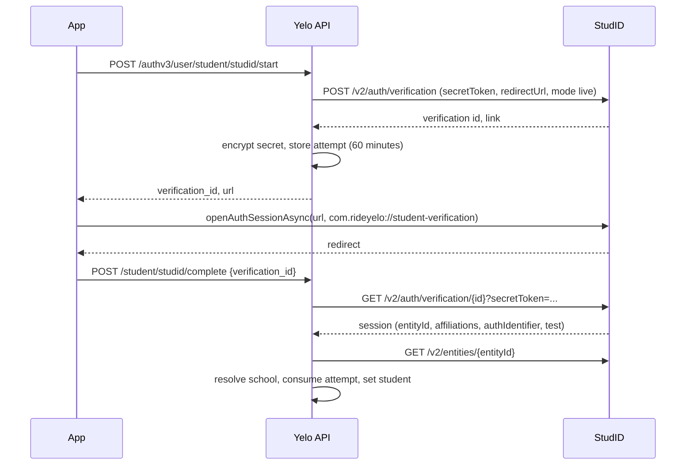

School verification is a post-sign-in step. It proves an academic affiliation and flips the account to `account_type = 'student'`. It is separate from login identity: a school Google account used here is a proof, not a way to sign in.

## What student status changes

| Field | After a successful verification |
| --- | --- |
| `Users.account_type` | `student` |
| `Users.school_id` | The matched school |
| `Users.is_verified` | `true` |
| `EducationVerifications` | Upserted row for the provider |

Where it matters:

- **Ride options.** `filterRideTypesForRider` in `internal/service/ride/rider.go` removes ride types with `IsStudentOnly` for any rider whose `account_type` isn't `student`.
- **Graduation year.** Auth v2 profile setup and profile updates only store `graduation_year` for students (`internal/service/authv2/profile.go`).
- **Analytics and segments.** Dashboard analytics, driver lead scoring (`internal/data/repository/driver_leads.go`), and contact sync segments filter on `account_type`.
- **Identity matching.** `is_verified = true` makes the row eligible as an Auth v3 candidate by email or phone. See [Identity resolution and linking](/engineering/identity/identity-resolution#candidate-matching).

<Note>
Verification never moves a user's community. School-to-community mapping is informational. See [Schools and communities](/administration/schools-and-communities).
</Note>

## Methods

The mobile **Are you a student?** screen (`app/(app)/verify/1-oauth.tsx`) offers four methods. The driver signup flow reuses them.

| Method | API | Provider value stored |
| --- | --- | --- |
| StudID | `POST /authv3/user/student/studid/start`, `/complete` | `studid` |
| School Google account | `POST /authv2/email/verify-oauth` with `method: google` | `google` |
| School Microsoft account | `POST /authv2/email/verify-oauth` with `method: microsoft` | `microsoft` |
| School email code | `POST /authv2/email/request-otp`, `/verify-otp` | `email_otp` |

The Auth v2 routes accept a presignup or full token. The StudID routes require a full `user` token.

## School matching by email domain

`GetByExtension` in `internal/data/repository/schools.go` matches the email's domain against `Schools.extensions`, case-insensitively:

1. Exact domain match.
2. Parent domain fallback, so `student.school.edu` can match `school.edu`. The school is marked `SubdomainFallback`.
3. No match: try the fleet driver whitelist (`FleetDriverWhitelist`, matched by exact email). A whitelist hit returns a synthetic school with `IsWhitelistEntry = true`.
4. Otherwise a user-facing "school not found" error.

A domain that maps to more than one school is an error, not a guess.

## Email code flow

<Steps>
  <Step title="Request">
    `RequestEmailOtp` lowercases the email and requires a matching school or whitelist entry before sending anything. The code is stored in Redis under `authv2:email_otp:<email>` for 15 minutes, with a 60-second resend cooldown.
  </Step>
  <Step title="Choose the code">
    `buildEmailOtp` returns the fixed code `12345` for test addresses, admin addresses, and every `@rideyelo.com` address. Everyone else gets a random 5-digit code. Test and admin addresses skip sending entirely. See [Test, E2E, and internal auth paths](/engineering/identity/test-and-internal-auth#fixed-email-codes).
  </Step>
  <Step title="Verify">
    `VerifyEmailOtp` allows 5 wrong codes, then deletes the record. The code is only deleted **after** the email is associated, so a failed association can be retried with the same code.
  </Step>
  <Step title="Associate">
    `associateEmail` resolves the school again and branches on the caller. See the next section.
  </Step>
</Steps>

## OAuth flow

`VerifyEmailOauth` in `internal/service/authv2/email.go` accepts only `google` and `microsoft`.

- **Google:** the ID token goes to Google's `tokeninfo` endpoint. The `aud` must be in `GOOGLE_ALLOWED_AUDIENCES` (required at startup outside E2E), and `email_verified` must be `"true"`.
- **Microsoft:** the access token goes to Microsoft Graph `/v1.0/me`. The email is `mail`, falling back to `userPrincipalName`. There is no audience check and no email-verified flag.
- Names from the provider fill the profile step. Client-supplied names are used only where the provider gave none.

During a v2 **signup** (caller has a presignup token, not a `user` role), a Google subject is also written as an `AuthIdentities` row (`recordProviderIdentity`), so it becomes a login method. From an authenticated verification it is only a school proof.

## Association rules

`associateEmail` behaves differently for existing and new users.

| Caller | School is a whitelist entry | Result |
| --- | --- | --- |
| Signed-in user (`user` role) | No | Collision check, then `CompleteSchoolVerification`. `Users.email` is **not** changed. |
| Signed-in user | Yes | No collision check, no student change, and nothing written. The call still returns success, as the code comment intends. |
| v2 signup with a user ID | Either | Collision check, student change unless whitelist, and fill `Users.email` only if blank |
| v2 signup without a user ID | Either | Find a user by email and attach the phone (legacy v1 migration), or create a user |

A signed-in caller always gets a full user JWT back, scoped to their current `community_id` (`buildPostEmailResponse` with `authenticated = true`). Presignup and new-account callers still get a full token only when `IsV2SignupComplete` is true, and a presignup token otherwise.

`checkCollisionExceptSelf` refuses an email already owned by another user. After a non-whitelist verification, `EducationClaim.ReconcileVerifiedEmail` marks any matching World Cup claim as verified.

`CompleteSchoolVerification` in `internal/data/repository/education_verification.go` upserts the `EducationVerifications` row and updates the user in one transaction. A second verification with the same provider replaces the first.

## StudID

StudID verifies an institutional login through a third party. It is enabled by `AUTH_V3_STUDID_ENABLED=true`, and the API refuses to start without a valid redirect URL (default `com.rideyelo://student-verification`).

`Service.Complete` in `internal/service/authv3/student/studid.go` rejects:

- a missing session (not finished),
- a session with `test: true`,
- a missing entity ID, and
- affiliations that don't include `student` or `member`.

School resolution (`ResolveSchool`) first checks `SchoolAcademicEntities` for the StudID entity. On a miss it matches the entity's scopes against school extensions. Exactly one match is cached as a new `SchoolAcademicEntities` row. Zero or multiple matches return "School Not Available" or "School Needs Review".

The app ignores the callback's parameters and completes with the server-created verification ID. The attempt can be consumed once, within 60 minutes, by the same user.

## Disconnecting a proof

`DELETE /authv3/user/student/connections/{provider}` accepts `studid`, `google`, `microsoft`, or `email_otp`. It deletes that `EducationVerifications` row, then `ReconcileUserEducationVerification` recomputes the user:

- If any proof remains, `school_id` becomes the most recently verified proof's school and `account_type` stays `student`.
- If none remain, `account_type` becomes `community`, `school_id` becomes null, and `graduation_year` is cleared.

`is_verified` is not changed.

## Where this lives in code

| Concern | Path |
| --- | --- |
| Email OTP and OAuth verification | `yelo-api/internal/service/authv2/email.go` |
| OTP helpers and test addresses | `yelo-api/internal/service/authv2/authv2.go` |
| Legacy OAuth token checks | `yelo-api/internal/data/repository/oauth.go` |
| School lookup | `yelo-api/internal/data/repository/schools.go` |
| Education ledger and reconciliation | `yelo-api/internal/data/repository/education_verification.go`, `yelo-api/internal/data/repository/queries/education_commerce.sql` |
| StudID | `yelo-api/internal/service/authv3/student/studid.go` |
| Student ride filter | `filterRideTypesForRider` in `yelo-api/internal/service/ride/rider.go` |
| Mobile screens | `yelo-frontend/app/(app)/verify/`, `yelo-frontend/app/(app)/profile/accounts.tsx`, `yelo-frontend/lib/auth/schoolEmail.ts` |

## Gotchas and edge cases

- **The mobile disconnect copy is wrong for the last proof.** The **Accounts** screen says disconnecting "removes the linked proof but does not remove your existing student status" (`accounts.tsx`). The API downgrades the account to `community`, clears `school_id`, and clears `graduation_year` when the last proof is removed.
- **Legacy students have no ledger row.** Users verified before `EducationVerifications` existed may have `account_type = 'student'` with no proof row (migration 280 only backfilled Google). They can't disconnect, and disconnecting a newer proof may drop them to `community` even though they were verified earlier.
- **Proofs outlive deleted accounts.** Account deletion doesn't delete `EducationVerifications`. Because provider subjects are unique per provider, the same school Google account, Microsoft account, or StudID identity can't verify a new Yelo account later. It fails with `identity_conflict`. Email code proofs have no subject and don't block.
- **StudID with no affiliations passes.** `studentAffiliationAllowed` returns true for an empty list. Only a non-empty list without `student` or `member` is rejected.
- **Microsoft proofs are weaker.** Any Microsoft access token for any app is accepted, and `userPrincipalName` can be used as the email. The school match still depends on the domain.
- **The client suffix list is broader than the server.** `SCHOOL_EMAIL_SUFFIXES` allows `.edu`, `.ca`, and `@rideyelo.com`, and matches case-sensitively. The server decides by `Schools.extensions`, case-insensitively.
- **`Schools.admin_otp` is dead.** The column is loaded into `models.School` but no verification path reads it. The fixed-code behavior comes from hardcoded email patterns instead.
- **StudID secrets share the Apple keyring.** The StudID secret token is encrypted with `AUTH_V3_REFRESH_TOKEN_KEYS`. Rotating that keyring affects both.
