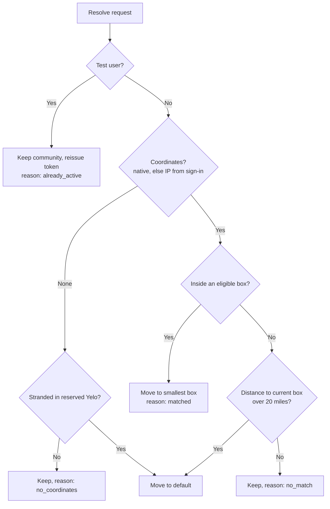

Every user carries a `community_id` that scopes pricing, the map, feeds, and presence. Four code paths assign it from coordinates, and they use slightly different rules. This page documents each rule precisely so you can predict where a given point lands.

For the product view of communities and zones, see [Communities and zones](/concepts/communities-and-zones). For school mapping from the admin side, see [Schools and communities](/administration/schools-and-communities).

## Geometry

A community's service area is an axis-aligned latitude and longitude rectangle: `min_latitude`, `max_latitude`, `min_longitude`, `max_longitude` on `"Communities"`. There are no polygons at the community level. Containment is inclusive on every edge.

| Operation | Implementation | Units |
| --- | --- | --- |
| Point in box (users, rides) | SQL `BETWEEN min AND max` in `GetCommunityByCoordinates` | Degrees |
| Point in box (schools) | SQL `BETWEEN LEAST(min, max) AND GREATEST(min, max)` in `school_community_candidates` | Degrees |
| Box size for tie-breaks | `(max_lat - min_lat) × (max_lng - min_lng)` | Square degrees, unprojected |
| Distance from a point to a box | `geo.DistanceToBoundsMi` in `internal/utilities/geo/bounds.go` | Great-circle miles |
| Ride stop in box | `validateRideCoordinates` in `internal/service/ride/rider.go` | Degrees. Rejects only when a stop is below the min or above the max, so edges count as inside |

`DistanceToBoundsMi` returns 0 inside the box. Outside, it takes the minimum haversine distance to the two parallels (at the clamped longitude) and to the two meridians (at the latitude of the great-circle projection onto the meridian, clamped to the box), plus the four corners. Distance wraps across the antimeridian, but containment does not.

## Eligible communities

`GetCommunityByCoordinates` in `internal/data/repository/queries/community.sql`:

```sql
WHERE $lat BETWEEN c.min_latitude AND c.max_latitude
  AND $lng BETWEEN c.min_longitude AND c.max_longitude
  AND is_default = FALSE AND is_active = TRUE AND is_test = FALSE AND archived_at IS NULL
  AND c.id <> '87794dc9-7ef8-438c-b2e8-ba6fd77e66aa'::uuid   -- reserved "Yelo"
ORDER BY (c.max_latitude - c.min_latitude) * (c.max_longitude - c.min_longitude) ASC
LIMIT 1;
```

| Flag | Excluded from location matching? |
| --- | --- |
| `is_default` | Yes |
| `is_active = FALSE` | Yes |
| `is_test` | Yes |
| `archived_at` set | Yes |
| Reserved **Yelo** community | Yes, by hard-coded ID |
| `is_hidden` | **No** |
| `rides_disabled` | **No** |

The smallest containing box wins, so a campus box nested inside a metro box captures points inside it.

`GetDefaultCommunity` returns the first row with `is_default = TRUE`, not test, not archived, and not **Yelo**. It has no `ORDER BY` and does not check `is_active`.

## Authenticated resolution (auth v3)

`ActiveCommunityService.Resolve` in `internal/service/authv3/active_community.go` serves both `POST /authv3/user/community/resolve` (full user token) and the onboarding variant. It always returns a freshly issued token, whether or not the community changed.



### Coordinate sources

`activeCommunityCoordinates` picks, in order:

1. `NativeCoordinates` from the request body (`source: native`).
2. The sign-in transaction's stored location, only if `location_source` is `ip` (`source: ip`).
3. Nothing (`reason: no_coordinates`).

A user-scope request needs either coordinates or a `transaction_id`. A transaction must belong to the user, have purpose sign-in, and be completed. For onboarding tokens, the transaction must have completed no later than one second after the token's `iat`.

### Entry and exit

- **Entry** has no hysteresis. The moment a trusted point lands inside a different eligible box, the user moves there, even if they are still inside their current box. A smaller box always wins.
- **Exit** only happens when no eligible box contains the point. The user stays until they are more than 20 miles (`communityExitBufferMiles`) from the nearest edge of their current box, then moves to the default community. The buffer is fixed, not scaled by community size.
- A user in the default community has nothing to exit to. The default's box is typically global, so its distance is 0 and they stay unless a real community matches.

### The reserved Yelo community

`needsYeloCommunityRepair` in `yelo_community_repair.go` flags ordinary users sitting in the reserved **Yelo** community. Staff accounts are exempt: emails ending in `@rideyelo.com`, and `.edu` emails starting with `test` or `rideyelo@`. A flagged user is matched by containment only, never retained by Yelo's global box, and falls back to the default even without coordinates.

### Result

`ActiveCommunityResult` returns `reason` (`matched`, `already_active`, `no_coordinates`, `invalid_stored_coordinates`, `no_match`), `source` (`none`, `native`, `ip`), `community_id`, `token`, `token_scope`, `resolved`, and `updated`. Every call invalidates the user's auth and profile caches before issuing the token, including no-match calls.

### Client throttling

`LocationProvider` calls resolve fire-and-forget:

| Gate | Value | Source |
| --- | --- | --- |
| Minimum interval | 15 minutes per app session | `COMMUNITY_RESOLUTION_MIN_INTERVAL_MS` |
| Maximum fix age | 30 minutes | `isCommunityResolutionLocationUsable` |
| Maximum accuracy radius | 5,000 m (a missing accuracy passes) | Same |
| Skipped when | Path contains `/drive` or `/ride`, or status is `driving` or `riding` | `inSensitiveFlow` in `lib/ride/tripGuards.ts` |
| Also requires | JWT, not presignup, interactive, current user loaded, permission granted | `LocationProvider` |

When a new `user`-scope token comes back and the JWT hasn't changed meanwhile, the app calls `signIn(token)` and invalidates `currentUser` and `currentCommunity`. The 15-minute timer is an in-memory ref, so it resets on every cold start.

## Legacy sign-up resolution (auth v2)

`AuthV2Service.resolveCommunity` in `internal/service/authv2/community.go` treats `0, 0` as "location unknown" and assigns the default. Otherwise it uses `GetCommunityByCoordinates`, rejects a match named `Yelo` (case-insensitive), and falls back to the default. It has no exit buffer, because it only runs at sign-up.

## Ride-time repair

`loadRideCommunity` in `internal/service/ride/rider.go` reads the rider's community from Postgres, not the JWT, so admin moves apply immediately. `repairRideCommunity` then re-matches the pickup point when any of these hold:

- The current community is the default.
- The current community has `rides_disabled`.
- The pickup or destination falls outside the current community's box.

It calls `GetCommunityByCoordinates` on the pickup. It moves the rider (through `UpdateActiveCommunity`) only if the match is a different community and both stops fit inside the matched box. Otherwise the original community stays and `validateRideCoordinates` rejects the ride with **Pickup Outside Service Area** or **Destination Outside Service Area**.

If the final community has `rides_disabled`, the request returns no vehicle options instead of an error, and still returns a route (`ridesDisabledRoute`) so the app can draw its third-party fallback.

## Manual switching

`PUT /user/community` lets a user pick a community from the profile switch screen. The target must be active and not hidden, test, or the reserved **Yelo** community, unless the user is a test user. Automatic resolution moves them back the next time a trusted location puts them inside another eligible box, or more than 20 miles outside the chosen one. Test users are never moved by location.

## Schools

Schools map to communities in the database, not in Go. Migration `000301_automatic_school_community_mapping` adds triggers, and `000303_school_management_visibility` defines `school_community_candidates`:

- A school with valid coordinates, not `0, 0`, maps to the smallest-area active, non-test, non-default, non-archived community whose box contains it. Ties break by community ID.
- Otherwise it maps to the default community (`ORDER BY id LIMIT 1`).
- Triggers re-run the mapping when a school's coordinates change and when a community's box, `is_active`, `is_test`, or `archived_at` changes.
- `PreviewSchoolCommunityMapping` shows gained, dropped, and changed schools for a proposed box before you save it.

School mapping never moves users. A user's `school_id` and `community_id` are independent.

## Where this lives in code

| Concern | Path |
| --- | --- |
| Resolve service | `yelo-api/internal/service/authv3/active_community.go` (`Resolve`, `communityAtLocation`, `activeCommunityCoordinates`) |
| Yelo repair | `yelo-api/internal/service/authv3/yelo_community_repair.go` |
| HTTP handlers | `yelo-api/internal/server/http/authv3/community_handler.go`, `routes.go`, `onboarding_routes.go` |
| Match queries | `yelo-api/internal/data/repository/queries/community.sql` (`GetCommunityByCoordinates`, `GetDefaultCommunity`, `GetCommunitySearchBounds`) |
| Distance to box | `yelo-api/internal/utilities/geo/bounds.go`, `haversine.go` |
| Sign-up assignment | `yelo-api/internal/service/authv2/community.go` (`resolveCommunity`) |
| Ride repair | `yelo-api/internal/service/ride/rider.go` (`loadRideCommunity`, `repairRideCommunity`, `validateRideCoordinates`) |
| School mapping | `yelo-api/migrations/000301_automatic_school_community_mapping.up.sql`, `000303_school_management_visibility.up.sql`, `queries/school_management.sql` |
| Client trigger | `yelo-frontend/providers/LocationProvider.tsx`, `lib/map/communityResolution.ts`, `lib/ride/tripGuards.ts` |

## Gotchas and edge cases

<AccordionGroup>
  <Accordion title="Hidden and rides-disabled communities still capture users">
    Location matching ignores `is_hidden` and `rides_disabled`. A user standing in a hidden community's box is assigned to it automatically, even though they couldn't pick it by hand. Rides then return no options until the community is enabled.
  </Accordion>
  <Accordion title="Inverted boxes behave differently for users and schools">
    User matching uses `BETWEEN min AND max`, which matches nothing if `min > max`. School matching normalizes with `LEAST` and `GREATEST`. A box saved with swapped corners still receives schools but never users.
  </Accordion>
  <Accordion title="Equal-area ties are nondeterministic for users">
    `GetCommunityByCoordinates` orders only by area. Two identical boxes can resolve either way between calls. School mapping breaks ties by ID.
  </Accordion>
  <Accordion title="Multiple default communities">
    `GetDefaultCommunity` has no `ORDER BY`, and no unique index limits `is_default` to one row. If more than one non-test community has `is_default`, the fallback is whichever row Postgres returns first. `MoveSchoolToDefaultCommunity` and the fallback branch of `FindCommunityArchiveReplacement` have the same issue.
  </Accordion>
  <Accordion title="Archived current community with no local match">
    `communityAtLocation` calls `GetSearchBounds` for the user's current community, and that query filters out archived rows. A user still assigned to an archived community, standing outside every eligible box, gets a server error from resolve instead of a move to the default. Archiving through the dashboard can't cause this: `ArchiveCommunity` in `internal/data/repository/community.go` moves every user, home community, and school to a replacement community in the same transaction. Only an `archived_at` set directly in the database leaves users behind.
  </Accordion>
  <Accordion title="The exit buffer ignores other nearby communities">
    Only containment picks a new community. A user 15 miles outside community A and 2 miles outside community B stays in A. At 21 miles from A, they go to the default, not to B.
  </Accordion>
  <Accordion title="Auth v3 does not treat 0,0 as unknown">
    Auth v2 special-cases `0, 0`. Auth v3's `validCoordinates` accepts it, so a zero point matches any eligible box that contains the origin.
  </Accordion>
  <Accordion title="Community changes lag in the JWT">
    Most endpoints read the community from the JWT. After an admin moves a user, pricing uses the new community immediately (ride requests read Postgres), but the map layers, search bias, and presence keep using the old one until the app gets a new token.
  </Accordion>
</AccordionGroup>
