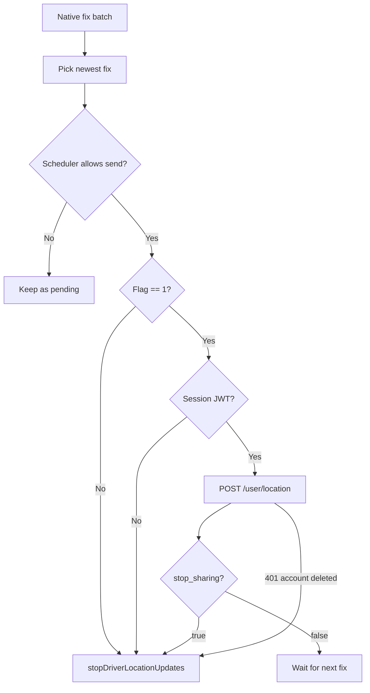

A driver's position travels through three stores before a rider sees it: the native location task on the phone, the Redis presence hash, and the `Users` row in Postgres. Riders read the Postgres copy. This page covers each hop, the kill switch that stops zombie tasks, and every ETA calculation that uses the driver's position.

For the presence hash itself, see [Heartbeat and presence](/engineering/location/heartbeat-and-presence). For ride statuses, see [Ride lifecycle](/concepts/ride-lifecycle).

## When the task runs

`app/(app)/drive/index.tsx` owns the lifecycle:

```tsx
const isActivelyDriving = Boolean(userStatus?.driver_is_online) || Boolean(currRide);
useEffect(() => {
  if (isActivelyDriving) void startDriverLocationUpdates();
  else void stopDriverLocationUpdates();
  return () => { void stopDriverLocationUpdates(); };
}, [isActivelyDriving]);
```

- The task starts only while the driver is online or has a current ride. Viewing the drive screen offline does not start it.
- The effect cleanup stops the task whenever the drive screen unmounts.
- `app/_layout.tsx` calls `reconcileDriverLocationUpdates()` on every cold start. It stops a still-registered task if the SecureStore flag `driver_should_share_location` is not `"1"`.

## Task configuration

`startDriverLocationUpdates` in `tasks/DriverLocationTask.ts` first writes `driver_should_share_location = "1"`, then registers `DRIVER_LOCATION_SYNC_TASK` only if it isn't already running:

| Option | Value | Effect |
| --- | --- | --- |
| `accuracy` | `Location.Accuracy.Balanced` | Network-assisted fixes, lower battery than High |
| `timeInterval` | 15,000 ms | Minimum time between fixes (Android) |
| `distanceInterval` | 25 m | Minimum movement between fixes |
| `activityType` | `AutomotiveNavigation` | iOS tuning for driving |
| `pausesUpdatesAutomatically` | `false` | iOS never pauses updates on its own |
| `deferredUpdatesInterval`, `deferredUpdatesDistance` | Same as above | iOS may batch fixes into one wake-up |
| `showsBackgroundLocationIndicator` | `true` | iOS blue status-bar pill |
| `foregroundService` | Title "Location sharing active", body "Updating your location for your ride" | Required Android foreground notification |

The iOS background modes are `location` and `remote-notification`. See [Rider and driver flows](/engineering/mobile/rider-and-driver-flows#background-driver-task).

## Upload pipeline

Each task callback receives a batch of fixes. The task uploads only the newest fix in the batch, through a scheduler from `lib/platform/locationUploadScheduler.ts`:

| Setting | Value |
| --- | --- |
| Minimum interval between sends | 5 seconds (`minIntervalMs`) |
| Backoff after failure | `min(60s, 5s × 2^(failures - 1))`, so 5, 10, 20, 40, then 60 seconds |
| Failure counter cap | 8 |
| Request timeout | 15 seconds |
| Retry trigger | The next native fix. No JS timer keeps the runtime awake |

A fix older than the last successful upload is ignored. A failed fix is kept as pending unless a newer one arrived meanwhile. `reset()` bumps a generation counter so a send that finishes after a stop cannot restore state.

The request is `POST /user/location` with an explicit `Authorization: Bearer` header read from SecureStore key `session`, because no React providers exist in a headless task.

```json
{ "latitude": 40.1, "longitude": -88.2, "orientation": 271.5, "speed": 8.4 }
```

The foreground uploader in `LocationProvider` is disabled while the path contains `/drive` or `user_status` is `driving`, so the background task is the only location writer for an active driver.

## The stop_sharing kill switch

`UserHandler.UpdateLocation` in `internal/server/http/user/user_handler.go` writes the location, then asks whether the caller should still be sharing:

```sql
-- name: ShouldShareDriverLocation :one
SELECT (u.is_online_driver OR EXISTS (SELECT 1 FROM "Rides"
    WHERE driver_id = u.id AND status NOT IN ('complete', 'pending_rider_rating')))::boolean
FROM "Users" u WHERE u.id = $1;
```

The response is `{ "success": true, "stop_sharing": <bool> }`. `stop_sharing` is true when the user is neither DB-online nor assigned to an open ride, including a queued one. If the check itself fails, the handler logs and returns `stop_sharing: false`, so a database blip never kills a legitimate task.

The task tears itself down (sets the flag to `"0"` and calls `stopLocationUpdatesAsync`) when:

| Trigger | Where | Why it exists |
| --- | --- | --- |
| Flag `driver_should_share_location` is not `"1"` at send time | Upload scheduler callback | iOS relaunches force-quit apps for significant location changes and resumes the registered task |
| No SecureStore `session` | Upload scheduler callback | Logged out |
| Response has `stop_sharing: true` | Upload scheduler callback | Driver force-quit while online. The flag stays `"1"`, so only the server knows the session ended |
| 401 whose body marks the account deleted (`isAccountDeleted`) | Task error handler | A deleted account can never recover |

An ordinary 401 does not stop the task, because it may be a token-refresh race.



## Server-side storage

`UserService.UpdateLocation` (`internal/service/user/user.go`):

1. Calls `PresenceCache.UpdateLocation`. It reads `community` and `screen` from `presence:{user}`, writes `lat`, `lng`, `ts`, and optional `orient` and `speed`, refreshes the 120-second TTL, and re-scores `community:online:{c}`. It re-scores `community:drivers:{c}` only if `screen` is `drive`.
2. Queues the Postgres write (`SetDriverLocation`) on a 100-slot channel, dropping it when full.
3. If Redis fails, writes Postgres synchronously and returns.

| Store | Fields | Freshness | Readers |
| --- | --- | --- | --- |
| `presence:{user}` | `lat`, `lng`, `orient`, `speed`, `ts` | Real time, 120-second TTL | Vehicles layer, driver options, direct requests |
| `driver:loc:{user}` | `lat`, `lng`, `ts` | Heartbeat only, 2-hour TTL | Activation, vehicles-layer fallback for in-ride drivers |
| `Users.latitude`, `longitude`, `orientation`, `speed`, `location_updated_at` | Async copy | Usually sub-second behind, lossy under load | Rider map details, pickup routing, friends, heatmap |

## How riders see the driver

The rider app polls `GET /ride/i/{id}/map-details` every 3 seconds during `driver_en_route`, `driver_waiting`, and `in_progress` (`RideProvider`, `refetchIntervalInBackground: false`). The driver app polls the same endpoint every 10 seconds, only while `/drive` is visible.

`RideService.GetMapDetails` (`internal/service/ride/ride.go`) builds the response:

1. `GetRideMapProjection` reads the ride and joins the driver's `Users` row. Driver position, orientation, and speed come from Postgres, not Redis.
2. The route is `pickup_route` while `queued`, `driver_en_route`, or `driver_waiting`, and `route` otherwise.
3. For queued rides, `GetPreviousQueuedRideDestination` finds the destination of the driver's previous open ride, by `match_time`.
4. Queue position and wait come from the driver's cached queue ETAs (`queueCache.GetQueueRideETAs`).
5. `mapDistanceDuration` computes `distance` and `duration`, and `end_time` is `now + duration`.

### Map ETA by status

`calculateMapDistanceDuration`:

| Status | Leg | Source |
| --- | --- | --- |
| `requested`, `confirmed`, `pending_rider_rating`, `complete` | Pickup to destination | The ride's stored `distance` and `duration`, or a fresh lookup if both are zero |
| `driver_en_route`, `driver_waiting` | Driver to pickup | `GetDistance` from the driver's Postgres position |
| `in_progress` | Driver to destination | Same |
| `queued` | Driver to previous drop-off, plus previous drop-off to pickup | Two `GetDistance` calls. Falls back to driver to pickup when there's no previous ride |
| `no_drivers_available` | None | Input error "No Drivers Available" |

Results are cached in Redis under `rideeta:{rideID}:{status}:{driverID}` for 15 seconds (`rideETACacheTTL`), so a 3-second poll costs one provider call per 15 seconds per ride. Underneath, `mapbox.CachedClient.GetDistance` also caches each coordinate pair for 5 minutes. See [Routing and distance](/engineering/location/routing-and-distance).

If the driver has no Postgres coordinates, `getDriverCoordinates` returns a server error and the whole map-details request fails.

### Rendering on the rider app

`RideProvider` sets the map markers from `map-details`:

- In matching statuses, pickup and drop-off are shown, with the driver if present.
- In `queued`, `driver_en_route`, and `driver_waiting`, the route, pickup, drop-off, and the driver marker are shown.
- In `in_progress`, the separate driver marker is replaced by a combined rider-and-driver marker (`setRiderDriver`).

The driver marker is only built when `driver_latitude`, `driver_longitude`, and the driver's `photo_url` are all present. `driver_orientation` and `driver_speed` are returned but the rider app doesn't read them.

## Pickup routing on assignment

`pickupRoute` in `internal/service/ride/promotion_route.go` runs from `AcceptRide`, `prepareRidePickup`, and `prepareActiveRide` in `internal/service/ride/driver.go`:

- The origin is the driver's `NextAvailableLatitude` and `NextAvailableLongitude`, the end of their assigned queue. Once the ride is `driver_en_route`, the origin switches to the driver's actual `Users` position.
- It calls Mapbox `GetDistance` and Google `GetRoute` in parallel with an `errgroup`. If either fails, the calling step fails. Mapbox distance rarely fails because it falls back to Google and then haversine. The Google route has no fallback.
- The polyline is stored as `lat,lng;` pairs (`googlemaps.EncodeRoute`).

## Driver options ETA

When a rider requests a ride with `X-Features: driver-options`, `internal/service/ride/driver_options.go` offers specific online drivers:

1. Read every online driver from `GetVehiclePresences` (drive screen, vehicle set, fresh within 120 seconds). The rider is excluded.
2. For each, read the active ride and the queue summary. The ETA origin is the current position when idle, or the last queued drop-off when busy.
3. Rough-sort with haversine at 0.5 km per minute (30 km/h) plus queued minutes. Drop anyone at 60 rough minutes or more.
4. Keep the best 5 and call Mapbox `GetDistances` (one matrix request) for accurate durations. On failure, use the rough estimate.
5. Return at most 3 options. `pickup_time_range` is the ETA minus 2 minutes (minimum 1) to the ETA plus 2 minutes.

Direct requests re-check the selected driver the same way. `directDriverETAUnavailableReason` rejects an ETA of 60 minutes or more as `eta_too_long`.

## Where this lives in code

| Concern | Path |
| --- | --- |
| Background task | `yelo-frontend/tasks/DriverLocationTask.ts` |
| Upload scheduler | `yelo-frontend/lib/platform/locationUploadScheduler.ts` |
| Task lifecycle | `yelo-frontend/app/(app)/drive/index.tsx`, `app/_layout.tsx` |
| Rider map rendering | `yelo-frontend/providers/RideProvider.tsx` |
| Location endpoint and kill switch | `yelo-api/internal/server/http/user/user_handler.go` (`UpdateLocation`), `internal/service/user/user.go` (`UpdateLocation`, `ShouldStopLocationSharing`) |
| Share predicate | `yelo-api/internal/data/repository/queries/user_driver.sql` (`ShouldShareDriverLocation`, `SetDriverLocation`) |
| Map details | `yelo-api/internal/service/ride/ride.go` (`GetMapDetails`, `mapDistanceDuration`, `calculateMapDistanceDuration`), `internal/data/repository/ride_matching.go` (`GetMapDetails`), `queries/ride_matching.sql` (`GetRideMapProjection`) |
| Pickup route | `yelo-api/internal/service/ride/promotion_route.go` |
| Driver options | `yelo-api/internal/service/ride/driver_options.go` |
| ETA cache | `yelo-api/internal/data/redis/route_cache.go` (`GetRideETA`, `SetRideETA`) |

## Gotchas and edge cases

<AccordionGroup>
  <Accordion title="Leaving the drive screen stops tracking">
    The drive screen's effect cleanup calls `stopDriverLocationUpdates()` on unmount. If navigation unmounts `drive/index` while the driver is online or mid-ride, background uploads stop until the screen mounts again. Presence then expires after 120 seconds.
  </Accordion>
  <Accordion title="Riders see the Postgres copy">
    Map details read `Users.latitude` and `longitude`, which the async queue writes. When a sync queue is full, writes are dropped and the rider sees an older position. `location_updated_at` is not returned, so the app can't tell a stale position from a fresh one.
  </Accordion>
  <Accordion title="Drivers without a profile photo are invisible to riders">
    `RideProvider` only builds the driver marker when `rideInfo.driver.photo_url` is set. A driver with no photo has no marker during pickup, even though map details include the coordinates.
  </Accordion>
  <Accordion title="Heading can be -1 from the background task">
    The foreground uploader drops negative heading and speed. The background task sends `location.coords.heading ?? null` and `speed ?? null`, so iOS's `-1` "invalid" values reach the server. The API doesn't validate `orientation` or `speed`, and the vehicles layer passes `orient` through as the marker heading.
  </Accordion>
  <Accordion title="stop_sharing includes queued rides">
    The share predicate counts any ride not in `complete` or `pending_rider_rating`, including `queued`. A driver who goes offline with queued rides keeps sharing until those rides are unqueued or finished.
  </Accordion>
  <Accordion title="Queued ETA uses the previous open ride only">
    `GetPreviousQueuedRideDestination` picks the latest open ride with an earlier `match_time`. The queued ETA is two legs, not the full chain through every ride ahead in the queue.
  </Accordion>
  <Accordion title="ETA cache keys include status and driver">
    A status change or a driver reassignment produces a new `rideeta` key, so the ETA recomputes immediately instead of serving 15 seconds of the old leg.
  </Accordion>
  <Accordion title="Missing driver coordinates fail map details">
    If the assigned driver has never uploaded a location, `getDriverCoordinates` returns a server error for en-route, waiting, in-progress, and queued rides. The rider's 3-second poll keeps failing until a location arrives.
  </Accordion>
</AccordionGroup>
