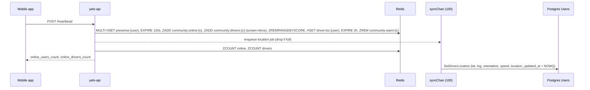

Presence is the answer to "who has the app open right now, and where". Two endpoints feed it, one Redis hash per user holds it, and three sorted sets per community index it. Postgres gets a delayed, lossy copy of the coordinates. This page traces a heartbeat end to end and lists every threshold that decides whether someone counts as online.

For the admin view of this data, see [Presence](/dashboard/presence). For the driver background task that also writes presence, see [Driver location tracking](/engineering/location/driver-location-tracking).

## Two write paths

| Endpoint | Sent by | Carries | Redis write | Postgres write |
| --- | --- | --- | --- | --- |
| `POST /heartbeat/` | `providers/HeartbeatProvider.tsx` (JS timer, foreground only in practice) | Position, app state, screen, battery, network, vehicle, auto-queue | `PresenceCache.Heartbeat`: full hash, sorted sets, driver location, warm-pool removal | Async `Users` location update |
| `POST /user/location` | Foreground uploader in `providers/LocationProvider.tsx`, and the driver background task in `tasks/DriverLocationTask.ts` | Position, heading, speed | `PresenceCache.UpdateLocation`: position fields only, re-scores sorted sets | Async `Users` location update |

Both paths write Redis first and queue the Postgres write. Only the heartbeat establishes a user's community and screen in the hash. `UpdateLocation` reads them back from the hash to keep the sorted sets fresh.



## Heartbeat payload

`HeartbeatRequest` in `internal/server/http/heartbeat/requests/heartbeat.go`:

| Field | Required | Validation | Stored in hash as |
| --- | --- | --- | --- |
| `latitude`, `longitude` | Yes (zero accepted) | `[-90, 90]`, `[-180, 180]` | `lat`, `lng` |
| `app_state` | Yes | `active`, `background`, or `inactive` | `app_state` |
| `screen` | No | Free text | `screen` |
| `orientation` | No | None | `orient` |
| `speed` | No | None | `speed` |
| `battery_level` | No | `[0, 1]` | `battery` |
| `network_type` | No | `wifi`, `cellular`, or `none` | `network` |
| `vehicle_id` | No | None | `vehicle` |
| `auto_queue` | No | None | `aq` (`"1"` or `"0"`) |
| `signal_strength` | No | None | Not stored |
| `battery_charging` | No | None | Not stored |

The handler takes the user and community from the JWT (`customContext.GetRequestUserID`, `GetRequestUserCommunity`), not the body. The server also writes `community` and `ts` (Unix seconds) into the hash.

## Client cadence

`lib/platform/heartbeatUtils.ts` picks the interval from the route and app state:

| Condition | Interval |
| --- | --- |
| `appState !== 'active'` | 45 seconds |
| Path contains `/drive` | 10 seconds |
| Path contains `/ride` | 15 seconds |
| Anything else | 30 seconds |

`HeartbeatProvider` debounces interval changes by 500 ms, sends immediately when the timer re-arms, and sends again on every background-to-active transition. It skips the send entirely unless all of these hold:

- The startup phase is interactive (`useStartupPhase().isInteractive`).
- A JWT exists and the session is not presignup.
- Foreground location permission is granted.
- `getLastPosition()` returns a fix.

`getLastPosition()` comes from the device location controller in `lib/map/deviceLocation.ts`. It returns `null` unless the fix is at most 60 seconds old (`DEVICE_LOCATION_MAX_AGE_MS`) and accurate to 100 m or better (`DEVICE_LOCATION_MAX_ACCURACY_M`). A heartbeat never falls back to an older fix.

### Screen mapping

`mapScreenName` checks path substrings in this order: `/driver-signup` becomes `driver_signup`, `/drive` becomes `drive`, `/ride` becomes `ride`, then `onboarding`, `profile`, `map`, and `home`. If the mapped screen is `drive` and the user is not an online driver, `HeartbeatProvider` sends `drive_offline` instead, so browsing the drive tab never advertises a driver.

Driver presence comes from `currentUser.user.is_online_driver` and `vehicle_id`, unless `setDriverPresence(online, vehicleId)` set an override. The go-online flow calls it right after `POST /driver/refresh-online`, so the server sees the new vehicle before the profile query refreshes. `vehicle_id` is only sent while online. `auto_queue` is sent whenever the profile has a value.

## Redis layout

All presence keys live in the shared Redis client. Constants are in `internal/data/redis/presence_cache.go` and `activation_cache.go`.

| Key | Type | TTL | Written by | Contents |
| --- | --- | --- | --- | --- |
| `presence:{userID}` | Hash | 120 seconds, refreshed on every write | `Heartbeat`, `UpdateLocation`, `SetAutoQueueFlag` | `lat`, `lng`, `community`, `app_state`, `ts`, and optional `orient`, `speed`, `screen`, `battery`, `network`, `vehicle`, `aq` |
| `community:online:{communityID}` | Sorted set, score = Unix seconds | None (pruned by score) | `Heartbeat`, `UpdateLocation` | Every user who sent a heartbeat |
| `community:drivers:{communityID}` | Sorted set, score = Unix seconds | None (pruned by score) | `Heartbeat` and `UpdateLocation`, only when the hash's `screen` is exactly `drive` | Online drivers on the drive screen |
| `driver:loc:{userID}` | Hash | 2 hours | `Heartbeat` only | `lat`, `lng`, `ts` |
| `community:warm:{communityID}` | Sorted set | Pruned to 60 minutes on read | See the warm pool note below | Recently offline drivers |

Every heartbeat runs a `ZREMRANGEBYSCORE` that removes members older than 120 seconds from both community sets. Readers also filter by score (`now - 120`), so a stale member is never counted even before pruning.

<Note>
  `driver:loc:{userID}` is written on every heartbeat, including riders'. The name reflects its only consumers (activation, the vehicles map layer fallback, and the dashboard warm-pool map), not who writes it. It is not refreshed by `POST /user/location`, so a backgrounded driver whose JS heartbeat timer has stopped keeps a `driver:loc` that ages up to 2 hours.
</Note>

## What "online" means

The API has several independent definitions. They disagree by design, so check which one a feature uses.

| Definition | Source | Window | Used by |
| --- | --- | --- | --- |
| Presence online | `presence:{user}` exists | 120 seconds since last write | `IsOnline` (queued-ride offline grace), friends layer `is_online` |
| Community online count | `community:online:{c}` score | 120 seconds | Heartbeat response `online_users_count`, dashboard **Online Users** |
| Community driver count | `community:drivers:{c}` score | 120 seconds | Heartbeat response `online_drivers_count`, dashboard **Online Drivers** |
| Online driver on the map | `community:drivers:{c}` score, plus hash `screen == "drive"` and a non-empty `vehicle` | 120 seconds | `GetVehiclePresences` (vehicles layer, driver options, direct-request checks) |
| Auto-queue candidate | Same as above, plus `aq == "1"` | 120 seconds | `GetAutoQueueDrivers` |
| DB online driver | `Users.is_online_driver` | Expires after 30 minutes without `last_pinged_driver` | Matching, `ShouldShareDriverLocation`, `/user/status` |
| Warm pool driver | `community:warm:{c}` score | 60 minutes (`warmPoolMaxAge`) | Activation tiers, dashboard **Warm Pool** |
| Market live | Any online driver, operating window, or last offline under 1 hour | See [Communities and zones](/concepts/communities-and-zones#operating-hours-and-market-status) | Rider app market status |

### DB driver liveness

`last_pinged_driver` is not touched by heartbeats. `GetUserStatus` in `internal/data/repository/user_driver.go` calls `pingDriverAsync` whenever the status is `driving` and the stored ping is older than 5 seconds (`driverPingFreshness`). The app polls `/user/status`, so a driver stays DB-online only while the app keeps polling.

`UserService.PurgeOfflineDrivers` runs every 30 seconds in the `Operational` loop (`cmd/api/main.go`). Through `SetInactiveDriversOffline` it:

1. Restores `is_online_driver = TRUE` for any driver with a ride not in `complete` or `pending_rider_rating` (`RestoreDriversWithActiveRides`).
2. Sets drivers offline when `last_pinged_driver` is older than 30 minutes (`config.DriverExpiryInterval`), unless they completed a ride within those 30 minutes or have an open ride (`ExpireInactiveDrivers`).
3. Closes their driver sessions in the same transaction.

It then sends renew-online reminders. `ListDriversAwaitingRenewReminder` picks drivers whose last ping is between 29 minutes 15 seconds and 29 minutes 45 seconds old, at most once per community per 30 seconds (`config.DriverReminderInterval`).

Finally, `handleQueuedDriverOfflineGrace` checks each driver with queued rides. If their presence hash is gone and their last ping is older than 5 minutes (`config.OfflineGraceInterval`), their queued rides are unqueued.

## Postgres sync

Both `HeartbeatService` and `UserService` own a buffered channel of 100 jobs (`maxPendingSyncs`, `maxPendingLocationSyncs`) and one goroutine that drains it with `SetDriverLocation`:

```sql
UPDATE "Users" SET latitude = $1, longitude = $2, orientation = $3, speed = $4,
  location_updated_at = NOW()
WHERE id = $5;
```

- The enqueue is non-blocking. When the channel is full, the write is dropped and a warning logs on the 1st, 101st, 201st drop, and so on.
- The job carries a detached context (`customContext.DetachedBackground`) so trace IDs survive the request.
- `location_updated_at` is the time the worker ran, not the time of the fix.
- If the Redis write fails, the handler writes Postgres synchronously instead. The heartbeat then returns `0` for both counts, because it skips the count queries.
- `Stop()` closes the channel on shutdown. Jobs still queued are processed until the channel drains.

Postgres coordinates feed the rider's view of the driver (`GET /ride/i/{id}/map-details`), friends' last-known positions, the heatmap, and pickup routing. See [Driver location tracking](/engineering/location/driver-location-tracking#how-riders-see-the-driver).

## Reads

| Reader | Method | Notes |
| --- | --- | --- |
| Heartbeat response | `GetOnlineCount`, `GetOnlineDriverCount` | Scoped to the JWT community |
| Dashboard presence | `GetOnlineMembers`, `GetDriverMembers`, `GetPresenceFields` | `internal/service/dashboard/presence.go`. The page polls every 10 seconds |
| Vehicles map layer | `GetVehiclePresences` | Pipelined `HMGET` of `lat`, `lng`, `orient`, `vehicle`, `screen`, `ts`, `aq`. Logs a warning with the count of rejected presences |
| Driver options and direct requests | `GetVehiclePresences` | `internal/service/ride/driver_options.go`, `rider.go` |
| Friends layer | `GetPresenceBatch` | `lat`, `lng`, `ts` only |
| Bump notifications | `GetPresenceFields` | `internal/service/notifications/bump.go` |
| Queued-ride offline grace | `IsOnline` | `EXISTS presence:{user}` |

## Where this lives in code

| Concern | Path |
| --- | --- |
| Heartbeat route and validation | `yelo-api/internal/server/http/heartbeat/routes.go`, `handler.go`, `requests/heartbeat.go` |
| Heartbeat service and PG queue | `yelo-api/internal/service/heartbeat/heartbeat.go` (`Heartbeat`, `processSyncQueue`) |
| Location route and PG queue | `yelo-api/internal/server/http/user/user_handler.go` (`UpdateLocation`), `internal/service/user/user.go` (`UpdateLocation`, `processSyncQueue`) |
| Presence cache | `yelo-api/internal/data/redis/presence_cache.go` |
| Warm pool and driver location cache | `yelo-api/internal/data/redis/activation_cache.go` |
| Offline sweep | `yelo-api/internal/data/repository/user_driver.go` (`SetInactiveDriversOffline`), `queries/user_driver.sql`, `internal/service/user/user.go` (`PurgeOfflineDrivers`, `handleQueuedDriverOfflineGrace`) |
| Constants | `yelo-api/internal/utilities/config/constants.go` |
| Client provider | `yelo-frontend/providers/HeartbeatProvider.tsx` |
| Cadence and screen mapping | `yelo-frontend/lib/platform/heartbeatUtils.ts` |
| Fix freshness | `yelo-frontend/lib/map/deviceLocation.ts` |

## Gotchas and edge cases

<AccordionGroup>
  <Accordion title="The warm pool is never filled">
    Only `PresenceCache.GoOffline` and `ActivationCache.AddToWarmPool` add members to `community:warm:{c}`, and neither has a caller outside tests. Heartbeats only remove members. Unless something outside the API writes that key, the dashboard **Warm Pool** card reads zero and activation's warm-pool tier finds no candidates.
  </Accordion>
  <Accordion title="An online driver off the drive screen drops out of the driver set">
    `community:drivers:{c}` only gets a member when the hash's `screen` is exactly `drive`. An online driver who opens the map tab or profile sends `screen: map` or `profile`, which overwrites the hash. Within 120 seconds they stop counting in **Online Drivers**, disappear from the vehicles layer, and stop being offered as a driver option. They stay `is_online_driver` in Postgres.
  </Accordion>
  <Accordion title="Substring matching catches unrelated routes">
    `pathname.includes('/drive')` also matches `/driver-earnings` and `/driver-signup`. Those routes get the 10-second cadence. `/driver-earnings` maps to screen `drive` (or `drive_offline`), so an online driver checking earnings still counts as a driver. `/ride` also matches `/ride-matching`.
  </Accordion>
  <Accordion title="A stationary user can stop heartbeating">
    Heartbeats require a fix no older than 60 seconds. The foreground watcher only runs while a map or ride-planning screen needs it, and ongoing tracking uses a 50 m distance filter. On a screen without tracking, or when the device does not move, `getLastPosition()` can return `null` and every heartbeat is skipped. The user's presence expires 120 seconds later.
  </Accordion>
  <Accordion title="Background heartbeats are best effort">
    The 45-second background interval is a JS `setInterval`. The OS usually suspends the JS runtime, so backgrounded riders mostly drop out after 120 seconds. Online drivers stay present only because the native background task keeps calling `POST /user/location`, which re-scores the sorted sets.
  </Accordion>
  <Accordion title="Community comes from the token">
    Both the hash's `community` field and the sorted-set key come from the JWT claim. After a community change, the old sorted set keeps the member until it ages out, so for up to 120 seconds the user can count in two communities.
  </Accordion>
  <Accordion title="UpdateLocation before any heartbeat">
    If `presence:{user}` has no `community` or `screen` yet, `UpdateLocation` writes only `lat`, `lng`, `ts`, and heading or speed, with a 120-second TTL. That hash makes `IsOnline` true and shows the user as online in the friends layer, but the user is in no community set.
  </Accordion>
  <Accordion title="Accepted but ignored fields">
    `signal_strength` and `battery_charging` pass validation and are never stored. The app sends `battery_charging` on every heartbeat.
  </Accordion>
  <Accordion title="Dropped Postgres writes are silent to the client">
    A full sync queue drops the write but still returns success. `Users.latitude` and `location_updated_at` can lag Redis under load, and each API instance has its own queue.
  </Accordion>
  <Accordion title="Coordinates of 0,0">
    The heartbeat validator accepts `0, 0`. The app never sends it, because it requires a usable fix, but other clients could. The heatmap query excludes zero coordinates. Presence readers do not.
  </Accordion>
</AccordionGroup>
