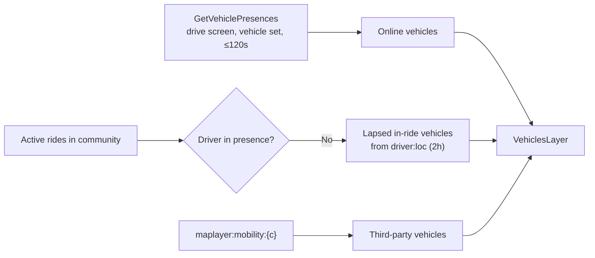

The rider map is assembled from four server layers under `/map`. Each layer has its own data sources, cache, and freshness contract. Third-party transit and micromobility feeds are polled into the same vehicles layer. This page documents how each layer is built and cached.

For the operator side of feeds and the dashboard map, see [Community map](/dashboard/community-map). For how the app draws these layers, see [Map rendering](/engineering/location/map-rendering).

## Endpoints

Rider routes are registered in `internal/server/http/maplayer/routes.go` under `/map` and scoped to the JWT community. Community POI pins come from a separate route, `GET /location/pois` (`internal/server/http/location`). Dashboard routes take a community ID in the path.

| Route | Payload | Server cache | `Cache-Control` |
| --- | --- | --- | --- |
| `GET /map/vehicles` | `VehiclesLayer` | `maplayer:vehicles:{c}`, 60 seconds | `private, max-age=30, stale-while-revalidate=60` |
| `GET /map/community` | `CommunityLayer` | `maplayer:community:canonical-places:{c}`, 300 seconds | `private, max-age=120, stale-while-revalidate=300` |
| `GET /map/friends` | `FriendsLayer` | None | `no-store` |
| `GET /map/mobility` | `MobilityLayer` | Reads the vehicles cache plus the schedule key | `private, max-age=30, stale-while-revalidate=60` |
| `GET /dashboard/communities/{id}/map/community` | `CommunityLayer` | Same as rider | `private, max-age=120, stale-while-revalidate=300` |
| `GET /dashboard/communities/{id}/map/mobility` | `MobilityLayer` | Same as rider | `private, max-age=30, stale-while-revalidate=60` |
| `GET /dashboard/communities/{id}/map/ride-routes` | Historical routes | None | `private, max-age=60, stale-while-revalidate=300` |
| `GET /dashboard/communities/{id}/mobility-feed-suggestions` | Catalog matches | In-process catalog, 6 hours | `private, max-age=300, stale-while-revalidate=3600` |

`MapLayerCache.Get` in `internal/data/redis/map_layer_cache.go` is a plain read-through cache: on a miss it builds the layer and writes it with the TTL. There is no stampede protection, so concurrent misses each build the layer.

## Vehicles layer

`buildVehiclesLayer` in `internal/service/maplayer/maplayer.go` merges three sources:

| Source | Status | Position | `updated_at_ms` |
| --- | --- | --- | --- |
| Online presence | `in_ride` if the driver has an active ride, else `online_auto_queue` if `aq == "1"`, else `online` | Presence `lat`, `lng`, heading from `orient` | Presence `ts × 1000`, or now if missing |
| In-ride driver whose presence expired | `in_ride` | `driver:loc:{driver}` | That hash's `ts × 1000` |
| Mobility feed | Not set | Feed position and bearing | Feed timestamp |

- Yelo vehicle marker IDs are vehicle IDs, never user IDs. Lapsed in-ride drivers without a `vehicle_id` on the ride, or without a cached location, are skipped.
- Fleet comes from the ride's fleet, else the driver's active session fleet. Vehicle type and fleet name and logo are looked up in batches.
- A presence read failure returns an empty layer rather than an error.

## Community layer

`buildCommunityLayer` assembles curated content. Each section fails independently to an empty list:

| Section | Source | Limit |
| --- | --- | --- |
| `top_locations` | `Location.GetTopLocations` | 20 |
| `events` | `Event.GetUpcoming` with `uuid.Nil` as viewer, so no per-user viewed flag | 25 |
| `spot` | `Spot.GetActiveByCommunity` | 1 |
| `heatmap`, `heatmap_max_weight` | `maplayer:heat:{c}` | Up to 500 cells |
| `moves` | Bumps and public ride destinations | 50 |

### Heatmap

`RefreshHeatmaps` in `heatmap.go` runs in the `MapHeat` loop every 5 minutes, and once immediately at startup (`backgroundCleanupImmediately`). For every active, non-hidden community:

1. Read last-known positions from Postgres with `ListFreshCommunityCoordinates`: users in the community, not deleted, `share_location_with_friends = TRUE`, `location_updated_at` within 60 days, non-zero coordinates, at most 10,000 rows.
2. Bin into a grid of 0.0005 degrees (about 50 m of latitude) using `floor(coordinate / 0.0005)`. Each cell reports its center.
3. Drop cells with fewer than 3 users (`heatMinUsers`, a k-anonymity floor).
4. Keep the 500 heaviest cells (`heatMaxCellsCap`).
5. Write `maplayer:heat:{c}` with a 15-minute TTL, then invalidate the community layer cache.

The heatmap reads Postgres only. Merging presence would double-count online users and leak users who turned off location sharing.

### Moves

`collectCommunityMoves` in `community_moves.go` counts anonymized "people heading to X" destinations over the community's `map_moves_window_hours` (default 7 days):

- `Bump.GetCommunityDestinationCounts` and `Ride.GetPublicDestinationCounts` each apply a floor of 2 in SQL (`communityMovesMinCount`).
- Results merge by `mapbox_id|name|lat4|lng4`. Counts add up, and categories prefer the snapshot's.
- Sorted by count and truncated to 50.

`PurgeExpiredBumps` runs in the same loop and deletes bumps that expired more than 7 days ago (`bumpRetention`).

## Friends layer

`GetFriendsLayer` in `friends_layer.go` is per user and never cached:

1. `ListFriendsForMap` returns friends who aren't deleted and have `share_location_with_friends = TRUE`.
2. `GetPresenceBatch` reads `presence:{friend}`. A friend with a presence hash is `is_online: true` at the presence position.
3. Otherwise the friend's Postgres position is used if `location_updated_at` is within 7 days (`friendPositionMaxAge`). Older friends are omitted.
4. Liked spots from friends: up to 500 rows read, 100 spots returned.
5. Moves: bumps sent to the caller from current friends, plus friends' public ride destinations in the last 24 hours.

`PUT /user/location-sharing` sets `share_location_with_friends` and triggers `SocialChanged`, which pushes `map_content_changed` with scope `friends` to the user and all their friends.

## Change notifications

`internal/service/mapchanges` sends silent `map_content_changed` pushes after map mutations, each with a unique event key so the five-minute notification dedupe never swallows an edit:

| Scope | Trigger | Recipients |
| --- | --- | --- |
| `community_pois` | Top locations or location edits in a community | Community broadcast |
| `place_metadata` | A Google place profile changed | Users affected by that place (`PlaceCatalog.AffectedUsers`) |
| `friends` | Likes, location sharing, friendships | The user plus their friends |

The app maps each scope to query invalidations. See [Rider and driver flows](/engineering/mobile/rider-and-driver-flows#push-notifications).

## Mobility feeds

### Sources

| `source` | Fetch | Output |
| --- | --- | --- |
| `gbfs` | Auto-discovery (`gbfs.json`) or a direct `vehicle_status` or `free_bike_status` URL | Vehicles |
| `gtfs_rt` | GTFS-Realtime `FeedMessage` protobuf (`Accept: application/x-protobuf`) | Vehicles |
| `gtfs` | Static GTFS ZIP | Stops and route shapes |

GBFS discovery prefers `vehicle_status`, then `free_bike_status`, across the direct feed list and every language group. Station-only systems are rejected. A GTFS-RT URL that returns a ZIP gets a specific error telling the operator to use `gtfs`.

### Refresh loop

`RefreshMobilityFeeds` in `internal/service/maplayer/mobility.go` runs every minute in the `Mobility` loop. It does nothing when Redis is disabled.

1. Load all active feeds and group them by community.
2. For each GBFS or GTFS-RT feed not in backoff, fetch and map vehicles. Disabled or reserved vehicles are skipped. Marker IDs are `{feed name}:{vehicle id}`.
3. Write `maplayer:mobility:{c}` (10-minute TTL) and invalidate the vehicles layer cache.
4. For each GTFS feed, reuse `maplayer:mobility-schedule-feed:{feedID}:{sha256(url)[:8]}` (24-hour TTL) or fetch and parse the ZIP. Write the merged `maplayer:mobility-schedule:{c}` (48-hour TTL).
5. Scan both community prefixes and delete keys for communities that no longer have an active feed.

Every feed failure is written to the row (`last_error`, `last_error_at`, `consecutive_failures`) and shown on the dashboard. `mobilityFeedInBackoff` skips a feed for `min(2^n minutes, 1 hour)` after `n` consecutive failures. The first success clears the counters. Healthy feeds cause no writes.

### Limits

| Limit | Value | Source |
| --- | --- | --- |
| HTTP timeout, dial timeout | 10 seconds each, no retries | `data/mobility/client.go` |
| Live feed body | 10 MiB | `maxMobilityResponseBytes` |
| GTFS ZIP | 20 MiB compressed, 100 MiB expanded per file | `maxGTFSArchiveBytes`, `maxGTFSExpandedBytes` |
| Vehicles per feed | 50,000 | `maxMobilityVehicles` |
| GTFS stops, shapes, shape points | 100,000, 25,000, 750,000 | `data/mobility/gtfs.go` |
| Catalog CSV | 10 MiB, cached in process for 6 hours | `data/mobility/catalog.go` |

### SSRF guard

Feed URLs are operator-supplied and fetched from inside Cloud Run, so the client guards every connection:

- `validateFeedURL` in `internal/service/mobilityfeed/mobilityfeed.go` resolves the host at save time and rejects non-public addresses. It gives fast feedback but is not the security boundary.
- `guardedDialContext` in `data/mobility/client.go` resolves the host on every dial, including redirect hops, rejects the connection if any resolved IP is disallowed, and dials the vetted IP. This defeats DNS rebinding.
- `IsBlockedHostname` rejects `metadata.google.internal` and `metadata` before DNS.
- `IsDisallowedIP` rejects anything that isn't global unicast, plus private, CGNAT (`100.64.0.0/10`), documentation, benchmarking, 6to4, Teredo, ULA, link-local, and multicast ranges.
- `AllowPrivateHosts()` disables the guard for tests only.

### Feed URL normalization

- A `mobilitydatabase.org` feed page URL for `gtfs` is rewritten to `https://files.mobilitydatabase.org/{id}/latest.zip`.
- `gtfs_rt` rejects any URL on `files.mobilitydatabase.org` or ending in `.zip`.

### Catalog suggestions

`DiscoverMobilityFeeds` downloads `https://files.mobilitydatabase.org/feeds_v2.csv` (cached in process for 6 hours) and returns active, unauthenticated GTFS Schedule and GTFS-RT VehiclePositions feeds whose bounds overlap the community box, sorted by provider then source. A suggestion is marked enabled if its latest or direct URL already exists on the community.

## Where this lives in code

| Concern | Path |
| --- | --- |
| Layer service | `yelo-api/internal/service/maplayer/maplayer.go`, `heatmap.go`, `community_moves.go`, `friends_layer.go`, `mobility.go`, `bump_retention.go` |
| Layer cache | `yelo-api/internal/data/redis/map_layer_cache.go` |
| Presence reads | `yelo-api/internal/data/redis/presence_cache.go` (`GetVehiclePresences`, `GetPresenceBatch`) |
| Routes and headers | `yelo-api/internal/server/http/maplayer/routes.go`, `handler.go` |
| Change pushes | `yelo-api/internal/service/mapchanges/mapchanges.go` |
| Feed clients | `yelo-api/internal/data/mobility/client.go`, `ssrf.go`, `gbfs.go`, `gtfs.go`, `gtfsrt.go`, `catalog.go` |
| Feed CRUD and validation | `yelo-api/internal/service/mobilityfeed/mobilityfeed.go`, `internal/server/http/dashboard/mobilityfeed` |
| Loops | `yelo-api/cmd/api/main.go` (`MapHeat`, `Mobility`) |

## Gotchas and edge cases

<AccordionGroup>
  <Accordion title="Every instance polls every feed">
    The `Mobility` and `MapHeat` loops run on every API instance. With three instances, each feed is fetched three times a minute. Writes are idempotent, but upstream rate limits see all of them.
  </Accordion>
  <Accordion title="Feed vehicles are not clipped to the community">
    Nothing filters mobility vehicles or stops by the community box. A statewide GBFS system puts every vehicle, up to 50,000, into one community's Redis key and the rider's vehicles payload.
  </Accordion>
  <Accordion title="Marker IDs depend on the feed name">
    Third-party IDs are `{feed name}:{vehicle id}`. Two feeds with the same name collide, and renaming a feed changes every marker ID, which breaks client-side tweening for one poll.
  </Accordion>
  <Accordion title="A backed-off feed disappears, a cached schedule does not">
    Vehicles from a feed in backoff vanish on the next tick. A GTFS schedule keeps serving from its 24-hour per-feed key even while the feed is failing.
  </Accordion>
  <Accordion title="The heatmap is not live presence">
    It uses last-known Postgres positions up to 60 days old. A campus that emptied out for break still shows heat. The dashboard labels it presence.
  </Accordion>
  <Accordion title="Grid edges split groups">
    Cells use `floor`, so three people standing across a cell boundary can fall below the floor of 3 in both cells and disappear from the heatmap.
  </Accordion>
  <Accordion title="Friends appear online from location uploads alone">
    `is_online` only checks for a presence hash. A driver's background task creates or refreshes that hash through `POST /user/location` even when no heartbeat was sent.
  </Accordion>
  <Accordion title="Vehicles layer lags by up to a minute">
    The layer is cached for 60 seconds and the client polls every 60 seconds. A driver who goes offline can stay on riders' maps for up to about two minutes. Presence expiry adds up to 120 seconds more.
  </Accordion>
</AccordionGroup>
