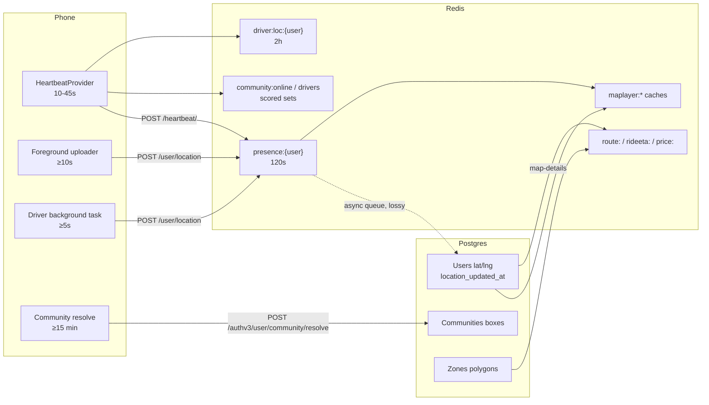

Location data enters Yelo from phones, flows through Redis and Postgres, and comes back out as presence counts, map layers, community assignments, ETAs, and prices. This section documents the behavior that lives only in code: timing, thresholds, fallbacks, and failure modes.

## Pages in this section

| Page | Covers |
| --- | --- |
| [Heartbeat and presence](/engineering/location/heartbeat-and-presence) | Heartbeat payload and cadence, presence keys, Postgres sync, every definition of online |
| [Driver location tracking](/engineering/location/driver-location-tracking) | Background task, `stop_sharing`, rider view of the driver, map and driver-option ETAs |
| [Community assignment](/engineering/location/community-assignment) | Box containment, the 20-mile exit buffer, ride-time repair, school mapping |
| [Zones geometry](/engineering/location/zones-geometry) | Polygons, ray casting, overlap resolution, the zoned meter |
| [Search, geocoding, and places](/engineering/location/search-and-places) | Autocomplete providers, retrieval, POI enrichment, reverse geocoding, top locations |
| [Routing and distance](/engineering/location/routing-and-distance) | Mapbox, Google, and haversine fallback, batching, route caches |
| [Map layers and mobility feeds](/engineering/location/map-layers-and-mobility) | Vehicles, community, and friends layers, heatmap privacy, GBFS and GTFS |
| [Map rendering](/engineering/location/map-rendering) | Mobile and dashboard Mapbox setup, layer order, polling, animation |

## Data flow

## Where each fact lives

| Question | Source of truth | Freshness |
| --- | --- | --- |
| Is this user's app open? | `presence:{user}` | 120 seconds |
| Where is this driver for a rider? | `Users.latitude`, `longitude` | Async copy of the last upload |
| Is this driver online for matching? | `Users.is_online_driver` | Until 30 minutes without a status ping |
| Which community is this user in? | `Users.community_id`, echoed in the JWT | JWT lags until reissued |
| Which zone is this point in? | `"Zones".geometry`, resolved in Go | Read per pricing call, quotes cached 5 minutes |
| Which places are top locations? | `CommunityTopLocations` joined to `PlaceProfiles` | Manual by default. Automatic refresh is opt-in per community, then at most every 24 hours |

## Threshold reference

### Presence and liveness

| Threshold | Value | Defined in |
| --- | --- | --- |
| Presence TTL and online window | 120 seconds | `presenceTTL`, `internal/data/redis/presence_cache.go` |
| Heartbeat interval: drive, ride, other, background | 10, 15, 30, 45 seconds | `lib/platform/heartbeatUtils.ts` |
| Heartbeat interval debounce | 500 ms | `providers/HeartbeatProvider.tsx` |
| Usable device fix | ≤ 60 seconds old, ≤ 100 m accuracy | `lib/map/deviceLocation.ts` |
| Location acquisition timeout | 12 seconds | `DEVICE_LOCATION_TIMEOUT_MS` |
| Ride-planning fix refresh | 45 seconds, 30 seconds after a failure | `DEVICE_LOCATION_REFRESH_MS`, `DEVICE_LOCATION_RETRY_MS` |
| Driver location cache | 2 hours | `driverLocTTL`, `activation_cache.go` |
| Warm pool window | 60 minutes | `warmPoolMaxAge` |
| DB driver ping refresh | Older than 5 seconds | `driverPingFreshness`, `user_driver.go` |
| DB driver expiry | 30 minutes | `config.DriverExpiryInterval` |
| Queued-ride offline grace | 5 minutes | `config.OfflineGraceInterval` |
| Offline sweep | Every 30 seconds | `Operational` loop, `cmd/api/main.go` |
| Postgres sync queue | 100 jobs per service, drop when full | `maxPendingSyncs`, `maxPendingLocationSyncs` |

### Uploads

| Threshold | Value | Defined in |
| --- | --- | --- |
| Foreground watcher | Balanced, 10 seconds, 50 m (High and 0 m while acquiring) | `providers/LocationProvider.tsx` |
| Foreground upload spacing and backoff | 10 seconds, backing off to 60 seconds | `lib/platform/foregroundLocationUploader.ts` |
| Background task | Balanced, 15 seconds, 25 m | `tasks/DriverLocationTask.ts` |
| Background upload spacing and backoff | 5 seconds, backing off to 60 seconds | `lib/platform/locationUploadScheduler.ts` |

### Community assignment

| Threshold | Value | Defined in |
| --- | --- | --- |
| Exit buffer | 20 miles from the nearest edge | `communityExitBufferMiles` |
| Client resolve spacing | 15 minutes | `COMMUNITY_RESOLUTION_MIN_INTERVAL_MS` |
| Client resolve fix limits | ≤ 30 minutes old, ≤ 5 km accuracy | `lib/map/communityResolution.ts` |
| Search bounds cache | 15 minutes, per instance | `communityBoundsCacheTTL` |

### Routing and ETA

| Threshold | Value | Defined in |
| --- | --- | --- |
| Route and polyline cache | 5 minutes, coordinates rounded to 4 decimals | `route_cache.go` |
| Live ride ETA cache | 15 seconds | `rideETACacheTTL` |
| Haversine fallback | ×1.4 detour at 30 km/h | `mapbox.go` |
| Matrix pairs per request | 24 | `maxBatchPairs` |
| Driver options | 3 shown, 5 routed, cut off at 60 minutes, ±2 minute range | `driver_options.go` |
| Google Routes timeout | 2 seconds per attempt | `googlemaps.go` |

### Search and places

| Threshold | Value | Defined in |
| --- | --- | --- |
| Google autocomplete timeout | 1.5 seconds | `googleplaces.go` |
| Mapbox suggest timeout | 2 seconds total, 3 attempts | `mapbox.go` |
| Google bias radius | 10 km default, 50 km maximum | `GOOGLE_PLACES_BIAS_RADIUS_METERS` |
| Client suggestion throttle | 300 ms | `hooks/useSearchSuggestions.ts` |
| Session suggestions | 10 minutes | `sessionSuggestTTL` |
| Place details and retrieve cache | 7 days | `placeDetailsCacheTTL` |
| POI match | Score ≥ 0.65, ≤ 5 km | `minimumPOIEvidence` |
| Top-location refresh | Every 24 hours when `automatic` is on, 40 candidates, 8 seconds each | `toplocations.go` |

### Map layers

| Threshold | Value | Defined in |
| --- | --- | --- |
| Vehicles layer cache | 60 seconds | `vehiclesLayerTTL` |
| Community layer cache | 300 seconds | `communityLayerTTL` |
| Heatmap cell and floor | 0.0005°, at least 3 users, at most 500 cells | `heatmap.go` |
| Heatmap position age | 60 days | `heatPositionMaxAge` |
| Moves floor and window | At least 2, default 7 days | `community_moves.go` |
| Friend position age | 7 days | `friendPositionMaxAge` |
| Mobility poll and backoff | 1 minute, up to 1 hour | `mobility.go` |

## Where this lives in code

| Area | API | Mobile | Dashboard |
| --- | --- | --- | --- |
| Presence | `internal/service/heartbeat`, `internal/data/redis/presence_cache.go` | `providers/HeartbeatProvider.tsx` | `src/sites/dashboard/pages/LivePage.tsx` |
| Location upload | `internal/service/user/user.go`, `internal/server/http/user` | `providers/LocationProvider.tsx`, `tasks/DriverLocationTask.ts` | None |
| Communities | `internal/service/authv3/active_community.go`, `queries/community.sql` | `lib/map/communityResolution.ts` | `src/components/CommunityBoundingBoxPicker.tsx` |
| Zones | `internal/models/zone.go`, `internal/utilities/pricing/zoned.go` | `lib/map/zones.ts` | `src/components/communitymap/useZonesLayer.ts` |
| Search and places | `internal/service/mapping`, `internal/data/googleplaces`, `internal/data/mapbox` | `hooks/useSearchSuggestions.ts` | Top locations card |
| Routing | `internal/data/mapbox`, `internal/data/googlemaps` | `providers/RideProvider.tsx` | None |
| Map layers | `internal/service/maplayer`, `internal/data/mobility` | `components/map`, `lib/map/mapLayers.ts` | `src/components/communitymap` |

## Gotchas and edge cases

- Three stores hold a user's position with three freshness contracts. Redis presence is the freshest, `driver:loc` survives presence by up to 2 hours, and Postgres is a lossy async copy. Check which one a feature reads before debugging a "wrong location" report.
- "Online" means at least five different things. See [What online means](/engineering/location/heartbeat-and-presence#what-online-means).
- Background loops such as `MapHeat`, `Mobility`, and `Operational` run on every API instance. Set `BACKGROUND_TASKS_ENABLED=false` to disable them locally. See [Background jobs](/engineering/api/background-jobs).
- Most endpoints scope by the JWT's community, while ride creation reads `Users.community_id` from Postgres. After a community change, the two disagree until the app gets a new token.
