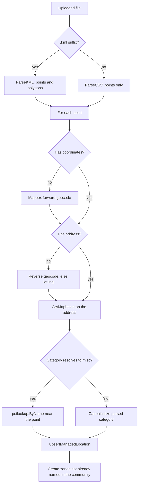

Curated points of interest (POIs) are the `"Locations"` rows with a `community_id` and `show_on_map = true`. They render as pins on the rider map and come from three writers: dashboard CRUD, dashboard file import, and the `cmd/import-pois` CLI. A fourth tool, `cmd/backfill-categories`, repairs their categories after the fact.

For the operator steps, see [Community map](/dashboard/community-map#import-locations-and-zones) and [Onboard a community](/runbooks/onboard-community). For the table itself, see [Locations](/reference/database/markets-locations-and-places#locations). For how raw provider types become a category, see [Place categories](/engineering/domains/events-and-feed#place-categories).

## Endpoints

Dashboard routes are registered in `internal/server/http/dashboard/location/location_routes.go` on the Clerk-authenticated `/dashboard` group. The app route is registered in `internal/server/http/location/location_routes.go`.

| Method | Route | Service call | Notes |
| --- | --- | --- | --- |
| `GET` | `/dashboard/communities/{id}/locations` | `GetLocations` | Query `search` (name `ILIKE`), `show_on_map` (`true` or `false`, omit for all), `limit` (default 20), `offset`. Sorted by name, then ID. Returns `total` from a window count |
| `GET` | `/dashboard/communities/{id}/locations/{location_id}` | `GetLocationByID` | Ownership-checked |
| `POST` | `/dashboard/communities/{id}/locations` | `CreateLocation` | JSON body `CreateLocationRequest` |
| `PUT` | `/dashboard/communities/{id}/locations/{location_id}` | `UpdateLocation` | Ownership-checked. Partial body `DashboardLocationUpdateRequest` |
| `DELETE` | `/dashboard/communities/{id}/locations/{location_id}` | `DeleteLocation` | Ownership-checked |
| `POST` | `/dashboard/communities/{id}/locations/import` | `ImportFile` | Multipart field `file`, `.kml` or anything else as CSV |
| `GET` | `/dashboard/communities/{id}/locations/user-coords` | `GetUserCoordinates` | Admin only. Up to 5,000 non-deleted users with a non-zero stored position |
| `GET` | `/dashboard/communities/{id}/locations/ride-destinations` | `GetRideDestinations` | Admin only. Every ride destination in the community with valid, non-zero coordinates. `confirmed` is `status != 'requested'` |
| `GET` | `/location/pois` | `GetCommunityPOIs` | User JWT. The caller's community's `show_on_map` rows, sorted by name |

### Community scope

`resolveCommunityID` in `location_handler.go` decides which community a request touches:

- An `admin` uses the `{id}` path segment.
- Any other role uses the `community_id` claim from the Clerk session and ignores `{id}`. A missing claim returns 403 **No community associated with this account**.

`requireLocationInCommunity` loads the row and returns 404 **location not found** unless its `community_id` equals the resolved community. A row with no community is never in scope. The SQL for update and delete (`UpdateManagedLocation`, `DeleteManagedLocation`) also filters on the owning community, so a missed handler check still affects zero rows. `gate_enumeration_test.go` fails the build if a new handler method skips the gate.

## Manual create and update

`CreateLocation` stores the request as sent: `categories` is written verbatim and `raw_categories` is empty. When the new row has `show_on_map`, the service calls `CommunityPOIsChanged`, which pushes `map_content_changed` with scope `community_pois`. See [Map change pushes](/engineering/domains/map-layers-and-map-changes#map-change-pushes).

`UpdateLocation` loads the existing row and overlays the body:

- `name`, `address`, `mapbox_id`, `latitude`, `longitude`, and `show_on_map` change only when present.
- `categories` changes when the array is present, including an empty array.
- `description` and `image_url` are always copied from the body, so omitting them clears them.

Update and delete always push `community_pois` for the owning community.

## File import

`LocationService.ImportFile` in `internal/service/location/location.go` parses the file, writes points, then creates zones.

### Parsing

`internal/data/locationimport/parse.go` is pure parsing, with no database or network calls.

| Format | Rules |
| --- | --- |
| KML (`ParseKML`) | Reads `Document>Folder>Placemark` and top-level `Document>Placemark`. A `Point` becomes a location. Its folder name, lowercased with one trailing `s` removed, becomes its category (`Bars` → `bar`). A `Polygon` outer ring with at least 3 points becomes a zone named after the placemark, or the folder when the placemark has no name. Lines are ignored. Points with the same lowercased name and 6-decimal coordinates are deduplicated. KML points never carry an address |
| CSV (`ParseCSV`) | A header row is required and must include `name`. Headers are case-insensitive. Optional columns: `address`, `latitude`, `longitude`, `description`, `image_url`, `categories` (split on `;`). A row needs a name and either an address or both coordinates, otherwise it's skipped silently. Fewer than 2 rows fails with **CSV has no data rows** |

A parse failure returns 400 with title **Bad File** and message **Could not parse the uploaded file.** The handler also rejects a missing file (**File Required**) and an empty file (**Empty File**). The multipart limit is `helpers.MaxMultipartFormSize` (100 MiB).

### Categories and the name lookup

A parsed category is trusted only when `category.FromMapbox` resolves it to something other than `misc`. The row then stores that single canonical value in `categories` and the parsed strings in `raw_categories`.

Otherwise, `poilookup.ByName` in `internal/data/poilookup/poilookup.go` searches for the venue by name:

1. Mapbox Search Box `suggest` with the row's name, limit 3, biased to the row's coordinates.
2. Take the first suggestion of type `poi` within 250 m (`MaxDistanceMeters`). No match leaves the row as `misc`.
3. `retrieve` that suggestion and return its `poi_category` types and its Search Box ID.

On a hit, the row stores the resolved category, the raw types, and the Search Box ID as `mapbox_id`, replacing the address-feature ID from `GetMapboxId`. The lookup exists because an address feature never carries `poi_category`, so bare-address rows used to render as the generic pin.

### Writes and summary

Each point is written with `UpsertManagedLocation`, keyed `ON CONFLICT (community_id, address)`. It always sets `show_on_map = true` and `is_public = false`. Per-row failures are counted and never stop the import:

| Summary field | Meaning |
| --- | --- |
| `locations_added` | Rows upserted, including updates of existing rows |
| `locations_failed` | Geocode failures (`geocode failed: <name>`) and write failures (`upsert failed: <name>`) |
| `zones_added` | New zones |
| `zones_skipped` | Polygons whose name already exists in the community, case-insensitively |
| `errors` | One message per failure |

Zones are created with priority 0 and a color cycled from a fixed six-color palette. A zone create failure is appended to `errors` without a counter. If at least one location was added, the service pushes `community_pois`.

## Operator CLI: `cmd/import-pois`

`go run ./cmd/import-pois --community <uuid> --file <path>` shares the parser and the category logic but has its own write path.

| Flag | Default | Effect |
| --- | --- | --- |
| `--community` | required | Target community UUID |
| `--file` | required | `.kml` or CSV path |
| `--category` | empty | Fallback category for KML placemarks outside a folder and CSV rows without `categories` |
| `--apply` | `false` | Write rows. Without it, the run logs `[dry-run] would upsert POI` per row |

Differences from the dashboard import:

- Polygons are ignored. No zones are created.
- Its inline `INSERT ... ON CONFLICT (community_id, address)` doesn't write `raw_categories` or `is_public`, so an update keeps the existing `is_public`.
- It never pushes `map_content_changed`. Clients see new pins on their next `/location/pois` fetch.
- A dry run still calls Mapbox for every row: geocode, `GetMapboxId`, and the name lookup.

## Category repair: `cmd/backfill-categories`

`go run ./cmd/backfill-categories` re-resolves categories that earlier imports and migrations couldn't derive.

### Selection

A `"Locations"` row qualifies when it is map-visible and its categories look wrong:

- **Map-visible.** It has a community, is public, or shares a `mapbox_id` with a `"SavedLocations"` or `"LikedLocations"` row.
- **Needs a lookup.** Its categories are empty, its first value isn't canonical (for example the legacy `other` or a KML folder name like `pre-liked`), it has more than one value, it is `bus_stop` with no raw types, or it is `misc` with no raw types and is community-owned or public.
- **Resolvable.** It has a `mapbox_id`, or it is community-owned or public with a name.

`"LikedLocations"` rows with empty categories and a `mapbox_id` are resolved separately by retrieve. Only a non-`misc` result is written to them.

### Resolution

`resolveRow` retrieves by `mapbox_id` first. If that returns no types and the row is community-owned or public, it falls back to `poilookup.ByName`. Rows that are only saved or liked are never name-searched, because their names are user labels such as "Gym". Resolved rows get `categories = ARRAY[<canonical>]` and `raw_categories` set to the raw types. A resolved row no longer matches the selection, so the job is safe to rerun and interrupt.

| Flag | Default | Effect |
| --- | --- | --- |
| `--dry-run` | `true` | Print proposed changes. Pass `--dry-run=false` to write |
| `--limit` | 0 (no limit) | Maximum rows |
| `--rate` | 10 | Mapbox requests per second. Must be greater than 0 |
| `--histogram` | `false` | Print a count per resolved category and exit. It writes nothing, but it spends one provider call per candidate, like a real run |

## Where this lives in code

| Concern | Path | Key symbols |
| --- | --- | --- |
| Dashboard handlers | `yelo-api/internal/server/http/dashboard/location/location_handler.go`, `requests.go` | `resolveCommunityID`, `requireLocationInCommunity`, `ImportLocations` |
| App POI route | `yelo-api/internal/server/http/location/` | `GetPOIs` |
| Service | `yelo-api/internal/service/location/location.go` | `ImportFile`, `importPoints`, `importZones`, `reverseGeocodeAddress` |
| Parser | `yelo-api/internal/data/locationimport/parse.go` | `ParseKML`, `ParseCSV`, `folderCategory` |
| Name lookup | `yelo-api/internal/data/poilookup/poilookup.go` | `ByName`, `MaxDistanceMeters` |
| Repository and SQL | `yelo-api/internal/data/repository/location.go`, `queries/places.sql` | `CreateManagedLocation`, `UpsertManagedLocation`, `UpdateManagedLocation`, `ListCommunityPOIs` |
| CLIs | `yelo-api/cmd/import-pois/main.go`, `yelo-api/cmd/backfill-categories/main.go` | `importRows`, `needsBackfill`, `resolveRow` |
| Dashboard UI | `yelo-web/src/sites/dashboard/pages/CommunityMapPage.tsx`, `src/hooks/useLocations.ts`, `src/components/locations/` | `useImportLocations`, `useLocationsList`, `LocationsTable` |

## Gotchas and edge cases

<AccordionGroup>
  <Accordion title="An address can exist only once in the whole table">
    `"Locations_address_key"` makes `address` unique across all rows, including the geocoding cache rows riders create. The import upsert's conflict target is `(community_id, address)`, so it only merges with a POI in the same community. If the address already belongs to a cache row or another community, the write fails with a unique violation. The dashboard import counts it as `upsert failed: <name>`, and a manual create returns a server error.
  </Accordion>
  <Accordion title="Dashboard imports reset is_public">
    `UpsertManagedLocation` writes `is_public = false` on insert and on update. Re-importing a place that was public removes it from automatic top-location candidates. The CLI leaves `is_public` alone.
  </Accordion>
  <Accordion title="Manual creates skip canonicalization">
    Import canonicalizes categories, but `POST /dashboard/communities/{id}/locations` and `PUT` store `categories` verbatim. A category outside the canonical vocabulary renders as the generic pin until `cmd/backfill-categories` fixes it.
  </Accordion>
  <Accordion title="Partial updates clear description and image">
    `UpdateLocation` copies `description` and `image_url` from the body even when they're absent. A client that sends only `name` wipes both fields.
  </Accordion>
  <Accordion title="Coordinate-only rows get a synthetic address">
    When reverse geocoding finds no address, the row is stored with `"lat,lng"` (6 decimals) as its address so the upsert key stays unique. Moving such a pin later doesn't update that address.
  </Accordion>
  <Accordion title="KML folder names are singularized naively">
    `folderCategory` only strips one trailing `s`. `Churches` becomes `churche`, which isn't canonical, so the row falls through to the name lookup.
  </Accordion>
  <Accordion title="Large imports are sequential">
    Every point costs up to four Mapbox calls in series: geocode or reverse geocode, `GetMapboxId`, and the two-step name lookup. The request runs under the server's 30-second write timeout, so a large KML is better split, or run through `cmd/import-pois`.
  </Accordion>
  <Accordion title="Imported zones don't push a map change">
    Zone creation during import only writes the zone. No `map_content_changed` is sent for zones.
  </Accordion>
  <Accordion title="The standalone Locations page is unrouted">
    `yelo-web/src/sites/dashboard/pages/LocationsPage.tsx` still exists, but `/locations` redirects to `/map` in `App.tsx`. Place management and import happen on the community **Map** page.
  </Accordion>
  <Accordion title="AddLocation has no caller">
    `LocationService.AddLocation` canonicalizes and writes a location, but nothing calls it. Ride creation writes locations through the repository directly in `service/ride/rider.go`.
  </Accordion>
</AccordionGroup>
