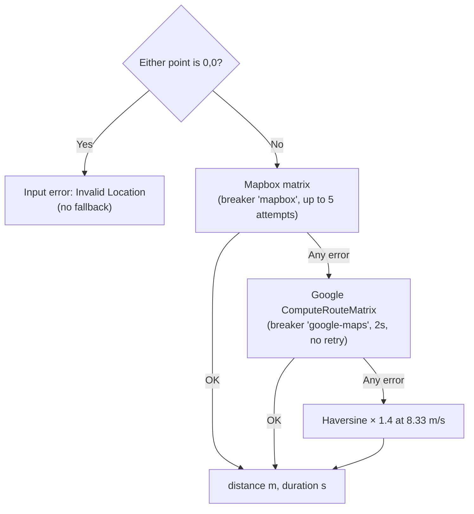

Yelo uses two routing providers for different jobs. Mapbox computes distance and duration. Google Routes computes the polyline drawn on the map and metered by zone pricing. A haversine estimate backs up distance, but nothing backs up the polyline. This page maps every call site to its provider, fallback, and cache.

Provider credentials and breaker defaults are in [Integrations](/engineering/api/integrations#maps-and-places). Cache TTLs are summarized in [Data layer](/engineering/api/data-layer#caches).

## Provider responsibilities

| Need | Provider and API | Client method | Fallback |
| --- | --- | --- | --- |
| Distance and duration for one pair | Mapbox Matrix API, `directions-matrix/v1/mapbox/driving` | `mapbox.Client.GetDistance` | Google `ComputeRouteMatrix`, then haversine |
| Many origins to one destination | Mapbox Matrix API | `GetDistances` | Per pair: Google, then haversine |
| One origin to many destinations | Mapbox Matrix API | `GetDistancesFromOrigin` | Per pair: Google, then haversine |
| Route polyline | Google Routes `ComputeRoutes` over gRPC | `googlemaps.Client.GetRoute` | None |
| Mapbox Directions polyline | Mapbox `directions/v5/mapbox/driving` | `mapbox.Client.GetDirections` | Not called by any service |

Neither provider is traffic-aware. Mapbox uses the `driving` profile, not `driving-traffic`. Google requests leave `RoutingPreference` unset, which Google treats as traffic-unaware. The code comments explain that `TRAFFIC_AWARE` bills at a higher SKU.

## The distance fallback chain

`mapbox.Client.GetDistance` in `internal/data/mapbox/mapbox.go`:

- **Mapbox attempt.** `retry.NewNetworkRetrier` runs up to 5 attempts, starting at a 200 ms delay with full jitter and a 10-second cap. Each attempt runs inside the `mapbox` circuit breaker. Input-type errors (Mapbox 400, 404, 422, or a non-`Ok` code) are not retried. A 429 becomes a rate-limit error and is retried, as are an open breaker and other untyped errors.
- **Google attempt.** One `ComputeRouteMatrix` call with a 2-second timeout and the `status,condition,distanceMeters,duration` field mask. `ROUTE_NOT_FOUND` is an input error. Empty streams, extra elements, unknown conditions, and missing durations are server errors that count against the `google-maps` breaker.
- **Haversine.** `haversineFallback` multiplies the great-circle distance by a 1.4 road detour factor and divides by 8.33 m/s (30 km/h). It never fails.

Because the last step always succeeds, `GetDistance` only returns an error for zero coordinates.

## Matrix batching

`GetDistances` and `GetDistancesFromOrigin` share these rules:

| Rule | Value |
| --- | --- |
| Coordinates per Mapbox request | 25 (`maxMatrixCoordinates`) |
| Pairs per request | 24 (`maxBatchPairs`), since one slot is the shared point |
| Zero-coordinate entries | Skipped. Their result stays `Valid: false` |
| Zero shared point | Every result `Valid: false`, no API call |
| Exactly one valid pair | Uses `GetDistance` instead, because the matrix needs at least 3 coordinates |
| Whole-chunk failure | Every pair in the chunk falls back through `fallbackSingleDistance` |
| `null` cell (unreachable) or short response | That pair falls back |
| Index lists | `sources` and `destinations` are semicolon-separated. A comma list returns 422 |

A chunk over 24 pairs logs a warning and sends another request.

## Polyline routing

`googlemaps.Client.GetRoute` in `internal/data/googlemaps/googlemaps.go`:

- `ComputeRoutes` with `DRIVE`, metric units, no alternatives, and `PolylineQuality_OVERVIEW`.
- Field mask `routes.polyline.encodedPolyline`, so only the polyline is billed and returned.
- Each attempt has a 2-second timeout. The retrier only retries `UNAVAILABLE`, following Google's AIP-194 guidance. Quota, deadline, internal, auth, and bad-request errors are not retried.
- A caller-canceled context is excluded from the breaker (`circuitbreaker.Exclude`).
- Input errors count as breaker successes in metrics (`recordBreakerResult`).
- The result is encoded as `lat,lng;lat,lng;...` by `googlemaps.EncodeRoute` and stored on the ride in `route` or `pickup_route`.

## Caches

`mapbox.NewCached` and `googlemaps.NewCached` wrap the raw clients with the shared `RouteCache` in `internal/data/redis/route_cache.go`:

| Key | Value | TTL | Wrapped method |
| --- | --- | --- | --- |
| `route:{lat1}:{lng1}:{lat2}:{lng2}` | `{distance, duration}` | 5 minutes | `CachedClient.GetDistance` (Mapbox) |
| `routepoly:route:{lat1}:{lng1}:{lat2}:{lng2}` | Encoded polyline | 5 minutes | `CachedClient.GetRoute` (Google) |
| `rideeta:{rideID}:{status}:{driverID}` | `{distance, duration}` | 15 seconds | `RideService.mapDistanceDuration` |

Coordinates are rounded to 4 decimal places (`roundCoord`), about 11 m of latitude. `GetDistances`, `GetDistancesFromOrigin`, and the geocoding methods pass straight through without caching. The Mapbox client's internal Google fallback uses the uncached Google client.

## Call sites

| Caller | Methods | On failure |
| --- | --- | --- |
| Ride creation, `prepareCreateRide` in `internal/service/ride/rider.go` | Cached `GetDistance` and cached `GetRoute`, in parallel | A Google route error fails ride creation |
| Rides-disabled fallback, `ridesDisabledRoute` | Cached `GetRoute` | Returns `[]`, never an error |
| Pickup routing, `pickupRoute` in `promotion_route.go` | Cached `GetDistance` and cached `GetRoute`, in parallel | A Google route error fails accept or pickup preparation |
| Map details ETA, `calculateMapDistanceDuration` in `ride.go` | Cached `GetDistance`, one or two legs | Only fails on zero or missing coordinates |
| Driver options, `applyAccurateETAs` in `driver_options.go` | `GetDistances` | Falls back to rough haversine minutes |
| Auto-queue, `internal/service/activation/auto_queue.go` | `GetDistances` | Per-pair fallback |
| Driver ride board, `GetEnrichedRideBoard` in `internal/service/ride/driver.go` | `GetDistancesFromOrigin` | Per-pair fallback |
| Queue summary deadhead, `internal/service/activation/queue_summary.go` | Cached `GetDistance` | Haversine fallback |
| `POST /mapping/distance` | Cached `GetDistance` | Request validation rejects zero coordinates first |

Ride creation stores the pickup-to-destination `distance` and `duration` on the ride. Pricing and the pre-driver map ETA reuse the stored values instead of calling a provider again.

## Circuit breakers

Every breaker uses `circuitbreaker.NewSettings`: it opens after 5 consecutive failures, stays open for 60 seconds, and allows 3 half-open probes. Opening and closing post Slack alerts.

| Breaker | Covers |
| --- | --- |
| `mapbox` | Every Mapbox call: matrix, directions, geocoding, Search Box suggest, retrieve, and reverse |
| `google-maps` | `ComputeRoutes` and `ComputeRouteMatrix` |
| `google-places` | Places autocomplete and details |
| `google-geocoding` | Google Geocoding and POI HTTP lookups |

## Where this lives in code

| Concern | Path |
| --- | --- |
| Mapbox client | `yelo-api/internal/data/mapbox/mapbox.go` (`GetDistance`, `GetDistances`, `GetDistancesFromOrigin`, `haversineFallback`, `doMapboxRequest`) |
| Mapbox cache wrapper | `yelo-api/internal/data/mapbox/cached.go` |
| Google Routes client | `yelo-api/internal/data/googlemaps/googlemaps.go` (`GetRoute`, `GetDistance`, `shouldRetryGoogleMapsError`) |
| Google cache wrapper and encoding | `yelo-api/internal/data/googlemaps/cached.go` (`EncodeRoute`) |
| Route and ETA cache | `yelo-api/internal/data/redis/route_cache.go` |
| Construction | `yelo-api/internal/service/service.go` (`googlemaps.NewClient`, `mapbox.NewClient`, `NewCached`) |
| Haversine | `yelo-api/internal/utilities/geo/haversine.go` |
| Retry policy | `yelo-api/internal/utilities/retry` |
| Breaker settings | `yelo-api/internal/utilities/circuitbreaker` |

## Gotchas and edge cases

<AccordionGroup>
  <Accordion title="Haversine estimates are cached as real results">
    `CachedClient.GetDistance` caches any successful return. When Mapbox and Google are both down, the haversine estimate is written to `route:` for 5 minutes and served to every caller of that pair, even after the providers recover.
  </Accordion>
  <Accordion title="Mapbox input errors still fall back">
    A Mapbox `Route Unavailable` or 422 is not retried, but `GetDistance` still falls through to Google and haversine. A pair Mapbox considers unroutable, such as a point in a lake, gets a straight-line estimate instead of an error.
  </Accordion>
  <Accordion title="An open Mapbox breaker adds latency">
    `ErrOpenState` is not a typed Yelo error, so the retrier retries it. During a Mapbox outage, each `GetDistance` spends up to 4 jittered backoff delays before reaching Google.
  </Accordion>
  <Accordion title="Google Routes is a hard dependency">
    The polyline has no fallback. If `ComputeRoutes` fails or its breaker is open, ride creation and pickup routing fail even though distance and pricing inputs are available.
  </Accordion>
  <Accordion title="One breaker for all of Mapbox">
    Search, geocoding, and routing share the `mapbox` breaker. Five consecutive search failures open it for routing too, and every distance call then goes to Google for at least 60 seconds.
  </Accordion>
  <Accordion title="Rounding shares cache entries across nearby points">
    Four-decimal rounding means two pickups about 10 m apart share a cached distance. A live driver leg is keyed by the driver's rounded position, so the 5-minute `route:` cache rarely hits for moving drivers. The 15-second `rideeta:` cache is what bounds provider calls there.
  </Accordion>
  <Accordion title="No traffic in any ETA">
    Both providers are called without traffic. Rush-hour ETAs and durations used in per-minute pricing come from free-flow speeds.
  </Accordion>
</AccordionGroup>
