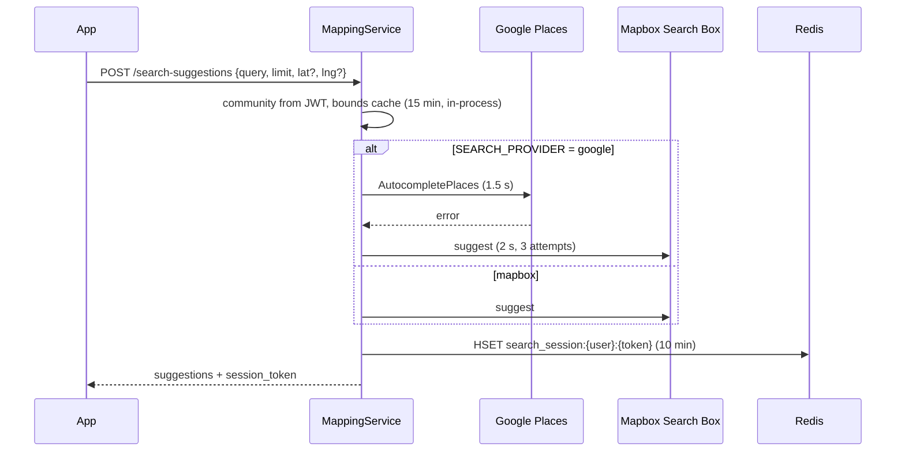

Place search spans two providers, three identifier formats, and a Yelo-owned place catalog that ties them together. This page follows a search from keystroke to a saved place, then covers reverse geocoding, recents and likes, and how top locations are ranked and refreshed.

For the operator view of top locations, see [Community top locations](/guides/community-top-locations). For provider configuration, see [Integrations](/engineering/api/integrations#google-places).

## Endpoints

All routes are under `/mapping` and require a user JWT. Routes are registered in `internal/server/http/mapping/mapping_routes.go`.

| Route | Purpose | Service method |
| --- | --- | --- |
| `GET /search-context` | Top locations (4), recent ride destinations (10), and a fresh session token | `GetSearchContext` |
| `POST /search-suggestions` | Autocomplete | `SearchSuggestions` |
| `POST /search-result` | Resolve a selected suggestion, recent, or saved place to coordinates | `SearchResult` |
| `POST /poi-details` | Enrich a tapped map POI or saved place | `POIDetails` |
| `POST /reverse-geocode` | Coordinates to an address | `ReverseGeocode` (Mapbox v6) |
| `POST /distance` | Road distance and duration | `GetDistance`. See [Routing and distance](/engineering/location/routing-and-distance) |

## Autocomplete



### Request rules

`LocationSearchRequest` in `internal/server/http/mapping/requests/search.go`:

- `query` is trimmed, required, and at most 256 bytes.
- `limit` is 1 to 10.
- `latitude` and `longitude` must be sent together.
- `search_purpose` is `general` (default), `pickup`, or `destination`.
- `community_id` in the body is overwritten with the JWT community.

### Provider selection

`SEARCH_PROVIDER` defaults to `google` in `internal/utilities/config/config.go`. `NewMappingService` accepts exactly `google` or `mapbox`. An empty value, or any other value (including `Google`), becomes `mapbox`, and an unknown value logs a warning at startup.

With `google`, a Google failure falls back to Mapbox and the suggestions are tagged `provider: "mapbox_fallback"`. If Mapbox also fails, the original Google error is returned.

### Location bias

`SearchSuggestions` attaches the community's box when the request has no user location, or when the purpose is `pickup`. Boxes come from `GetCommunitySearchBounds` and are cached per API instance for 15 minutes (`communityBoundsCacheTTL`).

| Situation | Google (`buildAutocompleteRequest`) | Mapbox (`getSearchSuggestionsFromAPI`) |
| --- | --- | --- |
| Pickup purpose with a community box | Hard `locationRestriction` rectangle, plus `origin` if known | Soft `proximity`, plus a hard `bbox` |
| User location known | `locationBias` circle of `GOOGLE_PLACES_BIAS_RADIUS_METERS` (default 10,000, clamped to 50,000), plus `origin` for distances | `proximity` at the user |
| Only a community box | `locationBias` rectangle | `proximity` at the box center |
| Nothing | No bias | No bias |

Both providers are limited to the US: Google uses `regionCode` and `includedRegionCodes` `US` with language `en-US`, and Mapbox uses `country=us` and `language=en`. Mapbox only returns `poi` and `address` types. Google results with broad-area types such as `locality`, `postal_code`, `administrative_area_level_1`, or `natural_feature` are dropped after the call, so Google can return fewer than `limit` results.

### Error handling

| Provider | Timeout | Retries | Bad input |
| --- | --- | --- | --- |
| Google autocomplete | 1.5 seconds | None | `InvalidArgument` or `NotFound` returns an empty list |
| Mapbox suggest | 2 seconds total | Up to 3 attempts, 100 ms to 2 seconds | 400, 404, or 422 returns an empty list. Mapbox rejects some mid-typing queries such as `20 3` |

### Session tokens

- `isSafeSessionToken` accepts 1 to 36 characters of letters, digits, `-`, and `_`. Anything else is replaced with a new UUID v4.
- Every suggestion shown is stored in the Redis hash `search_session:{userID}:{token}` for 10 minutes, field = suggestion ID. The retrieve step reads the name, address, and distance from it instead of paying for a full place lookup.
- The mobile hook `useSearchSuggestions` (`yelo-frontend/hooks/useSearchSuggestions.ts`) throttles requests to one per 300 ms, always sends `limit: 10`, and sends coordinates from an explicit origin or a usable device fix. It attaches the returned `session_token` to each suggestion for the retrieve call.

### Analytics

`searchAnalyticsRecorder` in `internal/service/mapping/analytics.go` writes `LocationBrowses` rows in the background: one `suggestion_viewed` row per suggestion with its position, and one `result_selected` row per retrieve. It uses a 1,024-job queue, 4 workers, and a 5-second job timeout. Events are dropped with a warning when the queue is full. Graduation years are cached in memory for 15 minutes. `result_selected` rows are the selection signal for top-location ranking.

## Retrieving a place

`SearchResult` resolves an ID to coordinates:

1. **Pick the provider by ID shape** (`providerForLocationId`). IDs starting with `mapbox:`, `poi.`, or `dXJuOm1ieH` (base64 of `urn:mbx`) are Mapbox. IDs starting with `google:`, `places/`, or `ChIJ` are Google. Anything else uses the configured provider. The `google:` or `mapbox:` prefix is then stripped.
2. **Prefer the session.** If the suggestion is in the session hash, its recorded provider wins.
3. **Follow legacy aliases** only when there is no session suggestion: `PlaceCatalog.LookupLegacy` can map an old ID to a Google place ID.
4. **Fetch.**
   - Google with a session suggestion: `GetPlaceLocation` with the Essentials field mask `id,formattedAddress,location,types`. The name comes from the suggestion.
   - Google without one (recents, saved, and top locations): the `retrieve:{placeID}` cache (7 days), else `GetPlaceDetails` with `displayName` added to the mask.
   - Mapbox: Search Box `retrieve`.
   - Google calls use a 3-second timeout per attempt inside the network retrier.
5. **Register** the place in the catalog (`PlaceCatalog.Ensure`), which returns the stable `yelo_place_id`. For Google, `Remember` stores the profile and emits a `PlaceMetadataChanged` notification when it changed.

If the request carries `yelo_place_id`, the handler skips all of this and calls `POIDetails` with the saved snapshot.

## POI enrichment

`POIDetails` in `internal/service/mapping/poi_details.go` enriches a tapped map label or saved place. It never moves the user's pin: whenever a name was supplied, the returned `name`, `latitude`, and `longitude` are the caller's.

- **Timeout and dedupe.** An 8-second deadline. Concurrent identical requests share one resolution through `singleflight`, keyed by name, coordinates, ID, and provider.
- **Canonical IDs.** A `yelo:{uuid}` reference to a verified catalog place uses the catalog's name and coordinates.
- **Mapbox basemap taps** resolve through Google (`resolveMapboxPOI` and `searchPOIProfile`): a text search near the pin, then a second search qualified with the pin's street address if nothing matches.
- **Ranking** (`rankGooglePOIs`). Candidates farther than 5,000 m are dropped. Each is scored by `poiEvidenceScore`:

  ```text
  scale_m = 75 + 3000 × similarity⁴
  score   = 0.45 × similarity + 0.55 × exp(-distance_m / scale_m) - identity_penalty
  ```

  Candidates need a score of at least 0.65 (`minimumPOIEvidence`). Scores are compared in bands of 0.02, and Google's order breaks ties. The top 3 are fetched in detail and re-validated against the snapshot. A detail cached under `place:{id}` is reused only if it has the same place ID and name as the candidate and lies within 5 m of it. Otherwise it is fetched again and re-cached.
- **Name similarity** (`poi_names.go`) combines token overlap with edit distance for words of 4 characters or more, and penalizes explicit sub-facility and branch-number mismatches. A generic label such as "Cafe" can also match on Google's category names.

## Reverse geocoding

| Use | Method | Details |
| --- | --- | --- |
| `POST /mapping/reverse-geocode` | `mapbox.Client.ReverseGeocode` | Geocoding v6 `reverse`, any type |
| Ride stops with no address, or a relative label such as "Current location" | `ReverseGeocodeAddress` | `types=address&permanent=true`. Up to 2 attempts, 1.5 seconds each, inside a 3.5-second deadline shared by both stops. An open breaker is not retried |
| Ride public-place classification | `GetReverseSearchSuggestions` | Search Box `reverse`, `limit=5`, `types=poi,address`, 1.5-second deadline. A failure counts as no features. Non-empty results are cached as `reverse:{communityID}:{lat4}:{lng4}` for 10 minutes |
| City and state | `ReverseGeocodeCity` | Geocoding v6 `reverse` with `types=place` |

`resolveRideLocations` in `internal/service/ride/ride_locations.go` resolves both stops in parallel before the ride is written. Address lookup is optional metadata and never moves the pin:

- A stop that already has a real address keeps it. The lookup only runs for an empty address or the "Current location" label.
- When the lookup fails or doesn't return an `address` feature, the stop keeps its coordinates with an empty address. The failure logs `ride.stop.address_unavailable`.
- A missing or relative name becomes the address. With no address either, the name falls back to **Pickup pin** or **Destination pin** (`CanonicalRideLocationName`).
- A relative label is never stored as a shared stop name or address.

A 401 or 403 from Mapbox on a `permanent=true` request becomes a server error inside the lookup, because it means the account isn't licensed for permanent geocoding. The ride still proceeds without an address. `ErrorTypePickupAddressRequired` and `ErrorTypeDestinationAddressRequired` still exist in the error package, but no ride path returns them.

A stop without an address is still a valid coordinate stop, but it skips address-keyed work: `rideAddressDiscount` returns no address-targeted discount, `recordRideLocationSearch` records no search, and the stop is never marked public.

`populatePickupDetails` and `populateDestinationDetails` in `rider.go` mark a stop public only when a reverse-search feature has the **same Mapbox ID the rider selected** and is a `poi` with categories that don't map to `misc`, `airport`, `bus_stop`, `subway`, or `train_station` (`nonPublicCategories`). A nearby business alone doesn't make a dropped pin public. The reverse search runs with a 1.5-second deadline. A failure logs `ride.stop.classification_unavailable` and the stop stays private.

## Recents and likes

| Data | Route | Rules |
| --- | --- | --- |
| Recent ride destinations | `GET /mapping/search-context` | `GetRecentDestinations`: `DISTINCT ON (destination_address)`, 10 rows |
| Recent locations | `GET /user/recent-locations`, `POST /user/recent-locations/sync` | Sync merges up to 50 selections (`RecentLocationsLimit`). Omitted items are not deleted. `last_selected_at` may be at most 5 minutes in the future |
| Likes | `GET`, `POST /user/likes`, `DELETE /user/likes/{id}` | `name` and non-zero coordinates are required. `findExistingLike` returns the existing like instead of creating a duplicate |

Recent locations are keyed by `place:{mapbox_id}`, with a `places/` prefix stripped. Without an ID, the key is `coordinates:{lat},{lng}:{address}`, with coordinates quantized to about 11 cm, negative zero canonicalized, and the address lowercased with whitespace collapsed.

## Top locations internals

### Public list

`ListTopLocations` in `queries/places.sql` returns verified catalog places in slot order. A community is shown when `CommunityTopLocationSettings.enabled` is true. With no settings row, it is shown for every community except the default one (`COALESCE(settings.enabled, NOT c.is_default)`). Search context asks for 4 rows. The map's community layer asks for 20, although only 4 slots exist.

### Ranking

`ListTopLocationCandidates` in `queries/top_location_profiles.sql` scores provider IDs:

- 1 point per `LocationBrowses` row with `action = 'result_selected'` in the community in the last 30 days.
- 10 points per `LikedLocations` row from a non-deleted user whose current `community_id` is this community, with no time window.
- Only IDs that match a public `"Locations"` row inside the community box are eligible.
- Ordered by score, then provider ID, limited to 40 (`CandidateBatchSize`).

### Refresh

`Service.Refresh` in `internal/service/toplocations/toplocations.go`:

1. Skip unless enabled. A scheduled run also needs `automatic` and a last refresh at least 24 hours ago.
2. Resolve each candidate with the provider inferred from its ID (Google for `google:`, `places/`, `ChIJ`, `GhIJ`, otherwise Mapbox), 8 seconds each. Not-found and input errors skip the candidate. Other errors abort the refresh.
3. Keep verified places inside the community box, until 4 are found.
4. In a transaction, lock the community and re-read settings. Abort if the revision changed, the feature was disabled, or a scheduled run finds `automatic` off.
5. Drop candidates already pinned. If any remain, delete all automatic slots and fill free slots in order. With no candidates, keep the current list.
6. Mark refreshed, bump the revision, commit, then invalidate the community map layer and push `map_content_changed`.

River runs a dispatcher every 5 minutes (`topLocationDispatchPeriodic`) that enqueues due communities from `ListDueTopLocationCommunities`, and a legacy verification pass every hour. Both run on start and use the `top_locations` queue, unique by arguments while a job is pending or running. A batch times out after `40 × 8 s + 1 min`.

## Cache keys

| Key | TTL | Contents | Defined in |
| --- | --- | --- | --- |
| `search_session:{userID}:{token}` | 10 minutes | Hash of suggestions shown | `data/redis/place_cache.go` |
| `retrieve:{placeID}` | 7 days | Google retrieve response | Same |
| `place:{placeID}` | 7 days | Google POI details | Same |
| `placeid:{lowercased name}:{lat4}:{lng4}` | 30 days | Name and coordinates to place ID | Same |
| `reverse:{communityID}:{lat4}:{lng4}` | 10 minutes | Search Box reverse features | Same |
| In-process community bounds | 15 minutes | Community box for search bias | `service/mapping/mapping.go` |

## Where this lives in code

| Concern | Path |
| --- | --- |
| Mapping service | `yelo-api/internal/service/mapping/mapping.go` (`SearchSuggestions`, `SearchResult`, `googleRetrieve`, `providerForLocationId`, `registerSelection`) |
| POI enrichment | `yelo-api/internal/service/mapping/poi_details.go`, `poi_google_authority.go`, `poi_names.go` |
| Search analytics | `yelo-api/internal/service/mapping/analytics.go` |
| Handlers and validation | `yelo-api/internal/server/http/mapping/mapping_handler.go`, `requests/` |
| Google Places client | `yelo-api/internal/data/googleplaces/googleplaces.go`, `poi_candidates.go`, `poi_details.go` |
| Mapbox search and geocoding | `yelo-api/internal/data/mapbox/mapbox.go` (`GetSearchSuggestions`, `GetSearchResult`, `GetReverseSearchSuggestions`, `ReverseGeocodeAddress`) |
| Place cache | `yelo-api/internal/data/redis/place_cache.go` |
| Ride stop resolution | `yelo-api/internal/service/ride/ride_locations.go`, `rider.go` (`reverseSearch`, `populatePickupDetails`) |
| Recents and likes | `yelo-api/internal/service/user/recent_locations.go`, `likes.go` |
| Top locations | `yelo-api/internal/service/toplocations/toplocations.go`, `internal/notify/queue/top_locations.go`, `queries/top_location_profiles.sql`, `queries/places.sql` |
| Client search hook | `yelo-frontend/hooks/useSearchSuggestions.ts`, `components/map/request/stopLocations.ts` |

## Gotchas and edge cases

<AccordionGroup>
  <Accordion title="The app starts a new session on every keystroke">
    `useSearchSuggestions`, which backs the map tab search and the change-stop sheet, never sends `session_token`, so the server mints a new UUID for each suggestion request. Only the last request's token reaches the retrieve call. Provider session pricing then sees many one-request sessions instead of one per search, and the `search_session` hash only holds the last response. The older `ride/pickup` and `ride/dropoff` screens do reuse their token, but nothing outside those two screens navigates to them.
  </Accordion>
  <Accordion title="The app never sends search_purpose">
    No mobile screen sends `search_purpose`, so every mobile search is `general`. The pickup-only hard restriction to the community box never applies from the app, so a pickup search can return places outside the service area. The ride request then fails with **Pickup Outside Service Area**.
  </Accordion>
  <Accordion title="SEARCH_PROVIDER is case-sensitive">
    `Google` or `GOOGLE` silently becomes `mapbox`. Check the startup log line `Mapping service search provider`.
  </Accordion>
  <Accordion title="Reverse search ignores the community box">
    `GetReverseSearchSuggestions` takes a `bbox` parameter but never sends it to Mapbox. The cache key includes the community ID anyway, so the same coordinate is fetched separately for each community.
  </Accordion>
  <Accordion title="Likes never age out of top-location ranking">
    Selections are limited to 30 days, but likes count forever and follow the liker's current community. A like counts toward the community the liker is in now, not the one they were in when they liked the place. A user who moves takes their likes to the new community, where they still count if a public location with the same provider ID sits inside that box.
  </Accordion>
  <Accordion title="Visibility is on by default, automatic refresh is off">
    Migration `000345_canonical_top_locations` gives every existing community a settings row with `enabled = NOT is_default` and `automatic = false`. A community created later has no row until the first slot edit or settings change. `ListTopLocations` and `GetTopLocationSettings` both resolve a missing row with `COALESCE(enabled, NOT c.is_default)`, so the public list and the dashboard toggle agree. Verified slots in a new non-default community show immediately, but nothing fills them until you pin places or turn on automatic refresh.
  </Accordion>
  <Accordion title="A partial refresh can shrink the list">
    If a refresh finds even one new candidate, it deletes every automatic slot and fills only as many as it found. Four automatic places can become one.
  </Accordion>
  <Accordion title="Bounds cache is per instance">
    The 15-minute community bounds cache lives in process memory. After a service-area edit, different API instances can bias search with different boxes for up to 15 minutes.
  </Accordion>
  <Accordion title="Google can return fewer results than requested">
    Broad-area predictions are filtered after the call, so a query like a city name can return an empty list even though Google found matches.
  </Accordion>
</AccordionGroup>
