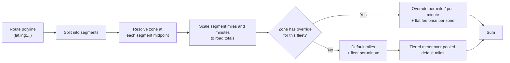

Zones are the only true polygons in Yelo. Communities are rectangles. Zones sit inside a community and drive two things: per-fleet rate overrides in pricing, and outlines on the rider map. This page covers the geometry model, the point-in-polygon test, the zoned meter, and the render paths.

For the admin workflow, see [Community map](/dashboard/community-map#manage-zones). For fare formulas, see [Pricing](/concepts/pricing).

## Data model

`"Zones"` rows map to `models.Zone` in `internal/models/zone.go`:

| Field | Type | Notes |
| --- | --- | --- |
| `geometry` | `GeoPolygon` JSON | `{"type": "Polygon", "coordinates": [[[lng, lat], ...], ...]}`. Ring 0 is the outer ring |
| `priority` | int, 0 or more | Higher wins on overlap |
| `is_active` | bool | Only active zones count for pricing |
| `show_on_map` | bool, default `true` | Only active and visible zones reach riders |
| `color` | Hex string, default `#eab308` | `#rgb` or `#rrggbb` |
| `description` | Nullable | Rider-facing tooltip. `PATCH` distinguishes omitted from explicit `null` (`DescriptionSet`) |

`"ZonePricing"` rows (`models.ZonePricing`) hold one override per zone and fleet: `per_mile`, `per_minute`, and `flat_fee`, each nullable. A null component inherits the fleet default.

<Note>
  Coordinates are `[longitude, latitude]`, following GeoJSON. Everywhere else in the API, `models.Coordinates` uses named `Latitude` and `Longitude` fields. Mixing the two orders is the most common zone bug.
</Note>

## Validation

`CreateZoneRequest.Validate` in `internal/server/http/community/requests/zone.go` checks:

- `name` is non-empty and `community_id` is set.
- `ValidPolygon`: `type == "Polygon"`, at least one ring, the outer ring has at least 4 positions, and the first and last positions are identical (closed).
- `priority >= 0`.
- `color`, if set, starts with `#` and is 4 or 7 characters long.

It does not check coordinate ranges, winding order, self-intersection, inner rings, or that the polygon lies inside the community's box.

## Point-in-polygon

`Zone.Contains(lat, lng)` uses even-odd ray casting over ring 0 only:

```go
for i, j := 0, n-1; i < n; j, i = i, i+1 {
  xi, yi := ring[i][0], ring[i][1] // lng, lat
  xj, yj := ring[j][0], ring[j][1]
  if ((yi > lat) != (yj > lat)) && (lng < (xj-xi)*(lat-yi)/(yj-yi)+xi) {
    inside = !inside
  }
}
```

- Computation is planar in degrees. There is no projection, which is fine at campus scale.
- Inner rings (holes) are ignored. A point inside a hole counts as inside the zone.
- Points exactly on an edge can go either way, depending on the edge's direction.

## Resolving overlaps

`ResolveZone(zones, lat, lng)` returns the single winning zone among active zones that contain the point:

1. Highest `priority`.
2. On a tie, the smallest `Area()`: the planar shoelace area of ring 0, in square degrees.
3. On a further tie, the lowest ID string.

It returns `nil` when no active zone matches.

## Zoned pricing

`meterAndTime` in `internal/utilities/pricing/zoned.go` meters a route piece by piece.



The algorithm:

1. `buildZoningContext` in `internal/service/ride/rider.go` loads the community's zone-pricing rows. If there are none, it returns `nil` and pricing is untouched. Otherwise it loads every zone in the community, active or not.
2. If the fleet has no overrides, or the route has fewer than 2 points, pricing falls back to the plain meter.
3. Each segment's haversine length is computed (Earth radius 3958.7613 miles). The zone is resolved at the segment's midpoint.
4. Segment lengths are scaled so they sum to the authoritative road distance: `mileScale = distanceMiles / geomMiles`. Time is spread the same way: `minScale = durationMinutes / geomMiles`. Time is allocated proportionally to distance, not to actual speed.
5. For each segment:
   - No zone, or a zone without an override for this fleet: add the miles to `defaultMiles` and charge minutes at the fleet's `PricePerMinute`.
   - Zone with an override: `per_mile` charges those miles at the override rate, otherwise the miles join `defaultMiles`. Minutes use `per_minute` if set, otherwise the fleet default. `flat_fee` is recorded once per zone ID.
6. `defaultMiles` is run through the fleet's tiered meter (`computeMeterCharge`) as one pool.
7. The result is the meter charge, the time charge, and the sum of flat fees.

The route is the Google Routes polyline from ride creation (`PolylineQuality_OVERVIEW`), or the ride's stored route when re-pricing. See [Routing and distance](/engineering/location/routing-and-distance).

### Backtest

`SimulateZonePricing` in `internal/service/dashboard/zone_pricing.go` re-prices recent rides with `pricing.GetRidePrice` twice, once without zoning and once with it, at surge 1.0 and without jitter. It returns `simulated_base`, `simulated_zoned`, `zone_delta`, the charged price, and the parsed route for each ride that has a matching fleet and vehicle price row today. Rides with unparseable routes get an empty route, so their zoned and base prices match.

### Caching

Quotes are cached in `PriceCache` under `price:{communityID}:{rounded pickup and drop-off}` for 5 minutes. `UpsertZonePricing` and `DeleteZonePricing` clear the community's quotes asynchronously (`invalidatePriceCacheForZone`). Zone create, update, and delete do not.

## API surface

| Route | Who | Returns |
| --- | --- | --- |
| `GET /community/{id}/zones` | Riders | Zones with `is_active` and `show_on_map`, ordered by priority descending, then creation time |
| `/dashboard/zones` routes | Admins | Create, update, and delete. Update accepts a new geometry |
| `/dashboard/communities/{id}/zone-pricing` | Admins | List, upsert, and delete overrides |
| `/dashboard/communities/{id}/zone-pricing/backtest` | Admins | The backtest above |

Handlers are in `internal/server/http/community/zone_handler.go` and `zone_pricing_handler.go`.

## Rendering

### Rider app

`QueryPollers` refetches the community's zones every 5 minutes, only while a live map is visible. `lib/map/zones.ts` converts them for Mapbox:

- `zonePolygon` rejects any zone whose rings have fewer than 4 points, contain non-finite numbers, or aren't closed. It keeps inner rings, so holes render as holes even though pricing ignores them.
- Outlines go into the `community-zone-outlines` shape source and layer, in the `top` slot, colored by `zone.color`.
- Each zone's name is drawn as a label image anchored at its topmost vertex (`topmostVertex`). The label layer ID `community-zone-labels` is always mounted, so POI layers can use it as an ordering anchor.

### Dashboard

The **Map** page draws zones with `useZonesLayer` in `yelo-web/src/components/communitymap`: a fill at 15% opacity and a 2 px line, both colored per zone. Admins draw new polygons with `@mapbox/mapbox-gl-draw` (polygon and trash controls only). On `draw.create`, the page opens the **New zone** dialog with the drawn geometry and clears the draw layer. Mapbox GL Draw emits closed GeoJSON rings in `[lng, lat]` order, which is what the API expects.

## Where this lives in code

| Concern | Path |
| --- | --- |
| Model, containment, area, resolution | `yelo-api/internal/models/zone.go` (`Contains`, `Area`, `ResolveZone`, `zoneWins`) |
| Overrides model | `yelo-api/internal/models/zone_pricing.go` |
| Zoned meter | `yelo-api/internal/utilities/pricing/zoned.go` (`meterAndTime`, `applyZoneSegment`) |
| Zoning context | `yelo-api/internal/service/ride/rider.go` (`buildZoningContext`) |
| Backtest and cache invalidation | `yelo-api/internal/service/dashboard/zone_pricing.go` |
| Validation | `yelo-api/internal/server/http/community/requests/zone.go`, `zone_pricing.go` |
| Queries | `yelo-api/internal/data/repository/queries/places.sql` (`ListZonesByCommunity`, `ListVisibleZonesByCommunity`) |
| Rider rendering | `yelo-frontend/lib/map/zones.ts`, `components/map/CommunityZonesLayer.tsx`, `providers/QueryPollers.tsx` |
| Dashboard rendering and drawing | `yelo-web/src/components/communitymap/useZonesLayer.ts`, `src/sites/dashboard/pages/CommunityMapPage.tsx` |

## Gotchas and edge cases

<AccordionGroup>
  <Accordion title="Zone edits don't clear cached quotes">
    Only zone-pricing changes invalidate `PriceCache`. Redrawing a zone, changing its priority, or toggling `is_active` leaves up to 5 minutes of quotes priced with the old geometry.
  </Accordion>
  <Accordion title="Small zones can be skipped by long segments">
    The zone is sampled once, at each segment's midpoint. Google's overview polyline has few vertices on straight roads, so a long segment that crosses a small zone can miss it entirely, or a whole long segment can be billed to a zone it only clips.
  </Accordion>
  <Accordion title="Holes are ignored in pricing but drawn on the map">
    `Contains` only reads ring 0. The rider app renders inner rings. A rider can see a hole in a zone and still be charged the zone rate inside it.
  </Accordion>
  <Accordion title="Flat fees apply once per zone, not per entry">
    `enteredFlat` is keyed by zone ID. A route that leaves and re-enters the same zone pays the flat fee once. Two different zones each add their fee.
  </Accordion>
  <Accordion title="Default miles are pooled before tiers">
    Tier breakpoints apply to the sum of unzoned and non-per-mile-override miles, not to the whole trip. A trip that is mostly inside a per-mile override zone reaches the higher tiers later.
  </Accordion>
  <Accordion title="Inactive zones still load for pricing">
    `buildZoningContext` loads every zone, but `ResolveZone` skips inactive ones. An override on an inactive zone has no effect until you activate it.
  </Accordion>
  <Accordion title="No containment check against the community box">
    A zone can extend outside its community's service area. Ride stops outside the box are rejected anyway, but a route can leave the box between stops and still be metered by the zone.
  </Accordion>
  <Accordion title="The dashboard can't reshape a zone">
    The **Map** page only handles `draw.create`. The edit dialog changes metadata. To change a shape, delete the zone and draw a new one, or send a geometry in the update API directly. Redrawing gives the zone a new ID, so its pricing overrides don't carry over.
  </Accordion>
  <Accordion title="Deleting a zone cascades pricing but can be blocked by calendars">
    `"ZonePricing".zone_id` is `ON DELETE CASCADE` (migration `000224_zone_pricing`), so deleting a zone silently drops its overrides. Migration `000318_calendar_snapshots` adds foreign keys from calendar zone tables to `"Zones"` without a delete action, so a zone referenced by an imported operating-hours calendar can't be deleted until those rows are gone.
  </Accordion>
</AccordionGroup>
