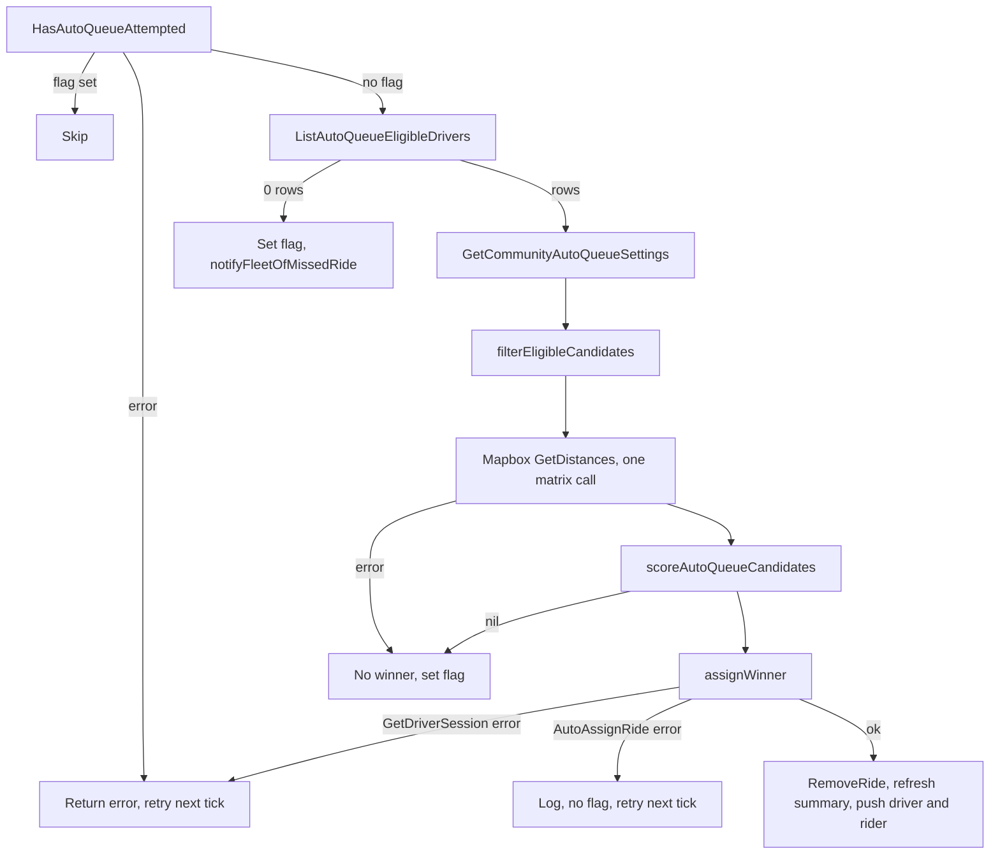

Auto-queue assigns a ride to an online, opted-in driver without anyone tapping accept. It runs inside `ProcessUnmatchedRides`, after the activation tiers, for every unmatched ride that was confirmed at least 2 minutes ago (`autoQueueMinAge`). Rides are processed one at a time, oldest first.

For the product description and driver settings, see [Matching and auto-queue](/concepts/matching-and-auto-queue#auto-queue).

## The pass for one ride



## Candidate filtering

`ListAutoQueueEligibleDrivers` returns drivers who are in the ride's community, have `auto_queue = TRUE`, `is_online_driver = TRUE`, no active pause, an active application, a profile vehicle of the ride's type, an open session in the ride's fleet, and aren't in `declined_drivers`. See [Driver eligibility](/engineering/matching/driver-eligibility#auto-queue-candidates-in-detail) for what it doesn't check.

`filterEligibleCandidates` then reads `driver:queue_summary:{driverId}` for each driver:

| Field | Used for |
| --- | --- |
| `ride_count` | Queue load, time to start, tie-break, choosing the origin |
| `total_fare_cents` | Queue load, divided by 100 |
| `total_minutes` | Capacity check, time to start |
| `last_dropoff_lat`, `last_dropoff_lng` | Deadhead origin when the queue isn't empty |

A missing key returns all zeros, which the code treats as an empty queue. A summary is built only when `ride_count > 0`.

### Capacity

```go
effectiveMax := communityDefault          // Communities.auto_queue_default_minutes
if candidate.AutoQueueMaxMinutes != nil { // Users.auto_queue_max_minutes
	effectiveMax = *candidate.AutoQueueMaxMinutes
}
if effectiveMax > communityMax {          // Communities.auto_queue_max_minutes
	effectiveMax = communityMax
}
if summary != nil && summary.TotalMinutes >= effectiveMax {
	continue // at capacity
}
```

The check uses the queue as it is now. It doesn't add the new ride's minutes. A driver at 59 of 60 minutes can receive a 40-minute ride and end at 99.

### Origin

| Queue state | Origin for deadhead |
| --- | --- |
| Queue has rides and the cached last dropoff isn't `(0, 0)` | Cached last dropoff |
| Queue has rides and the cached last dropoff is `(0, 0)` | Candidate is skipped |
| No queue and `Users.latitude` is set | Driver's stored position |
| No queue and no stored position | Candidate is skipped |

### Deadhead

All remaining origins go to Mapbox in one `GetDistances(origins, pickup)` call. If the call fails, every candidate is dropped. Per-row invalid results drop just that candidate. `deadheadMinutes = duration / 60`, using integer division, so 119 seconds counts as 1 minute.

## The formula

`normalizeAndScore` in `auto_queue.go`:

```go
const (
	efficiencyWeight = 0.5
	equityWeight     = 0.5
	rideCountWeight  = 0.6
	fareWeight       = 0.4
	tieThreshold     = 0.05
	bufferMinutes    = 2
)

c.timeToStart = float64(totalMinutes) + float64(c.deadheadMinutes) + float64(2*rideCount)
c.queueLoad   = rideCountWeight*float64(rideCount) + fareWeight*totalFare
```

Both raw values are min-max normalized across the candidates for this ride:

```
effNorm = (timeToStart - minTime) / (maxTime - minTime)   // 0 when range is 0
eqNorm  = (queueLoad  - minLoad) / (maxLoad - minLoad)    // 0 when range is 0
finalScore = 0.5 * effNorm + 0.5 * eqNorm
```

Lowest `finalScore` wins. With exactly one candidate, scoring is skipped and that candidate wins with a score of 0.

What the terms mean in practice:

- **`timeToStart`** approximates minutes until the driver could reach the pickup. `total_minutes` from the cache already includes 2 minutes of buffer per queued ride (see [queue summaries](/engineering/matching/queue-promotion#queue-summaries)). The formula adds `2 * rideCount` again, so the buffer counts twice.
- **`queueLoad`** is dominated by fare. One queued ride adds 0.6. A $15 queued fare adds 6.0. The "equity" half of the score effectively balances queued dollars, not ride counts.
- **Normalization is relative.** A 1-minute difference can swing the score as much as a 30-minute one, depending on the other candidates.

## Tie-breaking

`selectWinner` walks the candidates in the order the SQL returned them:

```go
diff := best.finalScore - c.finalScore
if diff > tieThreshold {          // c is clearly better
	best = c
} else if diff >= -tieThreshold { // within 0.05 either way
	if cRides < bestRides {       // fewer queued rides wins
		best = c
	}
}
```

Ties compare only against the current best. The comparison isn't transitive, and `ListAutoQueueEligibleDrivers` has no `ORDER BY`, so the winner can depend on row order. Equal ride counts keep the earlier candidate.

## Worked examples

<AccordionGroup>
  <Accordion title="Three candidates, clear winner">
    | Driver | Queue | Cached minutes | Queued fare | Deadhead |
    | --- | --- | --- | --- | --- |
    | A | Empty | 0 | $0 | 10 min |
    | B | 1 ride | 15 | $12 | 3 min from last dropoff |
    | C | Empty | 0 | $0 | 4 min |

    Raw values:

    - A: `timeToStart = 0 + 10 + 0 = 10`, `queueLoad = 0`
    - B: `timeToStart = 15 + 3 + 2 = 20`, `queueLoad = 0.6 + 4.8 = 5.4`
    - C: `timeToStart = 0 + 4 + 0 = 4`, `queueLoad = 0`

    Ranges: time 4 to 20 (16), load 0 to 5.4.

    - A: `0.5 * 6/16 + 0.5 * 0 = 0.1875`
    - B: `0.5 * 1 + 0.5 * 1 = 1.0`
    - C: `0`

    Walking A, B, C: A is best. B is 0.81 worse, so A stays. C is 0.1875 better, more than 0.05, so C wins.
  </Accordion>
  <Accordion title="Two candidates always tie when each wins one axis">
    | Driver | Queue | Cached minutes | Queued fare | Deadhead |
    | --- | --- | --- | --- | --- |
    | A | Empty | 0 | $0 | 12 min |
    | B | 1 ride | 6 | $8 | 1 min |

    - A: `timeToStart = 12`, `queueLoad = 0`, normalized `(1, 0)`, score 0.5
    - B: `timeToStart = 9`, `queueLoad = 3.8`, normalized `(0, 1)`, score 0.5

    The difference is 0, a tie. A has fewer queued rides, so A wins in either order. With two candidates, min-max normalization always pins each axis to 0 and 1. Whenever each driver wins one axis, both score 0.5, and the idle driver wins regardless of how much faster the busy one is.
  </Accordion>
  <Accordion title="Order-dependent result">
    Suppose the scores come out as X = 0.00 with 2 queued rides, Y = 0.04 with 1, and Z = 0.08 with 0.

    - Order X, Y, Z: Y ties X and has fewer rides, so Y. Z ties Y and has fewer rides, so Z wins.
    - Order Z, Y, X: Y ties Z but has more rides, so Z stays. X is 0.08 better than Z, so X wins.

    The same inputs produce Z or X depending on row order.
  </Accordion>
</AccordionGroup>

## Assignment

`assignWinner` in `auto_queue.go`:

1. Loads the driver and their session. A missing session returns a `NotFound` error from `GetDriverSession`, so the `session == nil` branch never runs. The error propagates, no flag is set, and the ride is retried next tick.
2. Calls the `assignRide` callback, wired in `internal/service/service.go` to `RideService.AutoAssignRide`.
3. On error, logs "ride may have been claimed" and returns without setting the flag.
4. On success, removes the ride from the board provider, refreshes the driver's queue summary, and sends notifications.

`RideService.AutoAssignRide` in `driver.go`:

- Sets the request context's user to the driver, so downstream code acts as that driver.
- Calls `Ride.AutoQueueAssign`, which is `acceptRide(..., automatic = true)` with pickup distance 0, duration 0, and an empty route. The transaction requires `accepts_auto_queue`, exactly one matching session, no live direct hold for someone else, the same fleet, and fewer than 100 rides.
- `AssignAcceptedRideToDriver` always sets `status = 'queued'` and `auto_queued = true` for automatic assignments.
- Records `ride_auto_queued`, refreshes the queue summary, and calls `RecoverIdleQueue`. If the driver has no active ride, this promotes the queue head right away. See [Queue promotion and recovery](/engineering/matching/queue-promotion).
- A `RecoverIdleQueue` failure is swallowed when the ride is still assigned to this driver. The ride stays `queued` for the 3-minute recovery loop.

Notifications after success:

| Recipient | Push | Condition |
| --- | --- | --- |
| Driver | `ride_auto_queued`, with `data.vibration = "true"` | Candidate has a non-empty push token |
| Rider | `NotifyRiderRideConfirmed` with the ride's current status | Rider has a push token. The status is `driver_en_route` if promotion already happened, otherwise `queued` |

## When a ride is given up on

`ride:aq_attempted:{rideId}` (1-hour TTL) stops future passes. It's set when:

- The eligibility query returns zero drivers. This also triggers the missed-ride fleet alert.
- Filtering or Mapbox leaves no scored candidates.

It isn't set when the pass fails on a Redis read, a settings read, a session lookup, or the assignment command. Those retry every tick.

`notifyFleetOfMissedRide` runs only on the zero-rows case and only for rides with a fleet. It pushes `unclaimed_ride_fleet` to up to 50 active members of the fleet in the community who have a token and allow notifications, with event key `unclaimed_ride_fleet:{rideId}`.

## Where this lives in code

| Concern | Location |
| --- | --- |
| Pass, filtering, scoring, assignment | `yelo-api/internal/service/activation/auto_queue.go` |
| Pass scheduling and min age | `yelo-api/internal/service/activation/activation.go` (`ProcessUnmatchedRides`, `autoQueueMinAge`) |
| Callback wiring | `yelo-api/internal/service/service.go` |
| Assignment and promotion | `yelo-api/internal/service/ride/driver.go` (`AutoAssignRide`, `RecoverIdleQueue`) |
| Assignment transaction | `yelo-api/internal/data/repository/ride_matching.go` (`AutoQueueAssign`), `ride_lifecycle.go` (`acceptRide`) |
| Flags and summaries | `yelo-api/internal/data/redis/queue_cache.go` |
| Driver settings | `yelo-api/internal/service/driver/driver.go` (`SetAutoQueue`, `PauseAutoQueue`) |
| Tests | `yelo-api/internal/service/activation/auto_queue_test.go`, `yelo-api/internal/service/ride/auto_assignment_test.go` |

## Gotchas and edge cases

- **A Mapbox outage gives up for an hour.** A failed matrix call means no scored candidates, which sets the attempted flag. That ride is never auto-queued again unless it's requeued more than an hour later.
- **Capacity filtering doesn't trigger the missed-ride alert.** If every opted-in driver is at capacity, the flag is set silently. The fleet only hears about it when the SQL finds nobody.
- **The flag survives requeue.** If the first pass gave up, a later driver-cancel requeue doesn't clear it, so the requeued ride skips auto-queue. A successful auto-queue doesn't set the flag, so a ride that was auto-queued and then requeued is eligible again.
- **Busy drivers are scored as idle.** The queue summary excludes the active ride. A driver mid-trip with an empty queue is routed from their GPS position with no time for the current trip.
- **Missing cache means idle.** If a driver's summary expired, they're scored as having no queue even if they have one.
- **Auto-queue ignores direct-request preferences.** `directAssignDriver` notes that auto-queue settings don't apply to direct requests. The reverse also holds: a lapsed direct request is auto-queued like any other ride.
- **Two instances can race.** Both can pick a winner for the same ride. The first commit wins, and the second fails the `status = 'confirmed'` check and logs "may have been claimed".
