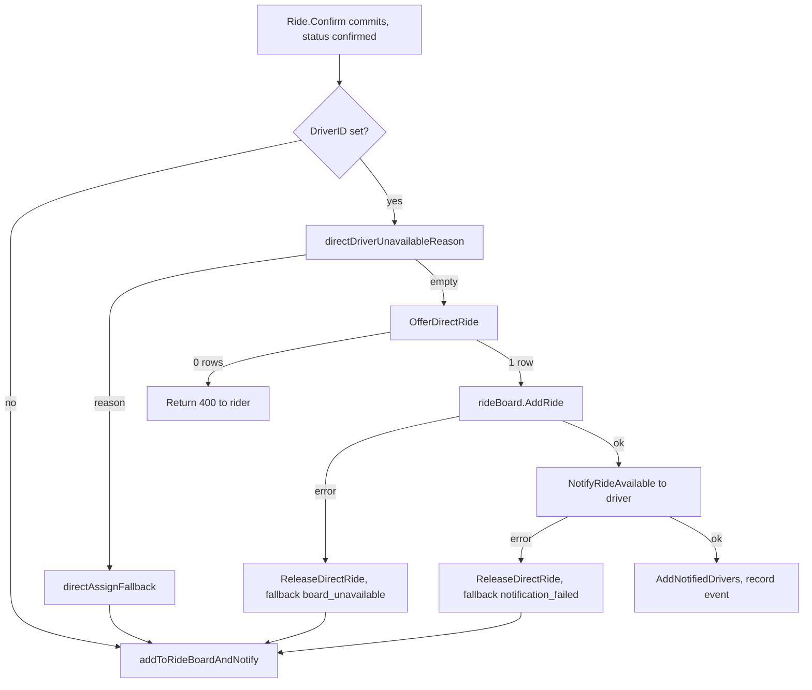

A direct request lets a rider confirm with a specific `driver_id`, usually picked from the driver options that `CreateRideV2` returns. The ride is still `confirmed` and unassigned. It's reserved for the selected driver for 30 seconds, and nothing assigns it automatically.

For the product view, see [Matching and auto-queue](/concepts/matching-and-auto-queue#direct-requests).

## State on the ride

A hold is two columns on `Rides`:

| Column | Meaning |
| --- | --- |
| `potential_driver` | The selected driver. Null when there's no hold |
| `offer_time` | When the hold started, set to `NOW()` by `OfferDirectRide` |

There's no expiry job. Every reader compares `offer_time` to `NOW() - INTERVAL '30 seconds'` itself, so a hold expires even if the API restarts. The same 30-second literal appears in five places:

| Location | Behavior while the hold is live |
| --- | --- |
| `GetEligibleEnrichedRideBoard` (`ride_driver.sql`) | Hidden from everyone except `potential_driver` |
| `ListUnmatchedRidesForActivation` (`ride_matching.sql`) | Excluded from activation and auto-queue |
| `CanAcceptDirectRide` (`ride_lifecycle.sql`) | Only `potential_driver` passes. Auto-queue passes `uuid.Nil`, so it never passes |
| `validateRideRequestAcceptance` (`driver.go`) | Service-level copy of the same check |
| `directAssignDriver` event metadata | `response_window_seconds: 30` |

<Warning>
`validateRideRequestAcceptance` treats a null `offer_time` with a non-null `potential_driver` as a live hold forever. The SQL predicates treat it as expired, because `NULL <= ...` is not true and the `OR` falls through. `OfferDirectRide` always sets both, so this only matters for rows written by hand or by old code.
</Warning>

## Confirm flow

`finalizeConfirmRide` in `internal/service/ride/rider.go` commits `Ride.Confirm` first. Only then does it branch on `request.DriverID`.



### Availability checks

`directDriverUnavailableReason` returns the first failing reason. Each becomes the `fallback_reason` on a `direct_assign_fallback` ride event.

| Order | Reason | Condition |
| --- | --- | --- |
| 1 | `driver_unavailable` | The selected driver is the rider, or the presence cache isn't wired |
| 2 | `driver_offline` | `GetVehiclePresences` errors, or the driver isn't in the community's live presence set (pinged within 120 s, on the drive screen, with a vehicle) |
| 3 | `no_active_session` | `GetDriverSession` fails or returns nothing |
| 4 | `session_changed` | Session fleet differs from the confirmed price's fleet, or session vehicle differs from the presence vehicle |
| 5 | `vehicle_changed` | `driverOptionProfiles` has no profile, or its fleet or vehicle type differs from the confirmed price |
| 6 | `eta_unavailable` | The rough ETA filter dropped the driver |
| 7 | `eta_too_long` | Accurate ETA is 60 minutes or more |

Two more reasons come from later steps: `board_unavailable` and `notification_failed`.

### ETA math

`directDriverETAUnavailableReason` reuses the driver-options helpers in `driver_options.go`:

1. `enrichWithQueueSummaries` loads the cached queue summary. If the driver has an active ride, it counts that ride and adds its remaining time, rounded up to whole minutes. The origin becomes the active ride's dropoff when the queue is empty.
2. `roughSortAndFilter` computes `roughMinutes = totalMinutes + haversineKm / 0.5`, which assumes 30 km/h. Drivers at 60 rough minutes or more are dropped, which returns `eta_unavailable`.
3. `applyAccurateETAs` calls Mapbox. `etaSeconds = totalMinutes * 60 + duration`. On a Mapbox error or invalid result, it falls back to `roughMinutes * 60`.
4. `etaSeconds >= 3600` returns `eta_too_long`.

Remaining active time comes from `remainingActiveRideSeconds` in `ride.go`. For `driver_en_route` it's the pickup duration minus the time since `match_time`, plus the trip duration, plus a 120-second buffer.

### Placing the hold

```sql
-- name: OfferDirectRide :execrows
UPDATE "Rides" SET potential_driver = sqlc.arg(driver_id)::uuid, offer_time = NOW()
WHERE id = sqlc.arg(ride_id)::uuid AND status = 'confirmed' AND driver_id IS NULL
  AND potential_driver IS NULL
  AND NOT (sqlc.arg(driver_id)::uuid = ANY(declined_drivers));
```

`OfferDirectRide` runs without the ride-command lock. If it updates zero rows, `directAssignDriver` returns an input error. It doesn't fall back.

After the hold is placed, the board entry is added before the push. The push uses event key `ride_available:{rideId}:direct:{driverId}`. The driver is added to `ride:notified:{rideId}` so activation won't page them again.

## Resolution paths

<Tabs>
  <Tab title="Driver accepts">
    The selected driver runs the normal `AcceptRide`. `CanAcceptDirectRide` passes because `potential_driver` matches. `AssignAcceptedRideToDriver` clears `potential_driver` and `offer_time`. Auto-queue settings and capacity limits in minutes don't apply. The 100-ride cap does.
  </Tab>
  <Tab title="Driver declines">
    `Ride.Decline` appends the driver to `declined_drivers` and clears `potential_driver` in the same `UPDATE` (`AppendRideDeclinedDriver`). `offer_time` stays set but is ignored. `DeclineRide` then calls `notifyDriversAboutNewRide` for T0 and `NotifyRiderDirectRequestFallback`. This happens immediately, not on the next loop tick.
  </Tab>
  <Tab title="Window lapses">
    Nothing happens at 30 seconds. The next `ProcessUnmatchedRides` tick, up to 30 seconds later, sees the ride because `ListUnmatchedRidesForActivation` now includes it. `resumeExpiredDirectRide` sends T0 to the fleet minus the selected driver, marks them notified, sends the rider fallback, and runs `ReleaseDirectRide`. The ride then continues through tiers and auto-queue in the same tick.
  </Tab>
  <Tab title="Another driver accepts after the window">
    The board shows the ride to everyone once `offer_time` is 30 seconds old, even before the loop releases the hold. `CanAcceptDirectRide` lets them through. The assignment clears the hold. `finishExpiredDirectRide` later reads a non-`confirmed` status and skips the rider fallback. `ReleaseDirectRide` matches no rows.
  </Tab>
</Tabs>

### `resumeExpiredDirectRide` in detail

```go
if ride.FleetID == nil {
	return s.finishExpiredDirectRide(ctx, ride)
}
targets, err := s.repository.Community.GetRideT0NotificationTargets(ctx, ride.ID)
// drop *ride.PotentialDriver from targets
eventKey := "ride_available:" + ride.ID.String() + ":fleet-t0:" + ride.FleetID.String()
```

- The T0 key is the same one a normal confirm would use. A direct-request confirm never sent T0, so it isn't deduplicated here.
- `finishExpiredDirectRide` rereads the ride. It sends `NotifyRiderDirectRequestFallback` only if the ride is still `confirmed` with a `potential_driver`.
- If any step returns an error, `ProcessUnmatchedRides` logs it and skips tier activation for that ride on this tick. The auto-queue pass still considers it.
- `ReleaseDirectRide` only clears the hold if `potential_driver` still equals the driver being released and the ride is `confirmed`.

## Timing

| Time after confirm | What happens |
| --- | --- |
| 0 s | Hold placed, driver pushed |
| 0 to 30 s | Only the selected driver sees or can accept the ride. No activation, no auto-queue |
| 30 s | Board opens to the fleet. Nobody is told |
| 30 to 60 s | First loop tick after lapse: T0 to fleet, rider fallback, hold released |
| 45 s or later | Tier 1 fires on the first tick after its delay. If that's the same tick that released the hold, both happen together |
| 120 s | Auto-queue eligible |

Because the loop fires every 30 seconds on each instance, the fleet learns about a lapsed direct request between 30 and roughly 60 seconds after confirm.

## Where this lives in code

| Concern | Location |
| --- | --- |
| Branch on confirm | `yelo-api/internal/service/ride/rider.go` (`finalizeConfirmRide`) |
| Availability checks and fallback | `rider.go` (`directAssignDriver`, `directDriverUnavailableReason`, `directDriverETAUnavailableReason`, `directAssignFallback`) |
| ETA helpers | `yelo-api/internal/service/ride/driver_options.go` (`enrichWithQueueSummaries`, `roughSortAndFilter`, `applyAccurateETAs`), `ride.go` (`remainingActiveRideSeconds`) |
| Accept-time enforcement | `yelo-api/internal/service/ride/driver.go` (`validateRideRequestAcceptance`), `ride_lifecycle.go` (`acceptRide`) |
| Decline | `driver.go` (`DeclineRide`), `ride_lifecycle.go` (`Decline`) |
| Expiry handling | `yelo-api/internal/service/activation/activation.go` (`resumeExpiredDirectRide`, `finishExpiredDirectRide`) |
| SQL | `queries/ride_matching.sql` (`OfferDirectRide`, `ReleaseDirectRide`, `ListUnmatchedRidesForActivation`), `queries/ride_lifecycle.sql` (`CanAcceptDirectRide`), `queries/ride_driver.sql` (`AppendRideDeclinedDriver`) |
| Presence | `yelo-api/internal/data/redis/presence_cache.go` (`GetVehiclePresences`) |

## Gotchas and edge cases

- **Confirm can succeed and still return 400.** `Ride.Confirm` commits before `OfferDirectRide`. If another driver accepts from the board in between, `OfferDirectRide` updates zero rows and the rider gets "Ride is no longer available" for a ride that is confirmed and assigned. The window is milliseconds, because the ride is visible to board polls as soon as confirm commits.
- **Without Redis, every direct request falls back.** `GetVehiclePresences` returns nothing when Redis is disabled, so the reason is `driver_offline`.
- **The hold doesn't check capacity or auto-queue settings.** Direct requests go to a driver even if their queue is at their auto-queue max. Accepting queues the ride behind their current one.
- **A lapsed hold is invisible to the rider for up to 30 seconds.** The rider's fallback notice comes from the loop, not from the 30-second mark.
- **`ACTIVATION_ENABLED=false` strands lapsed holds.** The board opens after 30 seconds, but nobody is pushed and the rider never hears about the fallback.
- **Decline versus lapse sends T0 through different code.** Decline calls `notifyDriversAboutNewRide`, which reaches the whole fleet except drivers in `declined_drivers`. Lapse calls `GetRideT0NotificationTargets` directly and removes the selected driver by hand. They share the event key `ride_available:{rideId}:fleet-t0:{fleetId}`, so only the first one to enqueue sends.
- **The selected driver can't be re-offered.** `OfferDirectRide` requires the driver not be in `declined_drivers`, and holds are never re-placed after release.
