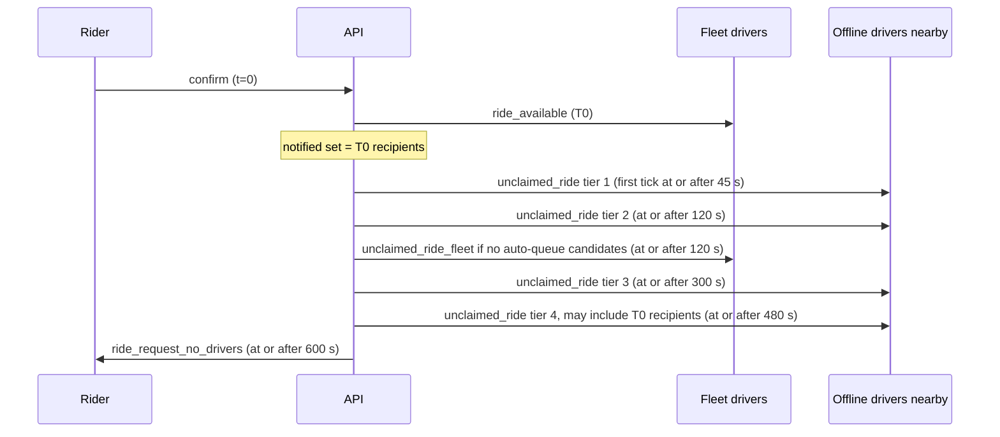

A single ride can trigger a dozen pushes before it's matched. They come from different code paths, and they deduplicate through three separate mechanisms that don't know about each other. This page lists them all.

For how the notification pipeline itself works, see [Notifications](/concepts/notifications#how-a-notification-is-sent).

## Three deduplication layers

| Layer | Where | Scope | Lifetime |
| --- | --- | --- | --- |
| `Notifications.event_key` | Postgres unique index, `ON CONFLICT (event_key) DO NOTHING` in `internal/notify/repository/notifications.go` | Exact key | Permanent. There's no retention job |
| `ride:notified:{rideId}` | Redis set, `ActivationCache.AddNotifiedDrivers` | Driver per ride, read only by activation and the pending-ride push | 30 minutes, refreshed on each add |
| `driver:activation_cd:{driverId}` | Redis `SETNX`, community `cooldown_minutes` | Driver across all rides, checked only by activation | Cooldown length |

The notification pipeline also applies template-level per-user cooldowns. The seeded templates give `unclaimed_ride*` a 900-second cooldown and let `ride_available` bypass cooldowns. See [Notifications](/concepts/notifications#limits-cooldowns-and-quiet-hours).

### Default event keys

`notify.resolveEventKey` in `internal/notify/emit.go` builds a key when the caller doesn't pass one:

```go
bucket := strconv.FormatInt(time.Now().Unix()/300, 10)
switch {
case o.rideID != nil:
	return string(code) + ":" + o.rideID.String() + ":" + bucket, nil
// community broadcast, single recipient...
}
```

Buckets are aligned to wall-clock 5-minute windows. Two emits of the same code for the same ride inside one window collapse to one, even if they carry different data.

## Driver-facing pushes

| Push | Code | Recipients | Event key | Adds to notified set | Takes cooldown |
| --- | --- | --- | --- | --- | --- |
| T0 on confirm | `ride_available` | `ListRideT0NotificationTargets` | `ride_available:{rideId}:fleet-t0:{fleetId}` | Yes, after enqueue | No |
| T0 on direct decline | `ride_available` | Same query, which excludes the decliner | Same as above | Yes | No |
| T0 on direct lapse | `ride_available` | Same query minus `potential_driver` | Same as above | Yes | No |
| T0 on requeue | `ride_available` | Same query | Same as above | Yes | No |
| Direct request | `ride_available` | The selected driver | `ride_available:{rideId}:direct:{driverId}` | Yes | No |
| Activation tier | `unclaimed_ride` | Up to `TargetDrivers` from the inactive pool | `unclaimed_ride:{rideId}:tier:{n}:recipients:{sha256}` | Yes, after enqueue | Yes, before enqueue |
| Driver comes online | `ride_available` | That driver | `ride_available:{rideId}:driver-online:{driverId}` | Yes | No |
| Missed ride | `unclaimed_ride_fleet` | Up to 50 active fleet members in the community | `unclaimed_ride_fleet:{rideId}` | No | No |
| Auto-queued | `ride_auto_queued` | The winner, with `data.vibration = "true"` | Default, `ride_auto_queued:{rideId}:{bucket}` | No | No |
| Promotion status ping | `ride_status_changed` | The driver, silent | `ride_status_changed:{rideId}:driver_en_route` | No | No |
| Renew online | `driver_renew_online` | Online drivers idle 29m15s to 29m45s | `driver_renew_online:{communityId}:{unix/300}` | No | No |

`ride_available` sends `data.type = ride_request` through the template's `client_data_type`, which makes the driver app refetch the board.

## Rider-facing pushes

| Push | Code | Sent by | Event key | Extra gate |
| --- | --- | --- | --- | --- |
| Driver matched | `ride_confirmed` | `AcceptRide` via `notifyRiderOfRideUpdate` | Default | Rider token, `allow_notifications`, and no `driver_matched` row in `RideNotifications` for this ride |
| Auto-queued | `ride_confirmed` | `sendAutoQueueNotifications` | Default | Rider token |
| Queue promotion | `ride_confirmed` with `driver_en_route` | `notifyQueuePromotion` | Default | Rider token |
| Direct request fell back | `direct_request_fallback` | `DeclineRide`, `finishExpiredDirectRide` | `direct_request_fallback:{rideId}` | Ride still `confirmed` with a hold, for the lapse path |
| Requeued | `ride_requeued` | `notifyRiderOfRequeue` | Default | Rider token and `allow_notifications` |
| Expired | `ride_request_no_drivers` | `CancelUnmatchedRides`, inside the expiry transaction | `ride_expired:{rideId}` | None |

## Ordering on a typical unmatched ride

With default activation tiers and a ride that nobody accepts:



Tier 4 has `ignore_already_notified`, so offline T0 recipients within 16 km can be pushed a second time. Drivers from tiers 1 to 3 are still in cooldown and aren't. See [Activation tiers](/engineering/matching/activation-tiers#cooldown-versus-re-notify).

## Where dedup silently drops a send

- **T0 after requeue.** The key `ride_available:{rideId}:fleet-t0:{fleetId}` is fixed per ride and fleet. If any earlier path already enqueued T0 for this ride, the requeue's T0 hits the permanent unique index and is dropped. Only a ride that was matched through a direct request, and so never had T0, gets a T0 on requeue. `AddNotifiedDrivers` still runs, so activation also skips those drivers.
- **Rider "driver matched" after requeue.** `RideNotifications` already has `driver_matched` for the ride, so `notifyRiderOfRideUpdate` returns before sending.
- **Rider "en route" shortly after "queued".** A busy driver's accept sends `ride_confirmed` with status `queued`. If the queue is promoted within the same 5-minute bucket, the promotion's `ride_confirmed` with `driver_en_route` has the same default key and is dropped. The rider app doesn't get the status push for the promotion and relies on polling or ride-state revisions.
- **Silent en-route ping for a second driver.** `ride_status_changed:{rideId}:driver_en_route` has no bucket. If a requeued ride is promoted again under a new driver, the second ping is dropped.
- **Missed-ride alert.** `unclaimed_ride_fleet:{rideId}` is permanent, so a fleet hears about a given ride at most once, even across requeues.
- **Auto-queue twice in five minutes.** A ride auto-queued, requeued, and auto-queued again inside one bucket sends the second driver no `ride_auto_queued` push.

## Ordering between enqueue and bookkeeping

Each path decides separately whether to record the notified set before or after enqueue:

| Path | Order | Consequence on enqueue failure |
| --- | --- | --- |
| T0 | Enqueue, then add to notified set | Drivers stay eligible for tiers |
| Direct request | Enqueue, then add | Hold is released and the ride falls back |
| Activation tier | Take cooldowns, enqueue, add to notified set, save tier | Tier retries next tick, but the chosen drivers are in cooldown and can't be retried |
| Pending ride on online | Enqueue, then add | Driver can be tried again on the next online transition |

## Debugging a driver who says they got no push

<Steps>
  <Step title="Check which path should have reached them">
    Online under the ride's fleet at confirm means T0. Offline and nearby means a tier. Going online after confirm means the pending-ride push. Opted into auto-queue means `ride_auto_queued`, but only if they won.
  </Step>
  <Step title="Read the ride's timeline">
    In `RideEvents`, `notification_dispatched` with `tier: 0` lists T0 recipients in `drivers`. `activation_tier_reached` lists tier recipients in `driver_ids`, including tiers that found nobody.
  </Step>
  <Step title="Check exclusions">
    Look for the driver in `Rides.declined_drivers`. While the keys are alive, check `SISMEMBER ride:notified:{rideId} {driverId}` and `TTL driver:activation_cd:{driverId}`.
  </Step>
  <Step title="Check the event key">
    Find the `Notifications` row by `event_key`. If the key existed before this ride event, the send was deduplicated.
  </Step>
  <Step title="Check delivery">
    `NotificationDeliveries` holds the per-recipient delivery rows and their Expo receipt results. See [Notifications](/concepts/notifications#how-a-notification-is-sent) for how opt-outs and template cooldowns drop recipients before delivery.
  </Step>
</Steps>

## Where this lives in code

| Concern | Location |
| --- | --- |
| Driver push wrappers | `yelo-api/internal/service/notifications/notification.go` (`NotifyRideAvailable`, `NotifyUnclaimedRide`, `NotifyUnclaimedRideFleet`, `NotifyDriverRideAutoQueued`, `NotifyRideStatusChanged`) |
| Rider push wrappers | Same file (`NotifyRiderRideConfirmed`, `NotifyRiderDirectRequestFallback`, `NotifyRiderRideRequeued`, `NotifyRiderRideRequestNoDrivers`) |
| Event key derivation | `yelo-api/internal/notify/emit.go` (`Emit`, `resolveEventKey`) |
| Dedup insert | `yelo-api/internal/notify/repository/notifications.go` |
| Template codes | `yelo-api/internal/notify/codes.go` |
| T0 and direct | `yelo-api/internal/service/ride/rider.go` |
| Tiers, pending, missed | `yelo-api/internal/service/activation/activation.go`, `auto_queue.go` |
| Rider match dedup | `yelo-api/internal/service/ride/driver.go` (`notifyRiderOfRideUpdate`), `queries/ride_history.sql` (`HasRideNotification`, `InsertRideNotification`) |
| App handling | `yelo-frontend/lib/notifications/pushInvalidation.ts` |

## Gotchas and edge cases

- **Enqueue isn't delivery.** Every "after enqueue" above means the River orchestrate job committed. The orchestrator can still drop recipients for opt-outs or template cooldowns. The notified set and the activation cooldown are recorded regardless.
- **Two cooldowns stack on `unclaimed_ride`.** Activation's Redis cooldown and the template's per-user cooldown are both 15 minutes by default. Shortening the community's `cooldown_minutes` doesn't let tier pushes through faster than the template cooldown allows.
- **T0 prices differ from tier prices.** T0 passes `ride.Price`. Direct requests pass `GetEffectivePrice()`. Tiers and the missed-ride alert pass `COALESCE(discounted_price, price)`. A discounted ride shows the full price in its T0 push.
- **T0 isn't sent for null-fleet rides.** `notifyDriversAboutNewRide` returns early when `FleetID` is nil or `uuid.Nil`.
- **The fleet alert ignores online state.** `ListFleetDriverIDs` returns members whether they're online or not, up to 50, in no particular order.
- **Auto-queue rider push ignores the preference flag.** `sendAutoQueueNotifications` checks the rider's token but not `allow_notifications`. The pipeline's own opt-out handling still applies.
