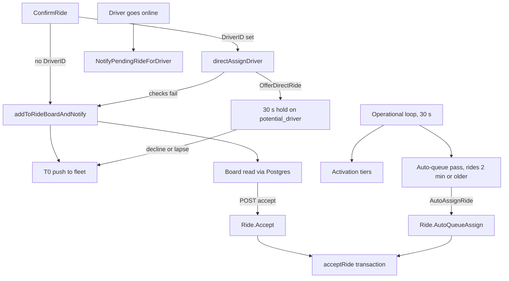

This section documents the matching engine at the level of individual queries, keys, and timings. It assumes you've read [Matching and auto-queue](/concepts/matching-and-auto-queue) and [Rides implementation](/engineering/api/rides-implementation). Those pages explain what each mechanism is for. These pages explain exactly how each one behaves, including where the code disagrees with the product description.

## Pages in this section

| Page | Covers |
| --- | --- |
| [Ride board](/engineering/matching/ride-board) | Board read model, Redis and in-memory providers, the Postgres query drivers actually read |
| [Driver eligibility](/engineering/matching/driver-eligibility) | Every filter each matching path applies, side by side, and result ordering |
| [Direct requests](/engineering/matching/direct-requests) | `potential_driver` holds, the 30-second window, fallback reasons, release |
| [Activation tiers](/engineering/matching/activation-tiers) | Tier selection math, cooldowns, notified sets, rescue alerts, pending-ride pushes |
| [Auto-queue scoring](/engineering/matching/auto-queue-scoring) | Candidate filtering, the scoring formula with weights, worked examples |
| [Queue promotion and recovery](/engineering/matching/queue-promotion) | Queue order, the two promotion paths, idle recovery, offline unqueue, queue summaries |
| [Requeue and expiry](/engineering/matching/requeue-and-expiry) | Driver-cancel requeue, expiry sweep, what state survives each path |
| [Concurrency and races](/engineering/matching/concurrency) | Row locks, advisory lock, retries, revision finalizer, walked race scenarios |
| [Notification fan-out](/engineering/matching/notification-fan-out) | Every push a new ride can trigger, recipients, event keys, deduplication |
| [Ride timeline walkthrough](/engineering/matching/ride-timeline) | One ride from confirm to accept, with every table and key it touches |

## Terms used in this section

| Term | Meaning in code |
| --- | --- |
| Unmatched ride | `Rides.status = 'confirmed'` and `driver_id IS NULL` |
| Hold | `potential_driver` and `offer_time` set by a direct request |
| Queue | A driver's rides with `status = 'queued'` |
| Active ride | A driver's ride in `driver_en_route`, `driver_waiting`, or `in_progress` |
| Promotion | `queued` to `driver_en_route` |
| Requeue | An assigned ride returned to `confirmed` after the driver cancels |
| Unqueue | Queued rides returned to `confirmed` because the driver went offline |
| Notified set | `ride:notified:{rideId}`, the drivers already pushed about a ride |
| Participants | The `Users` rows a ride command locks before the ride row |

## The mechanisms at a glance

A confirmed ride is matched by whichever of these gets there first. All of them converge on the same Postgres assignment command, which is the only thing that decides the winner.

| Mechanism | Trigger | Assigns the ride? | Entry point |
| --- | --- | --- | --- |
| Board plus manual accept | Driver polls `GET /ride/v2/board` every 10 s | Yes, when the driver taps accept | `RideService.AcceptRide` in `internal/service/ride/driver.go` |
| T0 push | Confirm, direct-request fallback, requeue | No, it points drivers at the board | `RideService.notifyDriversAboutNewRide` in `internal/service/ride/rider.go` |
| Direct request | Rider confirms with `driver_id` | No, it reserves the ride for 30 s | `RideService.directAssignDriver` in `internal/service/ride/rider.go` |
| Activation tiers | `Operational` loop, per tier delay | No | `ActivationService.activateForConfigTier` in `internal/service/activation/activation.go` |
| Pending-ride push | Driver's offline to online transition | No | `ActivationService.NotifyPendingRideForDriver` |
| Auto-queue | `Operational` loop, ride age of 2 min or more | Yes, as `queued` | `ActivationService.tryAutoQueueAssign` in `internal/service/activation/auto_queue.go` |
| Missed-ride fleet alert | Auto-queue finds zero eligible drivers | No | `ActivationService.notifyFleetOfMissedRide` |

## Background loops that drive matching

All loops are in-process tickers started by `startBackgroundTasks` in `cmd/api/main.go`. See [Background jobs](/engineering/api/background-jobs) for the generic loop runner.

| Loop | Interval | Matching tasks |
| --- | --- | --- |
| `Operational` | 30 s | `UserService.PurgeOfflineDrivers`, `RideService.CancelUnmatchedRides`, `ActivationService.ProcessUnmatchedRides` |
| `QueueRefresh` | 3 min | `ActivationService.RefreshQueueSummaries`, which also runs `RecoverIdleQueue` per driver |

Two properties of the loop runner in `cmd/api/background_cleanup.go` matter for matching:

- **Tasks in a group run concurrently.** `runBackgroundCleanupTick` starts each task in its own goroutine. Offline purge, expiry, and activation race each other every tick. They do not run in the listed order.
- **Every instance runs every loop.** There is no leader election. With several Cloud Run instances, each one runs `ProcessUnmatchedRides` on its own tick. Correctness comes from Postgres locks and Redis `SETNX`, not from single-writer scheduling. See [Concurrency and races](/engineering/matching/concurrency).

Each task gets a 2-minute context (`backgroundTaskTimeout`). A task that is still marked running after 5 minutes (`staleTaskTimeout`) is evicted so the next tick can start it again.

## Tunable constants

None of these are environment variables unless noted. Changing them requires a code change.

| Constant | Value | Location | Effect |
| --- | --- | --- | --- |
| `config.RideRequestExpiry` | 10 min | `internal/utilities/config/constants.go` | Unassigned rides expire. Also the upper bound on which rides activation looks at |
| `autoQueueMinAge` | 2 min | `internal/service/activation/activation.go` | Minimum ride age before auto-queue considers it |
| Direct-request window | 30 s | SQL literals in `ride_matching.sql`, `ride_driver.sql`, `ride_lifecycle.sql`, and `validateRideRequestAcceptance` | Exclusive accept window for the selected driver |
| `matching.MaxQueueLength` | 100 | `internal/utilities/matching/matching.go` | Hard cap on a driver's non-terminal rides |
| `config.OfflineGraceInterval` | 5 min | `constants.go` | Ping freshness for promotion and the offline unqueue threshold |
| `config.DriverExpiryInterval` | 30 min | `constants.go` | Online drivers with no ping for this long go offline |
| `config.DriverReminderInterval` | 30 s | `constants.go` | Minimum gap between renew-online reminders per community |
| `efficiencyWeight`, `equityWeight` | 0.5, 0.5 | `auto_queue.go` | Auto-queue score weights |
| `rideCountWeight`, `fareWeight` | 0.6, 0.4 | `auto_queue.go` | Queue-load weights |
| `tieThreshold` | 0.05 | `auto_queue.go` | Scores this close count as a tie |
| `bufferMinutes` | 2 | `auto_queue.go` | Per-ride buffer in queue ETAs and time-to-start |
| `ACTIVATION_ENABLED` | `true` | env, read by `config.Load()` | `false` skips the whole activation and auto-queue pass |
| `BACKGROUND_TASKS_ENABLED` | unset | env, read in `background_cleanup.go` | `false` disables every ticker loop on that instance |

Per-community settings live in Postgres:

| Setting | Table | Default |
| --- | --- | --- |
| Activation tiers, cooldown, rescue | `ActivationConfigs` (one row per community, `tiers` is JSONB) | `models.DefaultActivationConfig()` when no row exists |
| `auto_queue_max_minutes` | `Communities` | 120 (migration `000184`) |
| `auto_queue_default_minutes` | `Communities` | 60 (migration `000184`) |
| `Users.auto_queue` | `Users` | `false` (migration `000282` reset everyone to off) |

## Redis key catalog

Every matching key, who writes it, and who reads it. When Redis is disabled or the circuit breaker is open, see the last column.

| Key | Type, TTL | Written by | Read by | Without Redis |
| --- | --- | --- | --- | --- |
| `rides:community:{communityId}` | Set, none | `RedisRideBoard.AddRide`, `RemoveRide` | Nothing | In-memory map per process |
| `ride:details` | Hash, none | `RedisRideBoard.AddRide`, `RemoveRide` | `GetBoardRide` (`GET /ride/board/{id}`) | In-memory map per process |
| `rides:refresh:{communityId}` | String, 10 s | `RedisRideBoard.AddRide`, `RemoveRide` | Nothing | Not written |
| `ride:notify:{rideId}` | Hash `tier`, `ts`, 20 min | `ActivationCache.SetRideTier` | `determineTierIdx` | Tier never persists |
| `ride:notified:{rideId}` | Set, 30 min | T0, direct request, tiers, pending-ride push | `buildExcludeSet`, `driverAlreadyNotified`, rescue alert | Read fails, dedup skipped |
| `driver:activation_cd:{driverId}` | String, community cooldown | `TrySetActivationCooldownWithTTL` | Same call (`SETNX`) | Every candidate is skipped |
| `ride:rescue:{rideId}` | String, 30 min | `TrySetRescueSent` | Same call (`SETNX`) | Rescue never fires |
| `activation_config:{communityId}` | String, 5 min | `loadConfig` | `loadConfig` | Loaded from Postgres every time |
| `community:warm:{communityId}` | Sorted set | Nothing on `main` | `getCandidatesFromWarmPool` | Empty |
| `driver:loc:{driverId}` | Hash, 2 h | Nothing in matching | Warm pool, vehicles map layer | Empty |
| `ride:aq_attempted:{rideId}` | String, 1 h | `SetAutoQueueAttempted` | `tryAutoQueueAssign` | Auto-queue returns an error for every ride |
| `driver:queue_summary:{driverId}` | Hash, 30 min | `QueueSummaryService.CalculateAndCacheQueueSummary` | Auto-queue capacity and origin, driver options | Every driver looks empty |
| `driver:queue_ride_etas:{driverId}` | String JSON, 30 min | Same | `QueueSummaryService.Read` | Rebuilt from Mapbox on every read |
| `driver:offline_grace:{driverId}` | String, 5 min | `handleQueuedDriverOfflineGrace` | Same | Offline unqueue never runs |
| `presence:{driverId}`, `community:drivers:{communityId}` | Hash, sorted set, 120 s | Presence pings | Offline grace, direct requests | Direct requests always fall back |

<Warning>
Without Redis, matching degrades to T0 pushes plus the Postgres-backed board. Activation tiers find no candidates because the cooldown `SETNX` fails, auto-queue errors on the attempted-flag check, and direct requests fall back with `driver_offline`. Nothing crashes, so this is easy to miss.
</Warning>

## Where this lives in code

| Concern | Location |
| --- | --- |
| Loop registration | `yelo-api/cmd/api/main.go` (`startBackgroundTasks`) |
| Loop runner | `yelo-api/cmd/api/background_cleanup.go` |
| Activation and auto-queue | `yelo-api/internal/service/activation/` |
| Board, accept, decline, promotion | `yelo-api/internal/service/ride/driver.go`, `ride_board_redis.go`, `ride_board_memory.go` |
| Confirm, direct request, T0 | `yelo-api/internal/service/ride/rider.go` |
| Requeue, expiry, cancel | `yelo-api/internal/service/ride/ride.go` |
| Offline purge, offline unqueue | `yelo-api/internal/service/user/user.go` |
| Ride commands and locks | `yelo-api/internal/data/repository/ride_command.go`, `ride_lifecycle.go`, `ride_matching.go`, `ride_revision.go` |
| Matching SQL | `yelo-api/internal/data/repository/queries/ride_matching.sql`, `ride_driver.sql`, `ride_lifecycle.sql`, `ride_command.sql`, `user_driver.sql`, `community.sql` |
| Redis caches | `yelo-api/internal/data/redis/activation_cache.go`, `queue_cache.go`, `presence_cache.go` |

## Gotchas and edge cases

- **The board isn't read from Redis.** Drivers read the board from Postgres. The Redis set and refresh key are written on every board change and read by nothing. See [Ride board](/engineering/matching/ride-board).
- **The warm pool is dead code.** Nothing writes `community:warm:{communityId}`. The dashboard's **Recency** field (`warm_age_minutes`) has no effect on who gets notified.
- **Loops overlap.** Because tasks in `Operational` run concurrently and on every instance, you can see two activation passes on the same ride in the same second. Every write path is built to tolerate this, but log volume and push counts can double. See [Concurrency and races](/engineering/matching/concurrency).
- **`ACTIVATION_ENABLED=false` also disables auto-queue and direct-request expiry handling.** A lapsed direct request is released only by `ProcessUnmatchedRides`. With activation off, the board query still ignores the hold after 30 s, so drivers can accept it, but the fleet never gets its T0 push and the rider never gets the fallback notice.
- **Redis state isn't reset when a ride is requeued.** The tier, notified set, and auto-queue flag carry over. See [Requeue and expiry](/engineering/matching/requeue-and-expiry).
