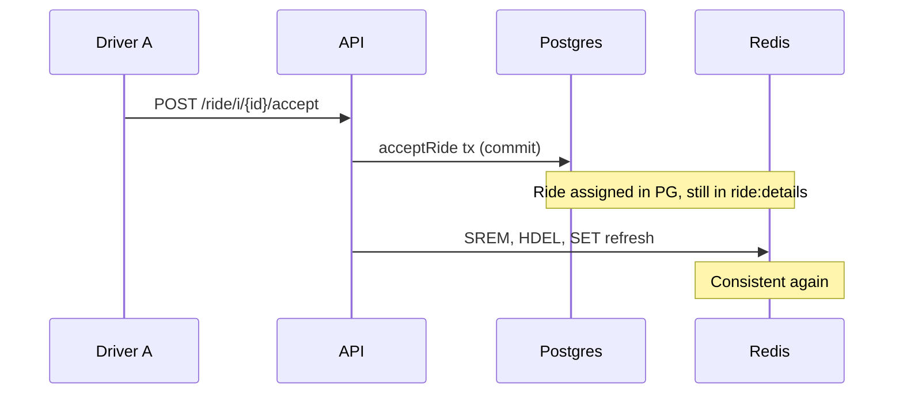

"Ride board" names two different things in the code. Keep them apart when you debug:

1. **The board drivers see.** A Postgres query, `GetEligibleEnrichedRideBoard`, run on every `GET /ride/v2/board`. This is the only board that affects matching.
2. **The `RideBoardProvider`.** A Redis-backed mirror (`RedisRideBoard`) with an in-memory fallback (`RideBoard`). It only serves `GET /ride/board/{id}`.

For the product view, see [Matching and auto-queue](/concepts/matching-and-auto-queue#the-ride-board).

## The board drivers see

`RideService.GetEnrichedRideBoard` in `internal/service/ride/driver.go` builds the response.

<Steps>
  <Step title="Resolve the driver">
    It loads the driver with `User.GetByID` to get `CommunityID` and last known `Latitude` and `Longitude`.
  </Step>
  <Step title="Resolve the session fleet">
    `activeSessionFleet` calls `User.GetDriverSession`. A `NotFound` error means no open `DriverSessions` row, and the method returns an empty list without querying rides. Any other error is returned.
  </Step>
  <Step title="Run the eligibility query">
    `Ride.GetEnrichedRideBoard(communityID, driverID, &fleetID)` runs `GetEligibleEnrichedRideBoard` from `queries/ride_driver.sql`.
  </Step>
  <Step title="Add pickup ETAs">
    If the driver has a location and at least one ride came back, one Mapbox matrix call (`GetDistancesFromOrigin`) adds `pickup_distance` and `pickup_duration`. A failed call logs an error and returns the rides without ETAs. An invalid per-row result leaves that row's ETA null.
  </Step>
</Steps>

The query:

```sql
WHERE r.community_id = sqlc.arg(community_id)
  AND r.status = 'confirmed'
  AND r.driver_id IS NULL
  AND (r.potential_driver IS NULL OR r.potential_driver = sqlc.arg(driver_id)::uuid
       OR r.offer_time <= NOW() - INTERVAL '30 seconds')
  AND NOT (sqlc.arg(driver_id)::uuid = ANY(r.declined_drivers))
  AND (sqlc.narg(fleet_id)::uuid IS NULL OR r.fleet_id = sqlc.narg(fleet_id)::uuid)
ORDER BY r.confirm_time ASC;
```

What each predicate means in practice:

| Predicate | Effect |
| --- | --- |
| `community_id` | The driver's home community (`Users.community_id`), not the community of their session or location |
| `status = 'confirmed' AND driver_id IS NULL` | Only unassigned rides. Queued and active rides never appear |
| `potential_driver` clause | A direct request is hidden from everyone except the selected driver until `offer_time` is 30 s old. See [Direct requests](/engineering/matching/direct-requests) |
| `declined_drivers` | A driver never sees a ride they declined, or one they were requeued off |
| `fleet_id` | The service always passes the session fleet, so the `IS NULL` branch never applies. Rides whose `fleet_id` is null are therefore invisible to everyone |
| `ORDER BY confirm_time ASC` | Oldest first. A requeued ride gets a fresh `confirm_time`, so it moves to the back |

The row also computes `rider_rating` as the average of the rider's non-null `rider_rating` values, defaulting to 5. `declined_by_current_driver` is hard-coded to `false`, because declined rides are already filtered out.

<Note>
The query doesn't filter on vehicle type or seat count. Within a fleet, a driver sees every unassigned ride regardless of the `vehicle_type` the rider picked. Neither `AcceptRide` nor the assignment transaction checks vehicle type either. Fleet isolation is the only type boundary for manual accepts.
</Note>

### How the app polls it

The driver app (`yelo-frontend/providers/DriveProvider.tsx`) queries `useRideGetRideBoardV2` with `refetchInterval: 10000` and `refetchIntervalInBackground: false`. The query is enabled only while `userStatus.driver_is_online` is true.

Pushes shorten that 10-second lag. The `ride_available` template sends `data.type = ride_request` (its `client_data_type` override in `NotificationTemplates`). `lib/notifications/pushInvalidation.ts` maps `ride_request` to an invalidation of `/ride/v2/board` and `/ride/board/{rideId}`. Ride status pushes also invalidate the board.

The app filters the response again in `eligibleBoardRides` (`providers/driveRideSelection.ts`). It hides rides the driver declined or accepted in this session, before the server confirms, so a slow response can't resurrect them. `selectActiveCardRide` shows the driver's manual pick if it's still eligible, otherwise the first (oldest) ride.

## The `RideBoardProvider`

`ride.NewRedisBacked` in `ride_board_redis.go` picks the implementation once at startup:

- If `repository.RedisClient` is nil or disabled, it returns the in-memory `RideBoard` directly.
- Otherwise it returns `RedisRideBoard`, which embeds its own in-memory `RideBoard` as a fallback.

```go
type RideBoardProvider interface {
	GetRideDetails(ctx context.Context, rideId uuid.UUID) *models.BoardRide
	AddRide(ctx context.Context, communityId uuid.UUID, ride *models.RideDetails) errors.Error
	RemoveRide(ctx context.Context, communityId uuid.UUID, rideId uuid.UUID) errors.Error
}
```

### Redis layout

| Key | Type | Written in | Read by |
| --- | --- | --- | --- |
| `rides:community:{communityId}` | Set of ride IDs | `AddRide` (`SADD`), `RemoveRide` (`SREM`) | Nothing |
| `ride:details` | Single global hash, ride ID to JSON `BoardRide` | `AddRide` (`HSET`), `RemoveRide` (`HDEL`) | `GetRideDetails` (`HGET`) |
| `rides:refresh:{communityId}` | String, 10-second TTL, Unix timestamp | `AddRide`, `RemoveRide` | Nothing |

`AddRide` writes all three keys in one `TxPipeline` (`MULTI`/`EXEC`). `RemoveRide` issues three separate commands. Only a failed `SREM` falls back to the memory board. A failed `HDEL` or refresh `SET` is logged and ignored.

`ride:details` has no TTL. An entry leaves only through `RemoveRide`.

### The `BoardRide` payload

`models.NewBoardRideFromRide` snapshots the ride at add time: pickup and destination names, addresses, and coordinates, `Price`, `RequestTime`, `FleetID`, `RiderRating` (defaults to 5), and `AvailableAt = time.Now()`.

`Price` is `ride.Price`, the undiscounted price. The v2 board query returns `COALESCE(discounted_price, price)`. The two endpoints can show different prices for a discounted ride.

### In-memory fallback

`RideBoard` in `ride_board_memory.go` holds three maps behind one `sync.RWMutex`: `communityRides`, `rideDetails`, and `lastRefresh`.

- `AddRide` and `RemoveRide` lazily initialize a community on first touch. `initCommunityRideBoard` runs `ListAvailableRideIDs` (every `confirmed` ride in the community) and then one `Ride.GetByID` per ride while holding the write lock.
- `GetRideDetails` doesn't initialize anything. It returns only rides this process has added or loaded.
- Initialization errors make `AddRide` or `RemoveRide` return a server error.

The memory board is per process. Two instances never share it.

## Every write path

| Caller | Operation | When | Error handling |
| --- | --- | --- | --- |
| `addToRideBoardAndNotify` (`rider.go`) | `AddRide` | Normal confirm, direct-request fallback | Returned to `ConfirmRide` |
| `directAssignDriver` (`rider.go`) | `AddRide` | After `OfferDirectRide` succeeds | Releases the hold and falls back with `board_unavailable` |
| `requeueAfterDriverCancel` (`ride.go`) | `RemoveRide`, then `AddRide` with a fresh `GetByID` | Driver cancels a queued or active ride | Logged, requeue continues |
| `unqueueOfflineDriverRides` (`user/user.go`) | `AddRide` per unqueued ride | Offline grace expired | Logged |
| `AcceptRide` (`driver.go`) | `RemoveRide` | After `Ride.Accept` commits | Returned, so the HTTP call fails even though the ride is assigned |
| `assignWinner` (`auto_queue.go`) | `RemoveRide` | After `AutoAssignRide` succeeds | Logged |
| `Cancel` (`ride.go`) | `RemoveRide` | Any non-requeue cancel | Returned after the cancel committed |
| `CancelUnmatchedRides` (`ride.go`) | `RemoveRide` per expired ride | Expiry sweep | Logged |

There is no remove on direct-request release or decline. The ride stays on the board the whole time and only its visibility changes.

## Every read path

| Endpoint | Source | Fallback |
| --- | --- | --- |
| `GET /ride/v2/board` | Postgres, `GetEligibleEnrichedRideBoard` | None |
| `GET /ride/board/{id}` | `RideBoardProvider.GetRideDetails` | `Ride.GetByID`, returned only when `status = 'confirmed'`, otherwise 404 |
| `NotifyPendingRideForDriver` | Postgres, same query as the v2 board | None |

`GET /ride/board/{id}` has no ownership or fleet check. Any authenticated user can read any ride that is still in `ride:details` or still `confirmed`.

## Consistency model

Postgres is the source of truth. The provider is updated after the command commits, never inside the transaction, so there's always a window where the two disagree.



Because the v2 board reads Postgres, the drift only affects `GET /ride/board/{id}`. Accepts always revalidate `status = 'confirmed'` under the ride row lock, so a stale board entry can't produce a double assignment.

## Where this lives in code

| Concern | Location |
| --- | --- |
| Board handler and route | `yelo-api/internal/server/http/ride/ride_handler.go` (`GetRideBoardV2`, `GetBoardRide`), `ride_routes.go` |
| Board service | `yelo-api/internal/service/ride/driver.go` (`GetEnrichedRideBoard`, `activeSessionFleet`) |
| Single-ride read | `yelo-api/internal/service/ride/ride.go` (`GetBoardRide`) |
| Provider | `yelo-api/internal/service/ride/ride_board_redis.go`, `ride_board_memory.go` |
| Board SQL | `yelo-api/internal/data/repository/queries/ride_driver.sql` (`GetEligibleEnrichedRideBoard`), `ride_matching.sql` (`ListAvailableRideIDs`) |
| Payload model | `yelo-api/internal/models/ride.go` (`BoardRide`, `EnrichedBoardRide`, `NewBoardRideFromRide`) |
| App polling and filtering | `yelo-frontend/providers/DriveProvider.tsx`, `providers/driveRideSelection.ts`, `lib/notifications/pushInvalidation.ts` |

## Gotchas and edge cases

- **Null-fleet rides are hidden.** The concepts page says rides without a fleet are visible to everyone. On `main`, the service always passes a fleet, so the `fleet_id` predicate filters them out. Rides get a null fleet today when `UnqueueDriverRides` resets them. See [Queue promotion and recovery](/engineering/matching/queue-promotion#offline-unqueue).
- **Stale memory entries can outlive Redis ones.** If `AddRide` fell back to memory during a Redis blip, a later `RemoveRide` that succeeds against Redis doesn't touch the memory copy. `GetRideDetails` falls back to memory on an `HGET` miss, so the stale entry can be served until the process restarts.
- **`board_unavailable` is almost unreachable.** `RedisRideBoard.AddRide` never returns an error from a Redis failure. It falls back to memory and returns `nil`. Only a serialization error or a memory-board initialization failure surfaces.
- **The refresh key is vestigial.** `rides:refresh:{communityId}` looks like a change signal but no API code or app reads it. Clients rely on the 10-second poll and pushes.
- **Community is the driver's home community.** A driver whose `Users.community_id` differs from where they're driving sees the home community's board.
- **The accept path fails loudly after success.** If `RemoveRide` returns an error, `AcceptRide` returns it after `Ride.Accept` has committed. The client sees an error for an accepted ride. This only happens on the in-memory provider, when lazy initialization fails.
- **Memory-board initialization is O(n) queries.** The first touch of a community loads every confirmed ride with one `GetByID` each, under a write lock that blocks every other board call in the process.
